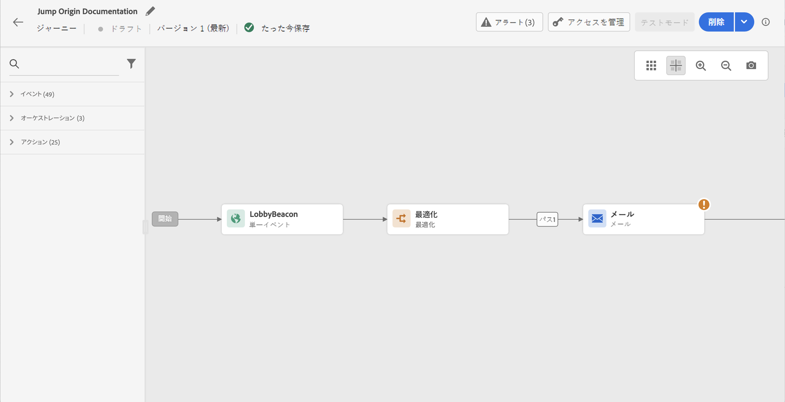
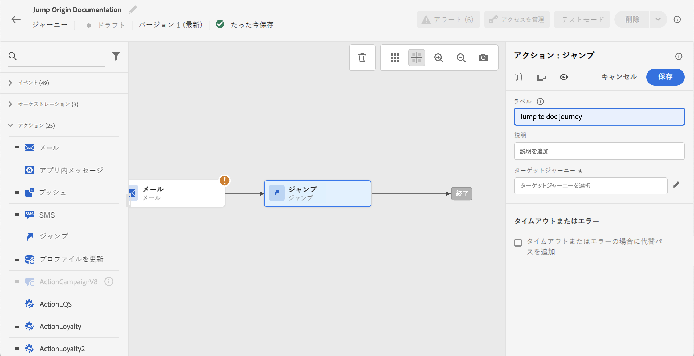
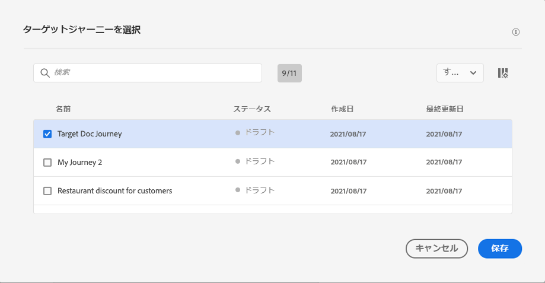
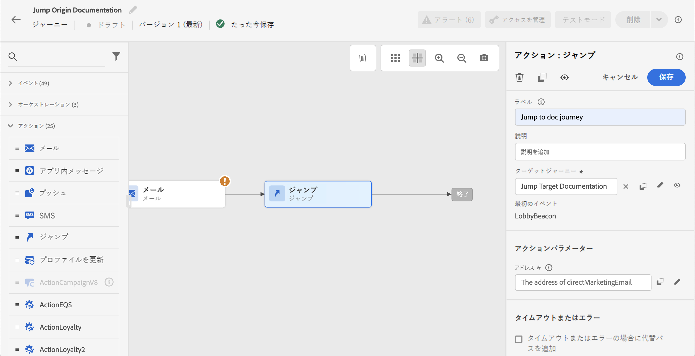
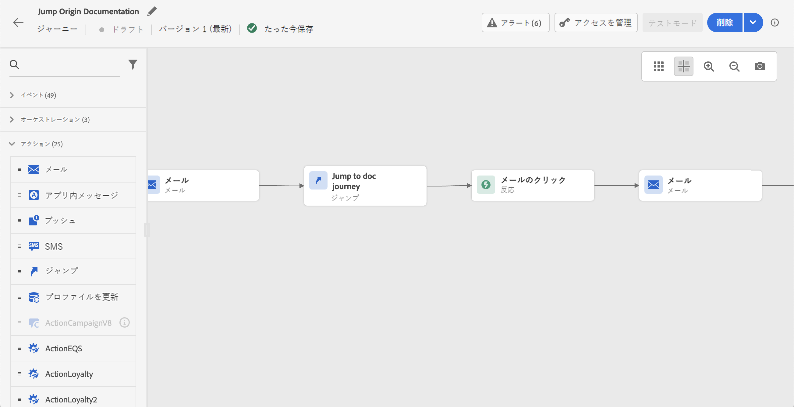
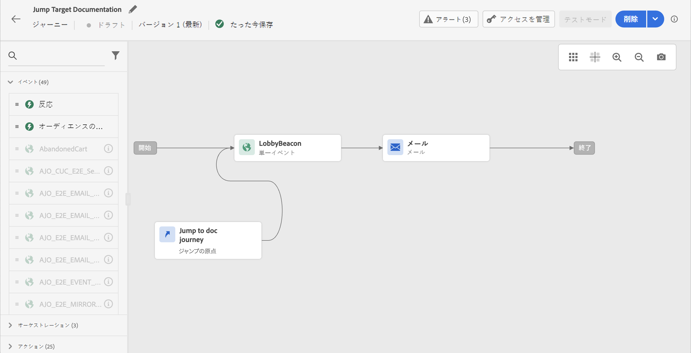
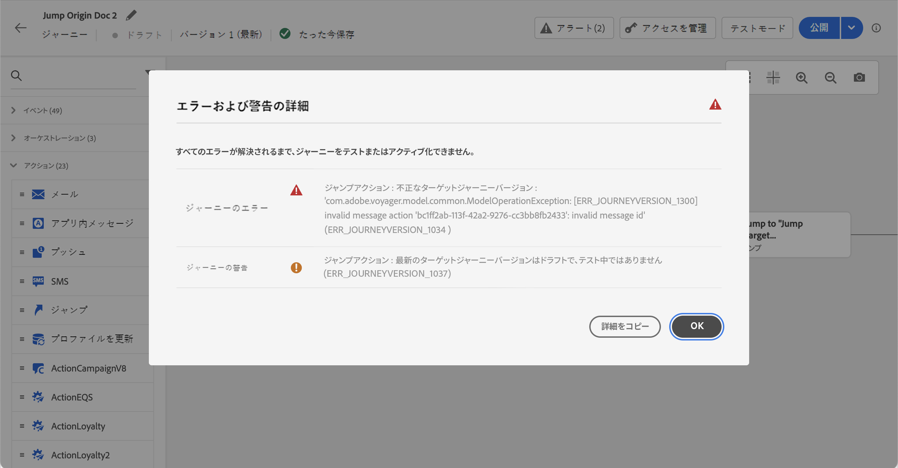

# ジャーニーからジャーニーへの移動 {#jump}

>[!CONTEXTUALHELP]
>id="ajo_journey_jump"
>title="ジャンプアクティビティ"
>abstract="ジャンプアクションアクティビティを使って、個々のユーザーをジャーニー間でプッシュできるようになりました。この機能を使用すると、非常に複雑なジャーニーの設計を簡略化し、再利用可能な一般ジャーニーパターンに基づいてジャーニーを構築できます。"

**[!UICONTROL ジャンプ]**&#x200B;アクションアクティビティを使って、個々のユーザーをジャーニー間でプッシュできるようになりました。この機能を使うと次のことができます。

* 非常に複雑なジャーニーを複数のジャーニーに分けて設計を簡素化する
* 一般的で再利用可能なジャーニーパターンに基づいてジャーニーを作成する

接触チャネルジャーニーで、**[!UICONTROL ジャンプ]**&#x200B;アクティビティを追加し、ターゲットジャーニーを選択します。個人が&#x200B;**[!UICONTROL ジャンプ]**&#x200B;ステップにエントリすると、内部イベントがターゲットジャーニーの最初のイベントに送られます。**[!UICONTROL ジャンプ]**&#x200B;アクションが成功した場合、個人はジャーニー内で進行を続けます。動作は他のアクションと同様です。

ターゲットジャーニーでは、**[!UICONTROL ジャンプ]**&#x200B;アクティビティによって内部で最初のイベントがトリガーされ、個人はジャーニーに沿って導かれます。

## ライフサイクル {#jump-lifecycle}

例えば、ジャーニー A の&#x200B;**[!UICONTROL ジャンプ]**&#x200B;アクティビティをジャーニー B に追加したとします。ジャーニー A は&#x200B;**接触チャネルジャーニー**&#x200B;で、ジャーニー B は&#x200B;**ターゲットジャーニー**&#x200B;です。

実行プロセスの様々なステップを次に示します。

**ジャーニー A** は外部イベントからトリガーされます。

1. ジャーニー A が、個人に関連する外部イベントを受信する。
1. 個人が&#x200B;**[!UICONTROL ジャンプ]**&#x200B;ステップに到達する。
1. 個人はジャーニー B にプッシュされ、**[!UICONTROL ジャンプ]**&#x200B;ステップの後、ジャーニー A の次のステップに進みます。

ジャーニー B では、最初のイベントがジャーニー A の&#x200B;**[!UICONTROL ジャンプ]**&#x200B;アクティビティを介して内部でトリガーされます。

1. ジャーニー B がジャーニー A から内部イベントを受け取ります。
1. 個人が、ジャーニー B でのフローを開始します。

>[!NOTE]
>
>外部イベントを介してジャーニー B をトリガーすることもできます。

## ベストプラクティスと制限 {#jump-limitations}

これらのガイドラインを使用して、ジャンプ アクティビティの動作を予測可能かつ安全に保ちます。

### オーサリング {#jump-limitations-authoring}

* **[!UICONTROL ジャンプ]**&#x200B;アクティビティは、名前空間を使用するジャーニーでのみ使用できます。
* 接触チャネルジャーニーと同じ名前空間を使用するジャーニーにのみジャンプできます。
* **オーディエンスの選定**&#x200B;イベントや&#x200B;**オーディエンスを読み取り**&#x200B;で始まるジャーニーにジャンプすることはできません。
* **[!UICONTROL ジャンプ]**&#x200B;アクティビティと、**オーディエンスの選定**&#x200B;イベントまたは&#x200B;**オーディエンスを読み取り**&#x200B;を同じジャーニーに含めることはできません。
* **[!UICONTROL ジャンプ]**&#x200B;アクティビティは、ジャーニーに必要な数だけ含めることができます。**[!UICONTROL ジャンプ]**&#x200B;の後に、必要なアクティビティを追加できます。
* 必要な数だけジャンプレベルを設定できます。例えば、ジャーニー A はジャーニー B にジャンプし、ジャーニー B はジャーニー C にジャンプします。
* ターゲットジャーニーには、必要に応じて&#x200B;**[!UICONTROL ジャンプ]**&#x200B;アクティビティをいくつでも含めることができます。
* ループパターンはサポートされていません。2 つ以上のジャーニーをリンクして、無限ループを作成できません。**[!UICONTROL ジャンプ]**&#x200B;アクティビティ設定画面では、この操作はできません。

### 実行 {#jump-limitations-exec}

* **[!UICONTROL ジャンプ]**&#x200B;アクティビティが実行されると、ターゲットジャーニーの最新バージョンがトリガーされます。
* 一意の個人は同じジャーニーに一度しか存在できません。その結果、接触チャネルジャーニーからプッシュされた個人がターゲットジャーニー内に既に存在する場合、その個人はターゲットジャーニーにエントリすることはできません。**[!UICONTROL ジャンプ]**&#x200B;アクティビティは通常の動作なので、エラーは報告されません。

## 設計戦略：一口サイズのサブジャーニー {#jump-strategy}

複雑なカスタマージャーニーは、特に追加のチャネルやタッチポイントが導入されると、すぐに構築および維持が困難になる可能性があります。 少数のマイルストーンを持つジャーニーでも、顧客が実行できる 20 以上の一意のパスを公開でき、その複雑さは追加ごとに急激に増加します。

これを管理する実用的なアプローチは、大きなジャーニーをより小さくフォーカスされたサブジャーニー（ビジネスフェーズまたはマイルストーンごとに 1 つ）に分割し、**[!UICONTROL ジャンプ]** アクティビティを使用してそれらを接続することです。 これにより、各ジャーニーが読みやすく、テスト可能で、独立して維持管理できるようになります。

**手順 1 - エンドツーエンドのジャーニーを視覚化**

カスタマージャーニー全体をマッピングし、その大まかなフェーズを特定します。 例えば、ロイヤルティオンボーディングジャーニーには、モバイルアプリのダウンロード、最初のトランザクションの実行、2 番目のトランザクションの実行という 3 つの異なるフェーズが含まれる場合があります。

**手順 2 - フェーズに注釈を付け、サブジャーニーを定義する**

各フェーズの境界をマークし、ビジネス目標を定義します。 各フェーズは、エントリ条件と目標が明確な候補サブジャーニーになります。

**手順 3 - サブジャーニーを作成して接続する**

各フェーズをJourney Optimizerで個別のジャーニーとして作成し、**[!UICONTROL ジャンプ]** アクティビティを使用して、サブジャーニー間でプロファイルを渡します。 その結果、組み合わせて完全なエンドツーエンドのエクスペリエンスを生成する、よりシンプルで再利用可能なジャーニーのセットが得られ、エラーが発生するリスクが低くなります。

>[!TIP]
>
>このアプローチの詳細については、[Journey Optimizerの高度なジャーニーのベストプラクティス &#x200B;](https://experienceleague.adobe.com/en/perspectives/best-practices-for-advanced-journeys-in-journey-optimizer){target="_blank"} を参照してください。

## ジャンプアクティビティの設定 {#jump-configure}

1. **接触チャネルジャーニー**&#x200B;を設計します。

   

1. ジャーニーの任意のステップで、**[!UICONTROL アクション]**&#x200B;カテゴリから&#x200B;**[!UICONTROL ジャンプ]**&#x200B;アクティビティを追加します。ラベルと説明を追加します。

   

1. 「**ターゲットジャーニー**」フィールド内をクリックします。リストには、ドラフトモード、ライブモード、またはテストモードのすべてのジャーニーバージョンが表示されます。別の名前空間を使用するジャーニーや、**オーディエンスの選定**&#x200B;イベントで始まるジャーニーは使用できません。ループパターンを作成するターゲットジャーニーも除外されます。

   

   >[!NOTE]
   >
   >右側の「**ターゲットジャーニーを開く**」アイコンをクリックすると、新しいタブでターゲットジャーニーが開きます。

1. ジャンプ先のターゲットジャーニーを選択します。
「**最初のイベント**」フィールドには、ターゲットジャーニーの最初のイベントの名前が事前に入力されています。ターゲットジャーニーに複数のイベントが含まれる場合、**[!UICONTROL ジャンプ]**&#x200B;は最初のイベントでのみ許可されます。

   

1. **アクションパラメーター**&#x200B;セクションには、ターゲットイベントのすべてのフィールドが表示されます。他のタイプのアクションと同様に、各フィールドを接触チャネルイベントまたはデータソースのフィールドにマッピングします。この情報は、実行時にターゲットジャーニーに渡されます。
1. 次のアクティビティを追加し、接触チャネルジャーニーを終了します。

   

   >[!NOTE]
   >
   >個人の ID は自動的にマッピングされます。この情報は、インターフェイスには表示されません。

**[!UICONTROL ジャンプ]**&#x200B;アクティビティが構成されます。ジャーニーがライブまたはテストモードになると、**[!UICONTROL ジャンプ]**&#x200B;ステップに到達した個人は、ターゲットジャーニーにプッシュされます。

ジャーニー内に&#x200B;**[!UICONTROL ジャンプ]**&#x200B;アクティビティを設定すると、ターゲットジャーニーの先頭に&#x200B;**[!UICONTROL ジャンプ]**&#x200B;エントリアイコンが自動的に追加されます。これによって、このジャーニーは外部からトリガーされることもあるけれど、**[!UICONTROL ジャンプ]**&#x200B;アクティビティで内部からトリガーされることもあるということを識別できます。

## トラブルシューティング {#jump-troubleshoot}

次の場合にエラーが発生します。

* ターゲットジャーニーが存在しない
* ターゲットジャーニーがドラフトである、クローズしている、または停止している
* ターゲットジャーニーの最初のイベントが変更され、マッピングが壊れている

