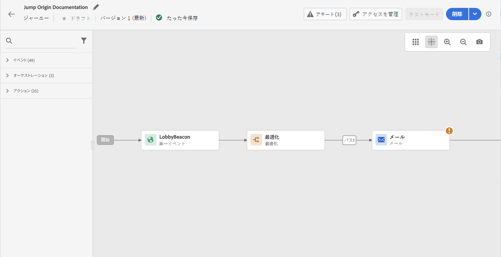
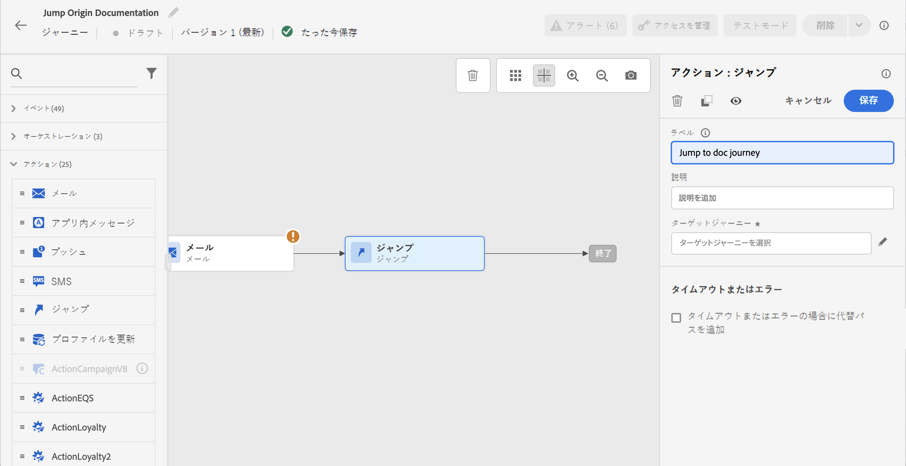
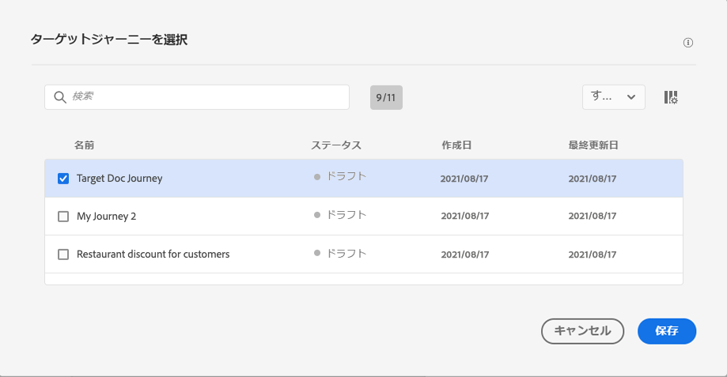
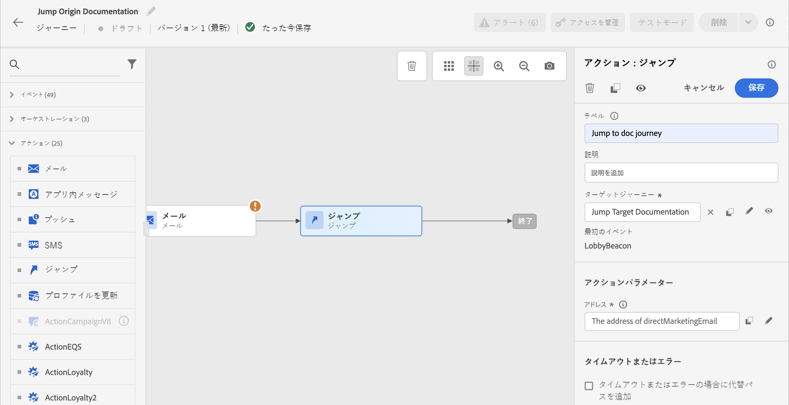
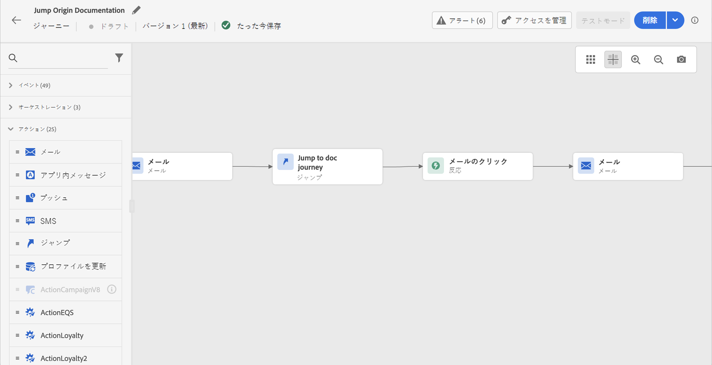
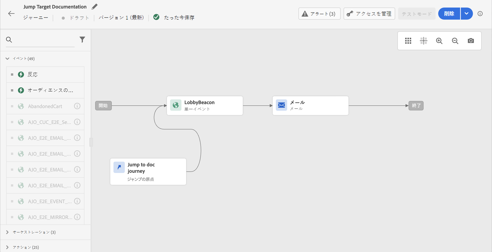
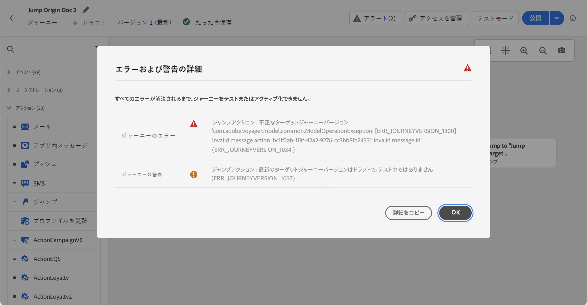

# ジャーニーからジャーニーへの移動 {#jump}

>[!CONTEXTUALHELP]
>id="ajo_journey_jump"
>title="ジャンプアクティビティ"
>abstract="ジャンプアクションアクティビティを使って、個々のユーザーをジャーニー間でプッシュできるようになりました。 この機能を使用すると、非常に複雑なジャーニーの設計を簡略化し、再利用可能な一般ジャーニーパターンに基づいてジャーニーを構築できます。"

**[!UICONTROL ジャンプ]**&#x200B;アクションアクティビティを使って、個々のユーザーをジャーニー間でプッシュできるようになりました。 この機能を使うと次のことができます。

* 非常に複雑なジャーニーを複数のジャーニーに分けて設計を簡素化する
* 一般的で再利用可能なジャーニーパターンに基づいてジャーニーを作成する

接触チャネルジャーニーで、**[!UICONTROL ジャンプ]**&#x200B;アクティビティを追加し、ターゲットジャーニーを選択します。 個人が&#x200B;**[!UICONTROL ジャンプ]**&#x200B;ステップにエントリすると、内部イベントがターゲットジャーニーの最初のイベントに送られます。 **[!UICONTROL ジャンプ]**&#x200B;アクションが成功した場合、個人はジャーニー内で進行を続けます。 動作は他のアクションと同様です。

ターゲットジャーニーでは、**[!UICONTROL ジャンプ]**&#x200B;アクティビティによって内部で最初のイベントがトリガーされ、個人はジャーニーに沿って導かれます。

## ライフサイクル {#jump-lifecycle}

例えば、ジャーニー A の&#x200B;**[!UICONTROL ジャンプ]**&#x200B;アクティビティをジャーニー B に追加したとします。ジャーニー A は&#x200B;**接触チャネルジャーニー**&#x200B;で、ジャーニー B は&#x200B;**ターゲットジャーニー**&#x200B;です。

実行プロセスの様々なステップを次に示します。

**ジャーニー A** は外部イベントからトリガーされます。

1. ジャーニー A が、個人に関連する外部イベントを受信する。
1. 個人が&#x200B;**[!UICONTROL ジャンプ]**&#x200B;ステップに到達する。
1. 個人はジャーニー B にプッシュされ、**[!UICONTROL ジャンプ]**&#x200B;ステップの後、ジャーニー A の次のステップに進みます。

ジャーニー B では、最初のイベントがジャーニー A の&#x200B;**[!UICONTROL ジャンプ]**&#x200B;アクティビティを介して内部でトリガーされます。

1. ジャーニー B がジャーニー A から内部イベントを受け取ります。
1. 個人が、ジャーニー B でのフローを開始します。

>[!NOTE]
>
>外部イベントを介してジャーニー B をトリガーすることもできます。

### ジャンプ中のプロファイル動作 {#jump-profile-behavior}

プロファイルが&#x200B;**[!UICONTROL ジャンプ]** ステップに達すると、同時にターゲットジャーニー（ジャーニー B）に入りながら、オリジンジャーニー（ジャーニー A）で進行を続けます。 したがって、プロファイルは両方のジャーニーで同時にアクティブになります。

インタラクションがあります。

* プロファイルは、「ジャンプ」アクティビティの後のジャーニー Aの残りの手順（フォローアップの待機やクローズアクションなど）を完了します。
* プロファイルは、ジャーニーAとは無関係に、最初のイベントからジャーニーBにも流れ始めます。
* ジャンプの実行時にプロファイルがジャーニー B内の&#x200B;**既にアクティブ**&#x200B;である場合、**not**&#x200B;はジャーニー Bに再度入ります。 ジャーニーAは正常に続き、エラーは報告されません。

>[!NOTE]
>
>上記のケース （ジャーニー Bで既にアクティブなプロファイル）では、**サイレントスキップ**&#x200B;が発生します。エラーは発生せず、ジャーニー Aは正常に続行されます。 その他の状況では、ジャンプは&#x200B;**失敗**&#x200B;し、ジャーニー Aは標準のアクションエラー処理を適用します。 ケースの完全なリストについては、[&#x200B; ランタイムエラー](#jump-troubleshoot)を参照してください。

## ベストプラクティスと制限 {#jump-limitations}

これらのガイドラインを使用して、ジャンプ アクティビティの動作を予測可能かつ安全に保ちます。

### オーサリング {#jump-limitations-authoring}

* **[!UICONTROL ジャンプ]**&#x200B;アクティビティは、名前空間を使用するジャーニーでのみ使用できます。
* 接触チャネルジャーニーと同じ名前空間を使用するジャーニーにのみジャンプできます。
* **オーディエンスの選定**&#x200B;イベントや&#x200B;**オーディエンスを読み取り**&#x200B;で始まるジャーニーにジャンプすることはできません。
* **[!UICONTROL ジャンプ]**&#x200B;アクティビティと、**オーディエンスの選定**&#x200B;イベントまたは&#x200B;**オーディエンスを読み取り**&#x200B;を同じジャーニーに含めることはできません。
* **[!UICONTROL ジャンプ]**&#x200B;アクティビティは、ジャーニーに必要な数だけ含めることができます。 **[!UICONTROL ジャンプ]**&#x200B;の後に、必要なアクティビティを追加できます。
* 必要な数だけジャンプレベルを設定できます。 例えば、ジャーニー A はジャーニー B にジャンプし、ジャーニー B はジャーニー C にジャンプします。
* ターゲットジャーニーには、必要に応じて&#x200B;**[!UICONTROL ジャンプ]**&#x200B;アクティビティをいくつでも含めることができます。
* ループパターンはサポートされていません。 2 つ以上のジャーニーをリンクして、無限ループを作成できません。 **[!UICONTROL ジャンプ]**&#x200B;アクティビティ設定画面では、この操作はできません。

### 実行 {#jump-limitations-exec}

* **[!UICONTROL ジャンプ]**&#x200B;アクティビティが実行されると、ターゲットジャーニーの最新バージョンがトリガーされます。
* 一意の個人は同じジャーニーに一度しか存在できません。 その結果、接触チャネルジャーニーからプッシュされた個人がターゲットジャーニー内に既に存在する場合、その個人はターゲットジャーニーにエントリすることはできません。 **[!UICONTROL ジャンプ]**&#x200B;アクティビティは通常の動作なので、エラーは報告されません。

## デザイン戦略：短期間のサブジャーニー {#jump-strategy}

複雑なカスタマージャーニーを構築し、維持することは、特にチャネルや顧客接点が増えるにつれて、急速に困難になります。 ほんの一握りのマイルストーンを伴うジャーニーでも、顧客がたどる可能性のある20以上の独自のパスを明らかにすることができ、その複雑さは追加ごとに飛躍的に拡大します。

これを管理するための実用的なアプローチは、大規模なジャーニーをより小さく焦点を絞ったサブジャーニー（ビジネスフェーズまたはマイルストーンごとに1つ）に分割し、**[!UICONTROL ジャンプ]** アクティビティを使用して接続することです。 これにより、各ジャーニーを読みやすく、テスト可能で、個別に管理できます。

**ステップ 1 — エンドツーエンドのジャーニーを可視化**

カスタマージャーニー全体をマッピングし、その上位フェーズを特定します。 たとえば、ロイヤルティオンボーディングジャーニーには、モバイルアプリのダウンロード、最初の取引の実行、2回目の取引という3つのフェーズがあります。

**ステップ 2 — フェーズに注釈を付け、サブジャーニーを定義**

各段階の境界をマークし、ビジネス目標を定義します。 各フェーズは、明確なエントリ条件と目標を持つ候補サブジャーニーになります。

**ステップ 3 — サブジャーニーの作成と接続**

Journey Optimizerで各フェーズを個別のジャーニーとして構築し、**[!UICONTROL ジャンプ]** アクティビティを使用して、1つのサブジャーニーから次のサブジャーニーにプロファイルを渡します。 これにより、シンプルかつ再利用可能な一連のジャーニーを構築し、エンドツーエンドのエクスペリエンスを構築して、エラーが発生するリスクを低減できます。

>[!TIP]
>
>複数段階のロイヤルティプログラムを使用した実際の例については、[複数段階のロイヤルティジャーニー](journeys-uc.md#multi-phase-loyalty)を参照してください。

## ジャンプアクティビティの設定 {#jump-configure}

1. **接触チャネルジャーニー**&#x200B;を設計します。

   

1. ジャーニーの任意のステップで、**[!UICONTROL アクション]**&#x200B;カテゴリから&#x200B;**[!UICONTROL ジャンプ]**&#x200B;アクティビティを追加します。 ラベルと説明を追加します。

   

1. 「**ターゲットジャーニー**」フィールド内をクリックします。
リストには、ドラフトモード、ライブモード、またはテストモードのすべてのジャーニーバージョンが表示されます。 別の名前空間を使用するジャーニーや、**オーディエンスの選定**&#x200B;イベントで始まるジャーニーは使用できません。 ループパターンを作成するターゲットジャーニーも除外されます。

   

   >[!NOTE]
   >
   >右側の「**ターゲットジャーニーを開く**」アイコンをクリックすると、新しいタブでターゲットジャーニーが開きます。

1. ジャンプ先のターゲットジャーニーを選択します。
「**最初のイベント**」フィールドには、ターゲットジャーニーの最初のイベントの名前が事前に入力されています。 ターゲットジャーニーに複数のイベントが含まれる場合、**[!UICONTROL ジャンプ]**&#x200B;は最初のイベントでのみ許可されます。

   

1. **アクションパラメーター**&#x200B;セクションには、ターゲットイベントのすべてのフィールドが表示されます。 他のタイプのアクションと同様に、各フィールドを接触チャネルイベントまたはデータソースのフィールドにマッピングします。 この情報は、実行時にターゲットジャーニーに渡されます。
1. 次のアクティビティを追加し、接触チャネルジャーニーを終了します。

   

   >[!NOTE]
   >
   >個人の ID は自動的にマッピングされます。 この情報は、インターフェイスには表示されません。

**[!UICONTROL ジャンプ]**&#x200B;アクティビティが構成されます。 ジャーニーがライブまたはテストモードになると、**[!UICONTROL ジャンプ]**&#x200B;ステップに到達した個人は、ターゲットジャーニーにプッシュされます。

ジャーニー内に&#x200B;**[!UICONTROL ジャンプ]**&#x200B;アクティビティを設定すると、ターゲットジャーニーの先頭に&#x200B;**[!UICONTROL ジャンプ]**&#x200B;エントリアイコンが自動的に追加されます。 これによって、このジャーニーは外部からトリガーされることもあるけれど、**[!UICONTROL ジャンプ]**&#x200B;アクティビティで内部からトリガーされることもあるということを識別できます。

## トラブルシューティング {#jump-troubleshoot}

### 設定エラー

次の問題により、ジャンプが正しく機能せず、ジャーニーキャンバスにエラーとして表示されます。

* ターゲットジャーニーは存在しません。
* ターゲットジャーニーがドラフト、クローズ、または停止された場合：
* ターゲットジャーニーの最初のイベントが変更され、マッピングが壊れます。

### ランタイムエラー

次の場合、ジャンプステップはジャーニー Aの&#x200B;**失敗したアクション**&#x200B;として扱われます。ジャーニー Aでは、標準のaction-error処理が適用され、続行されます。

* 既存のターゲットジャーニーインスタンスが終了し、ターゲットジャーニーが再エントリされない。
* 再エントリ期間は、ターゲットジャーニーで設定されます。 再入場が原則として許可されている場合でも、プロファイルは期間が経過するまで再入場できません（ジャンプは「期間に対して再入場しない」ステータスで失敗します）。
* ターゲットジャーニーバージョンが見つからないか、削除されているか、完了状態であるか、停止されています。
