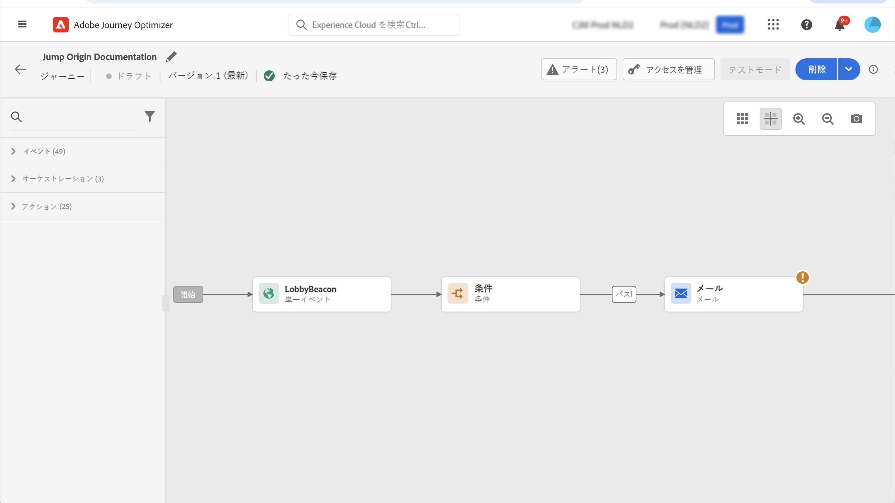
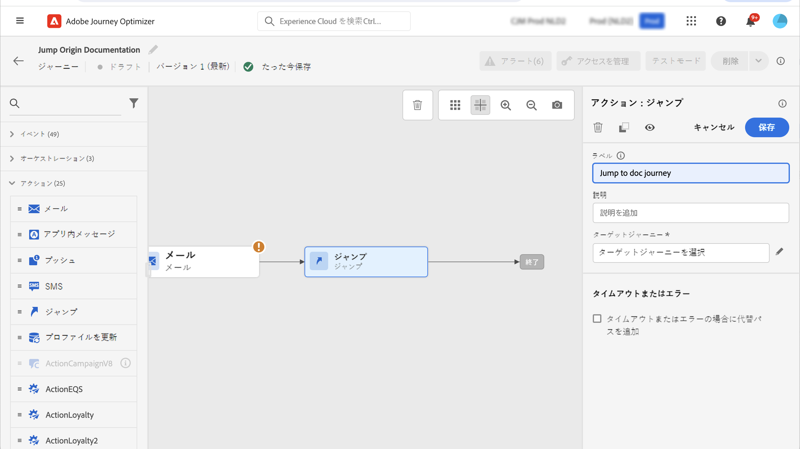
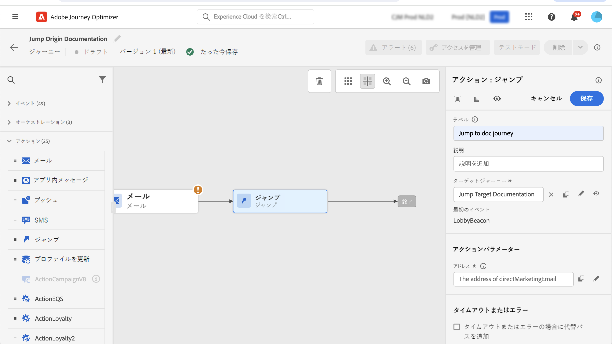
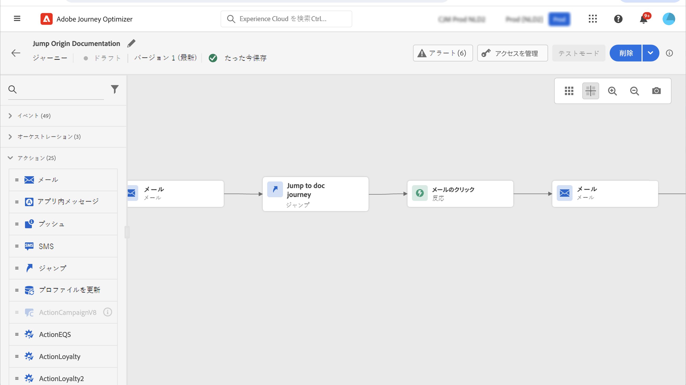
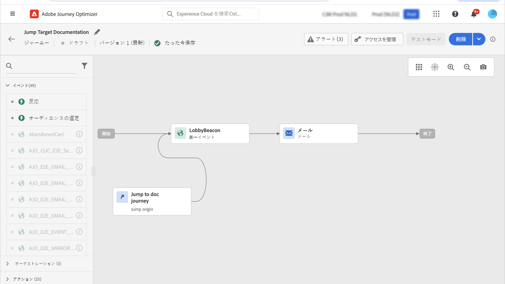

# 1つの旅から他の旅に移動 {#jump}

>[!CONTEXTUALHELP]
>id="ajo_journey_jump"
>title="ジャンプアクティビティー"
>abstract="「ジャンプアクション」機能を使用すると、1つの旅から他の旅にユーザーを移動することができます。 この機能を使用すると、一般的な、再利用可能な旅パターンに基づいて、非常に複雑な journeys と build journeys のデザインを簡素化できます。"

アクションアクティビティーを使用すると、 **[!UICONTROL Jump]** 1 つの旅から他の旅に移動することができます。 この機能を使用すると、次の操作を実行できます。

* journeys を複数の1つに分割して、非常に複雑なのデザインを簡素化します。
* 一般的な、再利用可能な旅パターンに基づいて journeys を構築する

このような **[!UICONTROL Jump]** 場合は、単にアクティビティを追加し、ターゲットを選択します。 各ユーザーがステップに入る **[!UICONTROL Jump]** と、ターゲットの旅の最初のイベントに内部イベントが送信されます。 **[!UICONTROL Jump]**&#x200B;操作が成功した場合は、その進行が継続されます。ビヘイビアーは、他のアクションに似ています。

ターゲットとなる過程で、アクティビティによって **[!UICONTROL Jump]** 内部でトリガーされる最初のイベントによって、1つのフローが流れています。

## 全体

ここでは、旅 a に1つの旅へのアクティビティを **[!UICONTROL Jump]** 追加したとします。 A の旅は **、これまでの旅を中心** と **** しています。ここでは、実行プロセスの様々な手順について説明します。

**次の外部イベントからの旅 A** が開始されます。

1. 「旅」には、人物に関連する外部イベントが格納されます。
1. 各ユーザーは、この手順に **[!UICONTROL Jump]** 達したことになります。
1. 個々の人物は、次の手順に従って、旅 B に移り、次の手順 **[!UICONTROL Jump]** に進みます。

次のように、最初のイベントは、次のようなアクティビティによって **[!UICONTROL Jump]** 開始されます。

1. 旅 B は、A から内部イベントを受信しました。
1. 1つの人物が旅 B に流れます。

>[!NOTE]
>
>外部イベントを使用して、旅 B をトリガーすることもできます。

## ベストプラクティスと制限事項

### オーサリング

* **[!UICONTROL Jump]**&#x200B;このアクティビティーは、名前空間を使用している journeys でのみ使用できます。
* 移動先は、同じ名前空間を使用している旅に限られます。
* セグメント認定 **イベントまたは** 読み取りセグメント **で** 開始するような旅にジャンプすることはできません。
* 同じ旅で、アクティビティと **セグメントの認定** イベント、または **セグメント** の読み取りを実行することはできません **[!UICONTROL Jump]** 。
* 1つの旅には、必要な数 **[!UICONTROL Jump]** の操作を含めることができます。 **[!UICONTROL Jump]**&#x200B;を使用して、必要な操作を追加することができます。
* 必要に応じて、ジャンプのレベル数を設定することができます。 例えば、このような旅は、道のりにジャンプします。
* ターゲットの旅には、必要な数 **[!UICONTROL Jump]** のアクティビティを含めることもできます。
* ループパターンはサポートされていません。 Journeys どうしをリンクする方法はありません。これは、無限ループを作成することになります。 この操作は **[!UICONTROL Jump]** 実行できません。

### 実行

* **[!UICONTROL Jump]**&#x200B;アクティビティが実行されると、対象となる旅の最新のバージョンがトリガーされます。
* 通常、一意の人物は、1回の操作で1回のみ表示できます。 その結果、元の旅から移動された個々のユーザーが、既にターゲットに移動している場合は、その人物はターゲットとなる旅に入りません。 これは通常の動作なので、アクティビティについて **[!UICONTROL Jump]** はエラーが報告されません。

## ジャンプアクティビティーの設定

1. オリジナルの **旅** をデザインします。

   

1. 旅のどの段階においても、カテゴリーから **[!UICONTROL ACTIONS]** アクティビティーが **[!UICONTROL Jump]** 追加されます。ラベルと説明を追加します。

   

1. 「対象となる旅 **」フィールド内を** クリックします。このリストには、下書き、ライブ、またはテストモードになっているすべての旅バージョンが表示されます。 Journeys 別の名前空間を使用しているか、セグメント認定 **イベントを開始** している場合は使用できません。ループパターンを作成するターゲット journeys も除外されます。

   

   >[!NOTE]
   >
   >右側の「移動先 **を開く」アイコンをクリック** して、ターゲットの旅を新しいタブに開くことができます。

1. 移動先のターゲットの旅を選択します。**最初のイベント** フィールドには、ターゲットの prefilled の最初のイベントの名前が付けられています。ターゲットの旅に複数のイベント **[!UICONTROL Jump]** が含まれている場合は、最初のイベントでのみこの機能を使用できます。

   

1. 「アクションパラメーター **」セクションに** は、ターゲットイベントのすべてのフィールドが表示されます。他のタイプのアクションの場合と同様に、各フィールドは、origin イベントまたはデータソースから取得されたフィールドと共にマップします。 この情報は、実行時にターゲットになる旅に送られます。
1. 次のアクティビティを追加して、元の旅を完成させることができます。

   

   >[!NOTE]
   >
   >個人のアイデンティティは自動的にマップされます。 この情報は、インターフェイスには表示されません。

**[!UICONTROL Jump]**&#x200B;アクティビティが設定されています。移行がライブになるか、またはテストモードになると、その **[!UICONTROL Jump]** 段階に達した各人が、すぐに対象となる旅に到達します。

**[!UICONTROL Jump]**&#x200B;アクティビティがフライト中に設定されている場合は、 **[!UICONTROL Jump]** 対象となる旅の開始時に自動的に入力アイコンが追加されます。これにより、外部に出てもアクティビティから **[!UICONTROL Jump]** も内部でも、旅をトリガーすることができます。

## 解決

このような旅が公開されると、次のようなエラーが発生します。
* ターゲットへの旅は存在しなくなりました。
* ターゲットの旅は、ドラフト、終了、停止のいずれかです。
* 目的の旅の最初のイベントが変更され、マッピングが解除された場合

