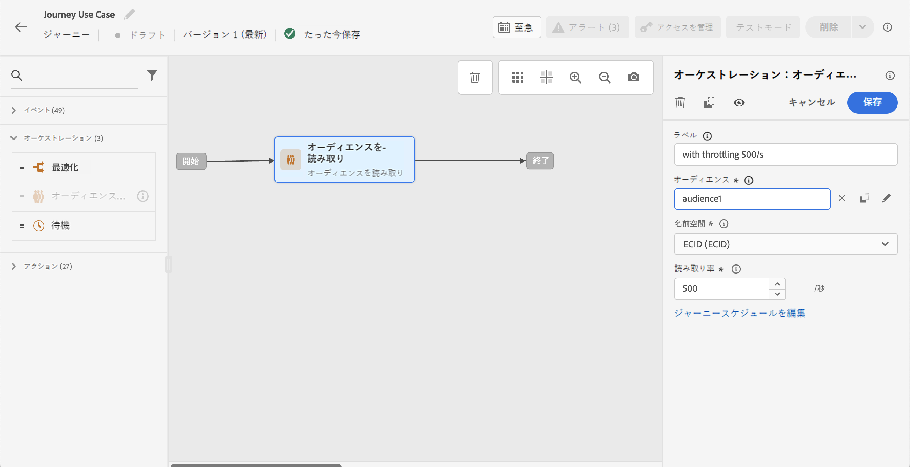
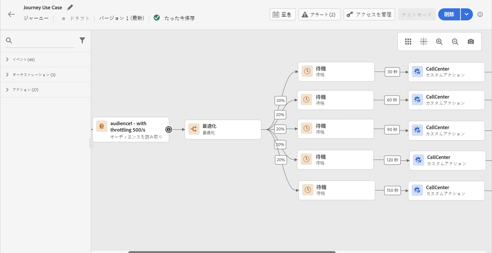

# ユースケース：外部データソースとカスタムアクションでスループットを制限する{#limit-throughput}

>[!BEGINSHADEBOX]

**このページでは、**&#x200B;外部システムがサポートされている1秒あたりのリクエスト数を超えないように、カスタムアクションと外部データソースを使用してジャーニー処理をスロットリングする方法について説明します。

>[!ENDSHADEBOX]

このユースケースは、外部システムが1秒あたりの上限リクエスト数を処理する必要がある場合に、ジャーニー処理をスロットリングする場合に使用します。

## ユースケースの説明

[!DNL Adobe Journey Optimizer]では、実務担当者がカスタムアクションとデータソースを使用して、外部システムにAPI呼び出しを送信できます。

これは以下を使用して行うことができます。

* **データソース**：外部システムから情報を収集し、その情報をジャーニーコンテキストで使用します（例えば、プロファイル都市の天気情報を取得し、それに基づいて専用のジャーニーフローを持つ場合）。

* **カスタムアクション**：外部システムに情報を送信します（例えば、プロファイル情報、オーディエンスデータ、ジャーニーコンテキストと共に Journey Optimizer のオーケストレーション機能を使用して外部ソリューションからメールを送信する）。

>[!NOTE]
>
>応答がサポートされるようになったので、外部データソースのユースケースでは、データソースの代わりにカスタムアクションを使用する必要があります。 応答について詳しくは、この[節](../action/action-response.md)を参照してください。

外部データソースやカスタムアクションを扱う場合は、ジャーニーのスループットを単一ジャーニーの場合は最大 5,000 インスタンス/秒、オーディエンストリガージャーニーの場合は最大 20,000 インスタンス/秒に制限して、外部システムを保護する必要が生じる場合があります。 ジャーニーの処理率とスループットについて詳しくは、[この節](entry-management.md#journey-processing-rate)を参照してください。

カスタムアクションの場合、スロットル機能は製品レベルで使用できます。 この[ページ](../configuration/external-systems.md#capping)を参照してください。

外部データソースの場合、Journey Optimizer の Capping API を使用して、これらの外部システムに圧倒されるのを回避できるようエンドポイントレベルでキャップのキャップを定義できます。 ただし、制限に到達後、残りのリクエストはすべて破棄されます。 この節では、スループットを最適化するために使用できる回避策を見つけます。

外部システムとの統合方法について詳しくは、この[ページ](../configuration/external-systems.md)を参照してください。

## 実装

**オーディエンストリガージャーニー**&#x200B;では、ジャーニーのスループットに影響を与える「オーディエンスを読み取り」アクティビティの読み取り率を定義できます。 [詳細情報](../building-journeys/read-audience.md)

>[!NOTE]
>
> これは、1 秒あたりにジャーニーにエントリできるプロファイルの最大数です。 このレートは、このアクティビティにのみ適用され、ジャーニーの他のアクティビティには適用されません。 [詳細情報](../building-journeys/read-audience.md)

この値は、1 秒あたりのインスタンス数 500 件から 20,000 件の範囲で変更できます。 1 秒あたり 500 件未満にする必要がある場合は、待機アクティビティと共に「パーセンテージ分割」条件を追加して、ジャーニーを複数の分岐に分割し、特定の時間に実行させることもできます。

例として、**10,000 件のプロファイル**&#x200B;を持つ母集団を扱う&#x200B;**オーディエンストリガージャーニー**&#x200B;があり、**1 秒あたり 100 件のリクエスト**&#x200B;をサポートする外部システムにデータを送信するとします。

1. 1 秒あたり 500 プロファイルのスループットでプロファイルを読み取るように、「オーディエンスを読み取り」を定義することができます。つまり、すべてのプロファイルを読み取るのに 20 秒かかります。 1 秒目では、そのうち 500 件を読み取り、2 秒目ではさらに 500 件、というように読み取ります。

1. 次に、20％の分割を持つ「パーセンテージ分割」条件アクティビティを追加して、各分岐の各秒に 100 件のプロファイルを持つことができます。

1. その後、各分岐で、特定のタイマーを使用して待機アクティビティを追加します。 ここでは、それぞれに対して 30 秒の待機を設定しました。 毎秒、100 件のプロファイルが各分岐に送られます。

   * 分岐 1 では、30 秒待機します。つまり、
      * 1 秒目では、100 件のプロファイルが 31 秒目まで待機します
      * 2 秒目では、100 件のプロファイルが 32 秒目まで待機し、以下同様に続きます。

   * 分岐 2 では、60 秒待機します。つまり、
      * 1 秒目では、100 件のプロファイルが 61 秒目（1 分 1 秒）まで待機します
      * 2 秒目には、100 件のプロファイルが 62 秒目（1 分 2 秒）まで待機し、以下同様に続きます。

   * すべてのプロファイルを読み取るのに最大 20 秒が必要となることがわかっているため、各分岐間で重複は発生せず、条件にプロファイルが送られるのは 20 秒目が最後となります。 31 秒から 51 秒の間に、分岐 1 内のすべてのプロファイルが処理されます。 61 秒目（1 分 1 秒）から 81 秒目（1 分 21 秒）の間で、分岐 2 内のすべてのプロファイルが処理されます。

   * ガードレールとして、特に外部システムが 1 秒あたり 100 リクエストしかサポートしていない場合に、1 つの分岐あたり 100 件未満のプロファイルを持つ 6 つ目の分岐を追加することもできます。

>[!IMPORTANT]
>
>回避策と同様に、本番環境に移行する前にそのソリューションを十分にテストし、想定通りに動くか確認してください。

追加のガードレールとして、キャッピング機能を使用することもできます。

>[!NOTE]
>
>サンドボックスのすべてのジャーニーに対してグローバルにすることでエンドポイントを保護するキャッピング機能とは異なり、この回避策はジャーニーレベルでのみ機能します。 つまり、複数のジャーニーが並行して実行され、同じエンドポイントをターゲティングしている場合、ジャーニーを設計する際に、その点を考慮に入れる必要があります。 したがって、この回避策はすべてのユースケースに適しているわけではありません。

+++ AI ナレッジリファレンス

このセクションには、このトピックに関連する解釈、検索、質問への回答をサポートすることを目的とした構造化された知識が含まれています。

理解を深めるには、この情報をこのページのドキュメントと組み合わせる必要があります。 どちらのソースも単独で使用することを意図していません。このページでは、機能について説明しますが、この節では、用語、意図、適用可能性、および制約の曖昧さを解消するのに役立つ追加のコンテキストを提供します。

* **TL;DR:**&#x200B;このページでは、オーディエンスの読み取りレート設定、パーセンテージ分割、待機アクティビティを使用して、外部データソースまたはカスタムアクションの1秒あたりのリクエスト数に上限がある場合に、ジャーニースループットを制限する方法について説明します。

**インテント：**

* オーディエンスをトリガーとしたジャーニーのスループットを制限して、外部システムの負担を回避します
* オーディエンスを読み取りアクティビティの読み取り率を設定して、1秒間に入力するプロファイル数を制御します
* パーセンテージ分割条件と待機アクティビティを組み合わせて、プロファイル処理を時間をかけて分散させます
* ジャーニーレベルのスループットワークアラウンドとサンドボックスレベルのキャッピング機能の違いを理解します
* 製品レベルでのカスタムアクションへのキャッピング機能の適用

**用語集：**

* **スロットル / スループット制限**：外部システムのリクエスト容量を超えないように、プロファイルがジャーニーを流れる速度を制御します。 *（製品固有）*
* **オーディエンス読み取り率**: 1秒あたりのジャーニーにエントリするプロファイルの最大数を設定する、オーディエンス読み取りアクティビティの設定可能なパラメーター（範囲：500 ～ 20,000 インスタンス/秒）。 *（製品固有）*
* **Capping API**：外部データソースのエンドポイントあたりの最大リクエスト制限を定義するJourney Optimizer API。キャップを超えるリクエストはドロップされます。 *（製品固有）*
* **パーセンテージ分割条件**: プロファイルフローをパーセンテージで分岐に分割する条件アクティビティ。ここでは、時間差の待機パスをまたいでプロファイルを配布するために使用します。 *（製品固有）*

**ガードレール：**

* オーディエンス読み取り率は、1秒あたり500 ～ 20,000 インスタンスの間で設定できます。500/秒未満の値には、パーセンテージ分割と待機アクティビティを使用した回避策が必要です
* 単一ジャーニーは最大5,000 インスタンス/秒をサポート、オーディエンストリガージャーニーは最大20,000 インスタンス/秒をサポート
* パーセンテージ分割+待機回避策は、ジャーニーレベルでのみ動作し、サンドボックス内のすべてのジャーニーには適用されません
* 複数のジャーニーが同じ外部エンドポイントを並行してターゲットする場合、この回避策は、組み合わされた負荷を考慮しません。代わりに、キャップ機能を使用する必要があります
* 外部データソースの上限を超える残りのリクエストは、キューに入れずにドロップされます
* 本番環境に移行する前に、回避策を徹底的にテストする必要があります

**用語：**

* 正式名称：スループット制限 – 頭字語：none — バリアント：スロットリング、レート制限、ジャーニースループット制御
* 同義語：外部エンドポイント保護のコンテキストにおける「キャップ」 = 「スロットリング」
* 混同しないでください。「Capping API （エンドポイントレベル）」≠「読み取り率（ジャーニーレベル）」 — Capping APIは、エンドポイントを対象とするサンドボックス内のすべてのジャーニーにグローバルに適用されます。読み取り率とスプリット/待機回避策は、個々のジャーニーにのみ適用されます

**FAQ:**

* **Q: オーディエンスを読み取りアクティビティで設定できる最大読み取り率は何ですか？** — 500 ～ 20,000 プロファイル/秒。500/秒を下回る場合は、待機アクティビティでパーセンテージ分割を使用します。
* **Q: パーセンテージ分割と待機アクティビティは、スループットの制限にどのように役立ちますか？** - プロファイルを分岐に分割し（例：各20%）、分岐ごとに時間差待機タイマーを追加することで、1秒間に管理された数のプロファイルのみが外部システムに到達するようにします。
* **Q: パーセンテージ分割の回避策は、同じエンドポイントをターゲットとするすべてのジャーニーを保護しますか？**  – いいえ、個々のジャーニーレベルでのみ機能します。 同じエンドポイントに対して複数のジャーニーを並行して実行する場合は、代わりにサンドボックスレベルのキャッピング機能を使用します。
* **Q：外部データソースの上限を超えるリクエストはどうなりますか？**  – これらはドロップされます。Capping APIは余分なリクエストをキューに入れません。
* **Q：外部データのユースケースにカスタムアクションまたはデータソースを使用する必要がありますか？** — カスタムアクションは、レスポンス処理をサポートしているので優先されます。データソースは、ユースケースで特に必要な場合にのみ使用してください。

+++
