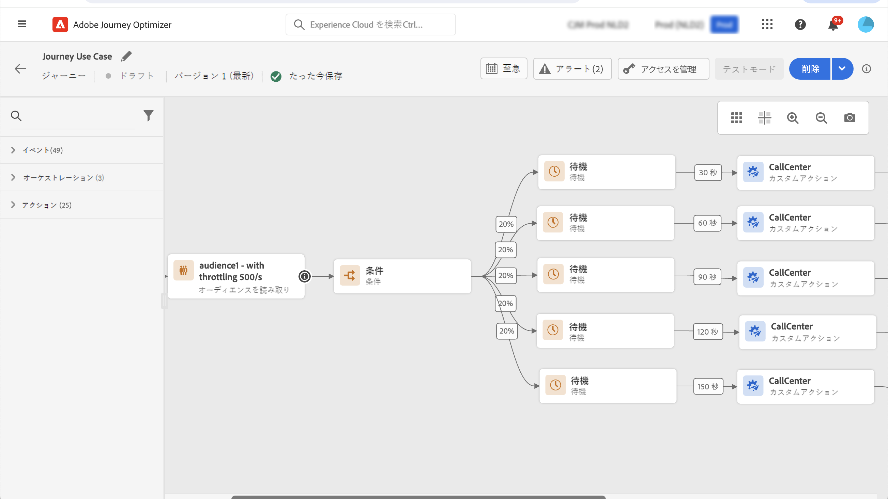

# ユースケース：外部データソースとカスタムアクションを使用してスループットを制限する{#limit-throughput}

## ユースケースの説明

Adobe Journey Optimizer を使用すると、実務担当者は、カスタムアクションとデータソースを使用して、外部システムに API 呼び出しを送信できます。

これは以下を使用して行うことができます。

* **データソース**：外部システムから情報を収集し、その情報をジャーニーコンテキストで使用します（例えば、プロファイル都市の天気情報を取得し、それに基づいて専用のジャーニーフローを持つ場合）。

* **カスタムアクション**：外部システムに情報を送信します（例えば、プロファイル情報、オーディエンスデータ、ジャーニーコンテキストと共に Journey Optimizer のオーケストレーション機能を使用して外部ソリューションからメールを送信する）。

>[!NOTE]
>
>応答がサポートされるようになったので、外部データソースのユースケースでは、データソースの代わりにカスタムアクションを使用する必要があります。応答について詳しくは、この[節](../action/action-response.md)を参照してください。

外部データソースやカスタムアクションを扱う場合は、ジャーニーのスループットを単一ジャーニーの場合は最大 5,000 インスタンス/秒、オーディエンストリガージャーニーの場合は最大 20,000 インスタンス/秒に制限して、外部システムを保護する必要が生じる場合があります。

カスタムアクションの場合、スロットル機能は製品レベルで使用できます。 この[ページ](../configuration/external-systems.md#capping)を参照してください。

外部データソースの場合、Journey Optimizer の Capping API を使用して、これらの外部システムに圧倒されるのを回避できるようエンドポイントレベルでキャップのキャップを定義できます。ただし、制限に到達後、残りのリクエストはすべて破棄されます。この節では、スループットを最適化するために使用できる回避策を見つけます。

外部システムとの統合方法について詳しくは、この[ページ](../configuration/external-systems.md)を参照してください。

## 実装

**オーディエンストリガージャーニー**&#x200B;では、ジャーニーのスループットに影響を与える「オーディエンスを読み取り」アクティビティの読み取り率を定義できます。[詳細情報](../building-journeys/read-audience.md)

>[!NOTE]
>
> これは、1 秒あたりにジャーニーにエントリできるプロファイルの最大数です。このレートは、このアクティビティにのみ適用され、ジャーニーの他のアクティビティには適用されません。[詳細情報](../building-journeys/read-audience.md)

この値は、1 秒あたりのインスタンス数 500 件から 20,000 件の範囲で変更できます。1 秒あたり 500 件未満にする必要がある場合は、待機アクティビティと共に「パーセンテージ分割」条件を追加して、ジャーニーを複数の分岐に分割し、特定の時間に実行させることもできます。

例として、**10,000 件のプロファイル**&#x200B;を持つ母集団を扱う&#x200B;**オーディエンストリガージャーニー**&#x200B;があり、**1 秒あたり 100 件のリクエスト**&#x200B;をサポートする外部システムにデータを送信するとします。

1. 1 秒あたり 500 プロファイルのスループットでプロファイルを読み取るように、「オーディエンスを読み取り」を定義することができます。つまり、すべてのプロファイルを読み取るのに 20 秒かかります。1 秒目では、そのうち 500 件を読み取り、2 秒目ではさらに 500 件、というように読み取ります。

1. 次に、20％の分割を持つ「パーセンテージ分割」条件アクティビティを追加して、各分岐の各秒に 100 件のプロファイルを持つことができます。

1. その後、各分岐で、特定のタイマーを使用して待機アクティビティを追加します。ここでは、それぞれに対して 30 秒の待機を設定しました。毎秒、100 件のプロファイルが各分岐に送られます。

   * 分岐 1 では、30 秒待機します。つまり、
      * 1 秒目では、100 件のプロファイルが 31 秒目まで待機します
      * 2 秒目では、100 件のプロファイルが 32 秒目まで待機し、以下同様に続きます。

   * 分岐 2 では、60 秒待機します。つまり、
      * 1 秒目では、100 件のプロファイルが 61 秒目（1 分 1 秒）まで待機します
      * 2 秒目には、100 件のプロファイルが 62 秒目（1 分 2 秒）まで待機し、以下同様に続きます。

   * すべてのプロファイルを読み取るのに最大 20 秒が必要となることがわかっているため、各分岐間で重複は発生せず、条件にプロファイルが送られるのは 20 秒目が最後となります。31 秒から 51 秒の間に、分岐 1 内のすべてのプロファイルが処理されます。61 秒目（1 分 1 秒）から 81 秒目（1 分 21 秒）の間で、分岐 2 内のすべてのプロファイルが処理されます。

   * ガードレールとして、特に外部システムが 1 秒あたり 100 リクエストしかサポートしていない場合に、1 つの分岐あたり 100 件未満のプロファイルを持つ 6 つ目の分岐を追加することもできます。

>[!IMPORTANT]
>
>回避策と同様に、実稼動環境に移行する前にそのソリューションを十分にテストし、想定通りに動くか確認してください。

追加のガードレールとして、キャッピング機能を使用することもできます。

>[!NOTE]
>
>サンドボックスのすべてのジャーニーに対してグローバルにすることでエンドポイントを保護するキャッピング機能とは異なり、この回避策はジャーニーレベルでのみ機能します。つまり、複数のジャーニーが並行して実行され、同じエンドポイントをターゲティングしている場合、ジャーニーを設計する際に、その点を考慮に入れる必要があります。したがって、この回避策はすべてのユースケースに適しているわけではありません。
