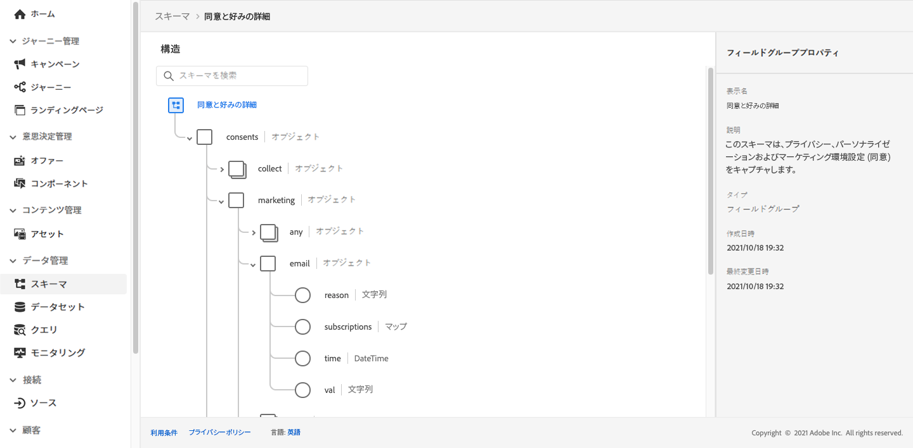
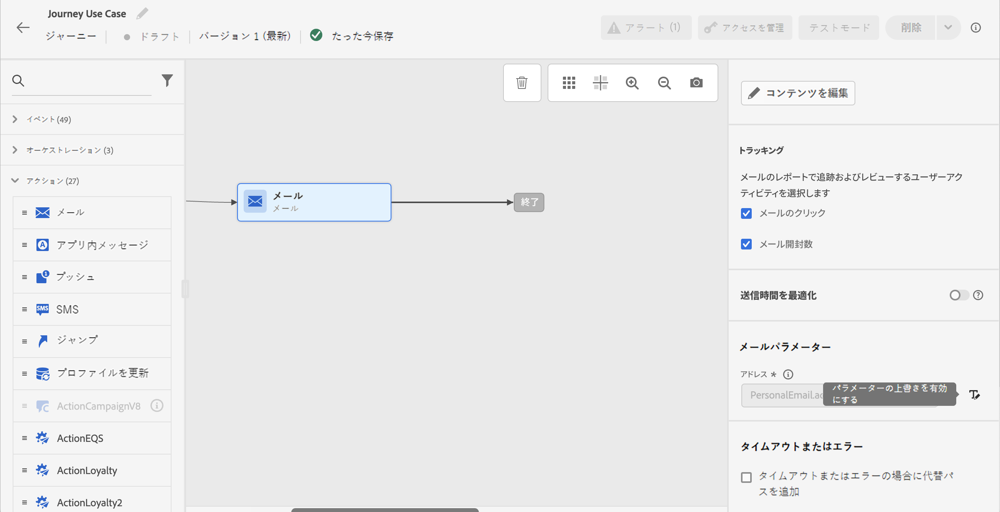
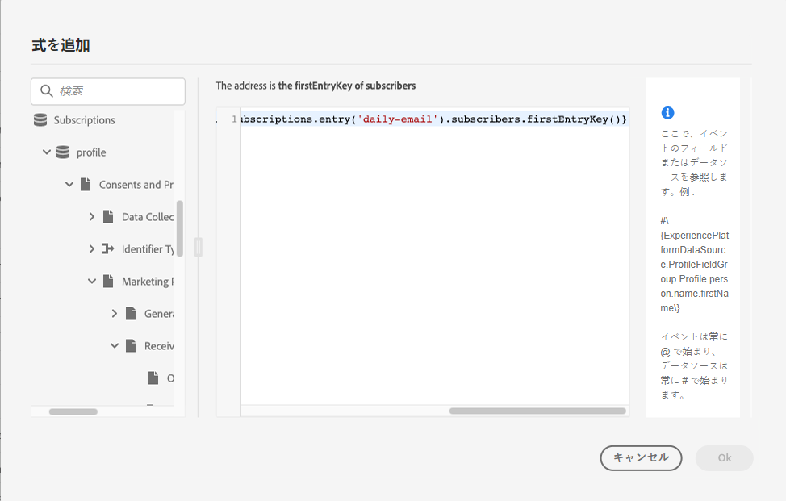

# ユースケース：リストの登録者に対するメッセージの送信{#send-a-message-to-the-subscribers-of-a-list}

このユースケースの目的は、ジャーニーを作成してリスト上の購読者にメッセージを送信することです。

この例では、[!DNL Adobe Experience Platform] の「**[!UICONTROL 同意と環境設定の詳細]**」フィールドグループを使用します。このフィールドグループを見つけるには、 **[!UICONTROL データ管理]**&#x200B;メニューから「**[!UICONTROL スキーマ]**」を選択します。「**[!UICONTROL フィールドグループ]**」タブで、検索フィールドにフィールドグループの名前を入力します。



このジャーニーを設定するには、次の手順に従います。

1. **[!UICONTROL 読み取り]**&#x200B;アクティビティで始まるジャーニーを作成します。[詳細情報](journey-gs.md)
1. を追加します。 **[!UICONTROL 電子メール]** ジャーニーに対するアクションアクティビティ。 [詳細情報](journeys-message.md)。
1. 内 **[!UICONTROL E メールパラメーター]** セクション **[!UICONTROL 電子メール]** アクティビティの設定で、デフォルトの電子メールアドレス (`PersonalEmail.adress`) にリスト購読者の電子メールアドレスを入力します。

   1. 「**[!UICONTROL アドレス]**」フィールドの右側にある「 **[!UICONTROL パラメーターの上書きを有効にする]**」アイコンをクリックしたあと、「**[!UICONTROL 編集]**」アイコンをクリックします。

      

   1. 式エディターで、購読者のメールアドレスを取得する式を入力します。[詳細情報](expression/expressionadvanced.md)

      この例では、マップフィールドへの参照を含む式を示しています。

      ```json
      #{ExperiencePlatform.Subscriptions.profile.consents.marketing.email.subscriptions.entry('daily-email').subscribers.firstEntryKey()}
      ```

      この例では、次の関数が使用されています。

      | 関数 | 説明 | 例 |
      | --- | --- | --- |
      | `entry` | 選択した名前空間に従ってマップ要素を参照します | 特定のサブスクリプションリストを参照します |
      | `firstEntryKey` | マップの最初のエントリキーを取得します | 購読者の最初のメールアドレスを取得します |

      この例では、サブスクリプションリストの名前は `daily-email` です。メールアドレスは、`subscribers` マップでキーとして定義されています。このマップはサブスクリプションリストマップにリンクされています。

      式におけるフィールドへの参照について詳しくは、[こちら](expression/field-references.md)を参照してください。

      

   1. **[!UICONTROL 式を追加]**&#x200B;ダイアログボックスで「**[!UICONTROL OK]**」をクリックします。
