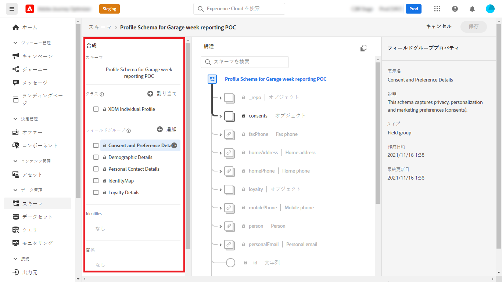
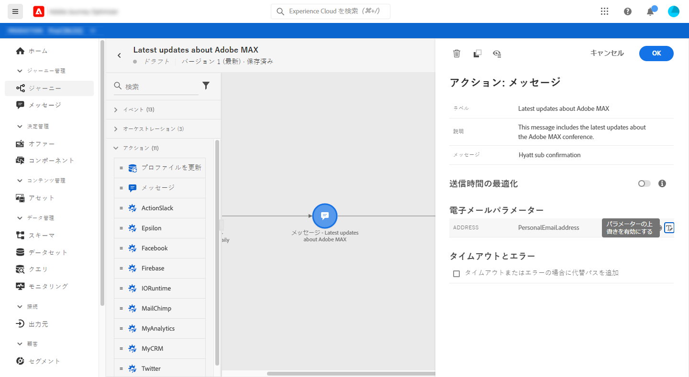
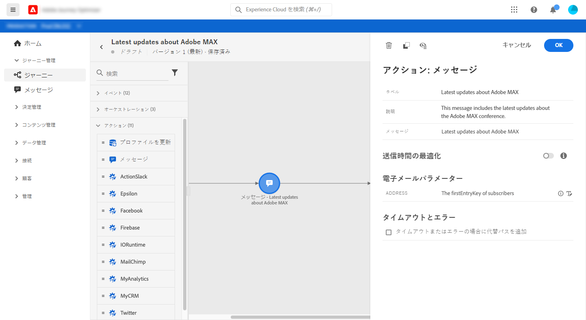

# リストの購読者にメッセージを送信

この使用例の目的は、リストの購読者にメッセージを送信するジャーニーを作成することです。

この例では、 **[!UICONTROL 同意および環境設定の詳細]** フィールドグループから [!DNL Adobe Experience Platform] が使用されます。 このフィールドグループを検索するには、 **[!UICONTROL データ管理]** メニュー、選択 **[!UICONTROL スキーマ]**. の **[!UICONTROL フィールドグループ]** 「 」タブで、検索フィールドにフィールドグループの名前を入力します。



このジャーニーを設定するには、次の手順に従います。

1. 次で始まるジャーニーの作成： **[!UICONTROL 読み取り]** アクティビティ。 [詳細を読む](journey-gs.md)。
1. を追加します。 **[!UICONTROL メッセージ]** アクティビティをジャーニーに送信します。 [詳細を読む](journeys-message.md)。
1. 内 **[!UICONTROL E メールパラメーター]** セクション **[!UICONTROL メッセージ]** アクティビティの設定で、デフォルトの電子メールアドレス (`PersonalEmail.adress`) にリスト購読者の電子メールアドレスを入力します。

   1. 次をクリック： **[!UICONTROL パラメーターの上書きを有効にする]** アイコン **[!UICONTROL 住所]** フィールドに値を入力し、 **[!UICONTROL 編集]** アイコン

      

      E メールアドレスを変更するには、以前にメッセージを公開しておく必要があります。

   1. 式エディターで、式を入力して、購読者の E メールアドレスを取得します。 [詳細を読む](expression/expressionadvanced.md)。

      この例では、マップフィールドへの参照を含む式を示します。

      ```json
      #{ExperiencePlatform.Subscriptions.profile.consents.marketing.email.subscriptions.entry('daily-email').subscribers.firstEntryKey()}
      ```

      この例では、次の関数が使用されています。

      | 関数 | 説明 | 例 |
      | --- | --- | --- |
      | `entry` | 選択した名前空間に従ってマップ要素を参照します。 | 特定の購読リストを参照 |
      | `firstEntryKey` | マップの最初のエントリキーを取得します | 購読者の最初の E メールアドレスの取得 |

      この例では、購読リストの名前はです。 `daily-email`. 電子メールアドレスは、 `subscribers` map：購読リストマップにリンクされています。

      詳細を表示 [フィールドへの参照](expression/field-references.md) 式内。

      

   1. 内 **[!UICONTROL 式を追加]** ダイアログボックスで、 **[!UICONTROL Ok]**.

   

1. ジャーニーを **[!UICONTROL 終了]** アクティビティ。
