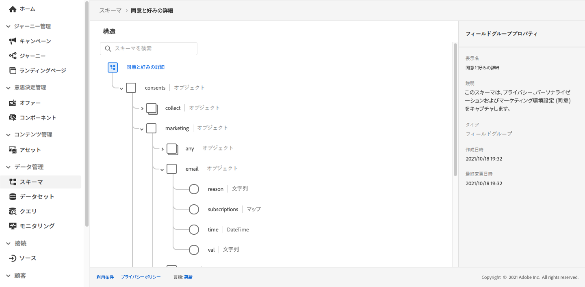
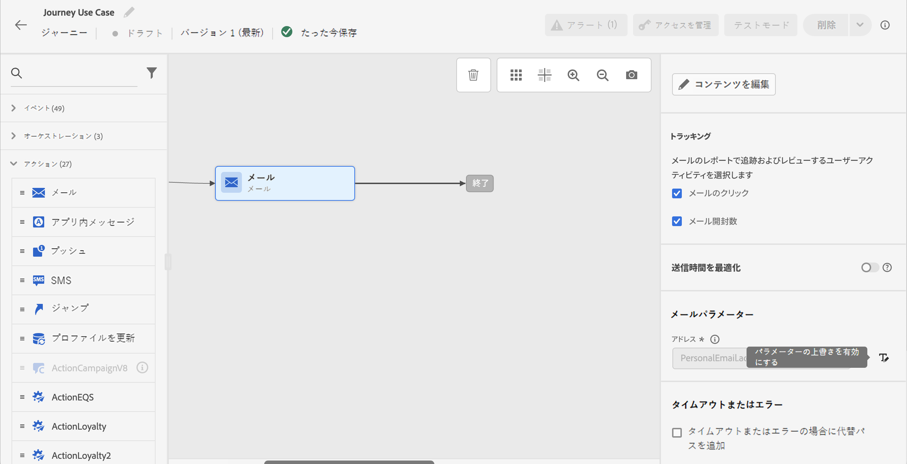
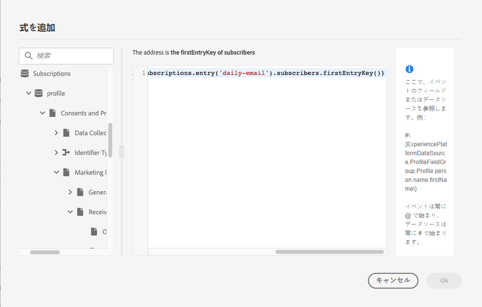

# リスト上の購読者に対するメッセージの送信 {#send-a-message-to-the-subscribers-of-a-list}

このユースケースの目的は、ジャーニーを作成してリスト上の購読者にメッセージを送信することです。

この例では、[!DNL Adobe Experience Platform] の「**[!UICONTROL 同意と環境設定の詳細]**」フィールドグループを使用します。 このフィールドグループを見つけるには、 **[!UICONTROL データ管理]**&#x200B;メニューから「**[!UICONTROL スキーマ]**」を選択します。 「**[!UICONTROL フィールドグループ]**」タブで、検索フィールドにフィールドグループの名前を入力します。



このジャーニーを設定するには、次の手順に従います。

1. **[!UICONTROL 読み取り]**&#x200B;アクティビティで始まるジャーニーを作成します。 詳しくは、[初めてのジャーニーの作成](journey-gs.md)を参照してください。
1. **[!UICONTROL メール]**&#x200B;アクションアクティビティをジャーニーに追加します。 詳しくは、[チャネルアクションの操作](journey-action.md)を参照してください。
1. **[!UICONTROL メール]**&#x200B;アクティビティ設定の「**[!UICONTROL メールパラメーター]**」セクションで、デフォルトのメールアドレス（`PersonalEmail.adress`）をリスト上の購読者のメールアドレスに置き換えます。

   1. 「**[!UICONTROL アドレス]**」フィールドの右側にある「 **[!UICONTROL パラメーターの上書きを有効にする]**」アイコンをクリックしたあと、**[!UICONTROL 編集]**&#x200B;アイコンをクリックします。

      

   1. 式エディターで、購読者のメールアドレスを取得する式を入力します。 [詳細情報](expression/expressionadvanced.md)

      この例では、マップフィールドへの参照を含む式を示しています。

      ```json
      #{ExperiencePlatform.Subscriptions.profile.consents.marketing.email.subscriptions.entry('daily-email').subscribers.firstEntryKey()}
      ```

      この例では、次の関数が使用されています。

      | 関数 | 説明 | 例 |
      | --- | --- | --- |
      | `entry` | 選択した名前空間に従ってマップ要素を参照します | 特定のサブスクリプションリストを参照します |
      | `firstEntryKey` | マップの最初のエントリキーを取得します | 購読者の最初のメールアドレスを取得します |

      この例では、サブスクリプションリストの名前は `daily-email` です。 メールアドレスは、`subscribers` マップでキーとして定義されています。このマップはサブスクリプションリストマップにリンクされています。

      式におけるフィールドへの参照について詳しくは、[こちら](expression/field-references.md)を参照してください。

      

   1. **[!UICONTROL 式を追加]**&#x200B;ダイアログボックスで「**[!UICONTROL OK]**」をクリックします。

>[!CAUTION]
>
>メールアドレスの上書きは、特定のユースケースに対してのみ使用してください。 ほとんどの場合、**[!UICONTROL 実行フィールド]**&#x200B;でプライマリアドレスとして定義されている値を使用する必要があるため、メールアドレスを変更する必要はありません。 [詳細情報](../configuration/primary-email-addresses.md)
