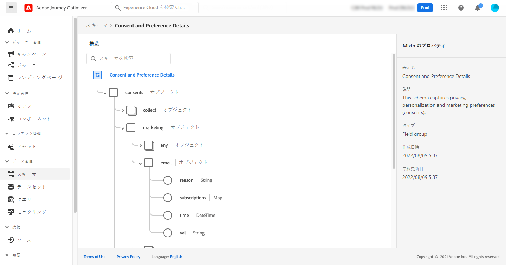

# 使用例: リストのサブスクライバーにメッセージを送信します。{#send-a-message-to-the-subscribers-of-a-list}

この例では、リストのサブスクライバーにメッセージを送信するための旅を作成することを目的としています。

次の例では、の [!DNL Adobe Experience Platform] フィールドグループが使用されて **[!UICONTROL Consent and Preference Details]** います。このフィールドグループを検索するには、メニューから **[!UICONTROL Data Management]** 「」を選択 **[!UICONTROL Schemas]** します。 **[!UICONTROL Field groups]**「」タブで、「検索」フィールドにフィールドグループの名前を入力します。



このような旅を設定するには、次の手順を実行します。

1. アクティビティから始まる **[!UICONTROL Read]** 旅を作成します。 [詳しく ](journey-gs.md) は、こちらを参照してください。
1. **[!UICONTROL Email]**&#x200B;旅にアクションアクティビティを追加します。[詳しく ](journeys-message.md) は、こちらを参照してください。
1. **[!UICONTROL Email parameters]**&#x200B;アクティビティ設定の **[!UICONTROL Email]** セクションで、デフォルトの電子メールアドレス ( `PersonalEmail.adress` ) をリスト購読者の電子メールアドレスに置き換えます。

   1. **[!UICONTROL Enable parameter override]**&#x200B;フィールドの **[!UICONTROL Address]** 右側にあるアイコンをクリックしてから、 **[!UICONTROL Edit]** アイコンをクリックします。

      

   1. 式エディターに、サブスクライバーの電子メールアドレスを取得するための式を入力します。 [詳しく ](expression/expressionadvanced.md) は、こちらを参照してください。

      次の例は、マップフィールドへの参照を含む式を示しています。

      ```json
      #{ExperiencePlatform.Subscriptions.profile.consents.marketing.email.subscriptions.entry('daily-email').subscribers.firstEntryKey()}
      ```

      次の例では、これらの関数を使用しています。

      | 関数 | つい | 一 |
      | --- | --- | --- |
      | `entry` | 選択された名前空間に従い、マップエレメントを参照します。 | 特定の購読リストの参照 |
      | `firstEntryKey` | マップの1番目のエントリキーを取得します。 | サブスクライバーの最初の電子メールアドレスを取得します。 |

      この例では、購読リストにはという名前が付け `daily-email` られています。 電子メールアドレスは、購読リストマップにリンクされたマップ内の `subscribers` キーとして定義されます。

      式のフィールド ](expression/field-references.md) の参照について詳しくは、こちらを参照して [ ください。

      

   1. **[!UICONTROL Add an expression]**&#x200B;ダイアログボックスで、をクリック **[!UICONTROL Ok]** します。
