# 最適化アクティビティ {#journey-path-optimization}

>[!CONTEXTUALHELP]
>id="ajo_journey_optimize"
>title="最適化アクティビティ"
>abstract="**最適化**&#x200B;アクティビティでは、実験、ターゲティング、特定の条件など、特定の条件に基づいて複数のパスを作成することで、個人がジャーニーをどのように進めるかを定義できます。"

>[!AVAILABILITY]
>
>この機能は、限定提供です。アクセス権を取得するには、アドビ担当者にお問い合わせください。

**最適化**&#x200B;アクティビティでは、実験、ターゲティング、特定の条件など、特定の条件に基づいて複数の&#x200B;**パス**&#x200B;を作成することで、個人がジャーニーをどのように進めるかを定義できます。これにより、最大限のエンゲージメントと成功が確保され、高度にカスタマイズされた効果的なジャーニーを作成できます。

ジャーニー **パス** は、通信の順序付け、通信の間隔、通信の数またはこれらの 3 つの変数の任意の組み合わせのいずれかで構成できます。

例えば、1 つのパスに 1 つのメールを含め、別のパスに 2 つの SMS メッセージを含め、3 番目のパスにメール、2 時間の待機ノード、そして SMS メッセージを含めることができます。

<!--With this feature, [!DNL Journey Optimizer] empowers you with the tools to deliver personalized and optimized paths to your audience, ensuring maximum engagement and success to create highly customized and effective journeys.-->

**最適化** アクティビティを通じて、結果として得られるパスに対して次のアクションを実行できます。

* [パス実験](#experimentation)を実行する
* 各ジャーニーパスでの[ターゲティング](#targeting)ルールを活用する
* パスに[条件](#conditions)を適用する

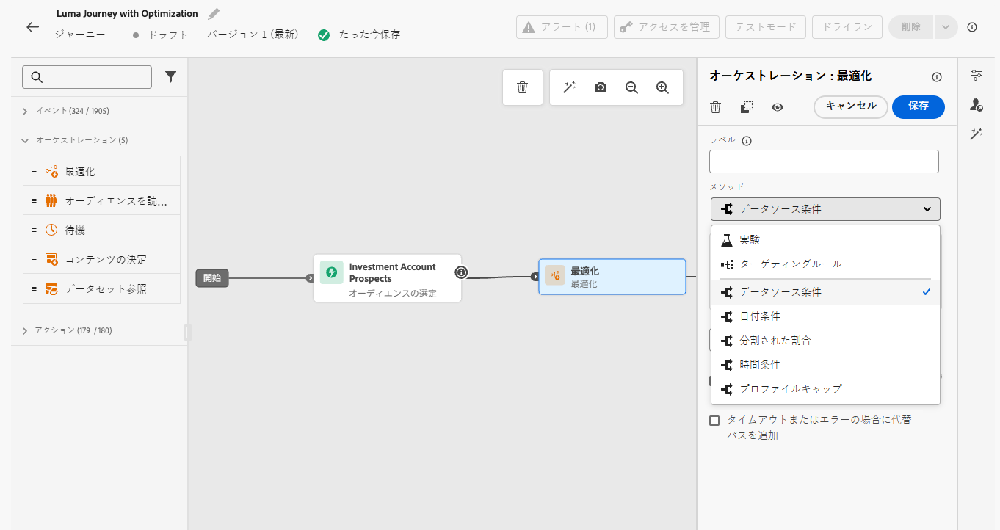

ジャーニーがライブになると、プロファイルは定義済み条件に照らして評価され、一致条件に基づいて、ジャーニーから適切なパスに送信されます。

## 実験を使用 {#experimentation}

>[!CONTEXTUALHELP]
>id="ajo_path_experiment_success_metric"
>title="成功指標"
>abstract="成功指標は、実験で最もパフォーマンスの高い処理を追跡および評価するために使用します。"

実験を行うことで、ランダム分割に基づいて様々なパスをテストし、事前定義済みの成功指標に基づいて最もパフォーマンスが高いパスを判断できます。

ジャーニーでパス実験を設定するには、次の手順に従います。

次の 3 つのパスを比較するとします。

* メールが 1 件の 1 番目のパス。
* 2 日間の **[!UICONTROL 待機]** ノードとメールを含む 2 番目のパス。
* メールの後に SMS メッセージを送信する 3 番目のパス。

1. 「**[!UICONTROL オーケストレーション]**」セクションで、「**[!UICONTROL 最適化]**」アクティビティをジャーニーキャンバスにドラッグ&amp;ドロップします。

1. オプションのラベルを追加します。このラベルは、レポートおよびテストモードのログでアクティビティを識別するのに役立ちます。

1. **[!UICONTROL メソッド]**&#x200B;ドロップダウンリストから「**[!UICONTROL 実験]**」を選択します。

   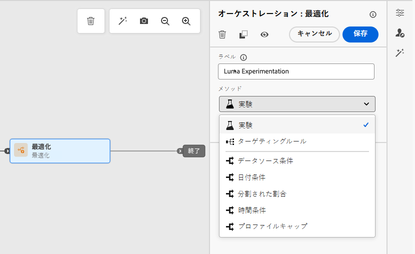{width=65%}

1. **[!UICONTROL 実験を作成]** をクリックします。

1. 実験に設定する **[!UICONTROL 成功指標]** を選択します。 使用可能な指標とリストの設定方法について詳しくは、[ この節 ](success-metrics.md) を参照してください。

   <!--Need to have the list of all default metrics + a description for each.
    Explain why the metric selection is important.
    Are there custom metrics? If so explain.
    If possible, add best practices and examples for each metrics (could even be a dedicated section).
    Consider adding an example in this step: For this example, select this metric to test xxx.
    -->

   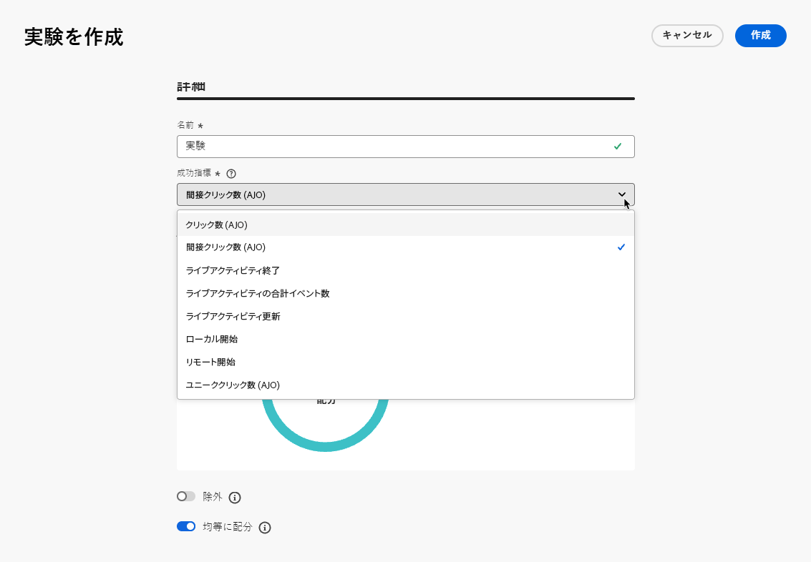{width=80%}

1. 配信に **[!UICONTROL 除外]** グループを追加することを選択できます。 このグループは、この実験からのパスを入力しません。

   >[!NOTE]
   >
   >切り替えバーをオンにすると、母集団の 10% が自動的に取得されます。 必要に応じて、この割合を調整できます。

   <!--
    DOES THIS APPLY TO PATH EXPERIMENT?
    IMPORTANT: When a holdout group is used in an action for path experimentation, the holdout assignment only applies to that specific action. After the action is completed, profiles in the holdout group will continue down the journey path and can receive messages from other actions. Therefore, ensure that any subsequent messages do not rely on the receipt of a message by a profile that might be in a holdout group. If they do, you may need to remove the holdout assignment.-->

1. 各 **[!UICONTROL 処理]** に正確な割合を割り当てることも、**[!UICONTROL 等しく分布]** 切り替えバーをオンにすることもできます。

   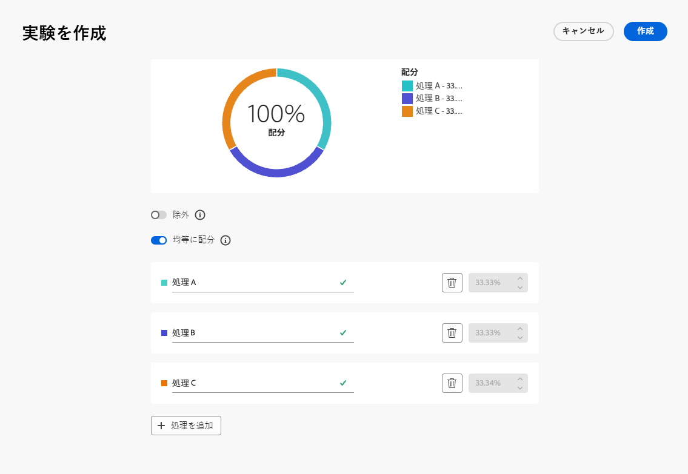{width=80%}

1. 「**[!UICONTROL 作成]**」をクリックします。

1. 実験から生成される各ブランチに必要な要素を定義します。次に例を示します。

   * [ メール ](../email/create-email.md) アクティビティを最初のブランチ（**処理 A**）にドラッグ&amp;ドロップします。

   * 2 日間の [ 待機 ](wait-activity.md) アクティビティを最初のブランチにドラッグ&amp;ドロップしたあと、[ メール ](../email/create-email.md) アクティビティ（**処理 B**）をドラッグ&amp;ドロップします。

   * [ メール ](../email/create-email.md) アクティビティを 3 つ目のブランチにドラッグ&amp;ドロップしたあと、[SMS](../sms/create-sms.md) アクティビティ（**処理 C**）をドラッグ&amp;ドロップします。

   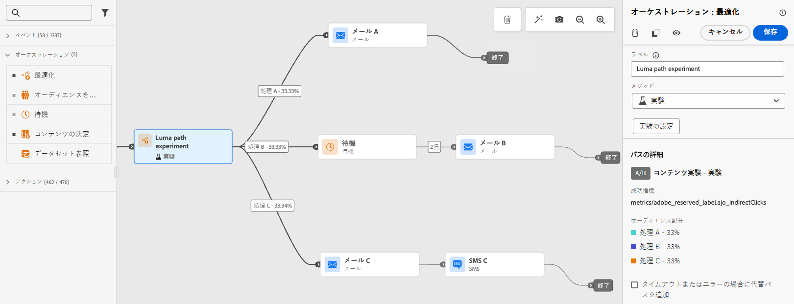{width=100%}

1. オプションで、「**[!UICONTROL タイムアウトまたはエラーの場合に代替パスを追加]**」を使用して、代替アクションを定義します。 [詳細情報](using-the-journey-designer.md#paths)

1. チャネルアクションを選択し、「**[!UICONTROL コンテンツを編集]** ボタンを使用してデザインツールにアクセスします。

   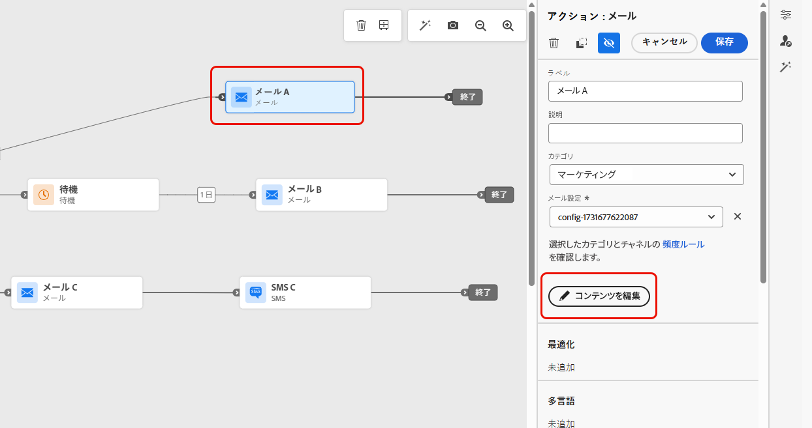{width=70%}

1. そこから、左のパネルを使用して、実験の各アクションに対して異なるコンテンツ間を移動できます。 各コンテンツを選択し、必要に応じてデザインします。

   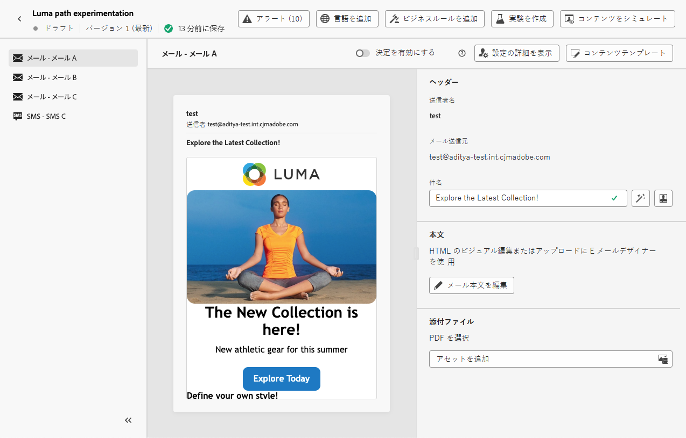{width=100%}

1. ジャーニーを [ 公開 ](publishing-the-journey.md) します。

ジャーニーがライブになると、ユーザーには異なるパスを進むようにランダムに割り当てられます。[!DNL Journey Optimizer] は、どのパスが最もパフォーマンスが高いかを追跡し、アクションにつながるインサイトを提供します。

ジャーニーパス実験レポートを使用して、ジャーニーの成功を追跡します。 [詳細情報](../reports/journey-global-report-cja-experimentation.md)

### 実験のユースケース {#uc-experiment}

次の例は、**[!UICONTROL 最適化]**&#x200B;アクティビティを&#x200B;**[!UICONTROL 実験]**&#x200B;メソッドで使用して、全体的に最も効果的なパスを決定する方法を示しています。

+++チャネルの有効性

最初のメッセージをメールで送信した場合と SMS で送信した場合のどちらがコンバージョン率が高くなるかをテストします。

➡️ コンバージョン率を成功指標として使用します（例：購入、サインアップ）。

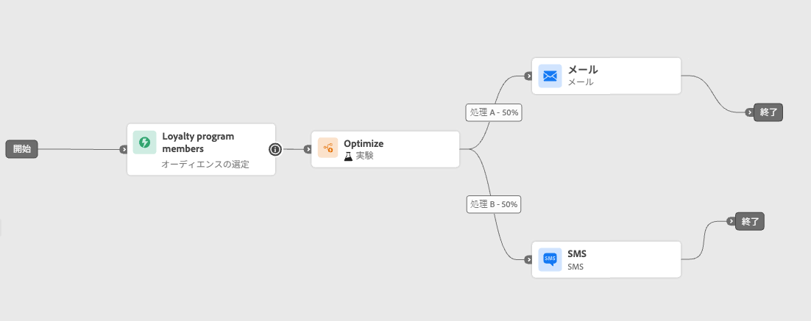

+++

+++メッセージ頻度

実験を実行して、1 週間に 1 通のメールを送信した場合と 3 通のメールを送信した場合のどちらで購入が増えるかを確認します。

➡️ 成功指標として購入または購読解除率を使用します。

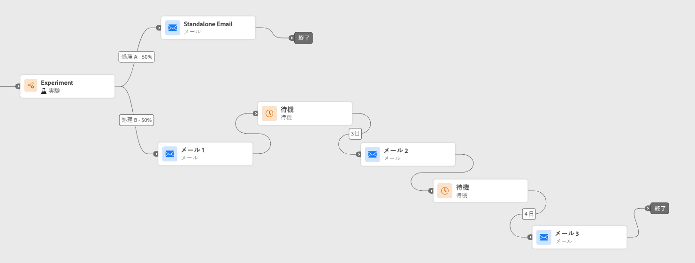

+++

+++通信間の待機時間

フォローアップ前の 24 時間待機と 72 時間待機を比較して、エンゲージメントを最大化するタイミングを判断します。

➡️ クリックスルー率または売上高を成功指標として使用します。

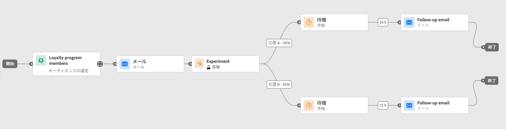

+++

## ターゲティングを活用 {#targeting}

>[!CONTEXTUALHELP]
>id="ajo_path_targeting_fallback"
>title="フォールバックパスとは"
>abstract="フォールバックパスを使用すると、ターゲティングルールが選定されていない場合に、オーディエンスが代替パスを入力できます。   このオプションを選択しない場合、ターゲティングルールに適合しないオーディエンスは、フォールバックパスに入力せずにジャーニーを終了します。"

ターゲティングルールを使用すると、特定のオーディエンスセグメント <!-- depending on profile attributes or contextual attributes--> に基づいて、ジャーニーパスの 1 つにエントリする資格を顧客が得るために満たす必要がある特定のルールまたは資格を決定できます。

特定のパスをランダムに割り当てる実験とは異なり、ターゲティングは、適切なオーディエンスまたはプロファイルが指定されたパスに確実にエントリするという点で決定論的です。

<!--With targeting, specific rules can be defined based on:

* **User profile attributes** such as location (eg. geo-targeting), age, or preferences. For example, users in the US receive a "Golden Gate" promotion, while users in France receive an "Eiffel Tower" promotion.

* **Contextual data** such as device type (eg. device-targeting), time of day, or session details. For example, desktop users receive desktop-optimized content, while mobile users receive mobile-optimized content.

* **Audiences** which can be used to include or exclude profiles that have a particular audience membership.-->

ジャーニーでターゲティングを設定するには、次の手順に従います。

1. 「**[!UICONTROL オーケストレーション]**」セクションで、「**[!UICONTROL 最適化]**」アクティビティをジャーニーキャンバスにドラッグ&amp;ドロップします。

1. オプションのラベルを追加します。このラベルは、レポートおよびテストモードのログでアクティビティを識別するのに役立ちます。

1. **[!UICONTROL メソッド]** ドロップダウンリストから「**[!UICONTROL ターゲティングルール]**」を選択します。

   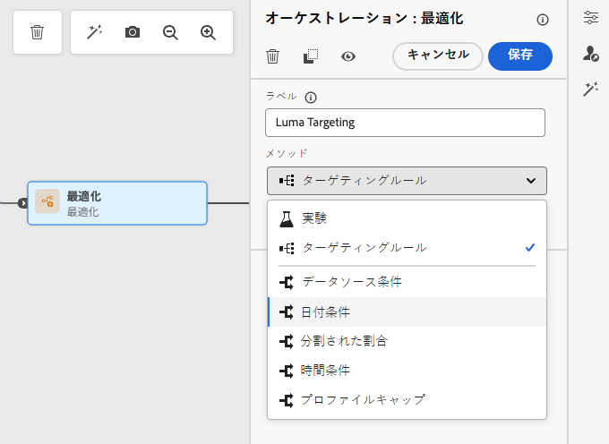{width=60%}

1. 「**[!UICONTROL ターゲティングルールを作成]**」をクリックします。

1. ルールビルダーを使用して条件を定義します。例えば、ロイヤルティプログラムのゴールドメンバー用のルール（`loyalty.status.equals("Gold", false)`）と、他のメンバー用のルール（`loyalty.status.notEqualTo("Gold", false)`）を定義します。

   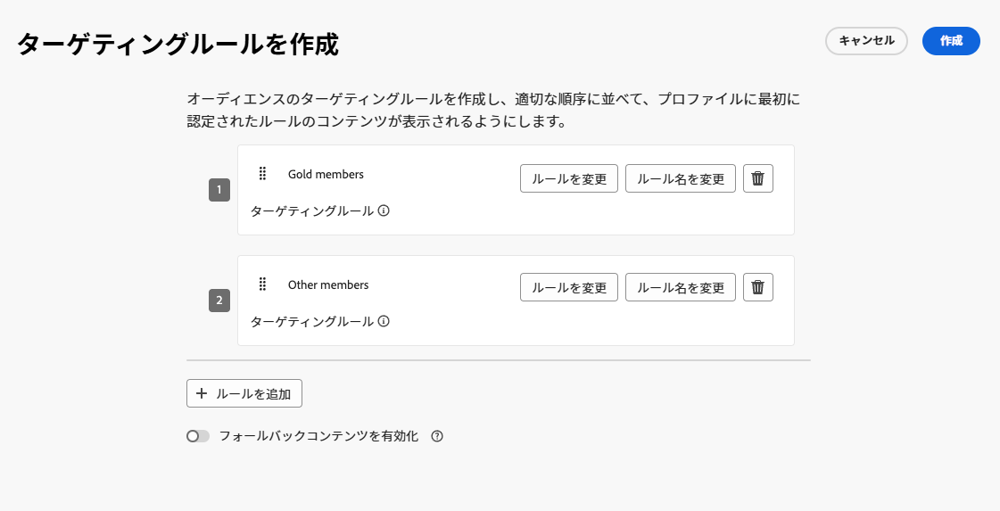

1. 必要に応じて「**[!UICONTROL フォールバックパスを有効にする]** オプションを選択します。 このアクションにより、上記で定義したどのターゲティングルールも満たさないオーディエンスのフォールバックパスが作成されます。

   >[!NOTE]
   >
   >このオプションを選択しない場合、ターゲティングルールに適合しないオーディエンスは、フォールバックパスに入力せずにジャーニーを終了します。

1. **[!UICONTROL 作成]** をクリックして、ターゲティングルールの設定を保存します。

1. ジャーニーに戻り、特定のアクションをドロップして各パスをカスタマイズします。例えば、ゴールドロイヤルティメンバー向けにパーソナライズされたオファーを含むメールと、他のすべてのメンバー向けの SMS リマインダーを作成します。

   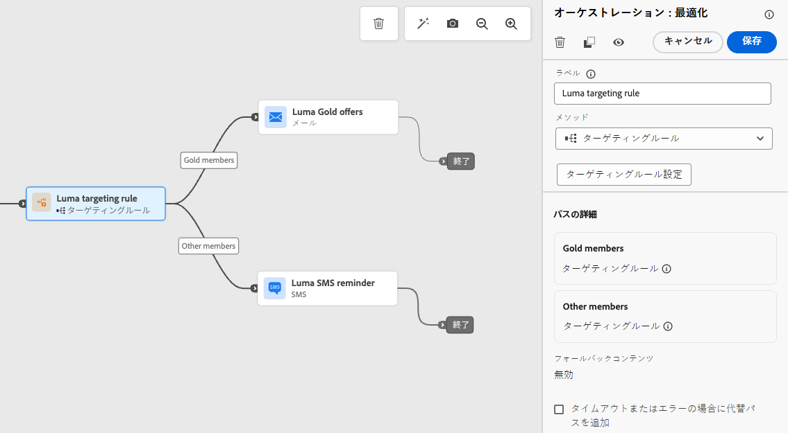

1. ルール設定を定義する際に **[!UICONTROL フォールバックコンテンツを有効にする]** オプションを選択した場合は、自動的に追加されたフォールバックパスに 1 つ以上のアクションを定義します。

   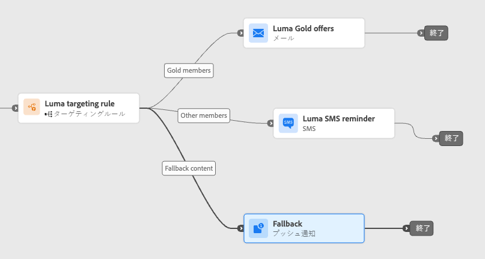{width=70%}

1. オプションで、「**[!UICONTROL タイムアウトまたはエラーの場合に代替パスを追加]**」を使用して、問題が発生した場合に代替アクションを定義します。 [詳細情報](using-the-journey-designer.md#paths)

1. ターゲティングルールの設定で定義した各グループに対応する各アクションに対して、適切なコンテンツを設計します。 アクションごとに異なるコンテンツ間をシームレスに移動できます。

   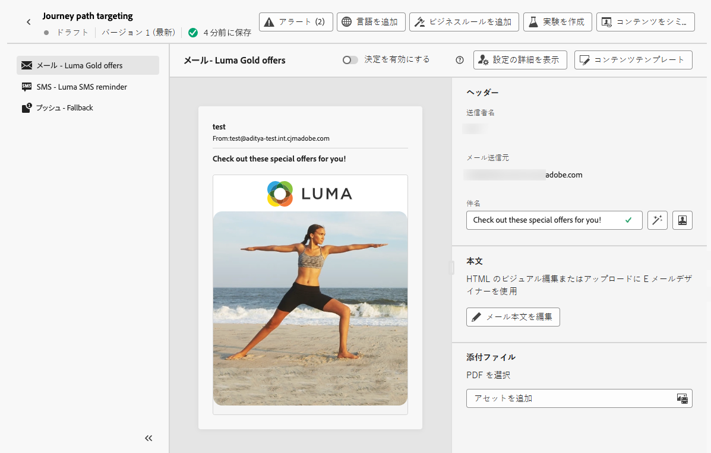

   この例では、ゴールドメンバー向けの特別オファーと、他のメンバー向けの SMS リマインダーを含むメールをデザインします。

1. ジャーニーを [ 公開 ](publishing-the-journey.md) します。

ジャーニーがライブになると、各セグメントに指定されたパスが処理され、ゴールドメンバーはメールオファーを使用してパスに入力し、他のメンバーは SMS リマインダーを使用してパスに入力します。

ジャーニーレポートを使用して、ジャーニーが成功したかどうかを追跡します。 [詳細情報](../reports/journey-global-report-cja.md#targeting)

### ターゲティングルールの使用例 {#uc-targeting}

次の例は、**[!UICONTROL 最適化]** アクティビティを **[!UICONTROL ターゲティングルール]** メソッドと共に使用して、様々なサブオーディエンスのパスをパーソナライズする方法を示しています。

+++セグメント固有のチャネル

ゴールドステータスのロイヤルティメンバーは、メールでパーソナライズされたオファーを受信でき、他のすべてのメンバーは SMS リマインダーに誘導されます。

<!--➡️ Use the revenue per profile or conversion rate as the optimization metric.-->

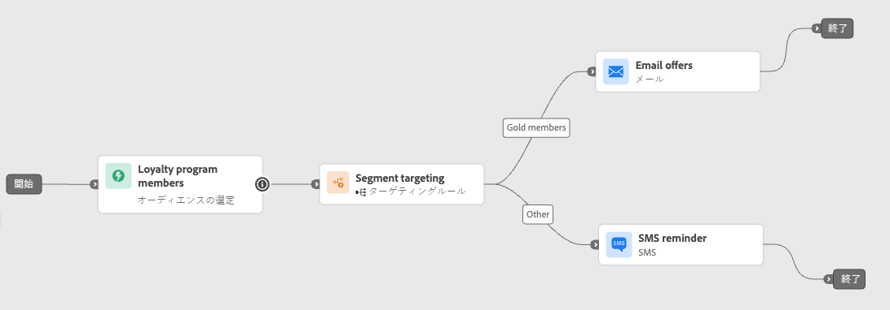

+++

+++行動ベースのターゲティング

メールを開いたがクリックしなかった顧客にはプッシュ通知、まったく開かなかった顧客には SMS が送信されます。

<!--➡️ Use the click-through rate or downstream conversions as the optimization metric.-->

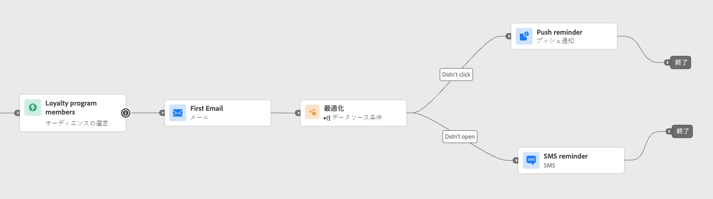

+++

+++購入履歴のターゲティング

最近購入した顧客は短い「お礼 + クロスセル」パスに進むことができますが、購入履歴のない顧客はより長い育成ジャーニーにエントリします。

<!--➡️ Use the repeat purchase rate or engagement rate as the optimization metric.-->

+++

### 条件の追加 {#conditions}

条件は、特定の条件に基づいて複数のパスを作成することで、個人がジャーニーをどのように進行させるかを定義できる、[ ターゲティング ](#targeting) ルールの一種です。

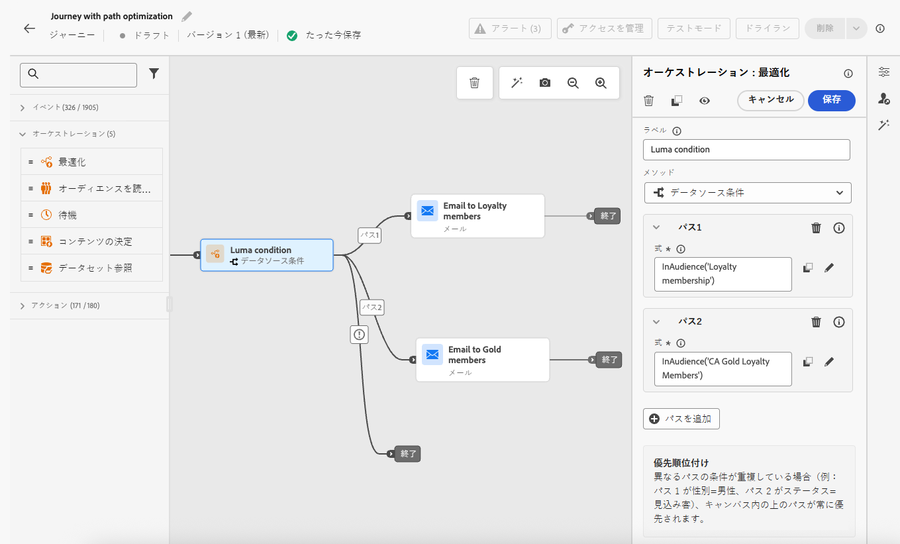

条件を定義する方法について詳しくは、[この節](conditions.md)を参照してください。

使用可能な条件のタイプは次のとおりです。

* [データソースの条件](condition-activity.md#data_source_condition)
* [時間条件](condition-activity.md#time_condition)
* [パーセンテージ分割](condition-activity.md#percentage_split)
* [日付条件](condition-activity.md#date_condition)
* [プロファイルキャップ](condition-activity.md#profile_cap)
