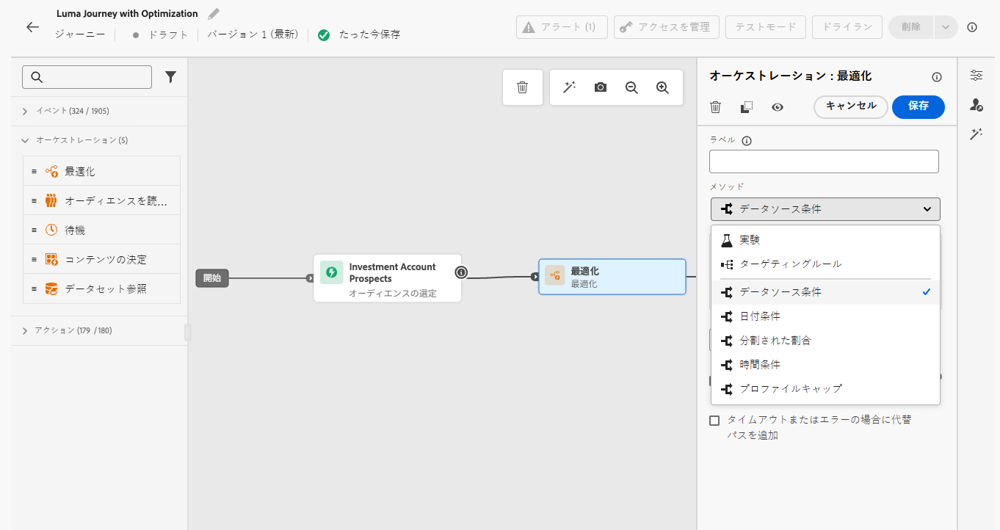

# 最適化アクティビティの概要 {#journey-path-optimization}

>[!CONTEXTUALHELP]
>id="ajo_journey_optimize"
>title="最適化アクティビティ"
>abstract="**最適化** アクティビティでは、実験、ターゲティング、特定の条件など、特定の条件に基づいて複数のパスを作成することで、個人がジャーニーをどのように進んでいるのかを定義できます。 **最適化** アクティビティは、ジャーニーで条件付きパスを作成するための新しい手段です。 元の&#x200B;**条件** アクティビティに置き換わります。"

>[!IMPORTANT]
>
>**最適化** アクティビティは、ジャーニーで条件付きパスを作成するための新しい手段です。 UIから削除された以前の&#x200B;**条件** アクティビティに置き換わります。 すべての条件付きロジックは保持され、**最適化** アクティビティの[条件](conditions.md)を通じて処理されるようになりました。
>
>**[!UICONTROL 条件]** アクティビティを使用した既存のジャーニーがある場合は、以前と同様に使用できます。 これらは、**[!UICONTROL 条件]** メソッドを使用して&#x200B;**[!UICONTROL 最適化]** アクティビティとして新しいアイコンで表示されるようになりましたが、動作は変更されていません。 ノードに設定したカスタムラベルはすべて保持されます。

**最適化**&#x200B;アクティビティでは、実験、ターゲティング、特定の条件など、特定の条件に基づいて複数の&#x200B;**パス**&#x200B;を作成することで、個人がジャーニーをどのように進めるかを定義できます。これにより、最大限のエンゲージメントと成功が確保され、高度にカスタマイズされた効果的なジャーニーを作成できます。

## ジャーニーパスとは？ {#journey-path}

ジャーニー&#x200B;**パス**&#x200B;は、通信の順序、通信間の時間、通信の数またはこれら 3 つの変数の任意の組み合わせで構成できます。

例えば、1 つのパスに 1 つのメールが含まれ、別のパスに 2 つの SMS メッセージが含まれ、3 番目のパスにメール、2 時間の待機ノード、SMS メッセージが含まれる可能性があります。

## カスタマージャーニーを最適化する3つの方法 {#optimization-methods}

「**最適化**」アクティビティを使用すると、ジャーニーパスで次のアクションを実行できます。

* [ パス実験を実行](path-experimentation.md) - ランダムな分割に基づいて異なるパスをテストし、事前に定義された成功指標（コンバージョン率、収益、エンゲージメントなど）に従って、最もパフォーマンスの高いパスを決定します。

* [ ターゲティングルールを活用](path-targeting.md) - オーディエンスセグメント、プロファイル属性、コンテキストデータに基づいて、顧客がジャーニーパスのいずれかを入力する資格を得るために満たす必要がある特定のルールを定義します。 これにより、適切なオーディエンスが指定されたパスに確実に入ります。

  >[!AVAILABILITY]
  >
  >この機能は現在限定的です。 アクセスをリクエストするには、Adobe担当者にお問い合わせください。

* [条件を適用](conditions.md) - データソース、時間、日付、パーセンテージ分割、プロファイルの上限などの特定の条件に基づいて条件付きパスを作成します。 これは、以前の条件アクティビティに相当します。

## 仕組み {#how-it-works}

ジャーニーがライブになると、プロファイルは定義済み条件に照らして評価され、一致条件に基づいて、ジャーニーから適切なパスに送信されます。

## 次の手順 {#next-steps}

ユースケースに最適な最適化方法を選択します。

* どの経路が最も効果的かをテストして確認したい場合、 → [ パス実験](path-experimentation.md)に移動
* 複数のオーディエンスを特定のパスに誘導する場合、 → [ パスのターゲット ](path-targeting.md)に移動
* 条件付きロジック（if/then シナリオ）を作成する場合、 → [条件](conditions.md)に移動
