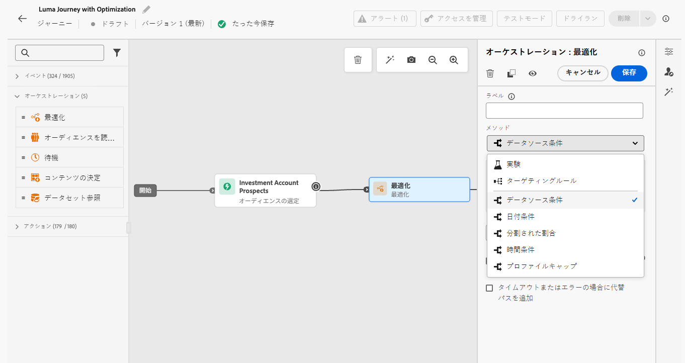

# 最適化アクティビティの基本を学ぶ {#journey-path-optimization}

>[!BEGINSHADEBOX]

**このページで：**&#x200B;最適化アクティビティを使用して、実験、ターゲティング、条件に基づいて複数のジャーニーパスを作成し、以前の条件アクティビティを置き換える方法を説明します。

>[!ENDSHADEBOX]

>[!CONTEXTUALHELP]
>id="ajo_journey_optimize"
>title="最適化アクティビティ"
>abstract="**最適化**&#x200B;アクティビティでは、実験、ターゲティング、特定の条件など、特定の条件に基づいて複数のパスを作成することで、個人がジャーニーをどのように進めるかを定義できます。 **最適化**&#x200B;アクティビティは、ジャーニーで条件付きパスを作成する新しい手段です。 以前の&#x200B;**条件**&#x200B;アクティビティに置き換わります。"

>[!IMPORTANT]
>
>**最適化** アクティビティは、ジャーニーで条件付きパスを作成するための新しい手段です。 UI から削除された以前の&#x200B;**条件**&#x200B;アクティビティに置き換わります。 すべての条件付きロジックは保持され、**最適化** アクティビティの[条件](conditions.md)を通じて処理されるようになりました。
>
>**[!UICONTROL 条件]** アクティビティを使用した既存のジャーニーがある場合は、以前と同様に使用できます。 これらは、**[!UICONTROL 条件]** メソッドを使用して&#x200B;**[!UICONTROL 最適化]** アクティビティとして新しいアイコンで表示されるようになりましたが、動作は変更されていません。 ノードに設定したカスタムラベルはすべて保持されます。

**最適化**&#x200B;アクティビティでは、実験、ターゲティング、特定の条件など、特定の条件に基づいて複数の&#x200B;**パス**&#x200B;を作成することで、個人がジャーニーをどのように進めるかを定義できます。これにより、最大限のエンゲージメントと成功が確保され、高度にカスタマイズされた効果的なジャーニーを作成できます。

## ジャーニーパスとは？ {#journey-path}

ジャーニー&#x200B;**パス**&#x200B;は、通信の順序、通信間の時間、通信の数またはこれら 3 つの変数の任意の組み合わせで構成できます。

例えば、1 つのパスに 1 つのメールが含まれ、別のパスに 2 つの SMS メッセージが含まれ、3 番目のパスにメール、2 時間の待機ノード、SMS メッセージが含まれる可能性があります。

## カスタマージャーニーを最適化する3つの方法 {#optimization-methods}

「**最適化**」アクティビティを使用すると、ジャーニーパスで次のアクションを実行できます。

* [ パス実験を実行](path-experimentation.md) - ランダムな分割に基づいて異なるパスをテストし、事前に定義された成功指標（コンバージョン率、収益、エンゲージメントなど）に従って、最もパフォーマンスの高いパスを決定します。

* [ ターゲティングルールを活用](path-targeting.md) - オーディエンスセグメント、プロファイル属性、コンテキストデータに基づいて、顧客がジャーニーパスのいずれかを入力する資格を得るために満たす必要がある特定のルールを定義します。 これにより、適切なオーディエンスが指定されたパスに確実に入ります。

  >[!AVAILABILITY]
  >
  >この機能は現在限定的です。 アクセスをリクエストするには、Adobe担当者にお問い合わせください。

* [条件を適用](conditions.md) - データソース、時間、日付、パーセンテージ分割、プロファイルの上限などの特定の条件に基づいて条件付きパスを作成します。 これは、以前の条件アクティビティに相当します。

## 仕組み {#how-it-works}

ジャーニーがライブになると、プロファイルは定義済み条件に照らして評価され、一致条件に基づいて、ジャーニーから適切なパスに送信されます。

## 次の手順 {#next-steps}

ユースケースに最適な最適化方法を選択します。

* どの経路が最も効果的かをテストして確認したい場合、 → [ パス実験](path-experimentation.md)に移動
* 複数のオーディエンスを特定のパスに誘導する場合、 → [ パスのターゲット ](path-targeting.md)に移動
* 条件付きロジック（if/then シナリオ）を作成する場合、 → [条件](conditions.md)に移動

+++ AI ナレッジリファレンス

このセクションには、このトピックに関連する解釈、検索、質問への回答をサポートすることを目的とした構造化された知識が含まれています。

理解を深めるには、この情報をこのページのドキュメントと組み合わせる必要があります。 どちらのソースも単独で使用することを意図していません。このページでは、機能について説明しますが、この節では、用語、意図、適用可能性、および制約の曖昧さを解消するのに役立つ追加のコンテキストを提供します。

* **TL;DR:**&#x200B;このページでは、以前の条件アクティビティに代わる「最適化」アクティビティが導入されています。このアクティビティでは、ユーザーは実験、ターゲティングルール、条件ロジックを使用して複数のジャーニーパスを作成できます。

**インテント：**

* 最適化アクティビティの機能と、以前の条件アクティビティの置き換え方法について説明します
* パスの検証（A/B テスト）を使用して、複数のジャーニーパスを作成する
* 特定のオーディエンスセグメントやプロファイル属性を個別のパスにルーティングするためのターゲティングルールを定義できます
* 最適化アクティビティ内の条件メソッドを使用して条件付きロジック（if/then）を適用します
* 条件アクティビティを使用した既存のジャーニーを、新しい最適化アクティビティに移行します

**用語集：**

* **アクティビティの最適化**：以前の条件アクティビティに代わり、実験、ターゲティング、条件を使用して複数のパスを作成できるジャーニーキャンバスアクティビティ。 *（製品固有）*
* **ジャーニーパス**：通信、待機時間、メッセージ数、または任意の組み合わせで構成できるジャーニー内のシーケンス。プロファイルは、「最適化」アクティビティで定義された条件に基づいてパスにルーティングされます。 *（製品固有）*
* **パスの実験**: プロファイルをパス間でランダムに分割し、コンバージョン率や収益などの事前に定義された成功指標に対して最も効果的なものを決定する最適化方法。 *（製品固有）*
* **パスターゲティング**: オーディエンスセグメント、プロファイル属性、コンテキストデータに基づいてプロファイルをパスにルーティングするOptimize メソッド（現在、可用性が制限されています）。 *（製品固有）*
* **条件**：以前の条件アクティビティと同等の最適化メソッド。データソース、時間、日付、パーセンテージ分割、プロファイルの上限に基づいて条件パスを作成します。 *（製品固有）*

**ガードレール：**

* パスのターゲティングは現在限定的です。アクセスをリクエストするには、Adobe担当者にお問い合わせください
* 以前の条件アクティビティはUIから削除されました。既存のジャーニーは引き続き機能し、新しいアイコンで「条件メソッドを使用してアクティビティを最適化」と表示されるようになりました
* 以前の条件ノードに設定されたカスタムラベルは、最適化への移行後も保持されます

**用語：**

* 正規名：アクティビティの最適化 – Acronym: none — バリアント：ジャーニーパスの最適化、ノードの最適化
* 同義語：「アクティビティを最適化（条件メソッド）」 = 「以前の条件アクティビティ」
* 混乱しないでください：「パス実験」≠「パスのターゲティング」 – パス実験では、ランダムな分割を使用して、どのパスが最も効果的かをテストします。パスのターゲティングでは、定義されたルールを使用して、特定のオーディエンスを特定のパスにルーティングします

**FAQ:**

* **Q：条件アクティビティはどうなりましたか？**  – 最適化アクティビティに置き換えられ、UIから削除されました。 条件アクティビティを使用した既存のジャーニーは引き続き変更されません。条件メソッドを使用してアクティビティを最適化するとして、新しいアイコンが表示されるようになりました。
* **Q: 「最適化」アクティビティで使用できる3つの方法は何ですか？** - パス実験（ランダムなA/B分割で最もパフォーマンスの高いパスを見つける）、パスのターゲティング（現在、制限付き可用性にあるオーディエンスまたはプロファイル属性によるルールベースのルーティング）、条件（以前の条件アクティビティと同等の条件付きロジックの場合/場合）。
* **Q: パス実験とパスのターゲティングの違いについて教えてください。** — パスの実験では、プロファイルをランダムに分割してパスのパフォーマンスをテストし、成功指標と比較します。パスのターゲティングでは、特定のオーディエンスまたはプロファイルタイプを、定義された基準に基づいて指定されたパスにルーティングします。
* **Q: パスのターゲット設定は一般に利用できますか？**  – いいえ、現在、限定提供となっています。 Adobeの担当者に連絡してアクセス権をリクエストしてください。
* **Q: ジャーニーパスとは何ですか？** - パスとは、ジャーニー内のシーケンスで、コミュニケーション、待機時間、メッセージ数の組み合わせを含めることができます。プロファイルは、最適化アクティビティ基準によって評価され、適切なパスにルーティングされます。

+++
