# パスの検証の使用 {#experimentation}

>[!CONTEXTUALHELP]
>id="ajo_path_experiment_success_metric"
>title="成功指標"
>abstract="成功指標は、実験で最もパフォーマンスの高い処理を追跡および評価するために使用します。"
>additional-url="https://experienceleague.adobe.com/ja/docs/journey-optimizer/using/orchestrate-journeys/create-journey/success-metrics" text="ジャーニー指標の設定とトラッキング"

実験を行うことで、ランダム分割に基づいて様々なパスをテストし、事前定義済みの成功指標に基づいて最もパフォーマンスが高いパスを判断できます。

ジャーニーでパス実験を設定するには、次の手順に従います。

次の 3 つのパスを比較するとします。

* メールが 1 件の 1 番目のパス。
* 2 日間の&#x200B;**[!UICONTROL 待機]**&#x200B;ノードと 1 件のメールの 2 番目のパス。
* メールの後に SMS メッセージを送信する 3 番目のパス。

1. 「**[!UICONTROL オーケストレーション]**」セクションから、**[!UICONTROL 最適化]**&#x200B;アクティビティをジャーニーキャンバスにドラッグ＆ドロップします。

1. レポートモードとテストモードのログでアクティビティを識別するのに役立つ、オプションのラベルを追加します。

1. **[!UICONTROL メソッド]**&#x200B;ドロップダウンリストから「**[!UICONTROL 実験]**」を選択します。

   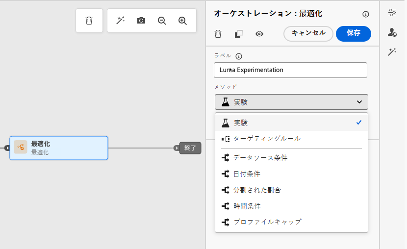{width=65%}

1. 「**[!UICONTROL 実験を作成]**」をクリックします。

1. 実験に設定する&#x200B;**[!UICONTROL 成功指標]**&#x200B;を選択します。使用可能な指標とリストの設定方法について詳しくは、[この節](success-metrics.md)を参照してください。

   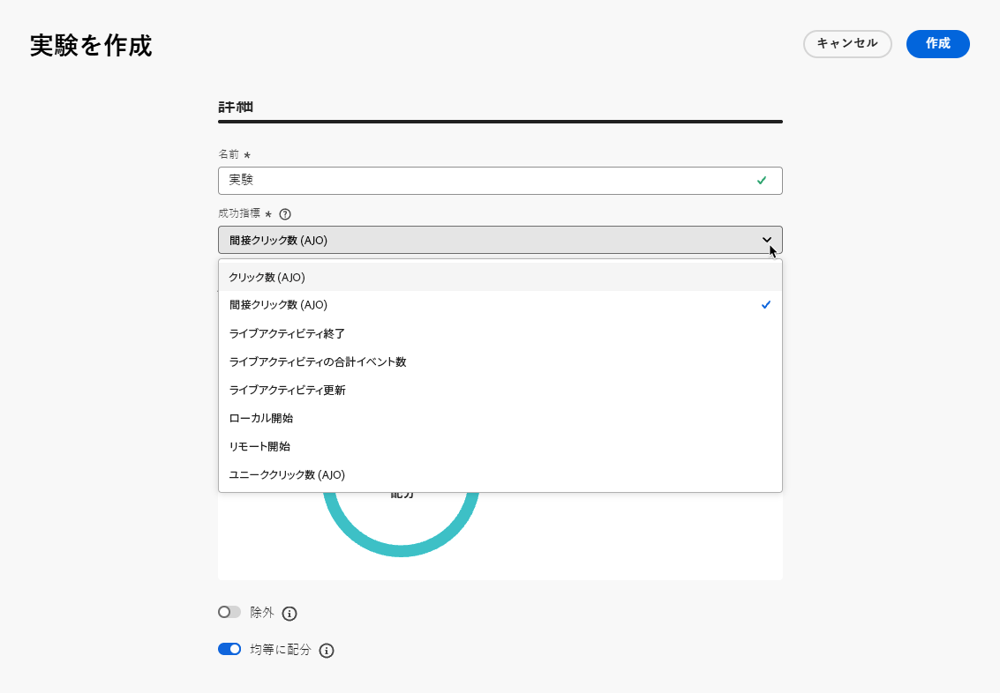{width=80%}

1. パス実験の&#x200B;**[!UICONTROL 実験タイプ]**&#x200B;を選択します。

   * **[!UICONTROL A/B実験]** — テスト開始時の処理間のトラフィック分割を定義します。 パフォーマンスは、選択した主要指標に基づいて評価されます。レポートでは、処理間の観察された上昇率が示されます。

   * **[!UICONTROL マルチアームドバンディット]** – 処理間のトラフィックの分割は自動的に処理されます。 7 日ごとに、プライマリ指標のパフォーマンスが確認され、それに応じて重み付けが調整されます。A/B テストと同様に、レポートには上昇率が引き続き示されています。

   {width=80%}

   ➡️ [A/B実験とマルチアームドバンディット実験の違いについて詳しく見る](../content-management/mab-vs-ab.md)

1. 配信に&#x200B;**[!UICONTROL 除外]**&#x200B;グループを追加することを選択できます。このグループは、この実験からパスにエントリしません。

   >[!NOTE]
   >
   >切り替えバーをオンにすると、母集団の 10％が自動的に取得されます。必要に応じて、この割合を調整できます。

   <!--
    DOES THIS APPLY TO PATH EXPERIMENT?
    IMPORTANT: When a holdout group is used in an action for path experimentation, the holdout assignment only applies to that specific action. After the action is completed, profiles in the holdout group will continue down the journey path and can receive messages from other actions. Therefore, ensure that any subsequent messages do not rely on the receipt of a message by a profile that might be in a holdout group. If they do, you may need to remove the holdout assignment.-->

1. 各&#x200B;**[!UICONTROL 処理]**&#x200B;に正確な割合を割り当てるか、**[!UICONTROL 等しく分布]**&#x200B;切り替えバーをオンにすることができます。

   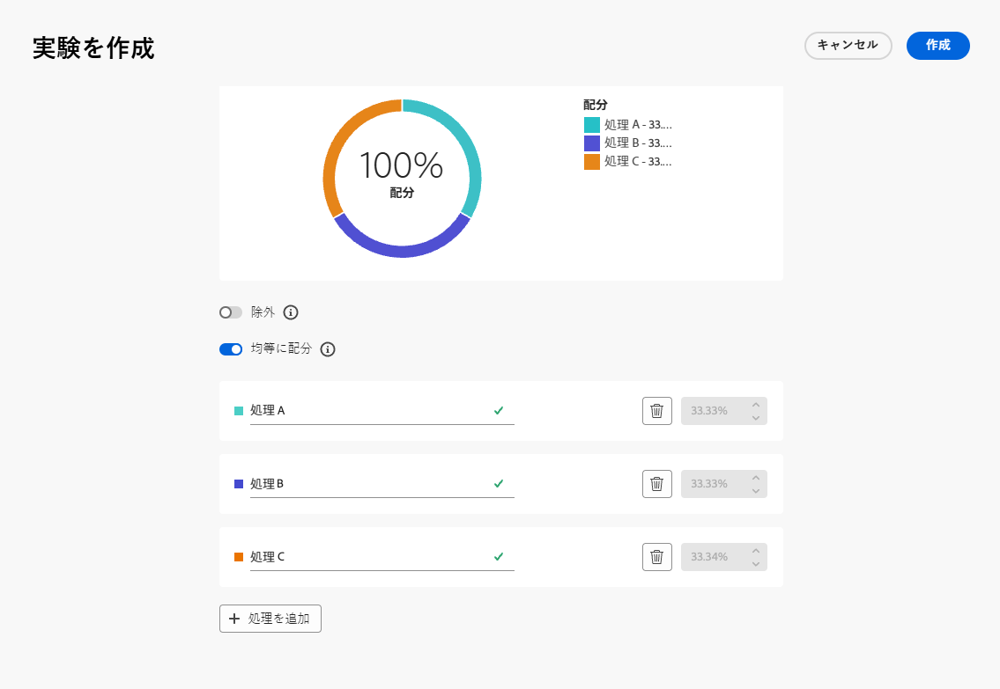{width=80%}

1. 自動スケール実験を有効にすると、実験の勝利バリエーションが自動的にロールアウトされます。[勝者をスケールする方法の詳細情報](#scale-winner)

1. 「**[!UICONTROL 作成]**」をクリックします。

1. 実験の結果として得られる各分岐に必要な要素を定義します。例：

   * [メール](../email/create-email.md)アクティビティを最初の分岐（**処理 A**）にドラッグ＆ドロップします。

   * 最初の分岐に 2 日間の[待機](wait-activity.md)アクティビティをドラッグ＆ドロップし、その後に[メール](../email/create-email.md)アクティビティ（**処理 B**）をドラッグ＆ドロップします。

   * [メール](../email/create-email.md)アクティビティを 3 番目の分岐にドラッグ＆ドロップし、その後に [SMS](../sms/create-sms.md) アクティビティ（**処理 C**）をドラッグ＆ドロップします。

   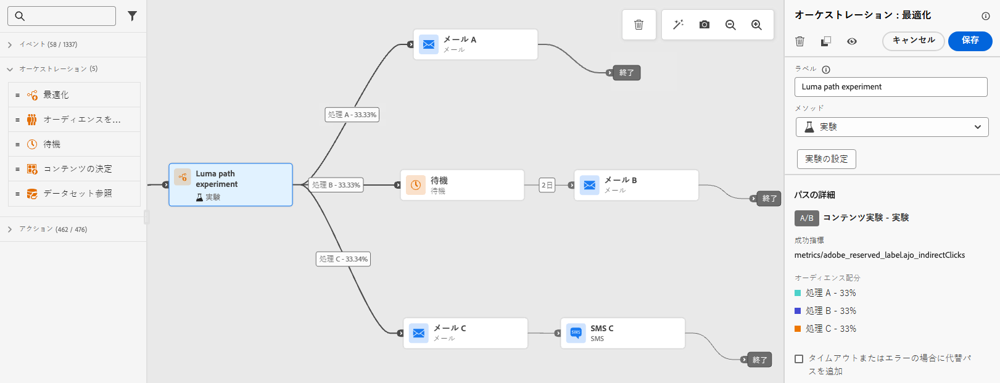{width=100%}

1. オプションとして、**[!UICONTROL タイムアウトまたはエラーが発生した場合に代替パスを追加]**&#x200B;して、フォールバックアクションを定義します。 [詳細情報](using-the-journey-designer.md#paths)

1. ジャーニーを[公開](publish-journey.md)します。

<!--

    Select a channel action and use the **[!UICONTROL Edit content]** button to access the design tools.

    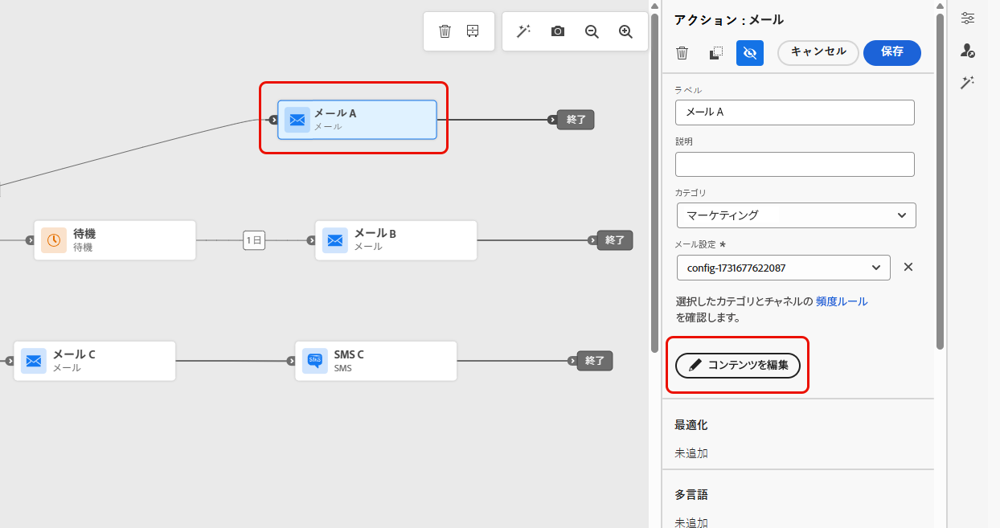{width=70%}

    From there, using the left pane you can navigate between the different contents for each action in your experiment. Select each content and design it as needed.

    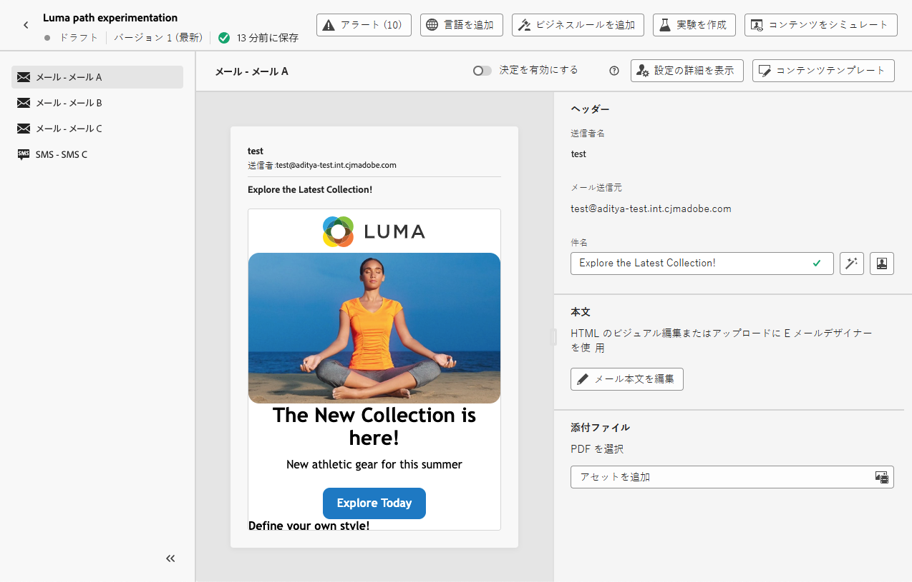{width=100%}

-->

ジャーニーがライブになると、ユーザーには異なるパスを進むようにランダムに割り当てられます。[!DNL Journey Optimizer] は、最もパフォーマンスが高いパスを追跡し、実用的なインサイトを提供します。

ジャーニーパス実験レポートを使用して、ジャーニーの成功を追跡します。[詳細情報](../reports/journey-global-report-cja-experimentation.md)

<!--REMOVED WITH GA

>[!CAUTION]
>
>Do not edit the metadata of a path experiment once it has been published. Editing the metadata will disrupt the calculation and reporting of experiment results.
-->

## 実験のユースケース {#uc-experiment}

次の例は、**[!UICONTROL 最適化]**&#x200B;アクティビティを&#x200B;**[!UICONTROL 実験]**&#x200B;メソッドで使用して、全体的に最も効果的なパスを決定する方法を示しています。

+++チャネルの有効性

最初のメッセージをメールで送信した場合と SMS で送信した場合のどちらがコンバージョン率が高くなるかをテストします。

➡️ コンバージョン率を成功指標として使用します（例：購入、新規登録）。

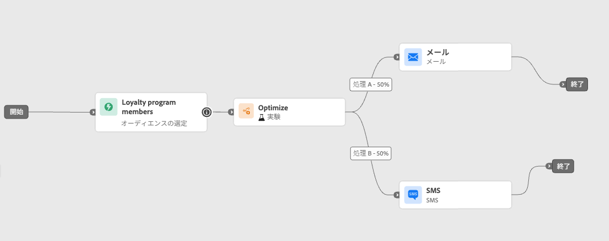

+++

+++メッセージの頻度

実験を実行して、1 週間に 1 通のメールを送信した場合と 3 通のメールを送信した場合のどちらで購入が増えるかを確認します。

➡️ 購入数または登録解除率を成功指標として使用します。

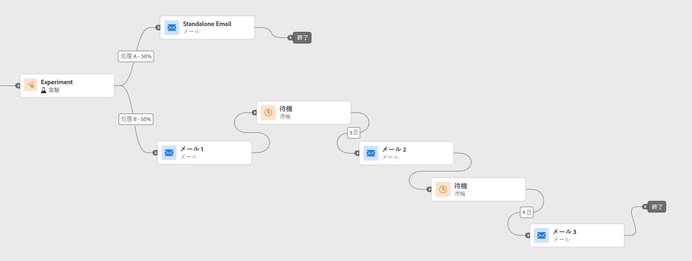

+++

+++通信間の待機時間

フォローアップ前の 24 時間待機と 72 時間待機を比較して、エンゲージメントを最大化するタイミングを判断します。

➡️ クリックスルー率または売上高を成功指標として使用します。

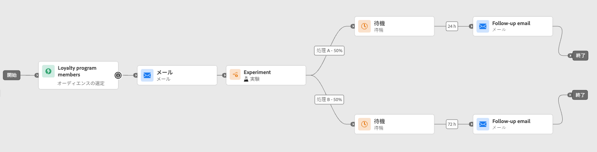

+++

## 勝者をスケール {#scale-winner}

>[!AVAILABILITY]
>
>パス実験の場合、勝者のスケール機能は、単一ジャーニー（イベントトリガーおよびオーディエンスの選定）でのみ使用できます。
>
>オーディエンスの読み取りジャーニーには使用できません。

「勝者をスケール」を使用すると、実験の勝利バリエーションをすべてのオーディエンスに自動または手動でロールアウトできます。この機能により、勝者が決定したら、実験を常に監視することなく、そのリーチと効果を増幅できます。

次の 2 つのモードから選択できます。

* **自動スケーリング**：実験を作成する際に、勝利の処理をスケーリングするタイミングと条件、または勝者が現れない場合はフォールバックオプションを選択して、自動スケーリング設定を指定します。

* **手動スケーリング**：実験結果を手動で確認し、タイミングと決定を完全に制御しながら、勝利の処理のロールアウトを開始します。

### 自動スケーリング {#autoscaling}

自動スケーリングを使用すると、実験の結果に基づいて、勝利の処理またはフォールバックをロールアウトするタイミングについて、定義済みルールを設定できます。

自動スケーリングが行われると、手動スケーリングは使用できなくなります。

実験の自動スケールを有効にするには：

1. ジャーニーの設定と、必要に応じたテストの設定をおこないます。 [詳細情報](#experimentation)

1. 実験を設定する際は、自動スケールオプションを有効にします。

   

1. 勝者のスケールを設定するタイミングを以下から選択します。

   * 勝者が見つかったらすぐに。
   * 選択した時間に実験がライブになった後。

   自動スケール時間は、実験の終了日より前にスケジュールする必要があります。終了日の後の時間に設定されている場合、検証警告が表示され、ジャーニーは公開されません。

   での時間の自動選択の拡大・縮小

1. スケール時間で勝者が見つからない場合のフォールバック動作を以下から選択します。

   * スケジュールどおりに終了するまで引き続き実験する。
   * 指定した時間の経過後に代替処理をスケーリングする。

すべてのパラメーターが満たされると、勝利の処理または代替処理がオーディエンスに送信されます。

### 手動スケーリング {#manual-scaling}

手動スケーリングでは、実験結果を確認し、勝利の処理を独自のスケジュールで展開するタイミングを決定できます。

スケジュールされた自動拡大時間の前に勝者を手動でスケーリングすると、自動スケールはキャンセルされます。

実験の勝者を手動でスケーリングするには：

1. ジャーニーの設定と、必要に応じたテストの設定をおこないます。 [詳細情報](#experimentation)

1. 勝者が特定されるか、統計的優位差が達成されるまで、実験を実行します。

1. ジャーニーを開き、パス実験を含む&#x200B;**[!UICONTROL 最適化]** アクティビティを選択します。

   **[!UICONTROL パス実験]** ビューの結果を確認して、最もパフォーマンスの高い処理を特定します。

   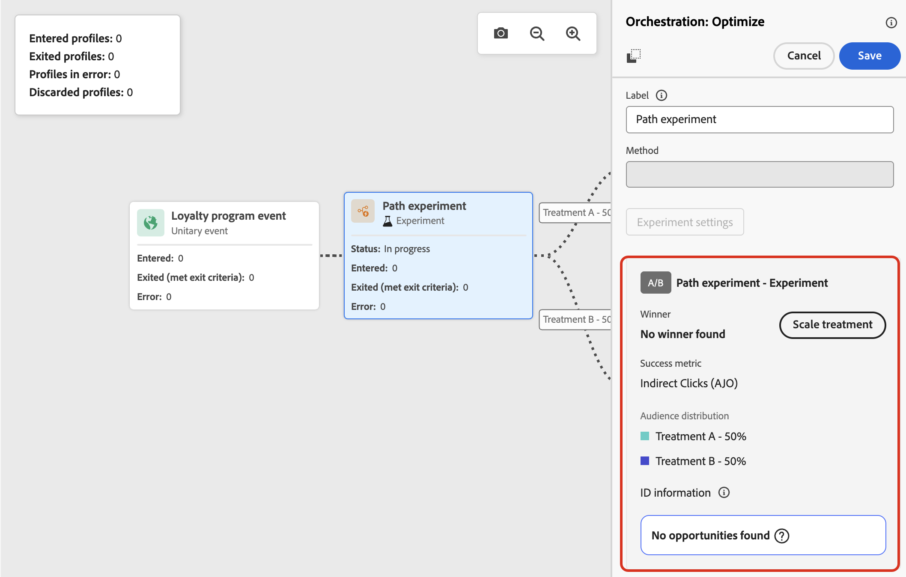

1. 「**[!UICONTROL 処理をスケール]**」をクリックして、勝利の処理を残りのオーディエンスにプッシュします。

   <!--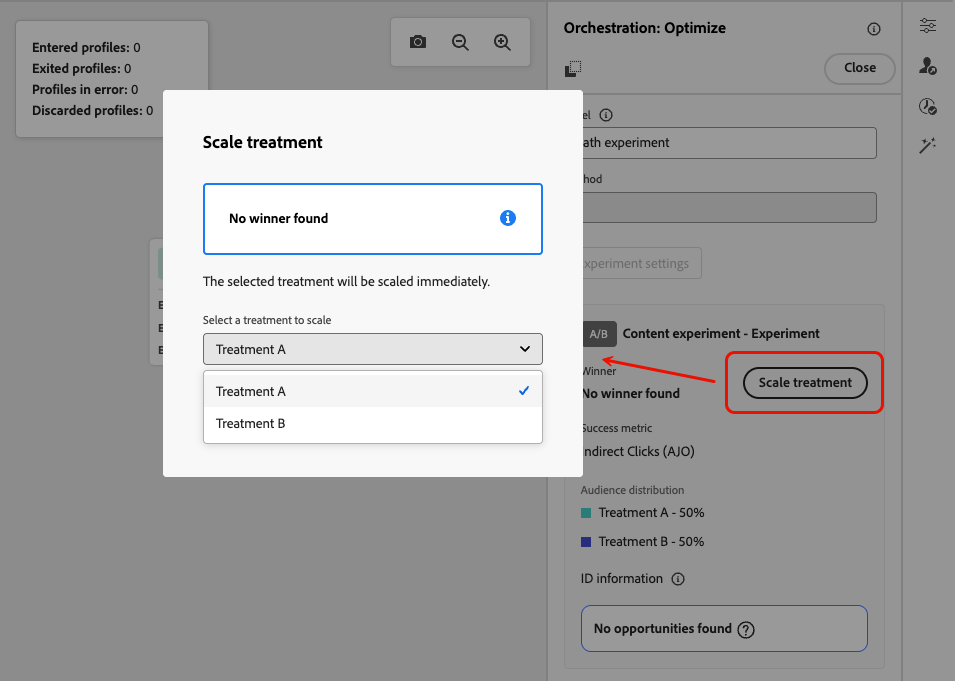-->

1. ドロップダウンメニューから拡大する処理を選択し、「**[!UICONTROL スケール]**」をクリックします。

   {width=80%}

処理のスケーリングには最大 1 時間かかる場合があります。手動スケーリングプロセスが完了すると、通知が届きます。
