# パス実験を使用 {#experimentation}

>[!BEGINSHADEBOX]

**このページ：**&#x200B;では、「最適化」アクティビティを使用してパス実験を設定し、A/Bまたはマルチアームドバンディット実験を使用して様々なジャーニーパスをテストする方法、成功指標による最もパフォーマンスの高い処理を特定する方法、勝者を拡大する方法について説明します。

>[!ENDSHADEBOX]

>[!CONTEXTUALHELP]
>id="ajo_path_experiment_success_metric"
>title="成功指標"
>abstract="成功指標は、実験で最もパフォーマンスの高い処理を追跡および評価するために使用します。"
>additional-url="https://experienceleague.adobe.com/ja/docs/journey-optimizer/using/orchestrate-journeys/create-journey/success-metrics" text="ジャーニー指標の設定とトラッキング"

実験を行うことで、ランダム分割に基づいて様々なパスをテストし、事前定義済みの成功指標に基づいて最もパフォーマンスが高いパスを判断できます。

ジャーニーでパス実験を設定するには、次の手順に従います。

次の 3 つのパスを比較するとします。

* メールが 1 件の 1 番目のパス。
* 2 日間の&#x200B;**[!UICONTROL 待機]**&#x200B;ノードと 1 件のメールの 2 番目のパス。
* メールの後に SMS メッセージを送信する 3 番目のパス。

1. 「**[!UICONTROL オーケストレーション]**」セクションから、**[!UICONTROL 最適化]**&#x200B;アクティビティをジャーニーキャンバスにドラッグ＆ドロップします。

1. レポートモードとテストモードのログでアクティビティを識別するのに役立つ、オプションのラベルを追加します。

1. **[!UICONTROL メソッド]**&#x200B;ドロップダウンリストから「**[!UICONTROL 実験]**」を選択します。

   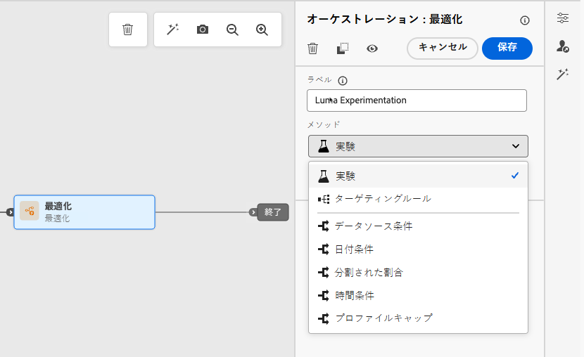{width=65%}

1. 「**[!UICONTROL 実験を作成]**」をクリックします。

1. 実験に設定する&#x200B;**[!UICONTROL 成功指標]**&#x200B;を選択します。 使用可能な指標とリストの設定方法について詳しくは、[この節](success-metrics.md)を参照してください。

   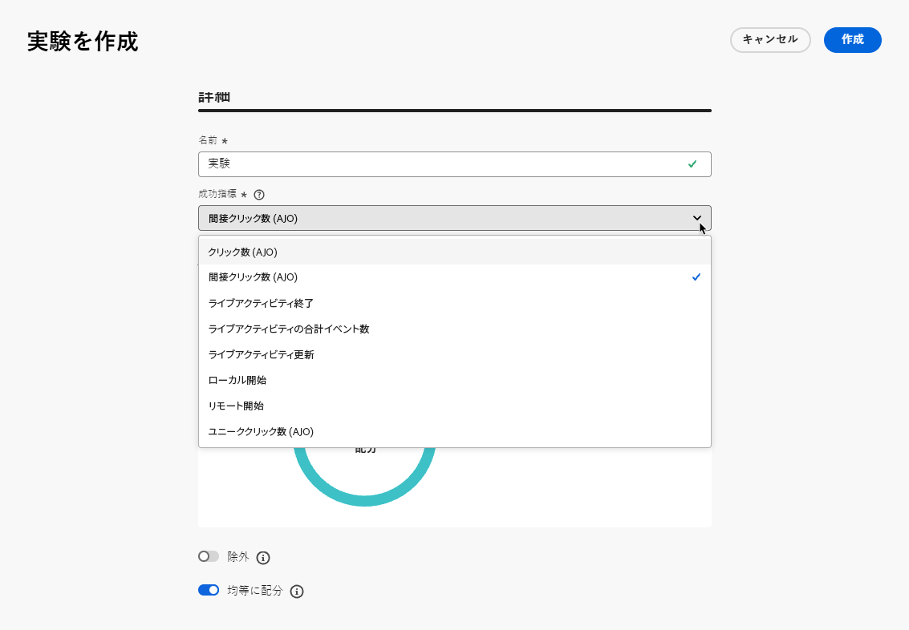{width=80%}

1. パス実験の&#x200B;**[!UICONTROL 実験タイプ]**&#x200B;を選択します。

   * **[!UICONTROL A/B実験]** — テスト開始時の処理間のトラフィック分割を定義します。 パフォーマンスは、選択した主要指標に基づいて評価されます。レポートでは、処理間の観察された上昇率が示されます。

   * **[!UICONTROL マルチアームドバンディット]** – 処理間のトラフィックの分割は自動的に処理されます。 7 日ごとに、プライマリ指標のパフォーマンスが確認され、それに応じて重み付けが調整されます。 A/B テストと同様に、レポートには上昇率が引き続き示されています。

   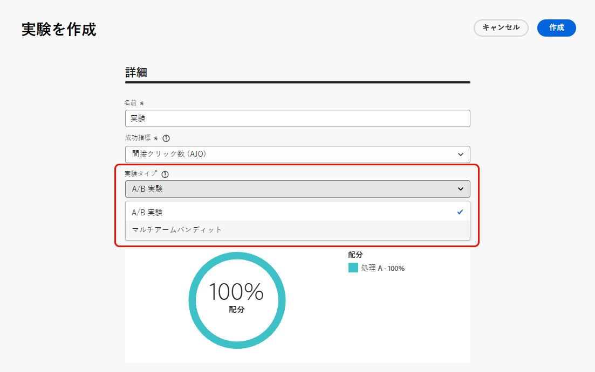{width=80%}

   ➡️ [A/B実験とマルチアームドバンディット実験の違いについて詳しく見る](../content-management/mab-vs-ab.md)

1. 配信に&#x200B;**[!UICONTROL 除外]**&#x200B;グループを追加することを選択できます。 このグループは、この実験からパスにエントリしません。

   >[!NOTE]
   >
   >切り替えバーをオンにすると、母集団の 10％が自動的に取得されます。 必要に応じて、この割合を調整できます。

1. 各&#x200B;**[!UICONTROL 処理]**&#x200B;に正確な割合を割り当てるか、**[!UICONTROL 等しく分布]**&#x200B;切り替えバーをオンにすることができます。

   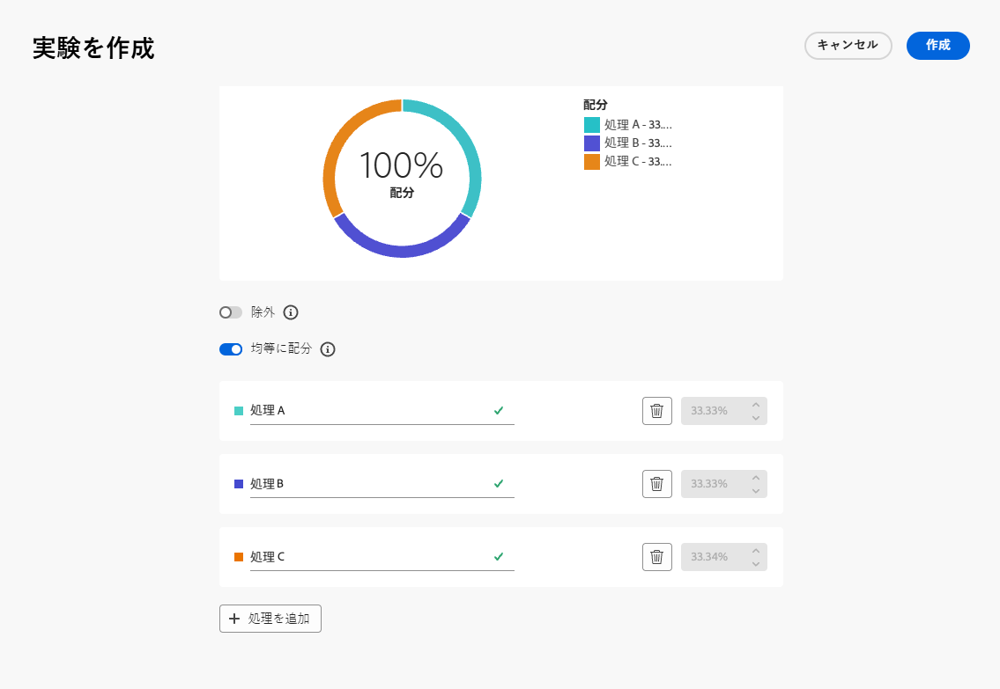{width=80%}

1. 自動スケール実験を有効にすると、実験の勝利バリエーションが自動的にロールアウトされます。 [勝者をスケールする方法の詳細情報](#scale-winner)

1. 「**[!UICONTROL 作成]**」をクリックします。

1. 実験の結果として得られる各分岐に必要な要素を定義します。例：

   * [メール](../email/create-email.md)アクティビティを最初の分岐（**処理 A**）にドラッグ＆ドロップします。

   * 最初の分岐に 2 日間の[待機](wait-activity.md)アクティビティをドラッグ＆ドロップし、その後に[メール](../email/create-email.md)アクティビティ（**処理 B**）をドラッグ＆ドロップします。

   * [メール](../email/create-email.md)アクティビティを 3 番目の分岐にドラッグ＆ドロップし、その後に [SMS](../mobile/create-mobile-message.md) アクティビティ（**処理 C**）をドラッグ＆ドロップします。

   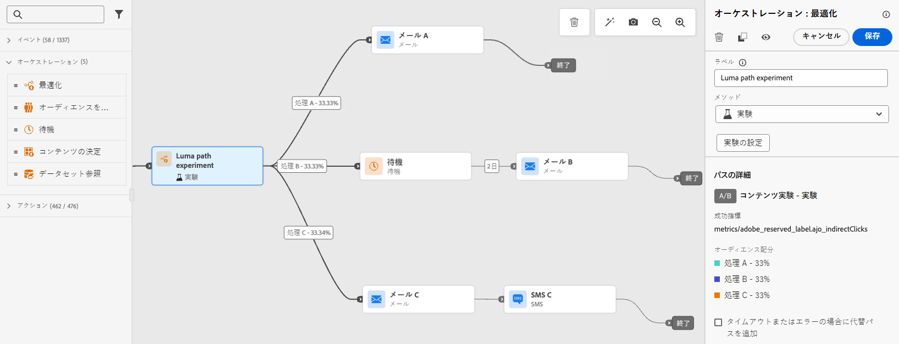{width=100%}

1. オプションとして、**[!UICONTROL タイムアウトまたはエラーが発生した場合に代替パスを追加]**&#x200B;して、フォールバックアクションを定義します。 [詳細情報](using-the-journey-designer.md#paths)

1. ジャーニーを[公開](publish-journey.md)します。

ジャーニーがライブになると、ユーザーには異なるパスを進むようにランダムに割り当てられます。 [!DNL Journey Optimizer] は、最もパフォーマンスが高いパスを追跡し、実用的なインサイトを提供します。

ジャーニーパス実験レポートを使用して、ジャーニーの成功を追跡します。 [詳細情報](../reports/journey-global-report-cja-experimentation.md)

## ジャーニーの再エントリ時のパス割り当て {#path-assignment}

パスの割り当ては、同じジャーニーバージョンの複数のエントリにまたがるプロファイルに対して永続的です。 例えば、プロファイルが1日目にジャーニーを入力し、パス Aに割り当てられ、2日目にジャーニーを再入力した場合、そのプロファイルは再度パス Aに割り当てられます。これにより、利用者に対して一貫性のある体験を提供し、統計的に有効なレポートと分析のために必要です。

ただし、割り当ては、特定のジャーニーバージョン内でのみ永続的です。 新しいジャーニーバージョンを公開すると、ランダム化が変更され、プロファイルが別のパスに割り当てられる可能性があります。

ジャーニーに複数のパス実験アクティビティがある場合、各アクティビティは独立したランダム割り当てを適用します。

## 実験のユースケース {#uc-experiment}

次の例は、**[!UICONTROL 最適化]**&#x200B;アクティビティを&#x200B;**[!UICONTROL 実験]**&#x200B;メソッドで使用して、全体的に最も効果的なパスを決定する方法を示しています。

+++チャネルの有効性

最初のメッセージをメールで送信した場合と SMS で送信した場合のどちらがコンバージョン率が高くなるかをテストします。

➡️ コンバージョン率を成功指標として使用します（例：購入、新規登録）。

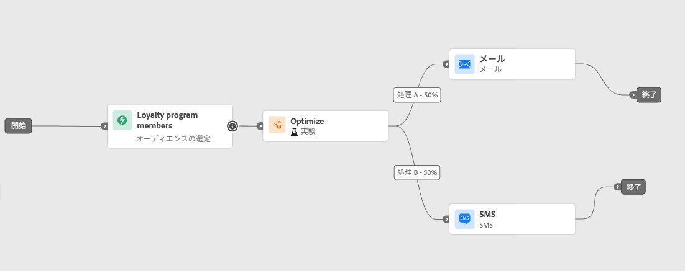

+++

+++メッセージの頻度

実験を実行して、1 週間に 1 通のメールを送信した場合と 3 通のメールを送信した場合のどちらで購入が増えるかを確認します。

➡️ 購入数または登録解除率を成功指標として使用します。

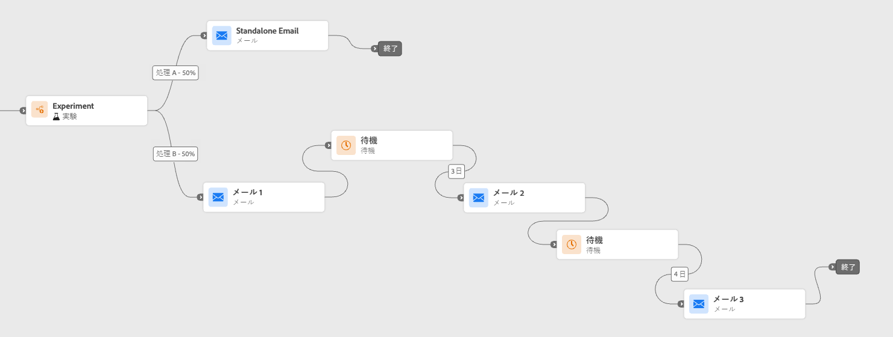

+++

+++通信間の待機時間

フォローアップ前の 24 時間待機と 72 時間待機を比較して、エンゲージメントを最大化するタイミングを判断します。

➡️ クリックスルー率または売上高を成功指標として使用します。

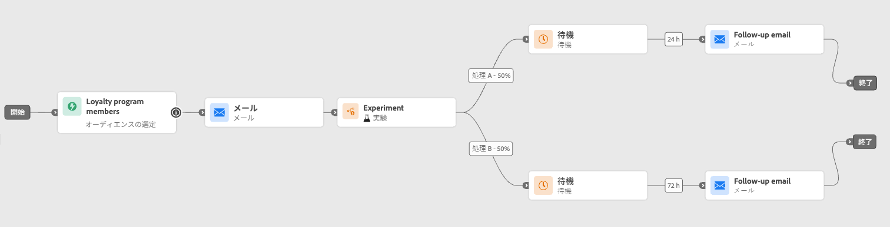

+++

## 勝者をスケール {#scale-winner}

>[!AVAILABILITY]
>
>パス実験の場合、勝者のスケール機能は、単一ジャーニー（イベントトリガーおよびオーディエンスの選定）でのみ使用できます。
>
>オーディエンスを読み取りジャーニーでは使用できません。

「勝者をスケール」を使用すると、実験の勝利バリエーションをすべてのオーディエンスに自動または手動でロールアウトできます。 この機能により、勝者が決定したら、実験を常に監視することなく、そのリーチと効果を増幅できます。

次の 2 つのモードから選択できます。

* **自動スケーリング**：実験を作成する際に、勝利の処理をスケーリングするタイミングと条件、または勝者が現れない場合はフォールバックオプションを選択して、自動スケーリング設定を指定します。

* **手動スケーリング**：実験結果を手動で確認し、タイミングと決定を完全に制御しながら、勝利の処理のロールアウトを開始します。

### 自動スケーリング {#autoscaling}

自動スケーリングを使用すると、実験の結果に基づいて、勝利の処理またはフォールバックをロールアウトするタイミングについて、定義済みルールを設定できます。

自動スケーリングが行われると、手動スケーリングは使用できなくなります。

実験の自動スケールを有効にするには：

1. ジャーニーの設定と、必要に応じたテストの設定をおこないます。 [詳細情報](#experimentation)

1. 実験を設定する際は、自動スケールオプションを有効にします。

   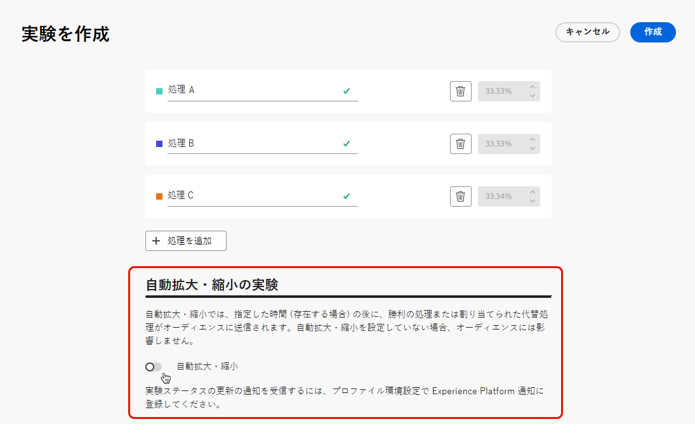

1. 勝者のスケールを設定するタイミングを以下から選択します。

   * 勝者が見つかったらすぐに。
   * 選択した時間に実験がライブになった後。

   自動スケール時間は、実験の終了日より前にスケジュールする必要があります。 終了日の後の時間に設定されている場合、検証警告が表示され、ジャーニーは公開されません。

   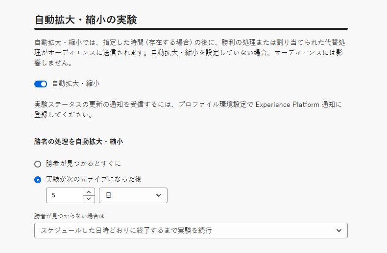での時間の自動選択の拡大・縮小

1. スケール時間で勝者が見つからない場合のフォールバック動作を以下から選択します。

   * スケジュールどおりに終了するまで引き続き実験する。
   * 指定した時間の経過後に代替処理をスケーリングする。

すべてのパラメーターが満たされると、勝利の処理または代替処理がオーディエンスに送信されます。

### 手動スケーリング {#manual-scaling}

手動スケーリングでは、実験結果を確認し、勝利の処理を独自のスケジュールで展開するタイミングを決定できます。

スケジュールされた自動拡大時間の前に勝者を手動でスケーリングすると、自動スケールはキャンセルされます。

実験の勝者を手動でスケーリングするには：

1. ジャーニーの設定と、必要に応じたテストの設定をおこないます。 [詳細情報](#experimentation)

1. 勝者が特定されるか、統計的優位差が達成されるまで、実験を実行します。

1. ジャーニーを開き、パス実験を含む&#x200B;**[!UICONTROL 最適化]** アクティビティを選択します。

   **[!UICONTROL パス実験]** ビューの結果を確認して、最もパフォーマンスの高い処理を特定します。

   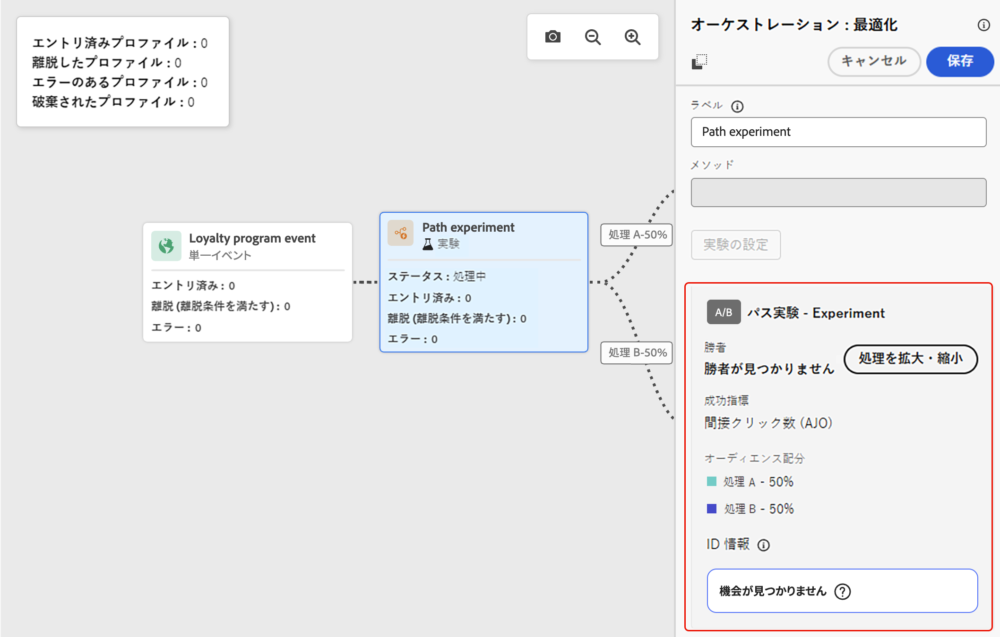

1. 「**[!UICONTROL 処理をスケール]**」をクリックして、勝利の処理を残りのオーディエンスにプッシュします。

   <!--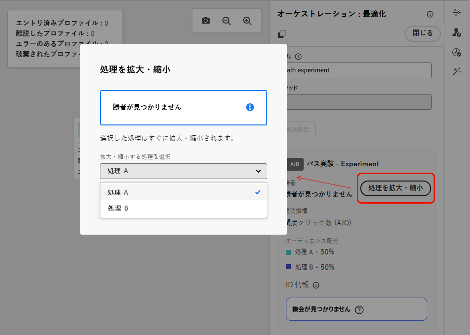-->

1. ドロップダウンメニューから拡大する処理を選択し、「**[!UICONTROL スケール]**」をクリックします。

   {width=80%}

処理のスケーリングには最大 1 時間かかる場合があります。 手動スケーリングプロセスが完了すると、通知が届きます。

+++ AI ナレッジリファレンス

このセクションには、このトピックに関連する解釈、検索、質問への回答をサポートすることを目的とした構造化された知識が含まれています。

理解を深めるには、この情報をこのページのドキュメントと組み合わせる必要があります。 どちらのソースも単独で使用することを意図していません。このページでは、機能について説明しますが、この節では、用語、意図、適用可能性、および制約の曖昧さを解消するのに役立つ追加のコンテキストを提供します。

* **TL;DR:**&#x200B;このページでは、A/Bまたはマルチアームドバンディット手法を使用してAdobe Journey Optimizer ジャーニーでパス実験を設定および実行する方法と、勝者の処理を自動または手動で拡張する方法について説明します。

**インテント：**
* ジャーニーでA/Bまたはマルチアームドバンディットパス実験を設定する
* 実験のパフォーマンスを評価するための成功指標を定義します
* 治療パス間のトラフィックを均等に、またはカスタムの割合で割り当てます
* すべての処理からオーディエンスの一部を除外するホールドアウトグループを追加する
* 自動スケーリングを有効にして、勝者の処理を自動的にロールアウトする
* 実験結果を確認した後、勝者の処理を手動で拡大・縮小する

**用語集：**
* **アクティビティの最適化**: プロファイルを実験またはターゲティング用に異なるパスに分割するために使用されるジャーニーキャンバスアクティビティ *（製品固有）*
* **処理**：パス実験の単一パスのバリアント （例：処理A、処理B） *（製品固有）*
* **成功指標**：どの処理が実験&#x200B;*（製品固有）*&#x200B;で最も効果的かを評価するために使用されるKPI
* **マルチアームドバンディット**：主要指標のパフォーマンス *（製品固有）*&#x200B;に基づいて、トラフィックの分割が7日ごとに自動的に調整される実験タイプ
* **勝者を拡大**：自動的または手動で、*（製品固有）*&#x200B;の残りのオーディエンスに勝者の処理をロールアウトする機能
* **ホールドアウトグループ**：すべての実験処理から除外されたオーディエンスのセグメントで、コントロールグループ *（製品固有）*&#x200B;として使用されます

**ガードレール：**
* 勝者の拡大・縮小は、単一ジャーニー（イベントトリガーおよびオーディエンスの選定）でのみ使用できます。オーディエンスの読み取りジャーニーでは使用できません。
* 自動スケール時間は、実験の終了日より前にスケジュールする必要があります。そうしないと、ジャーニーは公開されません。
* 自動スケーリングが実行されると、手動スケーリングは使用できなくなります。
* スケジュールされた自動スケール時間の前に勝者を手動でスケールすると、自動スケールがキャンセルされます。
* 治療の拡大には最大1時間かかる場合があります。

**用語：**
* 正規名：パス実験 – Acronym: none — バリエーション：ジャーニー実験、A/B パステスト
* 同義語：「アクティビティを最適化」 = 「実験アクティビティ」 = 「パス分割アクティビティ」
* 混乱しないでください：「A/B実験」≠「マルチアームドバンディット」（A/Bには固定トラフィック分割があります。マルチアームドバンディットは7日ごとにウェイトを動的に調整します）

**FAQ:**
* **Q: A/B実験とマルチアームドバンディットの違いは何ですか？** - A/B実験では、開始時に定義された固定トラフィック分割を使用し、マルチアームドバンディットは、主要な指標のパフォーマンスに基づいて7日ごとにトラフィック重みを自動的に調整します。
* **Q: オーディエンスを読み取りジャーニーで勝者を拡大/縮小できますか？**  – いいえ。勝者を拡大できるのは、単一ジャーニー（イベントトリガーおよびオーディエンスの選定）のみです。
* **Q：自動スケール時間で勝者が見つからない場合はどうなりますか？** - フォールバックを設定できます。実験をスケジュールされた終了まで続行するか、指定された時間が経過した後に代替処理を拡張します。
* **Q：処理率を手動で設定しない場合、トラフィックはどのように分配されますか？** - 「均等に配信」トグルを有効にすると、すべての処理でトラフィックを均等に分割できます。
* **Q: ジャーニーが公開された後、パス実験を編集できますか？** — ジャーニーは公開後に読み取り専用モードに入ります。変更を加えるには、ジャーニーの新しいバージョンを作成します。

+++
