# パスのターゲティングを活用 {#targeting}

>[!CONTEXTUALHELP]
>id="ajo_path_targeting_fallback"
>title="フォールバックパスとは"
>abstract="フォールバックパスを使用すると、ターゲティングルールが選定されていない場合に、オーディエンスは代替パスにエントリできます。 このオプションを選択しない場合、ターゲティングルールに選定されていないオーディエンスはフォールバックパスにエントリせずにジャーニーを終了します。"

>[!AVAILABILITY]
>
>この機能は現在限定的です。 アクセスをリクエストするには、Adobe担当者にお問い合わせください。

ターゲティングルールを使用すると、特定のオーディエンスセグメントに基づいて、顧客がいずれかのジャーニーパスへのエントリ対象となるために満たす必要がある、特定のルールまたは選定を決定できます<!-- depending on profile attributes or contextual attributes-->。

特定のパスをランダムに割り当てる実験とは異なり、ターゲティングは、適切なオーディエンスまたはプロファイルが指定されたパスに確実にエントリするという点で決定論的です。

<!--With targeting, specific rules can be defined based on:

* **User profile attributes** such as location (eg. geo-targeting), age, or preferences. For example, users in the US receive a "Golden Gate" promotion, while users in France receive an "Eiffel Tower" promotion.

* **Contextual data** such as device type (eg. device-targeting), time of day, or session details. For example, desktop users receive desktop-optimized content, while mobile users receive mobile-optimized content.

* **Audiences** which can be used to include or exclude profiles that have a particular audience membership.-->

ジャーニーでターゲティングを設定するには、次の手順に従います。

1. 「**[!UICONTROL オーケストレーション]**」セクションから、**[!UICONTROL 最適化]**&#x200B;アクティビティをジャーニーキャンバスにドラッグ＆ドロップします。

1. レポートモードとテストモードのログでアクティビティを識別するのに役立つ、オプションのラベルを追加します。

1. **[!UICONTROL メソッド]**&#x200B;ドロップダウンリストから「**[!UICONTROL ターゲティングルール]**」を選択します。

   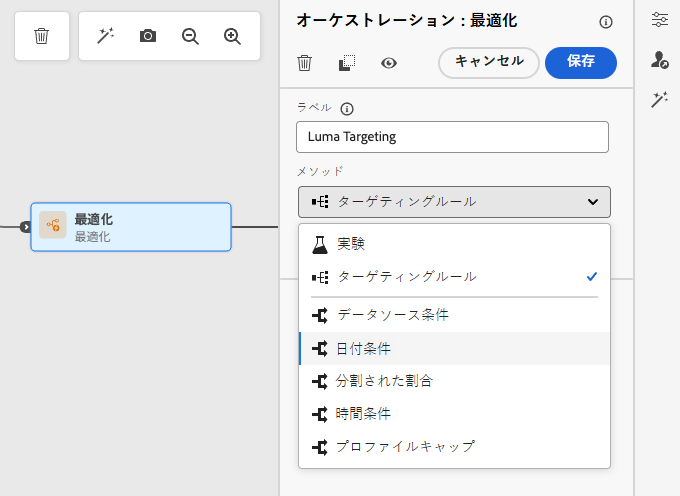{width=60%}

1. 「**[!UICONTROL ターゲティングルールを作成]**」をクリックします。

1. **[!UICONTROL ルールを作成]**／**[!UICONTROL 新規作成]**&#x200B;をクリックし、ルールビルダーを使用して条件を定義します。

   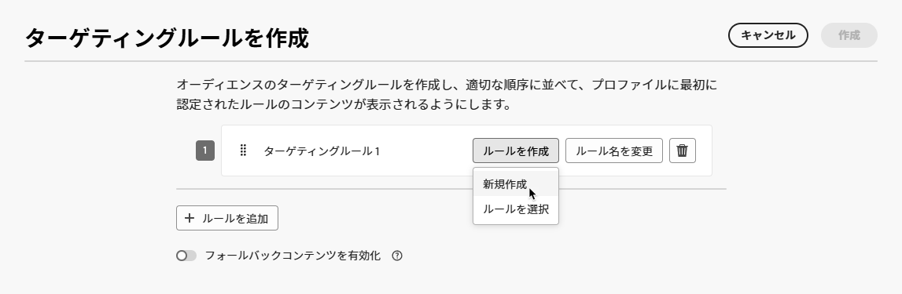{width=100%}

   例えば、ロイヤルティプログラムのゴールドメンバー向けのルール（`loyalty.status.equals("Gold", false)`）と、他のメンバー向けのルール（`loyalty.status.notEqualTo("Gold", false)`）を定義します。

   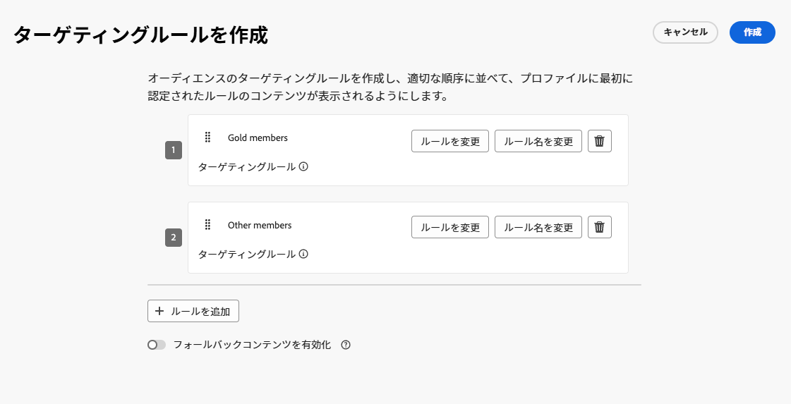

1. また、**[!UICONTROL ルールを作成]**／**[!UICONTROL ルールを選択]**&#x200B;をクリックして、**[!UICONTROL ルール]**&#x200B;メニューから作成した既存のターゲティングルールを選択することもできます。[詳細情報](../experience-decisioning/rules.md)

   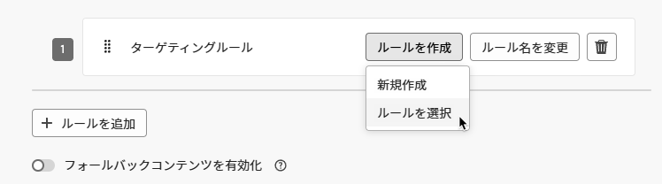{width=70%}

   この場合、ルールを構成する数式がジャーニーアクティビティにシンプルにコピーされます。その後、**[!UICONTROL ルール]**&#x200B;メニューからそのルールを変更しても、ジャーニーのコピーには影響しません。

   >[!AVAILABILITY]
   >
   >専用の [!DNL Journey Optimizer] メニューから[ターゲティングルールを作成](../experience-decisioning/rules.md#create)できるのは、現在、決定アドオン機能を購入した組織で、他の組織ではオンデマンドで使用できます（限定提供）。
   >
   >この機能は、すべての顧客に段階的にロールアウトされる予定です。それまでの間、アクセス権を取得するには、アドビ担当者にお問い合わせください。

1. ルールを追加したら、引き続き変更できます。 ルールビルダーを使用して外出先で更新するには「**[!UICONTROL インラインで編集]**」を選択し、別の既存のルールを選択するには「**[!UICONTROL ルールを選択]**」を選択します。

   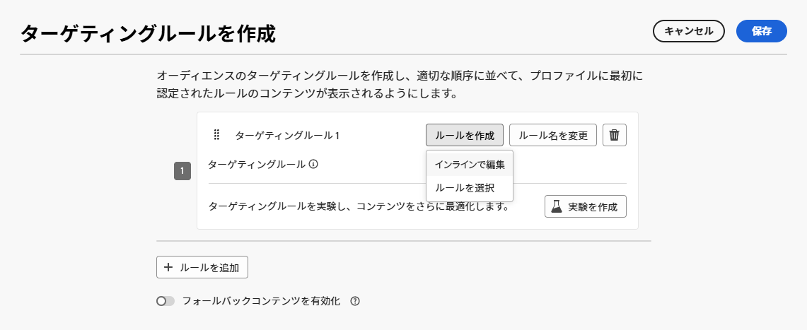{width=100%}

   >[!NOTE]
   >
   >ルールをインラインで編集しても、そのルールの元となる既存のルールには影響しません。

1. 必要に応じて、「**[!UICONTROL フォールバックパスを有効にする]**」オプションを選択します。このアクションにより、上記で定義したどのターゲティングルールも満たさないオーディエンスに対してフォールバックパスが作成されます。

   >[!NOTE]
   >
   >このオプションを選択しない場合、ターゲティングルールに選定されていないオーディエンスはフォールバックパスにエントリせずにジャーニーを終了します。

1. 「**[!UICONTROL 作成]**」をクリックして、ターゲティングルールの設定を保存します。

1. ジャーニーに戻り、特定のアクションをドロップして各パスをカスタマイズします。例えば、ゴールドロイヤルティメンバー向けにパーソナライズされたオファーを含むメールを作成し、他のすべてのメンバー向けには SMS リマインダーを作成します。

   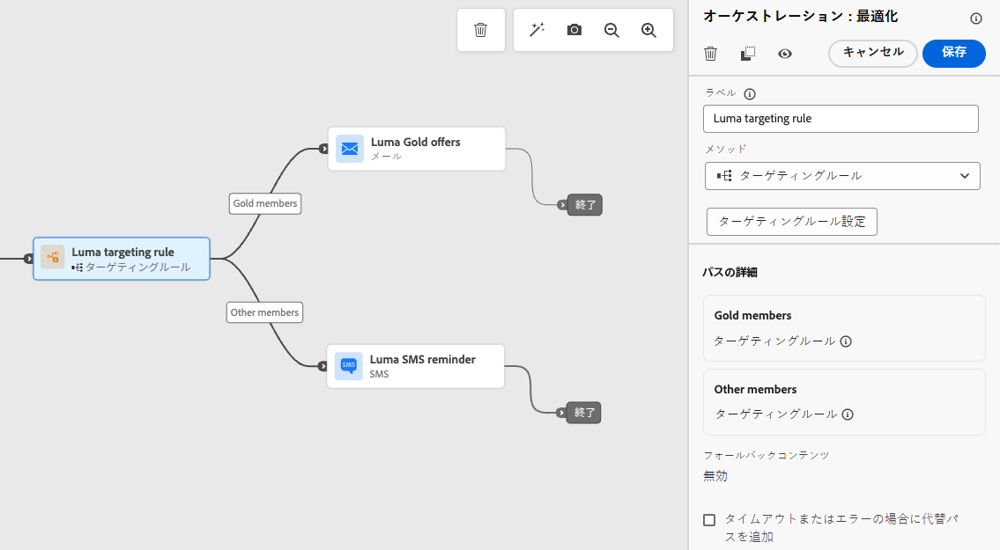

1. ルール設定を定義する際に「**[!UICONTROL フォールバックコンテンツを有効にする]**」オプションを選択した場合は、自動的に追加されたフォールバックパスに対して 1 つ以上のアクションを定義します。

   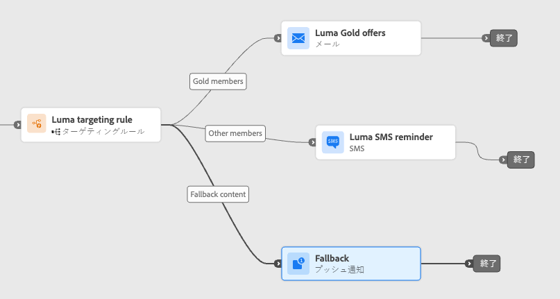{width=70%}

1. オプションとして、**[!UICONTROL タイムアウトまたはエラーが発生した場合に代替パスを追加]**&#x200B;し、問題が発生した場合に代替アクションを定義します。 [詳細情報](using-the-journey-designer.md#paths)

1. ターゲティングルール設定で定義された各グループに対応する各アクションに対して、適切なコンテンツをデザインします。

   この例では、ゴールド メンバーの特別オファーと、他のメンバーのSMS リマインダーを含むメールをデザインします。<!--You can seamlessly navigate between the different contents for each action. 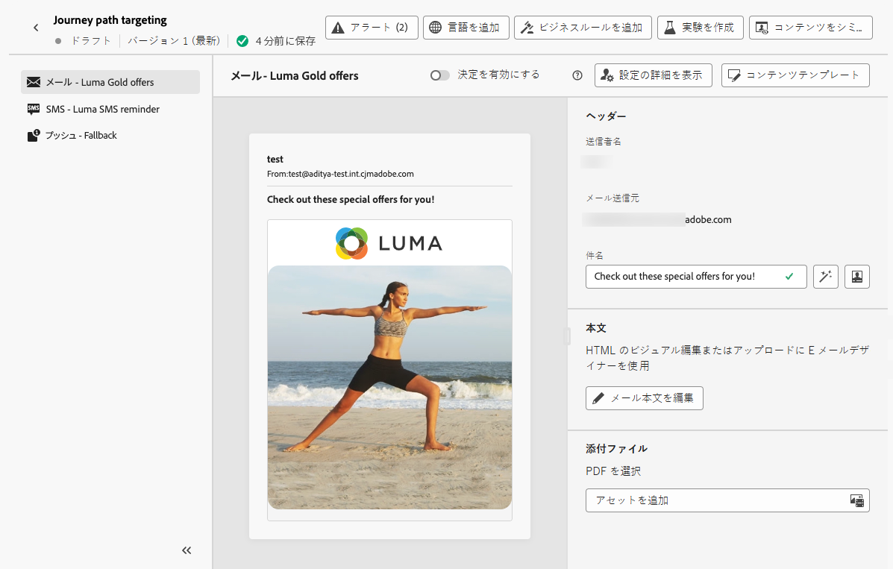-->

1. ジャーニーを[公開](publish-journey.md)します。

ジャーニーがライブになると、各セグメントに指定したパスが処理され、ゴールドメンバーはメールオファーを含むパスにエントリし、他のメンバーは SMS リマインダーを含むパスにエントリするようになります。

ジャーニーレポートを使用して、ジャーニーの成功を追跡します。[詳細情報](../reports/journey-global-report-cja.md#targeting)

## ターゲティングルールのユースケース {#uc-targeting}

次の例は、**[!UICONTROL 最適化]**&#x200B;アクティビティを&#x200B;**[!UICONTROL ターゲティング]**&#x200B;メソッドで使用して、様々なサブオーディエンスのパスをパーソナライズする方法を示しています。

+++セグメント固有のチャネル

ゴールドステータスのロイヤルティメンバーは、メールでパーソナライズされたオファーを受信でき、他のすべてのメンバーは SMS リマインダーに誘導されます。

<!--➡️ Use the revenue per profile or conversion rate as the optimization metric.-->

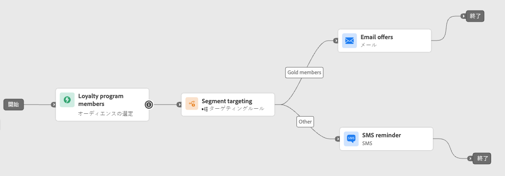

+++

+++行動ベースのターゲティング

メールを開いたがクリックしなかった顧客にはプッシュ通知、まったく開かなかった顧客には SMS が送信されます。

<!--➡️ Use the click-through rate or downstream conversions as the optimization metric.-->

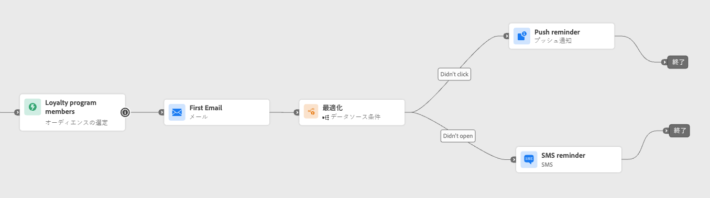

+++

+++購入履歴のターゲティング

最近購入した顧客は短い「お礼 + クロスセル」パスに進むことができますが、購入履歴のない顧客はより長い育成ジャーニーにエントリします。

<!--➡️ Use the repeat purchase rate or engagement rate as the optimization metric.-->

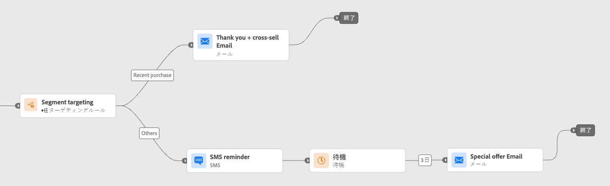

+++

