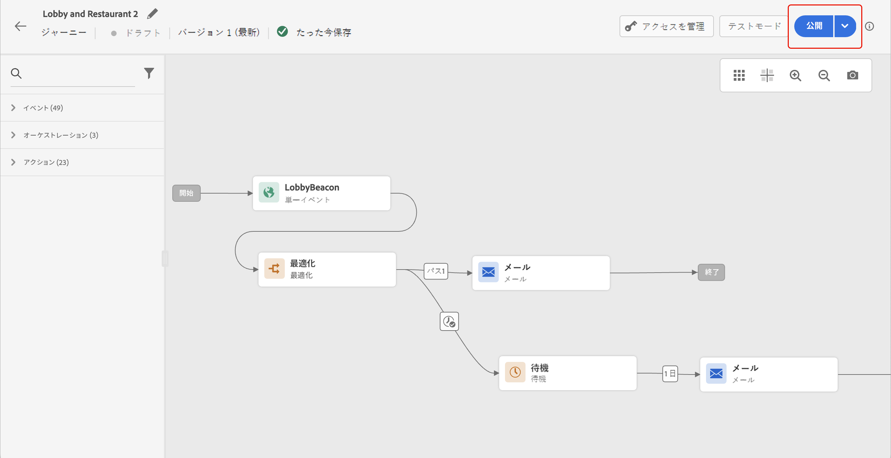
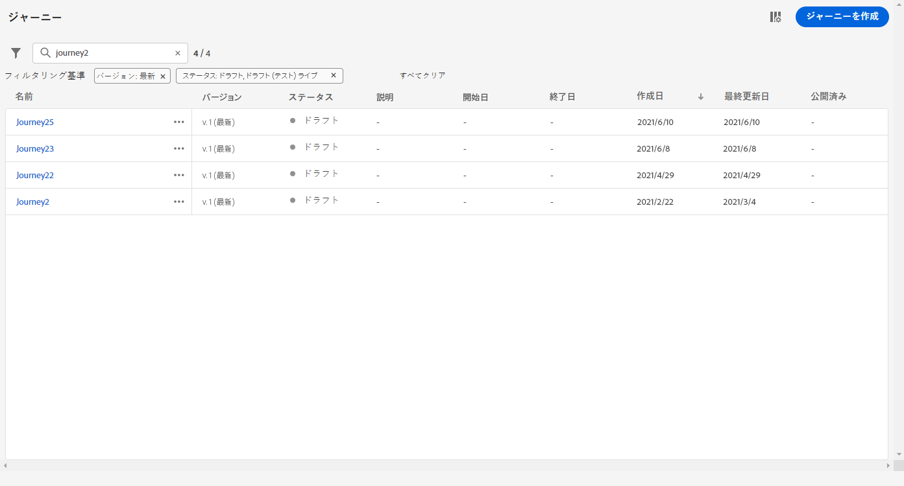
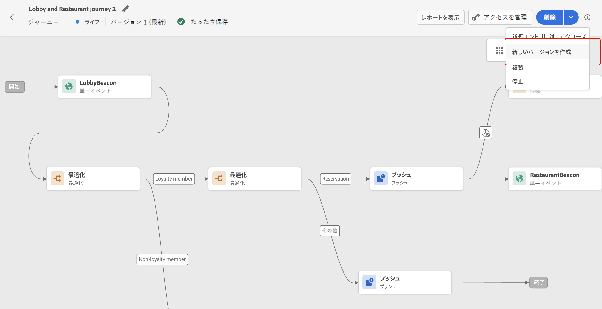

# ジャーニーの公開 {#publishing-the-journey}

>[!BEGINSHADEBOX]

**このページ：**&#x200B;前提条件、公開プロセス、バージョン管理、再公開要件など、ジャーニーをライブで設定するためのジャーニーの公開方法について説明します。

>[!ENDSHADEBOX]

ジャーニーを公開すると、そのジャーニーがアクティブになります。ステータスは&#x200B;**[!UICONTROL ライブ]**&#x200B;に移動し、新しいプロファイルが入力できるようになります。また、読み取り専用モードに切り替わります。 エラーを含むジャーニーは公開できません。

>[!NOTE]
>
>ジャーニーを保存または公開すると、Journey Optimizerはジャーニーペイロードサイズの合計を検証し、制限に近づいているか超えている場合は公開を警告またはブロックする場合があります。 詳しくは、[ジャーニーペイロードサイズの検証](../start/guardrails.md#journey-payload-size)を参照してください。

➡️ [この機能をビデオで確認](#video)

## 公開前に {#before-you-publish}

公開する前に、ジャーニーが次の前提条件を満たしていることを確認してください。

* **検証エラーはありません** — エラーを含むジャーニーを公開することはできません。 [最初にジャーニーをテスト &#x200B;](testing-the-journey.md)し、[&#x200B; アクティビティエラーのトラブルシューティング &#x200B;](../building-journeys/troubleshooting.md#activity-errors)を行います。
* **公開権限** – 公開には、**[!DNL Publish journeys]**&#x200B;の高レベル権限が必要です。 [&#x200B; アクセス権の管理](../administration/permissions-overview.md)の詳細をご覧ください。
* **制限内のペイロード** — ジャーニーペイロードは、設定された制限内（デフォルトでは4 MB）である必要があります。 [ジャーニーペイロードサイズの検証](../start/guardrails.md#journey-payload-size)を参照してください。
* **承認取得** — ジャーニーが承認ポリシーの対象である場合は、公開前に承認を要求して取得します。 [学習を増やす](../test-approve/gs-approval.md)。

>[!TIP]
>
>公開する前に、使用可能なテストオプションのいずれかを使用してジャーニーを検証します。
>
>* [&#x200B; シミュレーション &#x200B;](simulate-journey-gs.md) — Adobe Experience Platformで永続的なテストプロファイルを使用せずに、シミュレートされたユーザーでテストします。
>* [&#x200B; テストモード &#x200B;](testing-the-journey.md) — Adobe Experience Platformでテストプロファイルとしてフラグ付けされた永続的なプロファイルを使用してテストします。
>* [&#x200B; ドライラン &#x200B;](journey-dry-run.md) — プロファイルに連絡せずに、実際の実稼動データを使用してテストします。

## 公開プロセス {#journey-publication}

ジャーニーを公開する手順を以下に示します。

1. ジャーニーが有効で、エラーがなく、上記の[前提条件](#before-you-publish)を満たしていることを確認します。

1. ジャーニーを公開するには、右上のドロップダウンメニューにある「**[!UICONTROL 公開]**」オプションをクリックします。

   >[!NOTE]
   >
   > ジャーニーが承認ポリシーの対象となっている場合、ジャーニーを公開するには、承認をリクエストする必要があります。 [詳細情報](../test-approve/gs-approval.md)

   

ジャーニーを公開すると、**読み取り専用**&#x200B;モードになります。 読み取り専用モードでは、アクティビティのラベルと説明、ジャーニーの名前、ジャーニーの説明のみを変更できます。 公開済みのジャーニーに追加の変更を行う必要がある場合は、ジャーニーの[新しいバージョン](journey-ui.md#journey-filter)を作成します。

### ジャーニーのステータス {#journey-statuses}

公開後、ジャーニーはいくつかのステータスに移動します。

* **[!UICONTROL ライブ]** — ジャーニーが公開され、プロファイルが入力できます。
* **[!UICONTROL Closed]** – 新しいバージョンが公開されたときに自動的に終了した以前のバージョン。 入り口は出来ない。
* **[!UICONTROL 完了]** — ジャーニーは、終了条件に従って完了しました。 ジャーニーが終了したと見なされるタイミングの正確な定義については、[&#x200B; ジャーニーの終了方法](end-journey.md#journey-finished-definition)を参照してください。

### ジャーニーを停止 {#stop-journey}

ジャーニーを停止すると、そのジャーニーは完全に停止します。 ジャーニーを進むすべての個人は完全に停止し、ジャーニーは新規エントリの許可を停止します。 ジャーニーを再び実行する必要がある場合は、複製して新しいジャーニーを公開します。 ジャーニーの終了方法について詳しくは、[&#x200B; ジャーニーの終了方法](end-journey.md)を参照してください。

### 要件の再公開 {#republishing}

場合によっては、変更またはアセットを有効に保つためにジャーニーを再公開する必要があります。

>[!IMPORTANT]
>
>* ジャーニーのメッセージで使用されるオファーの決定に変更を行う場合は、ジャーニーを非公開にして、再公開する必要があります。 これにより、変更がジャーニーのメッセージに組み込まれ、メッセージが最新の更新と一致するようになります。
>
>* アセット／画像は、フラグメント／インラインメッセージで最初に公開されてから最大 2 年間（730 日間）、配信済みコンテンツでアクセスできます。 この有効期限の後（730 日後の任意の時間）に、さらに 2 年間アクセスできるようにするには、再公開が必要です。 最初の公開から 730 日以内に再公開した場合、アセット／画像の有効期限は次の 730 日間に延長されません。

## ジャーニーのバージョン {#journey-versions}

ジャーニーリストには、すべてのジャーニーバージョンがバージョン番号と共に表示されます。 ジャーニーを検索すると、アプリを初めて開いたときに、リストの先頭に最新のバージョンが表示されます。 次に、必要な並べ替えを定義します。アプリケーションはこの定義をユーザーの環境設定として扱います。 ジャーニーのバージョンは、ジャーニー版インターフェイスの上部（キャンバスの上）にも表示されます。

>[!NOTE]
>
>通常、プロファイルは、ジャーニーのすべてのアクティブなバージョンに対して、同じジャーニー内に同時に複数回存在することはできません。 再エントリが有効な場合、プロファイルはジャーニーに再エントリできますが、再エントリできるのは以前のジャーニーインスタンスから完全に離脱した後のみになります。 [詳細情報](entry-management.md)

### ジャーニーの新しいバージョンの作成 {#journey-create-new-version}

ライブジャーニーを変更する必要がある場合は、ジャーニーの新しいバージョンを作成します。 既存のジャーニーの新しいバージョンを作成するには、次の手順に従います。

1. ライブジャーニーの最新バージョンを開き、「**[!UICONTROL 新しいバージョンを作成]**」をクリックして確認します。

   

   >[!NOTE]
   >
   >新しいバージョンは、ジャーニーの最新バージョンからのみ作成できます。

1. 変更を加え、「**[!UICONTROL 公開]**」をクリックして確認します。

ジャーニーが公開された時点から、最新版ジャーニーに個人利用者がエントリし始めます。 既に前のバージョンにエントリしている人物は、ジャーニーが終了するまで古いバージョンを継続します。 後で同じジャーニーに再エントリする場合は、最新バージョンにエントリすることになります。

ジャーニーのバージョンは個別に停止できます。 ジャーニーのすべてのバージョンには同じ名前が付いています。

新しいバージョンのジャーニーを公開すると、前のバージョンが自動的に終了し、**クローズ**&#x200B;ステータスに切り替わります。 このジャーニーにはエントリできません。 最新バージョンを停止しても、以前のバージョンはクローズのままとなります。

>[!NOTE]
>
>ジャーニーのバージョン管理には、特定のガードレールと制限が適用されます。 詳しくは、[このページ](../start/guardrails.md#journey-versions-g)を参照してください。

## よくある質問 {#faq}

**ジャーニーを公開できないのはなぜですか？**

最も一般的な理由は、ジャーニーに検証エラーが含まれていることです。エラーのあるジャーニーを公開することはできません。 その他のブロッカーには、[&#x200B; ペイロードサイズの制限](../start/guardrails.md#journey-payload-size)を超えているか、**[!DNL Publish journeys]**&#x200B;権限がないか、保留中の[承認](../test-approve/gs-approval.md)が含まれます。 [公開前](#before-you-publish)および[&#x200B; アクティビティエラーのトラブルシューティング &#x200B;](../building-journeys/troubleshooting.md#activity-errors)を参照してください。

**公開後にジャーニーを編集できますか？**

公開されたジャーニーは読み取り専用モードです。 変更できるのは、アクティビティラベルと説明、ジャーニーの名前およびジャーニーの説明のみです。 その他の変更については、[&#x200B; ジャーニーの新しいバージョン &#x200B;](#journey-create-new-version)を作成します。

**新しいバージョンを公開すると、ジャーニー内にすでに存在するプロファイルはどうなりますか？**

新しいプロファイルは最新バージョンに移行します。 以前のバージョンのプロファイルは、完了するまで残ります。後で再入力すると、最新バージョンに移行します。 以前のバージョンは自動的に&#x200B;**[!UICONTROL Closed]**&#x200B;に切り替わり、新しいエントリは受け付けません。 [ジャーニー版](#journey-versions)を参照してください。

**停止したジャーニーを再実行するにはどうすればよいですか？**

ジャーニーの停止は永続的です。 もう一度実行するには、それを複製して新しいジャーニーを公開します。 「[&#x200B; ジャーニーの停止](#stop-journey)」を参照してください。

**オファーの決定を変更したり、アセットを更新した後に再公開する必要がありますか？**

はい。 ジャーニーのメッセージで使用されているオファー決定を変更する場合は、変更が適用されるように、ジャーニーを非公開にして再公開します。 Assetsと画像は、最初の公開から730日後に有効期限が切れます。その後は再公開してアクセスを維持します。 [要件の再公開](#republishing)を参照してください。

**承認が必要なジャーニーを公開できますか？**

ジャーニーが承認ポリシーの対象となる場合は、公開前に承認をリクエストする必要があります。 [承認について詳しく見る](../test-approve/gs-approval.md)。

## 関連トピック {#related-topics}

* [&#x200B; ジャーニーをテストする](testing-the-journey.md) – 公開前にテストプロファイルでジャーニーを検証します
* [ジャーニーのシミュレーション &#x200B;](simulate-journey-gs.md) – 公開前に、シミュレートされたユーザーとジャーニーを検証します
* [ジャーニードライ実行](journey-dry-run.md) - プロファイルに連絡せずに実稼動データを使用してテストします
* [&#x200B; トラブルシューティング &#x200B;](../building-journeys/troubleshooting.md#activity-errors) - アクティビティと公開エラーを解決する
* [&#x200B; ジャーニーの終了方法](end-journey.md#journey-finished-definition) - ジャーニーの完了とステータスを理解する
* [&#x200B; プロファイルのエントリ管理](entry-management.md) - プロファイルがジャーニーを入力および再入力する方法を設定します
* [ジャーニーのガードレールと制限事項](../start/guardrails.md#journeys-guardrails-journeys) – 公開とバージョン管理のガードレールを確認する

## チュートリアルビデオ {#video}

ジャーニーの公開方法について詳しくは、次のビデオを参照してください。

>[!VIDEO](https://video.tv.adobe.com/v/3427936?captions=jpn&quality=12)

+++ AI ナレッジリファレンス

このセクションには、このトピックに関連する解釈、検索、質問への回答をサポートすることを目的とした構造化された知識が含まれています。

理解を深めるには、この情報をこのページのドキュメントと組み合わせる必要があります。 どちらのソースも単独で使用することを意図していません。このページでは、機能について説明しますが、この節では、用語、意図、適用可能性、および制約の曖昧さを解消するのに役立つ追加のコンテキストを提供します。

* **TL;DR:**&#x200B;このページでは、Adobe Journey Optimizer ジャーニーを公開する方法、ジャーニーのバージョンを管理する方法、ジャーニーの公開後に適用される制約事項を理解する方法について説明します。

**インテント：**
* ジャーニーを公開して公開し、プロファイル入力で利用できるようにします
* ジャーニーの有効性を確認し、公開前にエラーを解決する
* ライブジャーニーの新しいバージョンを作成して修正する
* ジャーニーの公開後に適用される読み取り専用の制限について説明します
* ジャーニーを完全に停止するか、バージョン間の移行を管理します

**用語集：**
* **ジャーニーバージョン**：ジャーニーの番号付きイテレーション。新しいバージョンが作成され、進行中のプロファイルを中断せずにライブジャーニーを変更できます&#x200B;*（製品固有）*
* **クローズ済みステータス**：新しいバージョンが公開されたときに、以前のジャーニーバージョンが自動的に入力される状態。新しいプロファイルは、クローズ済みジャーニー&#x200B;*（製品固有）*&#x200B;に入力できません
* **承認ポリシー**: ジャーニーを公開する前に明示的な承認を必要とするオプションのガバナンスワークフロー&#x200B;*（製品固有）*

**ガードレール：**
* エラーのあるジャーニーは公開できません。
* Journey Optimizerは、保存時と公開時にジャーニーペイロードの合計サイズを検証します。制限を超えると、公開がブロックされる場合があります。
* 公開後、ジャーニーは読み取り専用モードになります。編集できるのは、ラベル、説明、ジャーニー名のみです。
* 新しいバージョンは、ジャーニーの最新バージョンからのみ作成できます。
* ジャーニーが停止されると、ジャーニーは完全に停止されます。再度実行するには、ジャーニーを複製する必要があります。
* 配信されたコンテンツ内のAssetsと画像は、最初の公開から最大730日間アクセスできます。その後、再公開が必要になります。
* ジャーニーメッセージで使用されるオファー決定が変更された場合、ジャーニーは非公開にして再公開する必要があります。
* 特定のガードレールは、ジャーニーのバージョン管理に適用されます（ガードレールのページを参照）。

**用語：**
* 正規名：ジャーニーを公開 – Acronym: none — バリエーション：ジャーニーをアクティブ化、ライブ化
* 同義語：「公開」 = 「アクティブ化」 = 「本番稼動」
* 混同しないでください：「ジャーニーを停止」≠「ジャーニーを閉じる」（停止は手動アクションです。クローズは、新しいバージョンが公開されたときに以前のバージョンに適用される自動ステータスです）

**FAQ:**
* **Q: ジャーニーを公開後に編集できますか？** — ラベル、説明、ジャーニー名のみを変更できます。 その他の変更を加えるには、ジャーニーの新しいバージョンを作成します。
* **Q：新しいバージョンが公開されたときに、古いジャーニーバージョンのプロファイルはどうなりますか？**  – 以前のバージョンのプロファイルは、完了するまで残ります。新しいプロファイルは、最新バージョンを入力します。
* **Q：クローズしたジャーニーのバージョンを再公開できますか？**  – いいえ。 以前のバージョンをクローズすると、最新バージョンが停止してもクローズしたままになります。
* **Q: ジャーニーで使用されているオファー決定が変更された場合はどうすればよいですか？** — ジャーニーを非公開にして再公開し、更新されたオファー決定を組み込みます。
* **Q：公開前に承認が必要ですか？** — ジャーニーが承認ポリシーの対象となる場合のみ。その場合は、最初に承認をリクエストする必要があります。

+++
