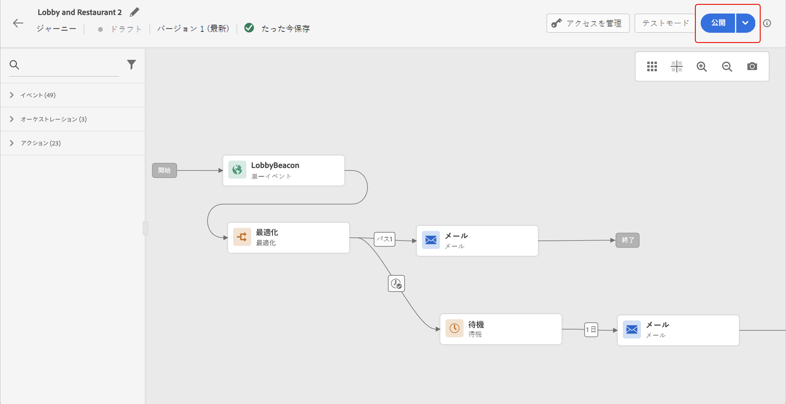

# ジャーニーの公開 {#publishing-the-journey}

ジャーニーを公開してアクティブ化し、新しいプロファイルが入力できるようにする必要があります。 ジャーニーを公開する前に、そのジャーニーが有効であること、エラーがないことを確認します。エラーのあるジャーニーは公開できません。 ジャーニーのテスト方法については、[ このページ ](testing-the-journey.md) を参照してください。

➡️ [この機能をビデオで確認](#video)

ジャーニーを公開する手順は次のとおりです。

1. ジャーニーを公開する前に、そのジャーニーが有効であること、エラーがないことを確認します。エラーのあるジャーニーは公開できません。ジャーニーのトラブルシューティング方法については、[ この節 ](../building-journeys/troubleshooting.md#checking-for-errors-before-testing) を参照してください。

1. ジャーニーを公開するには、右上のドロップダウンメニューにある「**[!UICONTROL 公開]**」オプションをクリックします。

   >[!NOTE]
   >
   > ジャーニーに承認ポリシーが適用される場合、ジャーニーを公開するには、承認をリクエストする必要があります。 [詳細情報](../test-approve/gs-approval.md)

   

ジャーニーが公開されると、**読み取り専用** モードになります。 ジャーニーが読み取り専用の場合、変更できるのはアクティビティのラベルと説明、ジャーニーの名前およびジャーニーの説明のみです。 公開済みのジャーニーにさらに変更を加える必要がある場合は、ジャーニーの [ 新しいバージョン ](journey-ui.md#journey-versions) を作成します。

ジャーニーを停止すると、そのジャーニーは完全に停止します。ジャーニーを進むすべてのユーザーは完全に停止し、ジャーニーは新規エントリの許可を停止します。 ジャーニーを再度実行する必要がある場合は、ジャーニーを複製し、新しいジャーニーを公開する必要があります。

>[!IMPORTANT]
>
>ジャーニーのメッセージで使用されるオファーの決定に変更が加えられた場合は、ジャーニーを非公開にして、再公開する必要があります。これにより、変更がジャーニーのメッセージに取り込まれ、メッセージが最新の更新と一致するようになります。

## チュートリアルビデオ {#video}

ジャーニーの公開方法については、次のビデオを参照してください。

>[!VIDEO](https://video.tv.adobe.com/v/3424998?quality=12)