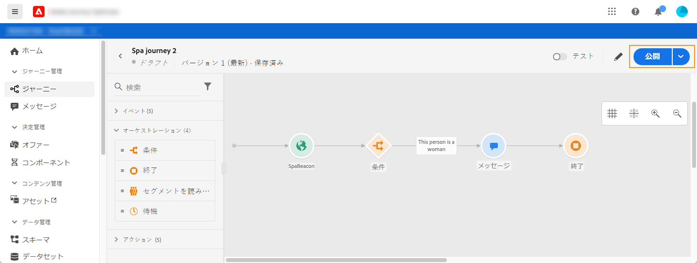

# ジャーニーの公開{#concept_mtc_lrt_52b}

ジャーニーは、有効性をテストした後で公開できます。

公開済みのジャーニーに変更を加える必要がある場合は、ジャーニーの新しいバージョンを作成する必要があります。[このページ](../building-journeys/journey-versions.md)を参照してください。ジャーニーが読み取り専用の場合、変更できるのはアクティビティのラベルと説明、ジャーニーの名前およびジャーニーの説明のみです。

ジャーニーを停止すると、そのジャーニーは完全に停止します。ジャーニーを進むすべての人は完全に停止し、ジャーニーは新規エントリの許可を停止します。ジャーニーを再び使用する必要がある場合は、複製して公開する必要があります。

1. ジャーニーを公開する前に、そのジャーニーが有効であること、エラーがないことを確認します。エラーのあるジャーニーは公開できません。[この節](../building-journeys/troubleshooting.md#section_h3q_kqk_fhb)を参照してください。また、公開前にジャーニーをテストすることもお勧めします。[このページ](../building-journeys/testing-the-journey.md)を参照してください。
1. ジャーニーを公開するには、右上のドロップダウンメニューにある「**[!UICONTROL 公開]**」オプションをクリックします。

   

ジャーニーが公開されると、読み取り専用モードになります。
