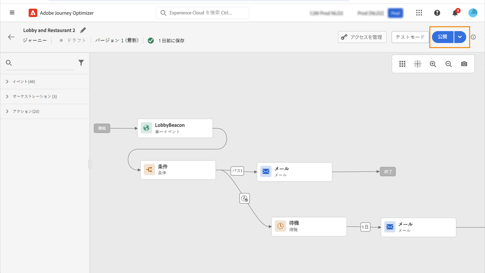

# 旅のパブリッシュ{#publishing-the-journey}

妥当性をテストした後で、フライトをパブリッシュすることができます。

➡️ [ ビデオでのこの機能の検出](#video)

パブリッシュされた旅に変更を加える必要がある場合は、新しいバージョンの旅を作成する必要があります。 このページ ](../building-journeys/journey.md) を参照してください [ 。書き込みが読み取り専用である場合は、アクティビティーラベルと説明、その旅の名前、および旅の説明のみを修正できます。

このような場合は、完全に停止されます。 このような旅に流れている人々はすべて永久的に停止され、その旅は停止し、新入り口は停止します。 この旅をもう一度使用する必要がある場合は、複製してパブリッシュする必要があります。

1. 旅を公開する前に、それが有効であり、エラーが発生していないことを確認してください。 エラーが発生しても、旅をパブリッシュすることはできません。 この項 ](../building-journeys/troubleshooting.md#checking-for-errors-before-testing) を参照してください [ 。また、公開前の旅もテストすることをお勧めします。 このページ ](../building-journeys/testing-the-journey.md) を参照してください [ 。
1. 旅を公開するには、右上のドロップダウンメニューにあるオプションをクリックし **[!UICONTROL Publish]** ます。

   

この旅が公開されると、読み取り専用モードになります。

## 操作方法のビデオ {#video}

ここでは、旅を公開する方法について説明します。

>[!VIDEO](https://video.tv.adobe.com/v/334238?quality=12)