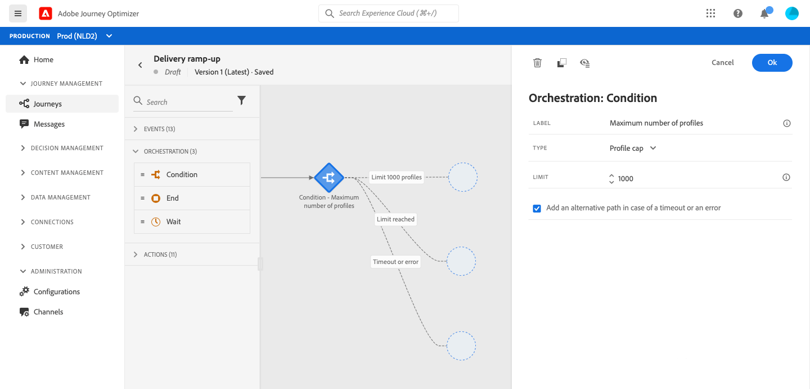

# ユースケース：配信を増やす

最近、別のメールサービスプロバイダー、IP アドレス、メールドメインまたはサブドメインに移動した場合は、送信者としての評判を確立する必要があります。そうしないと、配信がブロックされたり、受信者のメールボックスのスパムフォルダーに送られる可能性があります。IP ウォーミングを使用してメールの評判を高める方法については、[配信品質のベストプラクティスガイド](https://experienceleague.adobe.com/docs/deliverability-learn/deliverability-best-practice-guide/additional-resources/generic-resources/increase-reputation-with-ip-warming.html?lang=ja){target=&quot;_blank&quot;}を参照してください。

IP をウォームアップするために、配信数を徐々に増やすことができます。詳しくは、[Journey Optimizer での配信品質の最適化](../deliverability.md)を参照してください。

この使用例の目的は、ジャーニーを作成してメール配信を増やすことです。このジャーニーを設定するには、次の手順に従います。

1. ジャーニーを作成します。[詳細情報](journey-gs.md)

1. **[!UICONTROL 条件]**&#x200B;アクティビティをジャーニーに追加します。[詳細情報](condition-activity.md)

1. **[!UICONTROL 条件]**&#x200B;アクティビティの設定で、配信の最大受信者数を設定します。

   1. **[!UICONTROL 条件]**&#x200B;アクティビティの設定で、「**[!UICONTROL タイプ]**」フィールドを&#x200B;**[!UICONTROL プロファイルキャップ]**&#x200B;に設定します。[詳細情報](condition-activity.md#profile_cap)

   1. 「**[!UICONTROL 制限]**」フィールドをこの配信の最大受信者数に設定します。

   

   この制限は、購読者の合計数まで徐々に増やすことができます。

1. **[!UICONTROL メッセージ]**&#x200B;アクティビティを&#x200B;**[!UICONTROL 条件]**&#x200B;アクティビティの後の呼びパスに追加します。

   

   ジャーニーが実行されると、指定したプロファイルの最大数まで、メッセージが入力プロファイルに送信されます。この制限に達すると、入力したプロファイルは代替パスを使用します。

1. 選択したアクティビティでジャーニーを完了します。

IP がウォームアップされたら、この条件を削除できます。

