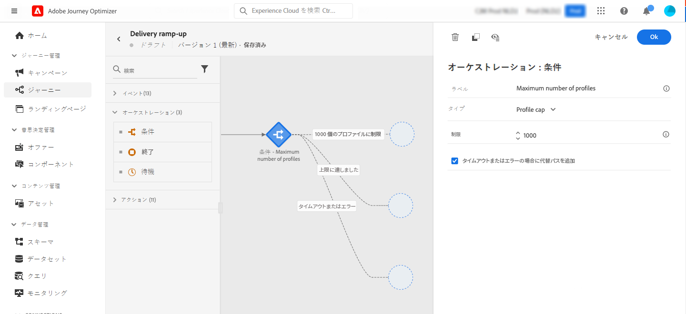
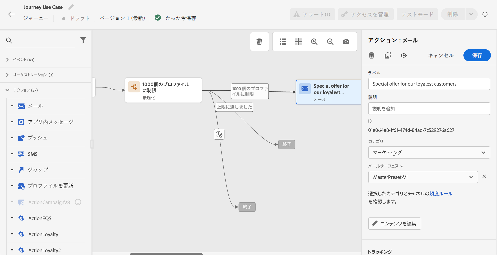

# ユースケース：配信を増やす{#use-case-ramp-up-your-deliveries}

最近、別のメールサービスプロバイダー、IP アドレス、メールドメインまたはサブドメインに移動した場合は、送信者としての評判を確立する必要があります。 そうしないと、配信がブロックされたり、受信者のメールボックスのスパムフォルダーに送られる可能性があります。 IP ウォーミングを使用してメールの評判を高める方法について詳しくは、[配信品質のベストプラクティスガイド](https://experienceleague.adobe.com/docs/deliverability-learn/deliverability-best-practice-guide/additional-resources/generic-resources/increase-reputation-with-ip-warming.html?lang=ja){target="_blank"}を参照してください。

IP をウォームアップするために、配信数を徐々に増やすことができます。 詳しくは、[Journey Optimizer での配信品質の最適化](../reports/deliverability.md)を参照してください。

この使用例の目的は、ジャーニーを作成してメール配信を増やすことです。 このジャーニーを設定するには、次の手順に従います。

1. ジャーニーを作成します。 [詳細情報](journey-gs.md)。

1. ジャーニーに&#x200B;**[!UICONTROL Optimize]** アクティビティを追加します。 [詳細情報](optimize.md)。

1. **[!UICONTROL 条件]**&#x200B;アクティビティの設定で、配信の最大受信者数を設定します。

   1. **[!UICONTROL 最適化]** アクティビティ設定で、**[!UICONTROL 条件]** メソッドを選択し、**[!UICONTROL タイプ]** フィールドを&#x200B;**[!UICONTROL プロファイル キャップ]**&#x200B;に設定します。 [詳細情報](conditions.md#profile_cap)。

   1. 「**[!UICONTROL 制限]**」フィールドをこの配信の最大受信者数に設定します。

   

   この制限は、購読者の合計数まで徐々に増やすことができます。

1. **[!UICONTROL メール]**&#x200B;アクションアクティビティを&#x200B;**[!UICONTROL 条件]**&#x200B;アクティビティの後の呼びパスに追加します。

   

   ジャーニーが実行されると、指定したプロファイルの最大数まで、メッセージが入力プロファイルに送信されます。 この制限に達すると、入力したプロファイルは代替パスを使用します。

1. 選択したアクティビティでジャーニーを完了します。

IP がウォームアップされたら、この条件を削除できます。
