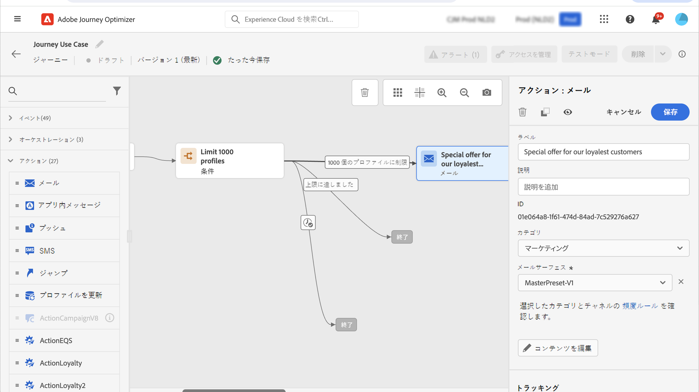

# 用途: 配信の強化{#use-case-ramp-up-your-deliveries}

最近別の電子メールサービスプロバイダー、IP アドレスまたは e-mail ドメインまたはサブドメインに移動した場合は、送信者としての評判を確認する必要があります。 それ以外の場合は、配信がブロックされるか、または受信者のメールボックスのスパムフォルダーに移動されます。 Deliverability ベストプラクティスガイド ](https://experienceleague.adobe.com/docs/deliverability-learn/deliverability-best-practice-guide/additional-resources/generic-resources/increase-reputation-with-ip-warming.html) () で [ 、IP ウォーミングを使用して電子メールの評判を上げる方法について説明します ({target = &quot;_blank&quot;})。

IP をウォームアップするには、配信数をしだいに増やします。 Deliverability オプティマイザー ](../reports/deliverability.md) での最適化について詳しくは、こちらを参照して [ ください。

このような使用例の目的は、電子メール配信によって増加する道を作成することです。 このような旅を設定するには、次の手順を実行します。

1. 旅を作成します。 [詳しく ](journey-gs.md) は、こちらを参照してください。

1. **[!UICONTROL Condition]**&#x200B;この旅にアクティビティを追加します。[詳しく ](condition-activity.md) は、こちらを参照してください。

1. **[!UICONTROL Condition]**「アクティビティ設定」で、配信先の最大受信者数を設定します。

   1. **[!UICONTROL Condition]**&#x200B;アクティビティ設定で、フィールドをに **[!UICONTROL Profile cap]** 設定 **[!UICONTROL Type]** します。[詳しく ](condition-activity.md#profile_cap) は、こちらを参照してください。

   1. **[!UICONTROL Limit]**&#x200B;このフィールドを配信の最大受信者数に設定します。

   

   この上限値は、サブスクライバーの総数に徐々に増加させることができます。

1. **[!UICONTROL Email]**&#x200B;アクティビティの **[!UICONTROL Condition]** 後にアクションアクティビティを公称パスに追加します。

   

   このような旅が実行されると、メッセージは、指定された最大数のプロファイルを入力して送信されます。 この制限に達した場合は、入力プロファイルに代替パスが採用されます。

1. 目的に応じた操作を行います。

IP が med-v を実行した後、この状態を削除することができます。
