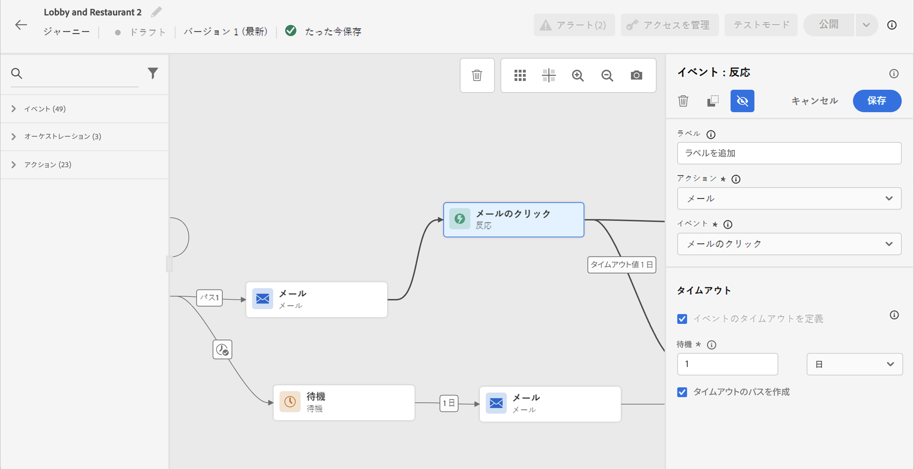

# 反応イベント {#reaction-events}

パレットに表示される多数のイベントアクティビティの中に、ビルトインの&#x200B;**[!UICONTROL 反応]**イベントがあります。
このアクティビティを使用すると、同じジャーニーの中で送信したメッセージに関するトラッキングデータに、反応することができます。この情報は、Adobe Experience Platform と共有した時点でリアルタイムに取り込まれます。プッシュ通知では、メッセージのクリック、送信、失敗に反応できます。SMS メッセージでは、メッセージの送信と失敗に反応できます。メールでは、メッセージのクリック、送信、開封、失敗に反応できます。

このしくみを使用して、メッセージに対する反応がない場合にアクションを実行することもできます。これには、反応アクティビティと並行して 2 つ目のパスを作成し、待機アクティビティを追加します。待機アクティビティで定義した期間に反応がない場合は、2 つ目のパスが選択されます。例えば、フォローアップメッセージを送信することもできます。

キャンバスで反応アクティビティを使用できるのは、事前に&#x200B;**メッセージ**&#x200B;アクティビティがおこなわれている場合のみです。

[アクションアクティビティについて](../building-journeys/about-journey-activities.md#action-activities)を参照してください。

反応イベントはさまざまな手順で設定できます。

1. 反応に&#x200B;**[!UICONTROL ラベル]**&#x200B;を追加します。この手順はオプションです。
1. ドロップダウンリストから、反応するアクションアクティビティを選択します。パスの中で前のステップに配置されている任意のアクションアクティビティを選択できます。
1. 選択したアクションに応じて、反応する対象を選択します。
1. イベントタイムアウト（40 秒 ～ 30 日）とタイムアウトパスを定義できます。これにより、定義したデュレーション内に反応しなかった個人に対する 2 つ目のパスが作成されます。反応イベントを使用するジャーニーをテストする場合、テストモードの&#x200B;**[!UICONTROL 待機時間]**&#x200B;のデフォルト値は最小値である 40 秒です。[この節](../building-journeys/testing-the-journey.md)を参照してください。

>[!NOTE]
>
>
>反応イベントでは、別のジャーニーで送信されるメッセージをトラッキングすることはできません。
>
>反応イベントは、「トラッキング対象」タイプのリンクのクリックを追跡します。購読解除とミラーページのリンクは考慮しません。

>[!IMPORTANT]
>
>Gmail などのメールクライアントでは、画像がブロックされる可能性があります。メールの開封は、メールに含めた 0 ピクセルの画像を使用してトラッキングします。画像がブロックされると、メールの開封は考慮できません。
