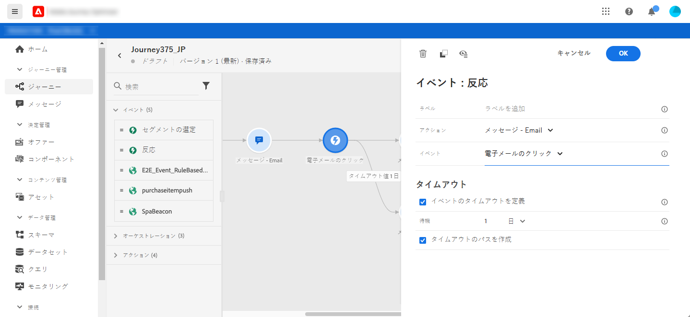

# 反応イベント {#section_dhx_gss_dgb}

パレットに表示される様々なイベントアクティビティの中に、組み込みの&#x200B;**[!UICONTROL Reactions]**&#x200B;イベントがあります。 このアクティビティにより、同じジャーニー内で送信されたメッセージに関連する追跡データに対して対応できます。 この情報をAdobe Experience Platformと共有した時点でリアルタイムで取り込みます。 プッシュ通知では、クリック、送信または失敗したメッセージに対応できます。 SMSメッセージの場合、送信されたメッセージや失敗したメッセージに対して反応を示すことができます。 電子メールの場合、クリック、送信、開いたメッセージ、失敗したメッセージに対応できます。

このメカニズムを使用して、メッセージに対する反応がない場合にアクションを実行することもできます。 これを行うには、リアクションアクティビティに平行な第2のパスを作成し、待機アクティビティを追加します。 待機アクティビティで定義された期間中に反応がない場合は、2番目のパスが選択されます。 例えば、フォローアップメッセージを送信することができます。

キャンバスには、以前&#x200B;**Message**&#x200B;アクティビティがある場合にのみ、リアクションアクティビティを使用できます。

[アクションアクティビティについて](../building-journeys/about-journey-activities.md#action-activities)を参照してください。

以下に、反応イベントを設定するための様々な手順を示します。

1. &lt;追加a0/>反応に対する&#x200B;]**ラベル。**[!UICONTROL &#x200B;この手順はオプションです。
1. ドロップダウンリストから、反応させるアクションアクティビティを選択します。 パスの前のステップに配置されている任意のアクションアクティビティを選択できます。
1. 選択したアクションに応じて、反応の対象を選択します。
1. イベントタイムアウト（40 ～ 30日）とタイムアウトパスを定義できます。 これにより、定義された期間内に反応しなかった個人に対して、2番目のパスが作成されます。 リアクションイベントを使用するジャーニーをテストする場合、テストモード&#x200B;**[!UICONTROL 待ち時間]**&#x200B;はデフォルト値で、最小値は40秒です。 詳しくは、[この節](../building-journeys/testing-the-journey.md)を参照してください。

>[!NOTE]
>
>
>リアクションイベントは、異なるジャーニーで発生したメッセージを追跡できません。
>
>リアクションイベントは、「追跡」タイプのリンクのクリックを追跡します。 購読解除とミラーページのリンクは考慮されません。

>[!IMPORTANT]
>
>Gmailなどの電子メールクライアントでは、画像のブロックが許可されます。 電子メールの開封は、電子メールに含まれる0ピクセルの画像を使用して追跡されます。 画像がブロックされると、電子メールの開封は考慮されません。
