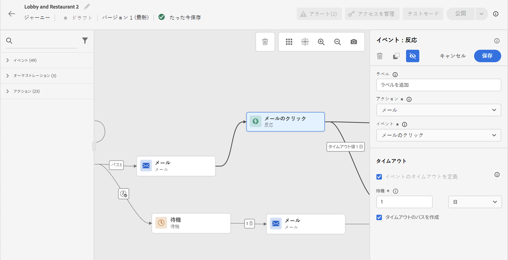

# 反応イベント {#reaction-events}

>[!BEGINSHADEBOX]

**このページ：**&#x200B;で、Reaction アクティビティを使用して、同じジャーニー内の開封数やクリック数などのメッセージ追跡データに応答する方法と、エンゲージしない個人に対するタイムアウトパスを設定する方法について説明します。

>[!ENDSHADEBOX]

>[!CONTEXTUALHELP]
>id="ajo_journey_event_reaction"
>title="反応イベント"
>abstract="このアクティビティを使用すると、同じジャーニーの中で送信したメッセージに関するトラッキングデータに反応することができます。 この情報は、[!DNL Adobe Experience Platform] と共有した時点でリアルタイムに取り込まれます。"

## 概要 {#overview}

パレットに表示される多数のイベントアクティビティの中に、ビルトインの&#x200B;**[!UICONTROL 反応]**&#x200B;イベントがあります。 このアクティビティを使用すると、同じジャーニーの中で送信したメッセージに関するトラッキングデータに反応することができます。 この情報は、[!DNL Adobe Experience Platform] と共有した時点でリアルタイムに取り込まれます。

クリックされたメッセージや開封されたメッセージに反応することができます。 例えば、個人が前回のメールを開封した場合やメール内をクリックした場合に別のメッセージを送信したり、コミュニケーションに関与しなかった場合に別のフォローアップメッセージを送信したりできます。

[アクションアクティビティ](../building-journeys/about-journey-activities.md#action-activities)を参照してください。

**[!UICONTROL 反応]**&#x200B;アクティビティを使用すると、メッセージに対する反応がない場合にアクションを実行できます。 これには、**[!UICONTROL 反応]**&#x200B;アクティビティと並行して 2 つ目のパスを作成し、**[!UICONTROL 待機]**&#x200B;アクティビティを追加します。 **[!UICONTROL 待機]**&#x200B;アクティビティで定義した期間に反応がない場合は、2 つ目のパスが選択されます。 フォローアップメッセージなどの送信を選択できます。

## 反応イベントの設定方法 {#configure}

反応イベントを設定するには、次の手順に従います。

1. ジャーニーキャンバスの[チャネルアクションアクティビティ](journey-action.md)の&#x200B;**直**&#x200B;後に&#x200B;**[!UICONTROL 反応]**&#x200B;アクティビティを配置します。
1. 反応に&#x200B;**[!UICONTROL ラベル]**&#x200B;を追加します。 この手順はオプションです。
1. ドロップダウンリストから、反応するアクションアクティビティを選択します。 パスの中で前のステップに配置されている任意のアクションアクティビティを選択できます。
1. 選択したアクションに応じて、反応する対象を選択します。
1. イベントタイムアウト（40 秒 ～ 90 日）とタイムアウトパスを定義できます。 これにより、定義した期間内に反応しなかった人物に対して 2 つ目のパスが作成されます。 反応イベントを使用するジャーニーをテストする場合、テストモードの&#x200B;**[!UICONTROL 待機時間]**&#x200B;のデフォルト値は最小値である 40 秒です。 [この節](../building-journeys/testing-the-journey.md)を参照してください。

## ガードレールと制限 {#guardrails-limitations}

* **[!UICONTROL 反応]**&#x200B;アクティビティは、ジャーニーキャンバスの[チャネルアクションアクティビティ](journey-action.md)の&#x200B;**直**&#x200B;後に配置する必要があります。
* **[!UICONTROL 反応]**&#x200B;アクティビティは、その前にチャネルアクションアクティビティがない場合は使用できません。
* チャネルアクションと&#x200B;**[!UICONTROL 反応]**&#x200B;アクティビティの間に&#x200B;**[!UICONTROL 待機]**&#x200B;アクティビティまたはその他のアクティビティを配置することはサポートされておらず、反応が期待どおりに機能しない場合があります。
* 反応イベントは、同じジャーニー内で送信されるメッセージのみを追跡できます。 別のジャーニーで送信されるメッセージは追跡できません。
* 反応イベントは、「トラッキング対象」タイプのリンクのクリックを追跡します。 購読解除とミラーページのリンクは考慮しません。
* メールの開封は、メールに組み込まれた 0 ピクセルの画像を使用してトラッキングされます。 メールクライアント（Gmail など）で画像がブロックされると、メールの開封は考慮されません。

+++ AI ナレッジリファレンス

このセクションには、このトピックに関連する解釈、検索、質問への回答をサポートすることを目的とした構造化された知識が含まれています。

理解を深めるには、この情報をこのページのドキュメントと組み合わせる必要があります。 どちらのソースも単独で使用することを意図していません。このページでは、機能について説明しますが、この節では、用語、意図、適用可能性、および制約の曖昧さを解消するのに役立つ追加のコンテキストを提供します。

* **TL;DR:**&#x200B;このページでは、Adobe Journey Optimizerに組み込まれたReaction event アクティビティを使用して、メールの開封やリンクのクリックなどのリアルタイムのメッセージエンゲージメントデータに基づいてジャーニーパスを分岐する方法について説明します。

**インテント：**
* ジャーニー内のメッセージの開封またはクリックに応答するリアクションイベントアクティビティを追加します
* エンゲージしないプロファイルのタイムアウト時間とフォールバックパスの設定
* 非応答者を処理するための待機アクティビティを含む並列パスを作成する
* リッスンする特定のアップストリームチャネルアクションアクティビティを選択します

**用語集：**
* **反応イベント**：同じジャーニー&#x200B;*（製品固有）で以前に送信されたメッセージからリアルタイムのトラッキングデータ（開封数、クリック数）をリッスンする組み込みのジャーニーイベントアクティビティ*
* **タイムアウトパス**: プロファイルが定義されたタイムアウト期間内に予想される反応を生成しない場合に従うセカンダリジャーニーブランチ *（製品固有）*

**ガードレール：**
* リアクションアクティビティは、チャネルアクションアクティビティの直後に配置する必要があります。それらの間に他のアクティビティを配置することはできません。
* パス内にチャネルアクションアクティビティがない場合、リアクションアクティビティは使用できません。
* リアクションイベントは、同じジャーニー内で送信されたメッセージのみを追跡できます。クロスジャーニーの追跡はサポートされていません。
* 購読解除リンクとミラーページリンクは、反応イベントによって追跡されません。
* 電子メールの開封率は0 ピクセルのトラッキング画像に依存します。電子メールクライアントが画像（Gmailなど）をブロックした場合、開封率は記録されません。
* イベントタイムアウトの範囲は40秒から90日です。テストモードの最小値も40秒です。

**用語：**
* 正規名：反応イベント – 頭字語：なし – バリアント：反応アクティビティ、エンゲージメントトラッキングイベント
* 同義語：「反応イベント」 = 「メッセージエンゲージメントイベント」 = 「トラッキングイベント」
* 混乱しないでください：「反応イベント」≠「外部イベント」（反応イベントは組み込まれており、同じジャーニーメッセージに関連付けられています。外部イベントはジャーニーの外部から来ます）

**FAQ:**
* **Q: リアクションイベントは、別のジャーニーで送信されたメッセージを追跡できますか？**  – いいえ。反応イベントは、同じジャーニー内で送信されたメッセージのみを追跡します。
* **Q: メッセージを開いたりクリックしたりしないプロファイルを処理するにはどうすればよいですか？**  – 待機アクティビティを使用して、Reaction アクティビティと並行して並行パスを追加します。待機時間内に反応しないプロファイルは、その2番目のパスに続きます。
* **Q：登録解除リンクのクリックは、反応イベントによって追跡されますか？**  – いいえ。追跡されたリンクタイプのみがキャプチャされます。 購読解除とミラーページのリンクは除外されます。
* **Q: メールクライアントが画像をブロックするとどうなりますか？** — 0 ピクセル画像を介して追跡された電子メールの開封数は、Gmailなどの画像をブロックするクライアントでは記録されません。
* **Q：反応イベントの有効なタイムアウト範囲は何ですか？** — 40秒から90日の間です。

+++
