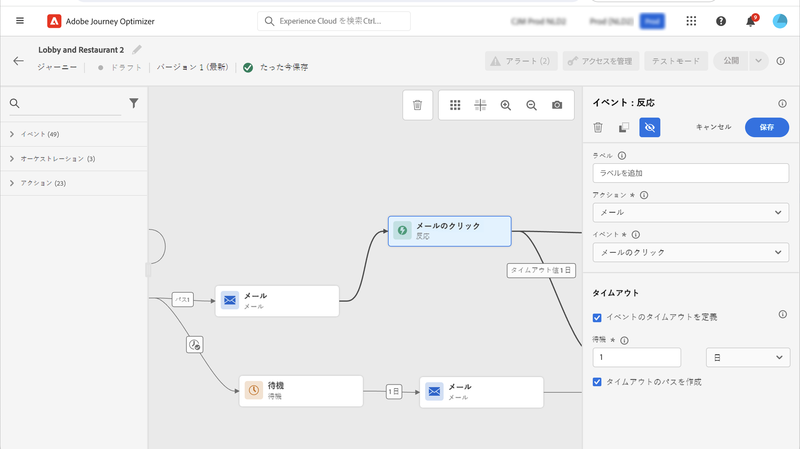

# 反力イベント {#reaction-events}

>[!CONTEXTUALHELP]
>id="ajo_journey_event_reaction"
>title="反力イベント"
>abstract="この操作によって、同じ旅で送信されたメッセージに関連するトラッキングデータに応答することができます。 この情報は、Adobe エクスペリエンスプラットフォームで共有される時点でリアルタイムに取得されます。"

「パレット」で使用可能な様々なイベント操作の中で、組み込み **[!UICONTROL Reactions]** イベントを見つけることができます。 この操作によって、同じ旅で送信されたメッセージに関連するトラッキングデータに応答することができます。 この情報は、Adobe エクスペリエンスプラットフォームで共有される時点でリアルタイムに取得されます。

クリックされたメッセージまたは開いているメッセージに応答することができます。

このメカニズムを使用して、メッセージに応答がない場合にアクションを実行することもできます。 これを行うには、反力アクティビティーに平行な第2のパスを作成し、待機アクティビティーを追加します。 Wait アクティビティーで定義されている期間中に応答がない場合は、2番目のパスが選択されます。 例えば、次のようなメッセージを送信することもできます。

その前にチャンネルアクションが必要な場合にのみ、canvas 内で反力があることに注意してください (電子メールとプッシュ)。

アクションの操作 ](../building-journeys/about-journey-activities.md#action-activities) についてを参照して [ ください。

反力イベントを設定するには、次の手順に従います。

1. **[!UICONTROL Label]**&#x200B;反応にを追加します。この手順はオプションです。
1. ドロップダウンリストから、応答を行うアクションアクティビティを選択します。 パスの前のステップで配置された操作を選択できます。
1. 選択したアクションに応じて、反応の対象を選択します。
1. イベントタイムアウトは、1 ~ 40 秒間の間で指定し、タイムアウトパスを使用することもできます。 これによって、定義された期間内に反応していないユーザーに対して、2番目のパスが作成されます。 反力イベントを使用する旅をテストする場合は、テストモード **[!UICONTROL Wait time]** のデフォルト値と最小値は40秒になります。 この項 ](../building-journeys/testing-the-journey.md) を参照してください [ 。

>[!NOTE]
>
>
>イベントの反によって、別の旅で発生するメッセージを追跡することはできません。
>
>反力イベントは、「追跡」タイプのリンクをクリックしてトラッキングします。 Unsubscription および mirror ページリンクは考慮されていません。

>[!IMPORTANT]
>
>Gmail などの電子メールクライアントを使用すると、イメージがブロックされます。 電子メールは、電子メールに含まれている0ピクセルの画像を使用して追跡されます。 イメージがブロックされている場合、電子メールは考慮されません。
