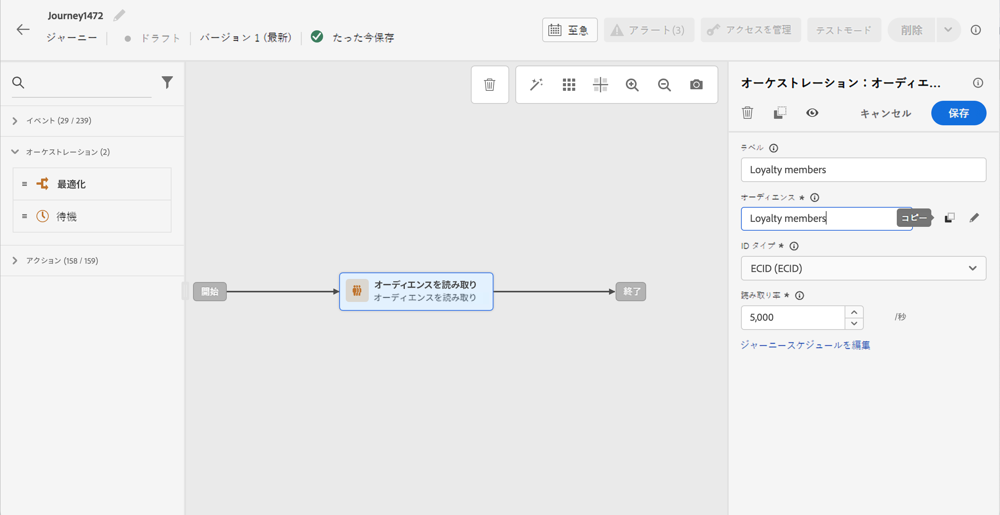
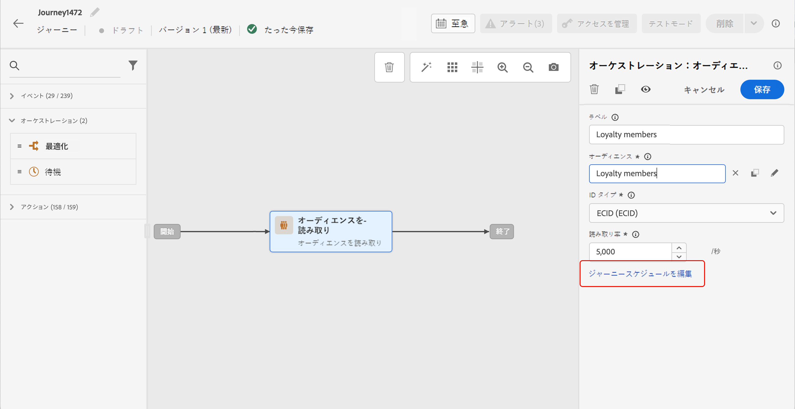
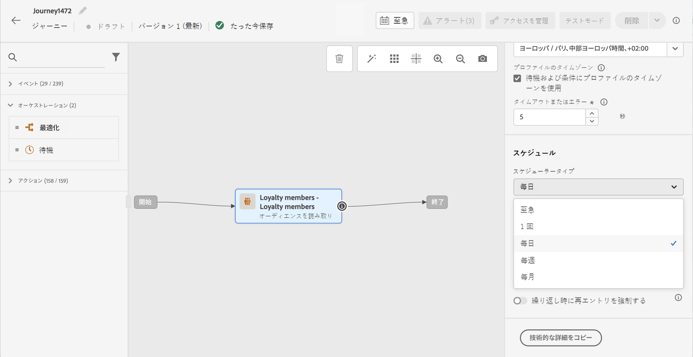
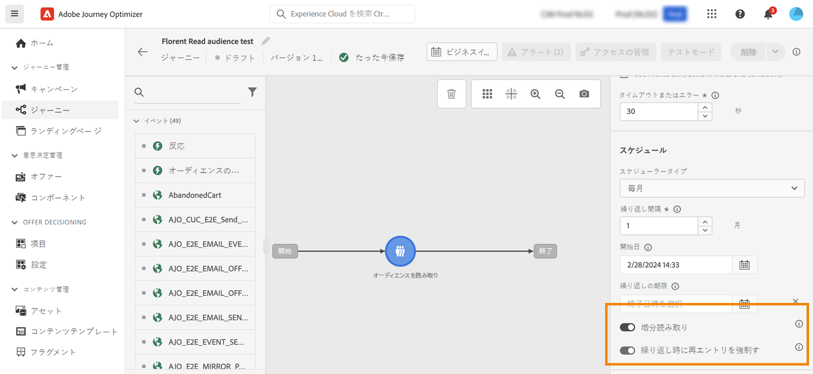
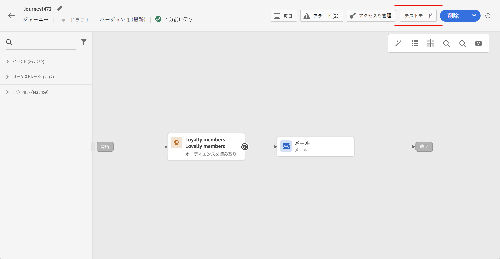
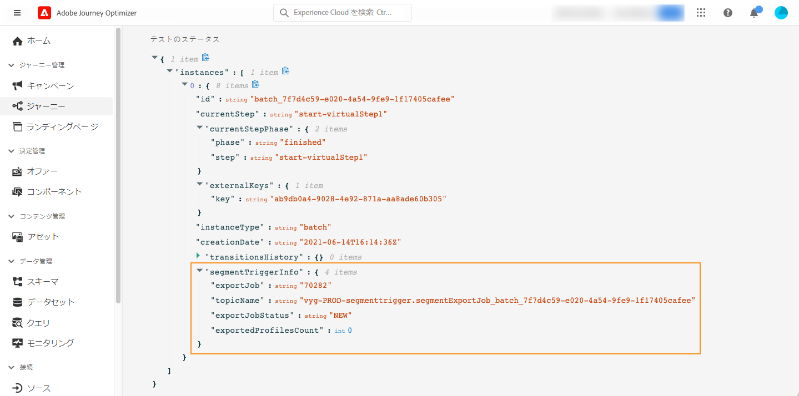
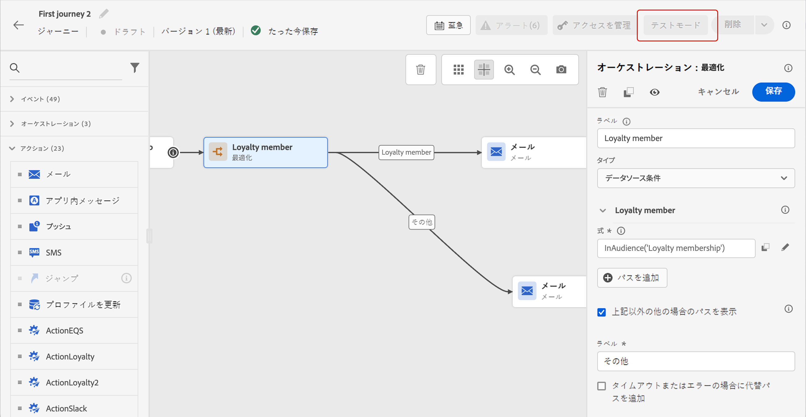
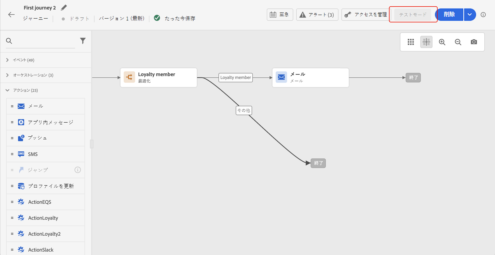
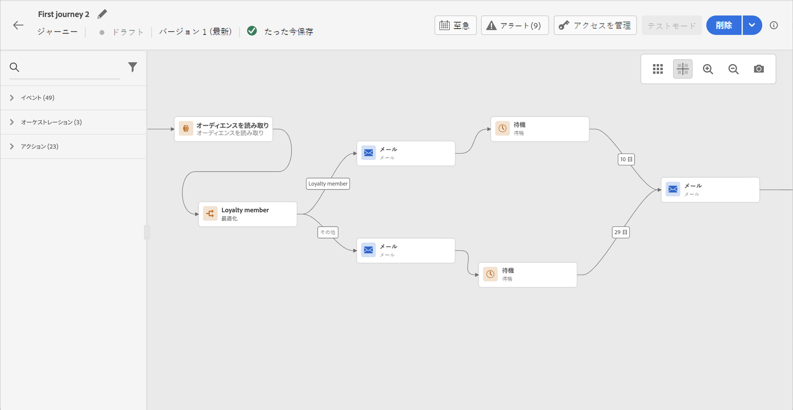

# ジャーニーでのオーディエンスの使用 {#segment-trigger-activity}

オーディエンスを読み取りアクティビティを使用すると、定義済みのオーディエンスでジャーニーを開始できます。 オーディエンスとそれが実行されるタイミングを選択し、条件、タイマー、アクションを使用して各プロファイルのパスをパーソナライズします。

## オーディエンスを読み取りアクティビティについて {#about-segment-trigger-activity}

>[!CONTEXTUALHELP]
>id="ajo_journey_read_segment"
>title="「オーディエンスを読み取り」アクティビティ"
>abstract="選択した [!DNL Adobe Experience Platform] オーディエンスのすべての認定済みプロファイルをこのジャーニーに追加します。 1 回またはスケジュールに従って実行します。"

**オーディエンスを読み取り** アクティビティは、選択したオーディエンスのすべてのプロファイルをジャーニーに追加する、ジ [!DNL Adobe Experience Platform] ーニーのエントリポイントアクティビティです。 エントリは、1 回または定期的なスケジュールで実行できます。 API およびテクニカルリファレンスでは、このアクティビティはセグメントトリガーまたはオーディエンスベースのジャーニーエントリとも呼ばれます。

**オーディエンスを読み取りとオーディエンスの選定のどちらを使用するか**

| **オーディエンスを読み取り** を使用する場合 | **[オーディエンスの選定](audience-qualification-events.md)** を使用する場合 |
|----------------------------|-----------------------------------------------------------------------|
| ジャーニーを 1 回、またはスケジュール（バッチ）に従って実行します。 | プロファイルは、選定されるたびにリアルタイムでジャーニーにエントリする必要があります。 |
| オーディエンスはバッチ評価されます（毎日のスナップショットなど）。 | オーディエンスはストリーミングまたはイベントベースです。 |
| オーディエンスの評価とジャーニーのエントリの間に遅延があっても問題ありません。 | プロファイルが適合したらすぐに入力する必要があります。 |

**キー制限：** ジャーニーごとに 1 つの読み取りオーディエンス（最初のアクティビティである必要があります）、アクティビティごとに 1 つのオーディエンス、1 組織あたり最大 5 つの同時オーディエンスの読み取り実行、サンドボックスごとに 1 秒あたり 20,000 個のプロファイル、12 時間のジョブタイムアウト。 詳しくは、[&#x200B; ガードレールと推奨事項 &#x200B;](#must-read) を参照してください。

**前提条件：** 構築および評価される [!DNL Adobe Experience Platform] オーディエンス（実現ステータス）、ジャーニー用に選択されたユーザーベースの ID 名前空間、繰り返し実行の場合 [&#x200B; スケジュールとスループットの制限 &#x200B;](#must-read) の理解。

例えば、`Luma app opening and checkout` オーディエンスを作成 [&#x200B; ユースケースで作成した &#x200B;](../audience/about-audiences.md) オーディエンスは、エントリポイントとして使用できます。 すべての認定プロファイルは、条件、タイマー、イベント、アクションを使用して、ジャーニーにエントリし、個別のパスを進めます。

➡️ [この機能をビデオで確認](#video)

>[!CAUTION]
>
>* オーディエンスを読み取りアクティビティを使用する前に、[ガードレールと制限のトピックに目を通してください](#must-read)。

## アクティビティの設定 {#configuring-segment-trigger-activity}

**オーディエンス** （必須）、**名前空間** （必須）、**読み取り率** （必須、デフォルト 5,000/s）、**スケジュール** （ジャーニーの実行時）を設定します。 必要に応じて、「**ラベル** および **補足識別子** を追加します。 次の手順では、各設定について説明します。

### アクティビティを追加してオーディエンスを選択 {#add-activity-and-select-audience}

>[!CONTEXTUALHELP]
>id="ajo_journey_read_segment_label"
>title="ラベル"
>abstract="レポートモードとテストモードのログでこのアクティビティを識別するオプションのラベル。"

>[!CONTEXTUALHELP]
>id="ajo_journey_read_segment_audience"
>title="オーディエンス"
>abstract="プロファイルがこのジャーニーにエントリする [!DNL Adobe Experience Platform] オーディエンスを選択します。"

>[!CONTEXTUALHELP]
>id="ajo_journey_read_segment_namespace"
>title="名前空間"
>abstract="ジャーニーにエントリする個人の識別に使用する ID （メール、ECID など）を選択します。 Business Rules およびキャッピングとの互換性を最大限に高めるには、リストの上位オプションを選択します。"

1. **[!UICONTROL オーケストレーション]**&#x200B;カテゴリを展開し、**[!UICONTROL オーディエンスをを読み取り]**&#x200B;アクティビティをキャンバスにドロップします。

   アクティビティは、ジャーニーの最初のステップとして配置する必要があります。

1. アクティビティに **[!UICONTROL ラベル]** を追加します（オプション）。 オプションのラベルを使用すると、レポートやテストモードのログでアクティビティを特定するのに役立ちます。

1. 「**[!UICONTROL オーディエンス]**」フィールドで、ジャーニーにエントリする [!DNL Adobe Experience Platform] オーディエンスを選択し、「**[!UICONTROL 保存]**」をクリックします。[セグメント定義](../audience/creating-a-segment-definition.md)を使用して生成された [!DNL Adobe Experience Platform] オーディエンスを選択できます。

   >[!NOTE]
   >
   >さらに、[!DNL Adobe Experience Platform] オーディエンスコンポジション [&#x200B; を使用して作成された &#x200B;](../audience/get-started-audience-orchestration.md) つのオーディエンスをターゲットにすることができます。
   >また、オーディエンスをターゲット [CSV ファイルからアップロード &#x200B;](https://experienceleague.adobe.com/docs/experience-platform/segmentation/ui/overview.html?lang=ja#import-audience){target="_blank"} することもできます。
   >[Journey Optimizer でオーディエンスを生成およびターゲットにする方法の詳細情報](../audience/about-audiences.md)。

   リストに表示される列は、カスタマイズして並べ替えることができます。

   ![&#x200B; 使用可能なオーディエンスを表示するオーディ [!DNL Adobe Experience Platform] ンス選択インターフェイス &#x200B;](assets/read-segment-selection.png)

   オーディエンスが追加されると、「**[!UICONTROL コピー]**」ボタンを使用して、オーディエンスの名前と ID をコピーできます。

   `{"name":"Luma app opening and checkout","id":"8597c5dc-70e3-4b05-8fb9-7e938f5c07a3"}`

   

   >[!NOTE]
   >
   >オーディエンスの参加ステータスが&#x200B;**適合**&#x200B;の個人のみが、ジャーニーにエントリします。オーディエンスの評価方法について詳しくは、[セグメント化サービスのドキュメント](https://experienceleague.adobe.com/docs/experience-platform/segmentation/tutorials/evaluate-a-segment.html?lang=ja#interpret-segment-results){target="_blank"}を参照してください。

1. 「**[!UICONTROL 名前空間]**」フィールドで、個人の識別に使用する名前空間を選択します。デフォルトでは、このフィールドには、最後に使用した名前空間が事前に入力されています。 [名前空間の詳細情報](../event/about-creating.md#select-the-namespace)。

   >[!NOTE]
   >
   >様々な ID の中から選択した ID（名前空間）を持たないオーディエンスに属する個人は、ジャーニーにエントリできません。ユーザーベースの ID 名前空間のみ選択できます。名前空間を参照テーブルに対して定義した場合（例：ProductID 名前空間を Product 参照に対して定義した場合）、その名前空間を&#x200B;**名前空間**&#x200B;ドロップダウンリストで使用することはできません。

### 追加の識別子 {#read-audience-supplemental-id}

必要に応じて、**追加の識別子を使用** を有効にして、プロファイル ID に加えて、セカンダリ識別子（注文 ID、予約 ID など）のコンテキストでジャーニーを実行できます。 これにより、追加の識別子が異なる場合に、同じプロファイルの複数のエントリが可能になります。

[&#x200B; ジャーニーで追加の識別子を使用する方法を説明します &#x200B;](supplemental-identifier.md)。 オーディエンスを読み取りジャーニーの場合、追加の識別子はプロファイル属性である必要があります。追加の ID を使用すると、読み取り速度は 1 秒あたり 500 プロファイルに制限されます。

### ガードレールとレコメンデーション {#must-read}

* ジャーニーで使用できる&#x200B;**[!UICONTROL オーディエンスを読み取り]**&#x200B;アクティビティは 1 つだけで、それをキャンバスの最初のアクティビティにする必要があります。

* **[!UICONTROL オーディエンスを読み取り]**&#x200B;アクティビティのターゲットにできるオーディエンスは 1 つだけです。複数のオーディエンスが必要な場合は、使用前に、それらのオーディエンスを 1 つのオーディエンスに結合することを検討してください。[構成ワークフローを使用してオーディエンスを結合する方法については、こちらを参照してください](../audience/get-started-audience-orchestration.md)

* **オーディエンスを読み取り**&#x200B;アクティビティを使用するジャーニーの場合、同時に開始できるジャーニーの最大数が決まっています。再試行は、システムによって実行されます。ただし、5 つを超えるジャーニー（**オーディエンスを読み取り**、スケジュール済み、または「できるだけ早く」開始）が同時に開始されることは避けてください。ベストプラクティスは、時間の経過と共に、5 分から 10 分の間隔で分散することです。

* エクスペリエンスイベントのフィールドグループは、**オーディエンスを読み取り**&#x200B;アクティビティ、**[オーディエンスの選定](audience-qualification-events.md)**&#x200B;アクティビティ、またはビジネスイベントアクティビティで始まるジャーニーでは使用できません。

* ベストプラクティスとして、バッチオーディエンスは、**オーディエンスを読み取り**&#x200B;アクティビティでのみ使用することをお勧めします。これにより、ジャーニーで使用されるオーディエンスが、高い信頼性かつ一貫してカウントされます。「オーディエンスを読み取り」は、バッチのユースケース向けに設計されています。ユースケースでリアルタイムデータが必要な場合は、**[オーディエンスの選定](audience-qualification-events.md)**&#x200B;アクティビティを使用します。

* [CSV ファイルから読み込まれた](https://experienceleague.adobe.com/docs/experience-platform/segmentation/ui/overview.html?lang=ja#import-audience)オーディエンスや、[構成ワークフロー](../audience/get-started-audience-orchestration.md)から生成されたオーディエンスは、「**オーディエンスを読み取り**」アクティビティで選択できます。これらのオーディエンスは、「**オーディエンスの選定**」アクティビティでは使用できません。

* 組織ごとのオーディエンス同時読み取り制限：各組織はオーディエンスの読み取りインスタンスを最大 5 つ同時に実行できます。これには、スケジュールされた実行とビジネスイベントによってトリガーされる実行の両方が含まれます。制限は、すべてのサンドボックスとジャーニーをまたいで適用されます。この制限は、すべての組織で公平かつバランスの取れたリソース配分が確保するのに適用されます。

* サンドボックススループット管理：システムは、サンドボックスごとの処理スループットを動的に管理し、すべてのオーディエンス読み取りアクティビティで共有されるプロファイル数の上限は 1 秒あたり 20,000 個です。個々のオーディエンス読み取りアクティビティは、1 秒あたり最低 500 個のプロファイルで設定できます。サンドボックスレベルのスループット制限に達した場合、公正なリソース割り当てを確保するために、ジョブをキューに追加することができます。

* ジョブ処理タイムアウト：ガードレールの制限により 12 時間以内に処理できないオーディエンス読み取りジョブは、自動的にクリーンアップされ、実行されなくなります。これにより、ジョブの蓄積を防ぎ、システムの安定性が確保されます。

* バッチセグメントを使用する場合は、ジャーニーが開始する前に、取り込みと毎日のスナップショットの更新が適切に完了していることを確認します。セグメントが同じ日に取り込まれたデータを反映する必要がある場合は、追加の待機期間を考慮します。即時プロファイルの鮮度が重要である場合は、毎日のバッチアプローチの代わりにイベントベースまたはストリーミングアプローチを使用します。または、待機メカニズムを挿入して、ジャーニーの評価の前に生成する更新済みのデータを許可します。

「**オーディエンスを読み取り**」アクティビティに関連するガードレールについて詳しくは、[このページ](../start/guardrails.md#read-segment-g)を参照してください。

>[!CAUTION]
>
>[リアルタイム顧客プロファイルデータとセグメント化のガードレール](https://experienceleague.adobe.com/docs/experience-platform/profile/guardrails.html?lang=ja){target="_blank"}は、[!DNL Adobe Journey Optimizer] にも適用されます。

**次：** [&#x200B; 読み取り率 &#x200B;](#profile-entry-and-reading-rate) と [&#x200B; スケジュール &#x200B;](#schedule) を設定し、[&#x200B; テストして公開 &#x200B;](#testing-publishing) を設定します。

### プロファイルのエントリと読み取り率 {#profile-entry-and-reading-rate}

>[!CONTEXTUALHELP]
>id="ajo_journey_read_segment_reading_rate"
>title="読み取り率"
>abstract="1 秒あたりにジャーニーにエントリするプロファイルの最大数（500 ～ 20,000）。 初期設定は 5,000 です。"

**[!UICONTROL 読み取り率]** を設定します（必須）。 これは、1 秒あたりにジャーニーにエントリできるプロファイルの最大数です。このレートは、このアクティビティにのみ適用され、ジャーニーの他のアクティビティには適用されません。例えば、カスタムのアクションに対してスロットルレートを定義する場合は、Throttling API を使用する必要があります。この[ページ](../configuration/throttling.md)を参照してください。

この値は、ジャーニーバージョンのペイロードに格納されます。デフォルト値は、1 秒あたり 5,000 プロファイルです。この値は、1 秒あたり 500～20,000 プロファイルの範囲で変更できます。

>[!NOTE]
>
>サンドボックスあたりの全体的な読み取り率は、1 秒あたり 20,000 プロファイルに設定されています。したがって、同じサンドボックスで同時に実行されるすべての「オーディエンスを読み取り」の読み取り率は、合計で 1 秒あたり最大 20,000 プロファイルになります。このキャップは変更できません。ジャーニーの処理率とスループットについて詳しくは、[この節](entry-management.md#journey-processing-rate)を参照してください。

### ジャーニーのスケジュール {#schedule}

>[!CONTEXTUALHELP]
>id="ajo_journey_read_segment_scheduler_start_date"
>title="開始日時"
>abstract="このジャーニーをいつ開始するかを定義します。"

>[!CONTEXTUALHELP]
>id="ajo_journey_read_segment_scheduler_repeat_until"
>title="繰り返しの期限"
>abstract="繰り返し実行の終了日を定義します。"

>[!CONTEXTUALHELP]
>id="ajo_journey_read_segment_scheduler_repeat_every"
>title="繰り返し間隔"
>abstract="ジャーニーの実行頻度（毎日、毎週など）。"

>[!CONTEXTUALHELP]
>id="ajo_journey_read_segment_scheduler_incremental_read"
>title="増分読み取り"
>abstract="最初の実行後、オーディエンスに追加された新しいプロファイルのみがジャーニーにエントリします。"

>[!CONTEXTUALHELP]
>id="ajo_journey_read_segment_scheduler_force_reentrance"
>title="再エントリを強制する"
>abstract="新しいオーディエンスが読み取られる前に、ジャーニーのすべての参加者をクリアします。"

>[!CONTEXTUALHELP]
>id="ajo_journey_read_segment_scheduler_synchronize_audience"
>title="バッチオーディエンス評価の後にトリガー"
>abstract="バッチオーディエンスが新たに評価された後にのみジャーニーを実行します。"

>[!CONTEXTUALHELP]
>id="ajo_journey_read_segment_scheduler_synchronize_audience_wait_time"
>title="新しいオーディエンス評価の待機時間"
>abstract="ジャーニーが新しいオーディエンスデータを待つ時間（1～6 時間、分または時間）。"

デフォルトでは、ジャーニーは 1 回実行されるように設定されています。ジャーニーを実行する特定の日付／時刻と頻度を定義するには、次の手順に従います。

>[!NOTE]
>
>1 回限りの「オーディエンスを読み取り」ジャーニーは、ジャーニーの実行から 91 日（[ジャーニーグローバルタイムアウト](journey-properties.md#global_timeout)）後に&#x200B;**完了**&#x200B;ステータスに移行します。スケジュールされた「オーディエンスを読み取り」の場合は、最後の実行から 91 日後になります。

1. **[!UICONTROL オーディエンスを読み取り]**&#x200B;アクティビティのプロパティで、「**[!UICONTROL ジャーニースケジュールを編集]**」を選択します。

   

1. ジャーニーのプロパティが表示されます。**[!UICONTROL スケジューラータイプ]**&#x200B;ドロップダウンリストで、ジャーニーを実行する頻度を選択します。

   

>[!TIP]
>
>アウトバウンドメッセージを一度にすべてではなく、バッチで時間をかけて配信するには、ジャーニースケジュールでウェーブ送信を設定します。 [&#x200B; ジャーニーでウェーブを使用して送信する方法を説明します &#x200B;](send-using-waves.md)

繰り返しジャーニーの場合は、ジャーニーへのプロファイルのエントリを管理するのに役立つ特定のオプションを使用できます。各オプションについて詳しくは、以下の節を展開してください。

+++**[!UICONTROL 増分読み取り]**

繰り返しの&#x200B;**オーディエンスを読み取り**&#x200B;を含んだジャーニーが初めて実行されると、オーディエンス内のすべてのプロファイルがジャーニーにエントリします。このオプションを使用すると、最初の実行後、ジャーニーの前回の実行以降にオーディエンスにエントリした個人のみをターゲットにすることができます。

このオプションを使用すると、システムは [!DNL Adobe Experience Platform] のセグメント化サービスによって実行された前回のオーディエンス評価ジョブの時点から **24 時間**&#x200B;前まで遡って確認します。

セグメント化が完了すると、プロファイルスナップショットのエクスポートジョブが開始され、Journey Optimizer が新しいプロファイルを検出して処理できるようになります。これらの 2 つのジョブの間にジャーニーがスケジュールされている場合、増分読み取りでは、ジャーニーの前回の実行以降にオーディエンスのメンバーになったプロファイルは取得されません。

プロファイルが欠落するリスクを最小限に抑えるには：
* 「**[!UICONTROL バッチオーディエンス評価の後にトリガー]**」オプションを有効にすると、発生した経過時間に関係なく、最後に成功したジャーニー実行時までルックバック期間を延長できます
* 毎日のバッチセグメント化ジョブが完了した後にジャーニーが適切に実行されるようにスケジュールします（通常 2～3 時間のバッファー）
* すぐにプロファイルを組み込む必要がある緊急のユースケースでは、代わりにストリーミングオーディエンスでの[オーディエンスの選定](audience-qualification-events.md)アクティビティの使用を考慮します

>[!CAUTION]
>
>ジャーニーで [&#x200B; カスタムアップロードオーディエンス &#x200B;](../audience/about-audiences.md#about-segments) をターゲットにしている場合、プロファイルは、繰り返しジャーニーでこのオプションが有効になっている場合の最初の繰り返し時にのみ取得されます。 これらのオーディエンスは固定されています。

+++

+++**[!UICONTROL 繰り返し時に再エントリを強制する]**

このオプションを使用すると、ジャーニーにまだ存在するすべてのプロファイルを、次回の実行時に自動的に終了させることができます。

例えば、毎日の繰り返しジャーニーに 2 日間の待機がある場合、このオプションを有効にすると、プロファイルは次のジャーニーの実行に移動します。 これは、次回実行されるオーディエンスに含まれているかどうかに関係なく、翌日に発生します。

このジャーニーでのプロファイルの存続期間が繰り返し頻度よりも長くなる可能性がある場合は、プロファイルがジャーニーを終了できるようにするために、このオプションをアクティブ化しないでください。

+++

+++**[!UICONTROL バッチオーディエンス評価の後にトリガー]**

毎日スケジュールされ、バッチオーディエンスをターゲティングするジャーニーの場合、バッチセグメント化ジョブからの新しいオーディエンスデータを待機するジャーニーの時間枠を最大 6 時間まで定義できます。セグメント化ジョブが時間枠内に完了すると、ジャーニーがトリガーされます。それ以外の場合は、次回の実行までジャーニーはスキップされます。このオプションにより、正確かつ最新のオーディエンスデータを使用してジャーニーが実行されます。

例えば、毎日午後 6 時にジャーニーがスケジュールされている場合、ジャーニーの実行前に待機する分数または時間数を指定できます。午後 6 時にジャーニーが起動すると、新しいオーディエンス、つまり前回のジャーニー実行時に使用されたオーディエンスよりも新しいオーディエンスがないか確認します。指定した時間枠内で、新しいオーディエンスが検出されるとすぐにジャーニーが実行されます。新しいオーディエンスが検出されない場合、その日のジャーニーの実行はスキップされます。

+++

<!--

### Segment filters {#segment-filters}

[!CONTEXTUALHELP]
>id="jo_segment_filters"
>title="About segment filters"
>abstract="You can choose to target only the individuals who entered or exited a specific segment during a specific time window. For example, you can decide to only retrieve all the customers who entered the VIP segment since last week."

You can choose to target only the individuals who entered or exited a specific segment during a specific time window. For example, you can decide to only retrieve all the customers who entered the VIP segment since last week. Only the new VIP customers will be targeted. All the customers who were already part of the VIP segment before will be excluded.

To activate this mode, click the **Segment Filters** toggle. Two fields are displayed:

**Segment membership**: choose whether you want to listen to segment entrances or exits. 

**Lookback window**: define when you want to start to listen to entrances or exits. This lookback window is expressed in hours, starting from the moment the journey is triggered.  If you set this duration to 0, the journey will target all members of the segment. For recurring journeys, it will take into account all entrances/exits since the last time the journey was triggered.

-->

## ジャーニーのテストと公開 {#testing-publishing}

**[!UICONTROL オーディエンスを読み取り]**&#x200B;アクティビティを使用すると、単一プロファイルでジャーニーをテストできます。

それには、テストモードを有効にします。

通常どおりにテストモードを設定し実行します。[ジャーニーのテスト方法を学ぶ](testing-the-journey.md)。

テストを実行したら、「**[!UICONTROL ログを表示]**」ボタンを使用して、テスト結果を確認できます。詳しくは、[この節](testing-the-journey.md#viewing_logs)を参照してください。

テストが正常に完了すると、ジャーニーを公開できます（[ジャーニーの公開](../building-journeys/publish-journey.md)を参照）。オーディエンスに属する個人は、ジャーニーのプロパティの「**[!UICONTROL スケジューラー]**」セクションで指定された日時にジャーニーにエントリします。

>[!NOTE]
>
>繰り返しのオーディエンスベースジャーニーの場合、ジャーニーは、最後の実行が完了すると自動的にクローズします。終了日時が指定されていない場合は、新しいエントリに対するジャーニーを手動でクローズして終了する必要があります。

## ジャーニーでのオーディエンスのターゲティング

オーディエンスベースのジャーニーは常に、オーディエンスに属する個人を取得する **オーディ** ンスを読み取り [!DNL Adobe Experience Platform] アクティビティで開始します。 これらのプロファイルは、1 回または定期的に読み取られます。

ジャーニーにエントリした後は、**条件** アクティビティを使用して調整します。属性または動作によるセグメント化、母集団の一部の除外、分岐の再マージ（和集合）などです。 以下の節では、各パターンについて説明します。

**セグメント化**

条件を使用して、**条件**&#x200B;アクティビティでセグメント化を実行できます。例えば、VIP 顧客は特定のパス、VIP 以外の顧客は別のパスに沿って進むようにすることができます。

セグメント化は以下に基づいて実行できます。

* データソースのデータ
* ジャーニーデータのイベント部分のコンテキスト（例：ある人物が 1 時間前に受け取ったメッセージをクリックしたか）
* 日付（例：ある人物がジャーニーを経験したのは 6 月だったか？）。
* 時間（例：その人物のタイムゾーンで午前中か？）
* ジャーニーに流入するオーディエンスを割合に基づいて分割するアルゴリズム（例：90% - 10%、コントロール母集団を除外）

>[!NOTE]
>
>**[!UICONTROL オーディエンスを読み取り]**&#x200B;アクティビティで「毎日」のスケジューラータイプを使用する場合、新しいオーディエンスデータを待機するジャーニーの時間枠を定義できます。これにより、正確なターゲティングが確保され、バッチセグメント化ジョブの遅延によって発生する問題を防ぐことができます。[詳しくは、ジャーニーのスケジュール方法を参照してください](#schedule)

**除外**

セグメント化に使用するのと同じ&#x200B;**条件**&#x200B;アクティビティ（上記を参照）を使用すると、母集団の一部を除外することもできます。例えば、VIP を除外するには、そのユーザーを終了ステップ直前の分岐に送ります。

この除外は、母集団のカウントを目的として、または複数のステップから成るジャーニーに従って、オーディエンスの取得直後に発生する可能性があります。

**和集合**

ジャーニーを使用すると、セグメント化の後に、N 個の分岐を作成および結合できます。その結果、2 つのオーディエンスを同じエクスペリエンスに戻すことができます。

例えば、VIP の顧客と VIP 以外の顧客は、ジャーニーで 10 日間別々のエクスペリエンスを経た後で、同じパスに戻ることができます。結合した後、セグメント化や除外を実行してオーディエンスを再度分割できます。

## トラブルシューティング {#audience-count-mismatch}

このセクションは、**オーディエンスサイズの不一致** （エントリするプロファイルが予想よりも少ないか多い）、**プロファイルが処理済み** （オーディエンスアラートを読み取るか、エントリがない）、および **エントリの遅延または欠落** （タイミングとデータの伝達）を解決するのに役立ちます。

>[!NOTE]
>
>オーディエンスを読み取りアクティビティを実行すると、システムではオーディエンスの書き出し操作のライフサイクルを追跡する内部イベント（`segmentExportJob` イベントと呼ばれる）が生成されます。これらのイベントは、個々のプロファイルごとではなく、アクティビティレベルで記録され、監視やトラブルシューティングの目的でクエリを実行できます。詳しくは、[オーディエンスを読み取りイベントのクエリ](../reports/query-examples.md#read-segment-queries)を参照してください。

**イシューを検索：**

| 症状 | に移動 |
|---------|--------|
| オーディエンスサイズよりも少ない（または多くの）プロファイルを入力 | [&#x200B; タイミングとデータ伝播 &#x200B;](#timing-and-data-propagation)、[&#x200B; データの検証と監視 &#x200B;](#data-validation-and-monitoring) |
| 処理されたプロファイルがゼロのオーディエンスを読み取り、アラートを発生 | [&#x200B; 処理済みのプロファイルがゼロ &#x200B;](#zero-profiles-processed) |
| バッチオーディエンスのエントリが遅延しているか、見つからない | [&#x200B; タイミングとデータの伝播 &#x200B;](#timing-and-data-propagation) |
| セグメントジョブのステータスまたは名前空間を確認する必要があります | [&#x200B; データの検証と監視 &#x200B;](#data-validation-and-monitoring) |

### 処理済みのプロファイルがゼロ {#zero-profiles-processed}

**オーディエンスを読み取り** アクティビティでプロファイルが処理されていない場合（例：[&#x200B; オーディエンスを読み取りアラート &#x200B;](../reports/alerts.md#alert-read-audiences) が表示された場合）:

1. **オーディエンスが空かどうかを確認** - [!DNL Adobe Experience Platform] で、オーディエンスサイズとプロファイルが **実現済み** ステータスであることを確認します。 空のオーディエンスや評価されていないオーディエンスの場合、エントリはゼロになります。
2. **名前空間を確認** - オーディエンスを読み取りアクティビティで選択した名前空間は、オーディエンスのプロファイルに存在する必要があります。 その ID を持たないプロファイルは、ジャーニーにエントリできません。 [名前空間の詳細情報](../event/about-creating.md#select-the-namespace)。
3. **アラートと再試行の確認** - エラーは **アラート** で報告されます。 エクスポートジョブの作成は、最大 1 時間、10 分ごとに再試行されます。 [&#x200B; 再試行とアラートの詳細情報 &#x200B;](#read-audience-retry)。

これらのチェック後も問題が解決しない場合は、バッチおよび設定の原因に関する [&#x200B; タイミングとデータの伝播 &#x200B;](#timing-and-data-propagation) および [&#x200B; データの検証と監視 &#x200B;](#data-validation-and-monitoring) を参照してください。

### タイミングとデータの生成 {#timing-and-data-propagation}

* **バッチセグメント化ジョブの完了**：バッチオーディエンスの場合、ジャーニーを実行する前に、毎日のバッチセグメント化ジョブが完了し、スナップショットが更新されていることを確認します。バッチオーディエンスは、セグメント化ジョブの完了から約 **2 時間**&#x200B;後に使用できます。詳しくは、[オーディエンスの評価方法](https://experienceleague.adobe.com/docs/experience-platform/segmentation/home.html?lang=ja#evaluate-segments){target="_blank"}を参照してください。

* **データ取り込みのタイミング**：ジャーニーの実行前にプロファイルデータ取り込みが完全に完了していることを確認します。プロファイルがジャーニーの開始直前に取り込まれた場合、まだオーディエンスに反映されていないことがあります。詳しくは、[&#x200B; のデータ取り込み  [!DNL Adobe Experience Platform]](https://experienceleague.adobe.com/docs/experience-platform/ingestion/home.html?lang=ja){target="_blank"} を参照してください。

* **「バッチオーディエンス評価の後にトリガー」を使用**：バッチオーディエンスを使用する毎日のスケジュール済みジャーニーの場合は、「**[!UICONTROL バッチオーディエンス評価の後にトリガー]**」オプションを有効にすることを考慮します。これにより、ジャーニーは実行される前に最新のオーディエンスデータ（最大 6 時間）を待機するようになります。 [詳しくは、スケジュール設定を参照してください。](#schedule)

* **待機アクティビティを追加**：最近取り込まれたデータを持つストリーミングオーディエンスの場合は、データの生成とプロファイルの選定の時間を確保するために、ジャーニーの開始時に&#x200B;**待機**&#x200B;アクティビティを追加することを考慮します。[待機アクティビティの詳細情報](wait-activity.md)

### データの検証 {#data-validation-and-monitoring}

* **セグメント化ジョブのステータスの確認**:[!DNL Adobe Experience Platform] [&#x200B; 監視ダッシュボード &#x200B;](https://experienceleague.adobe.com/docs/experience-platform/dataflows/ui/monitor-segments.html?lang=ja){target="_blank"} でバッチセグメント化ジョブの完了時間を監視します。 オーディエンスデータの準備が整ったタイミングを確認するために使用します。

* **結合ポリシーを確認**：オーディエンスに対して設定された結合ポリシーが、異なるソースからのプロファイルデータを組み合わせる場合の予想される動作と一致していることを確認します。詳しくは、[&#x200B; の結合ポリシー  [!DNL Adobe Experience Platform]](https://experienceleague.adobe.com/docs/experience-platform/profile/merge-policies/overview.html?lang=ja){target="_blank"} を参照してください。

* **セグメント定義を確認**：セグメント定義が正しく設定され、予想されるすべての選定条件が含まれていることを確認します。詳しくは、[オーディエンスの作成](../audience/creating-a-segment-definition.md)を参照してください。特に注意すべき点：
   * イベントのタイムスタンプに基づいてプロファイルを除外する場合がある時間ベースの条件
   * 最近更新されたデータに依存する属性の選定
   * ストリーミングとバッチの評価方法

* **名前空間の設定を検証**：**オーディエンスを読み取り**&#x200B;アクティビティで選択された名前空間が、オーディエンス内のプロファイルで使用されるプライマリ ID と一致していることを確認します。選択された名前空間のないプロファイルは、ジャーニーにエントリしません。詳しくは、[ID 名前空間](../event/about-creating.md#select-the-namespace)を参照してください。

### ベストプラクティス

* **セグメント化の後にジャーニーをスケジュール**：バッチオーディエンスの場合、通常のバッチセグメント化ジョブの完了時間から 2～3 時間以上後にジャーニーの実行をスケジュールします。[ジャーニーのスケジュールの詳細情報](#schedule)

* **リアルタイムのユースケースにストリーミングオーディエンスを使用**：即時のプロファイルの選定とジャーニーのエントリが必要な場合は、バッチオーディエンスでの&#x200B;**オーディエンスを読み取り**&#x200B;の代わりに、ストリーミングオーディエンスで[オーディエンスの選定](audience-qualification-events.md)アクティビティを使用します。

* **最初に小規模なオーディエンスでテスト**：大規模なジャーニーを開始する前に、小規模なサブセットでテストして、カウントが期待値と一致することを検証します。[ジャーニーのテスト方法の詳細情報](testing-the-journey.md)

* **定期的に監視**：オーディエンスサイズとジャーニーエントリ指標の定期的な監視を設定し、不一致を早期に検出します。詳しくは、[ジャーニーの処理率とエントリ管理](entry-management.md)を参照してください。

### サポートに連絡するタイミング

カウントが一致しない、またはプロファイルがゼロの実行が上記の手順に従った後も保持される場合は、[Adobe サポートにお問い合わせください &#x200B;](../start/user-interface.md#support-ticket-guidelines)。 準備ができている：オーディエンス名/ID、ジャーニー名/ID、スケジュールされた実行時間、サンドボックスおよび不一致の簡単な説明（例：「オーディエンスは 10,000 件実現を示し、[ 日付 ]」にジャーニーにエントリしたのは 2,000 件のみ）。

## 再試行 {#read-audience-retry}

再試行は、エクスポートジョブの取得中に、オーディエンストリガージャーニー（**オーディエンスを読み取り**&#x200B;または&#x200B;**ビジネスイベント**&#x200B;で始まる）にデフォルトで適用されます。エクスポートジョブの作成中にエラーが発生した場合、最大 1 時間、10 分ごとに再試行が行われます。それ以降は失敗と見なされます。したがって、これらのタイプのジャーニーは、スケジュールされた時間から最大 1 時間後に実行できます。

失敗した **オーディエンスを読み取り**&#x200B;トリガーはキャプチャされ、**アラート** に表示されます。 **オーディエンスを読み取り** アラートは、**オーディエンスを読み取り** アクティビティが、スケジュールされた実行時間から 10 分後にプロファイルを処理していない場合、警告を表示します。 このエラーは、技術的な問題や空のオーディエンスが原因で発生する可能性があります。 技術的な問題が原因でエラーが発生した場合でも、問題のタイプによっては、再試行が行われることがあります。 例えば、エクスポートジョブの作成に失敗した場合は、10 分ごとに最大 1 時間再試行します。 [詳細情報](../reports/alerts.md#alert-read-audiences)

## 関連トピック

* [オーディエンスを作成](../audience/about-audiences.md)
* [オーディエンスの選定アクティビティ](audience-qualification-events.md)
* [ジャーニーの補足識別子の使用](supplemental-identifier.md)
* [ジャーニーのプロパティとガードレール](../start/guardrails.md#read-segment-g)
* [ジャーニーの処理率と入力管理](entry-management.md)
* [ジャーニーのテスト](testing-the-journey.md)
* [ジャーニーの公開](../building-journeys/publish-journey.md)

## チュートリアルビデオ {#video}

「オーディエンスを読み取り」アクティビティによってトリガーされるジャーニーに適用可能なユースケースを理解します。バッチベースのジャーニーを構築する方法と適用するベストプラクティスについて説明します。

>[!VIDEO](https://video.tv.adobe.com/v/3424997?quality=12)
