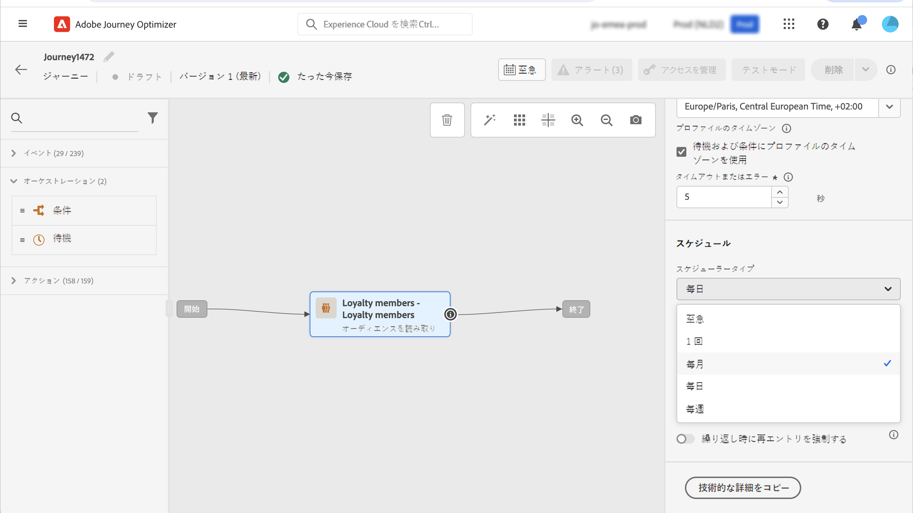
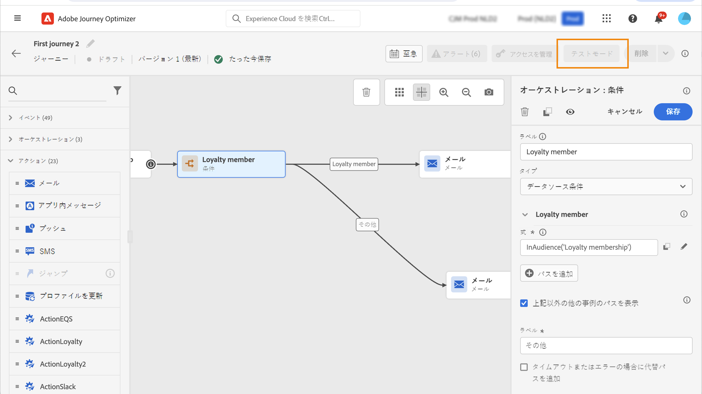

# ジャーニーでのオーディエンスの使用 {#segment-trigger-activity}

## オーディエンスを読み取りアクティビティについて {#about-segment-trigger-actvitiy}

>[!CONTEXTUALHELP]
>id="ajo_journey_read_segment"
>title="「オーディエンスを読み取り」アクティビティ"
>abstract="オーディエンスを読み取りアクティビティを使用すると、[!DNL Adobe Experience Platform] オーディエンスに属するすべての個人をジャーニーにエントリさせることができます。ジャーニーへのエントリは、1 回限りと定期的のいずれも可能です。"

**オーディエンスを読み取り**&#x200B;アクティビティを使用すると、オーディエンスのすべての個人をジャーニーにエントリさせることができます。ジャーニーへのエントリは、1 回限りと定期的のいずれも可能です。

[オーディエンスの作成](../audience/about-audiences.md)ユースケースで作成した「Luma アプリのオープンとチェックアウト」オーディエンスを例に取ります。オーディエンスを読み取りアクティビティを使用すると、このオーディエンスに属するすべての個人をジャーニーにエントリさせることができます。これらは、条件、タイマー、イベント、アクションなど、すべてのジャーニー機能を活用する個別のジャーニーにフローされます。

➡️ [この機能について詳しくは、ビデオを参照してください。](#video)

>[!NOTE]
>
>オーディエンスを読み取りアクティビティを実行すると、システムではオーディエンスの書き出し操作のライフサイクルを追跡する内部イベント（`segmentExportJob` イベントと呼ばれる）が生成されます。これらのイベントは、個々のプロファイルごとではなく、アクティビティレベルで記録され、監視やトラブルシューティングの目的でクエリを実行できます。詳しくは、[オーディエンスを読み取りイベントのクエリ](../reports/query-examples.md#read-segment-queries)を参照してください。

>[!CAUTION]
>
>* オーディエンスを読み取りアクティビティを使用する前に、[ガードレールと制限のトピックに目を通してください](#must-read)。

## アクティビティの設定 {#configuring-segment-trigger-activity}

オーディエンスを読み取りアクティビティを設定する手順は、次のとおりです。

### オーディエンスを読み取りアクティビティを追加し、オーディエンスを選択します

1. **[!UICONTROL オーケストレーション]**&#x200B;カテゴリを展開し、**[!UICONTROL オーディエンスをを読み取り]**&#x200B;アクティビティをキャンバスにドロップします。

   アクティビティは、ジャーニーの最初のステップとして配置する必要があります。

1. アクティビティに&#x200B;**[!UICONTROL ラベル]**&#x200B;を追加します（オプション）。

1. 「**[!UICONTROL オーディエンス]**」フィールドで、ジャーニーにエントリする [!DNL Adobe Experience Platform] オーディエンスを選択し、「**[!UICONTROL 保存]**」をクリックします。[セグメント定義](../audience/creating-a-segment-definition.md)を使用して生成された [!DNL Adobe Experience Platform] オーディエンスを選択できます。

   >[!NOTE]
   >
   >また、[オーディエンス構成](../audience/get-started-audience-orchestration.md)または [CSV ファイルからアップロード済み](https://experienceleague.adobe.com/docs/experience-platform/segmentation/ui/overview.html?lang=ja#import-audience){target="_blank"}を使用して作成された [!DNL Adobe Experience Platform] オーディエンスをターゲットにすることもできます。[Journey Optimizer でオーディエンスを生成およびターゲットにする方法の詳細情報](../audience/about-audiences.md)。

   リストに表示される列は、カスタマイズして並べ替えることができます。

   

   オーディエンスが追加されると、「**[!UICONTROL コピー]**」ボタンを使用して、オーディエンスの名前と ID をコピーできます。

   `{"name":"Luma app opening and checkout","id":"8597c5dc-70e3-4b05-8fb9-7e938f5c07a3"}`

   

   >[!NOTE]
   >
   >オーディエンスの参加ステータスが&#x200B;**適合**&#x200B;の個人のみが、ジャーニーにエントリします。オーディエンスの評価方法について詳しくは、[セグメント化サービスのドキュメント](https://experienceleague.adobe.com/docs/experience-platform/segmentation/tutorials/evaluate-a-segment.html?lang=ja#interpret-segment-results){target="_blank"}を参照してください。

1. 「**[!UICONTROL 名前空間]**」フィールドで、個人の識別に使用する名前空間を選択します。デフォルトでは、このフィールドには、最後に使用した名前空間が事前に入力されています。 [名前空間の詳細情報](../event/about-creating.md#select-the-namespace)。

   >[!NOTE]
   >
   >様々な ID の中から選択した ID（名前空間）を持たないオーディエンスに属する個人は、ジャーニーにエントリできません。ユーザーベースの ID 名前空間のみ選択できます。名前空間を参照テーブルに対して定義した場合（例：ProductID 名前空間を Product 参照に対して定義した場合）、その名前空間を&#x200B;**名前空間**&#x200B;ドロップダウンリストで使用することはできません。

### ガードレールとレコメンデーション {#must-read}

* ジャーニーで使用できる&#x200B;**[!UICONTROL オーディエンスを読み取り]**&#x200B;アクティビティは 1 つだけで、それをキャンバスの最初のアクティビティにする必要があります。

* **[!UICONTROL オーディエンスを読み取り]**&#x200B;アクティビティのターゲットにできるオーディエンスは 1 つだけです。複数のオーディエンスが必要な場合は、使用前に、それらのオーディエンスを 1 つのオーディエンスに結合することを検討してください。[構成ワークフローを使用してオーディエンスを結合する方法については、こちらを参照してください](../audience/get-started-audience-orchestration.md)

* **オーディエンスを読み取り**&#x200B;アクティビティを使用するジャーニーの場合、同時に開始できるジャーニーの最大数が決まっています。再試行は、システムによって実行されます。ただし、5 つを超えるジャーニー（**オーディエンスを読み取り**、スケジュール済み、または「できるだけ早く」開始）が同時に開始されることは避けてください。ベストプラクティスは、時間の経過と共に、5 分から 10 分の間隔で分散することです。

* エクスペリエンスイベントのフィールドグループは、**オーディエンスを読み取り**&#x200B;アクティビティ、**[オーディエンスの選定](audience-qualification-events.md)**&#x200B;アクティビティ、またはビジネスイベントアクティビティで始まるジャーニーでは使用できません。

* ベストプラクティスとして、バッチオーディエンスは、**オーディエンスを読み取り**&#x200B;アクティビティでのみ使用することをお勧めします。これにより、ジャーニーで使用されるオーディエンスが、高い信頼性かつ一貫してカウントされます。「オーディエンスを読み取り」は、バッチのユースケース向けに設計されています。ユースケースでリアルタイムデータが必要な場合は、**[オーディエンスの選定](audience-qualification-events.md)**&#x200B;アクティビティを使用します。

* [CSV ファイルから読み込まれた](https://experienceleague.adobe.com/docs/experience-platform/segmentation/ui/overview.html?lang=ja#import-audience)オーディエンスや、[構成ワークフロー](../audience/get-started-audience-orchestration.md)から生成されたオーディエンスは、「**オーディエンスを読み取り**」アクティビティで選択できます。これらのオーディエンスは、「**オーディエンスの選定**」アクティビティでは使用できません。

* 組織ごとのオーディエンス同時読み取り制限：各組織はオーディエンスの読み取りインスタンスを最大 5 つ同時に実行できます。これには、スケジュールされた実行とビジネスイベントによってトリガーされる実行の両方が含まれます。制限は、すべてのサンドボックスとジャーニーをまたいで適用されます。この制限は、すべての組織で公平かつバランスの取れたリソース配分が確保するのに適用されます。

* サンドボックススループット管理：システムは、サンドボックスごとの処理スループットを動的に管理し、すべてのオーディエンス読み取りアクティビティで共有されるプロファイル数の上限は 1 秒あたり 20,000 個です。個々のオーディエンス読み取りアクティビティは、1 秒あたり最低 500 個のプロファイルで設定できます。サンドボックスレベルのスループット制限に達した場合、公正なリソース割り当てを確保するために、ジョブをキューに追加することができます。

* ジョブ処理タイムアウト：ガードレールの制限により 12 時間以内に処理できないオーディエンス読み取りジョブは、自動的にクリーンアップされ、実行されなくなります。これにより、ジョブの蓄積を防ぎ、システムの安定性が確保されます。

* バッチセグメントを使用する場合は、ジャーニーが開始する前に、取り込みと毎日のスナップショットの更新が適切に完了していることを確認します。セグメントが同じ日に取り込まれたデータを反映する必要がある場合は、追加の待機期間を考慮します。即時プロファイルの鮮度が重要である場合は、毎日のバッチアプローチの代わりにイベントベースまたはストリーミングアプローチを使用します。または、待機メカニズムを挿入して、ジャーニーの評価の前に生成する更新済みのデータを許可します。

「**オーディエンスを読み取り**」アクティビティに関連するガードレールについて詳しくは、[このページ](../start/guardrails.md#read-segment-g)を参照してください。

>[!CAUTION]
>
>[リアルタイム顧客プロファイルデータとセグメント化のガードレール](https://experienceleague.adobe.com/docs/experience-platform/profile/guardrails.html?lang=ja){target="_blank"}は、[!DNL Adobe Journey Optimizer] にも適用されます。

### ジャーニーでのプロファイルエントリの管理

**[!UICONTROL 読み取り率]**&#x200B;を設定します。これは、1 秒あたりにジャーニーにエントリできるプロファイルの最大数です。このレートは、このアクティビティにのみ適用され、ジャーニーの他のアクティビティには適用されません。例えば、カスタムのアクションに対してスロットルレートを定義する場合は、Throttling API を使用する必要があります。この[ページ](../configuration/throttling.md)を参照してください。

この値は、ジャーニーバージョンのペイロードに格納されます。デフォルト値は、1 秒あたり 5,000 プロファイルです。この値は、1 秒あたり 500～20,000 プロファイルの範囲で変更できます。

>[!NOTE]
>
>サンドボックスあたりの全体的な読み取り率は、1 秒あたり 20,000 プロファイルに設定されています。したがって、同じサンドボックスで同時に実行されるすべての「オーディエンスを読み取り」の読み取り率は、合計で 1 秒あたり最大 20,000 プロファイルになります。このキャップは変更できません。ジャーニーの処理率とスループットについて詳しくは、[この節](entry-management.md#journey-processing-rate)を参照してください。

### ジャーニーのスケジュール {#schedule}

>[!CONTEXTUALHELP]
>id="ajo_journey_read_segment_scheduler_start_date"
>title="開始日時"
>abstract="このジャーニーをトリガーにする日時を定義します。"

>[!CONTEXTUALHELP]
>id="ajo_journey_read_segment_scheduler_repeat_until"
>title="繰り返しの期限"
>abstract="繰り返しの終了日を定義します。"

>[!CONTEXTUALHELP]
>id="ajo_journey_read_segment_scheduler_repeat_every"
>title="繰り返し間隔"
>abstract="定期的なスケジューラーの頻度を定義します。"

>[!CONTEXTUALHELP]
>id="ajo_journey_read_segment_scheduler_incremental_read"
>title="増分読み取り"
>abstract="前回の読み取り以降の新しいプロファイルのみがジャーニーにエントリできるようにします。"

>[!CONTEXTUALHELP]
>id="ajo_journey_read_segment_scheduler_force_reentrance"
>title="再エントリを強制する"
>abstract="各オーディエンスが読み取られる前に、すべてのジャーニー参加者をドロップします。"

>[!CONTEXTUALHELP]
>id="ajo_journey_read_segment_scheduler_synchronize_audience"
>title="バッチオーディエンス評価の後にトリガー"
>abstract="バッチオーディエンスの新しい評価の後、ジャーニーの実行をトリガーするには、このオプションをオンに切り替えます。"

>[!CONTEXTUALHELP]
>id="ajo_journey_read_segment_scheduler_synchronize_audience_wait_time"
>title="新しいオーディエンス評価の待機時間"
>abstract="バッチオーディエンスが新しく評価されるまでジャーニーが待機する時間を指定します。待機期間は整数値に制限されており、分または時間単位で指定できますが、1～6 時間の範囲で指定する必要があります。"

デフォルトでは、ジャーニーは 1 回実行されるように設定されています。ジャーニーを実行する特定の日付／時刻と頻度を定義するには、次の手順に従います。

>[!NOTE]
>
>1 回限りの「オーディエンスを読み取り」ジャーニーは、ジャーニーの実行から 91 日（[ジャーニーグローバルタイムアウト](journey-properties.md#global_timeout)）後に&#x200B;**完了**&#x200B;ステータスに移行します。スケジュールされた「オーディエンスを読み取り」の場合は、最後の実行から 91 日後になります。

1. **[!UICONTROL オーディエンスを読み取り]**&#x200B;アクティビティのプロパティで、「**[!UICONTROL ジャーニースケジュールを編集]**」を選択します。

   

1. ジャーニーのプロパティが表示されます。**[!UICONTROL スケジューラータイプ]**&#x200B;ドロップダウンリストで、ジャーニーを実行する頻度を選択します。

   

繰り返しジャーニーの場合は、ジャーニーへのプロファイルのエントリを管理するのに役立つ特定のオプションを使用できます。各オプションについて詳しくは、以下の節を展開してください。

+++**[!UICONTROL 増分読み取り]**

繰り返しの&#x200B;**オーディエンスを読み取り**&#x200B;を含んだジャーニーが初めて実行されると、オーディエンス内のすべてのプロファイルがジャーニーにエントリします。このオプションを使用すると、最初の実行後、ジャーニーの前回の実行以降にオーディエンスにエントリした個人のみをターゲットにすることができます。

このオプションを使用すると、システムは [!DNL Adobe Experience Platform] のセグメント化サービスによって実行された前回のオーディエンス評価ジョブの時点から **24 時間**&#x200B;前まで遡って確認します。

セグメント化が完了すると、プロファイルスナップショットのエクスポートジョブが開始され、Journey Optimizer が新しいプロファイルを検出して処理できるようになります。これらの 2 つのジョブの間にジャーニーがスケジュールされている場合、増分読み取りでは、ジャーニーの前回の実行以降にオーディエンスのメンバーになったプロファイルは取得されません。

プロファイルが欠落するリスクを最小限に抑えるには：
* 「**[!UICONTROL バッチオーディエンス評価の後にトリガー]**」オプションを有効にすると、発生した経過時間に関係なく、最後に成功したジャーニー実行時までルックバック期間を延長できます
* 毎日のバッチセグメント化ジョブが完了した後にジャーニーが適切に実行されるようにスケジュールします（通常 2～3 時間のバッファー）
* すぐにプロファイルを組み込む必要がある緊急のユースケースでは、代わりにストリーミングオーディエンスでの[オーディエンスの選定](audience-qualification-events.md)アクティビティの使用を考慮します

>[!CAUTION]
>
>ジャーニーで[カスタムアップロードオーディエンス](../audience/about-audiences.md#about-segments)をターゲティングする場合、繰り返しジャーニーでこのオプションを有効にすると、これらのオーディエンスは固定なので、プロファイルは最初の繰り返し時にのみ取得されます。

+++

+++**[!UICONTROL 繰り返し時に再エントリを強制する]**

このオプションを使用すると、ジャーニーにまだ存在するすべてのプロファイルを、次回の実行時に自動的に終了させることができます。

例えば、毎日繰り返されるジャーニーに 2 日間の待機時間がある場合、このオプションをアクティブ化すると、プロファイルは、次回実行されるオーディエンスに含まれているかどうかにかかわらず、常に次のジャーニー実行時（つまり翌日）に進められます。

このジャーニーでのプロファイルの存続期間が繰り返し頻度よりも長くなる可能性がある場合は、プロファイルがジャーニーを終了できるようにするために、このオプションをアクティブ化しないでください。

+++

+++**[!UICONTROL バッチオーディエンス評価の後にトリガー]**

毎日スケジュールされ、バッチオーディエンスをターゲティングするジャーニーの場合、バッチセグメント化ジョブからの新しいオーディエンスデータを待機するジャーニーの時間枠を最大 6 時間まで定義できます。セグメント化ジョブが時間枠内に完了すると、ジャーニーがトリガーされます。それ以外の場合は、次回の実行までジャーニーはスキップされます。このオプションにより、正確かつ最新のオーディエンスデータを使用してジャーニーが実行されます。

例えば、毎日午後 6 時にジャーニーがスケジュールされている場合、ジャーニーの実行前に待機する分数または時間数を指定できます。午後 6 時にジャーニーが起動すると、新しいオーディエンス、つまり前回のジャーニー実行時に使用されたオーディエンスよりも新しいオーディエンスがないか確認します。指定した時間枠内で、新しいオーディエンスが検出されるとすぐにジャーニーが実行されます。新しいオーディエンスが検出されない場合、その日のジャーニーの実行はスキップされます。

+++

<!--

### Segment filters {#segment-filters}

[!CONTEXTUALHELP]
>id="jo_segment_filters"
>title="About segment filters"
>abstract="You can choose to target only the individuals who entered or exited a specific segment during a specific time window. For example, you can decide to only retrieve all the customers who entered the VIP segment since last week."

You can choose to target only the individuals who entered or exited a specific segment during a specific time window. For example, you can decide to only retrieve all the customers who entered the VIP segment since last week. Only the new VIP customers will be targeted. All the customers who were already part of the VIP segment before will be excluded.

To activate this mode, click the **Segment Filters** toggle. Two fields are displayed:

**Segment membership**: choose whether you want to listen to segment entrances or exits. 

**Lookback window**: define when you want to start to listen to entrances or exits. This lookback window is expressed in hours, starting from the moment the journey is triggered.  If you set this duration to 0, the journey will target all members of the segment. For recurring journeys, it will take into account all entrances/exits since the last time the journey was triggered.

-->

## ジャーニーのテストと公開 {#testing-publishing}

**[!UICONTROL オーディエンスを読み取り]**&#x200B;アクティビティを使用すると、単一プロファイルでジャーニーをテストできます。

それには、テストモードを有効にします。

通常どおりにテストモードを設定し実行します。[ジャーニーのテスト方法を学ぶ](testing-the-journey.md)。

テストを実行したら、「**[!UICONTROL ログを表示]**」ボタンを使用して、テスト結果を確認できます。詳しくは、[この節](testing-the-journey.md#viewing_logs)を参照してください。

テストが正常に完了すると、ジャーニーを公開できます（[ジャーニーの公開](../building-journeys/publish-journey.md)を参照）。オーディエンスに属する個人は、ジャーニーのプロパティの「**[!UICONTROL スケジューラー]**」セクションで指定された日時にジャーニーにエントリします。

>[!NOTE]
>
>繰り返しのオーディエンスベースジャーニーの場合、ジャーニーは、最後の実行が完了すると自動的にクローズします。終了日時が指定されていない場合は、新しいエントリに対するジャーニーを手動でクローズして終了する必要があります。

## オーディエンスベースのジャーニーでのオーディエンスのターゲティング

オーディエンスベースのジャーニーは常に、**オーディエンスを読み取り**&#x200B;アクティビティで始まり、[!DNL Adobe Experience Platform] オーディエンスに属する個人を取得します。

オーディエンスに属するオーディエンスは、1 回のみ、または定期的に取得されます。

ジャーニーへのエントリ後、オーディエンスオーケストレーションのユースケースを作成し、最初のオーディエンス内の個人をジャーニーの様々な分岐に流入させることができます。

**セグメント化**

条件を使用して、**条件**&#x200B;アクティビティでセグメント化を実行できます。例えば、VIP 顧客は特定のパス、VIP 以外の顧客は別のパスに沿って進むようにすることができます。

セグメント化は以下に基づいて実行できます。

* データソースのデータ
* ジャーニーデータのイベント部分のコンテキスト（例：ある人物が 1 時間前に受け取ったメッセージをクリックしたか）
* 日付（例：ある人物がジャーニーを経験したのは 6 月だったか？）。
* 時間（例：その人物のタイムゾーンで午前中か？）
* ジャーニーに流入するオーディエンスを割合に基づいて分割するアルゴリズム（例：90% - 10%、コントロール母集団を除外）

>[!NOTE]
>
>**[!UICONTROL オーディエンスを読み取り]**&#x200B;アクティビティで「毎日」のスケジューラータイプを使用する場合、新しいオーディエンスデータを待機するジャーニーの時間枠を定義できます。これにより、正確なターゲティングが確保され、バッチセグメント化ジョブの遅延によって発生する問題を防ぐことができます。[詳しくは、ジャーニーのスケジュール方法を参照してください](#schedule)

**除外**

セグメント化に使用するのと同じ&#x200B;**条件**&#x200B;アクティビティ（上記を参照）を使用すると、母集団の一部を除外することもできます。例えば、VIP を除外するには、そのユーザーを終了ステップ直前の分岐に送ります。

この除外は、母集団のカウントを目的として、または複数のステップから成るジャーニーに従って、オーディエンスの取得直後に発生する可能性があります。

**和集合**

ジャーニーを使用すると、セグメント化の後に、N 個の分岐を作成および結合できます。その結果、2 つのオーディエンスを同じエクスペリエンスに戻すことができます。

例えば、VIP の顧客と VIP 以外の顧客は、ジャーニーで 10 日間別々のエクスペリエンスを経た後で、同じパスに戻ることができます。結合した後、セグメント化や除外を実行してオーディエンスを再度分割できます。

## オーディエンス数の不一致のトラブルシューティング {#audience-count-mismatch}

ジャーニーにエントリする推定オーディエンス数、選定されたプロファイル、実際のプロファイルの間に不一致が見られる場合は、次の点を考慮します。

### タイミングとデータの生成

* **バッチセグメント化ジョブの完了**：バッチオーディエンスの場合、ジャーニーを実行する前に、毎日のバッチセグメント化ジョブが完了し、スナップショットが更新されていることを確認します。バッチオーディエンスは、セグメント化ジョブの完了から約 **2 時間**&#x200B;後に使用できます。詳しくは、[オーディエンスの評価方法](https://experienceleague.adobe.com/docs/experience-platform/segmentation/home.html?lang=ja#evaluate-segments){target="_blank"}を参照してください。

* **データ取り込みのタイミング**：ジャーニーの実行前にプロファイルデータ取り込みが完全に完了していることを確認します。プロファイルがジャーニーの開始直前に取り込まれた場合、まだオーディエンスに反映されていないことがあります。詳しくは、[Adobe Experience Platform でのデータ取り込み](https://experienceleague.adobe.com/docs/experience-platform/ingestion/home.html?lang=ja){target="_blank"}を参照してください。

* **「バッチオーディエンス評価の後にトリガー」を使用**：バッチオーディエンスを使用する毎日のスケジュール済みジャーニーの場合は、「**[!UICONTROL バッチオーディエンス評価の後にトリガー]**」オプションを有効にすることを考慮します。これにより、ジャーニーは実行される前に最新のオーディエンスデータ（最大 6 時間）を待機するようになります。 [詳しくは、スケジュール設定を参照してください。](#schedule)

* **待機アクティビティを追加**：最近取り込まれたデータを持つストリーミングオーディエンスの場合は、データの生成とプロファイルの選定の時間を確保するために、ジャーニーの開始時に&#x200B;**待機**&#x200B;アクティビティを追加することを考慮します。[待機アクティビティの詳細情報](wait-activity.md)

### データの検証と監視

* **セグメント化ジョブのステータスを確認**：Adobe Experience Platform の[監視ダッシュボード](https://experienceleague.adobe.com/docs/experience-platform/dataflows/ui/monitor-segments.html?lang=ja){target="_blank"}でバッチセグメント化ジョブの完了時間を監視して、オーディエンスデータの準備が整ったことを確認します。

* **結合ポリシーを確認**：オーディエンスに対して設定された結合ポリシーが、異なるソースからのプロファイルデータを組み合わせる場合の予想される動作と一致していることを確認します。詳しくは、[Adobe Experience Platform の結合ポリシー](https://experienceleague.adobe.com/docs/experience-platform/profile/merge-policies/overview.html?lang=ja){target="_blank"}を参照してください。

* **セグメント定義を確認**：セグメント定義が正しく設定され、予想されるすべての選定条件が含まれていることを確認します。詳しくは、[オーディエンスの作成](../audience/creating-a-segment-definition.md)を参照してください。特に注意すべき点：
   * イベントのタイムスタンプに基づいてプロファイルを除外する場合がある時間ベースの条件
   * 最近更新されたデータに依存する属性の選定
   * ストリーミングとバッチの評価方法

* **名前空間の設定を検証**：**オーディエンスを読み取り**&#x200B;アクティビティで選択された名前空間が、オーディエンス内のプロファイルで使用されるプライマリ ID と一致していることを確認します。選択された名前空間のないプロファイルは、ジャーニーにエントリしません。詳しくは、[ID 名前空間](../event/about-creating.md#select-the-namespace)を参照してください。

### 不一致を防ぐためのベストプラクティス

* **セグメント化の後にジャーニーをスケジュール**：バッチオーディエンスの場合、通常のバッチセグメント化ジョブの完了時間から 2～3 時間以上後にジャーニーの実行をスケジュールします。[ジャーニーのスケジュールの詳細情報](#schedule)

* **リアルタイムのユースケースにストリーミングオーディエンスを使用**：即時のプロファイルの選定とジャーニーのエントリが必要な場合は、バッチオーディエンスでの&#x200B;**オーディエンスを読み取り**&#x200B;の代わりに、ストリーミングオーディエンスで[オーディエンスの選定](audience-qualification-events.md)アクティビティを使用します。

* **最初に小規模なオーディエンスでテスト**：大規模なジャーニーを開始する前に、小規模なサブセットでテストして、カウントが期待値と一致することを検証します。[ジャーニーのテスト方法の詳細情報](testing-the-journey.md)

* **定期的に監視**：オーディエンスサイズとジャーニーエントリ指標の定期的な監視を設定し、不一致を早期に検出します。詳しくは、[ジャーニーの処理率とエントリ管理](entry-management.md)を参照してください。

これらの手順を実行してもカウントの不一致が続く場合、オーディエンス、ジャーニー設定、確認された不一致について詳しくは、アドビサポートにお問い合わせください。

## 再試行 {#read-audience-retry}

再試行は、エクスポートジョブの取得中に、オーディエンストリガージャーニー（**オーディエンスを読み取り**&#x200B;または&#x200B;**ビジネスイベント**&#x200B;で始まる）にデフォルトで適用されます。エクスポートジョブの作成中にエラーが発生した場合、最大 1 時間、10 分ごとに再試行が行われます。それ以降は失敗と見なされます。したがって、これらのタイプのジャーニーは、スケジュールされた時間から最大 1 時間後に実行できます。

失敗した&#x200B;**オーディエンスを読み取り**&#x200B;トリガーはキャプチャされ、**アラート**&#x200B;に表示されます。「**オーディエンスを読み取りアラート**」は、スケジュールされた実行時間から 10 分経過しても、**オーディエンスを読み取り**&#x200B;アクティビティでプロファイルが処理されなかった場合に警告します。このエラーは、技術的な問題やオーディエンスが空であることが原因で発生する可能性があります。このエラーが技術的な問題によって発生した場合、問題のタイプに応じて、再試行が引き続き行われる可能性があります（例：エクスポートジョブの作成に失敗した場合、最大 1 時間、10 分ごとに再試行されます）。[詳細情報](../reports/alerts.md#alert-read-audiences)

## 関連トピック

* [オーディエンスを作成](../audience/about-audiences.md)
* [オーディエンスの選定アクティビティ](audience-qualification-events.md)
* [ジャーニーのプロパティとガードレール](../start/guardrails.md#read-segment-g)
* [ジャーニーのテスト](testing-the-journey.md)
* [ジャーニーの公開](../building-journeys/publish-journey.md)

## チュートリアルビデオ {#video}

「オーディエンスを読み取り」アクティビティによってトリガーされるジャーニーに適用可能なユースケースを理解します。バッチベースのジャーニーを構築する方法と適用するベストプラクティスについて説明します。

>[!VIDEO](https://video.tv.adobe.com/v/3430369?captions=jpn&quality=12)
