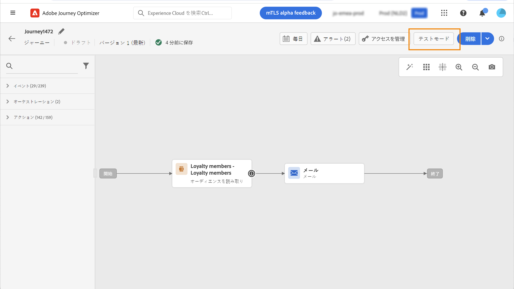
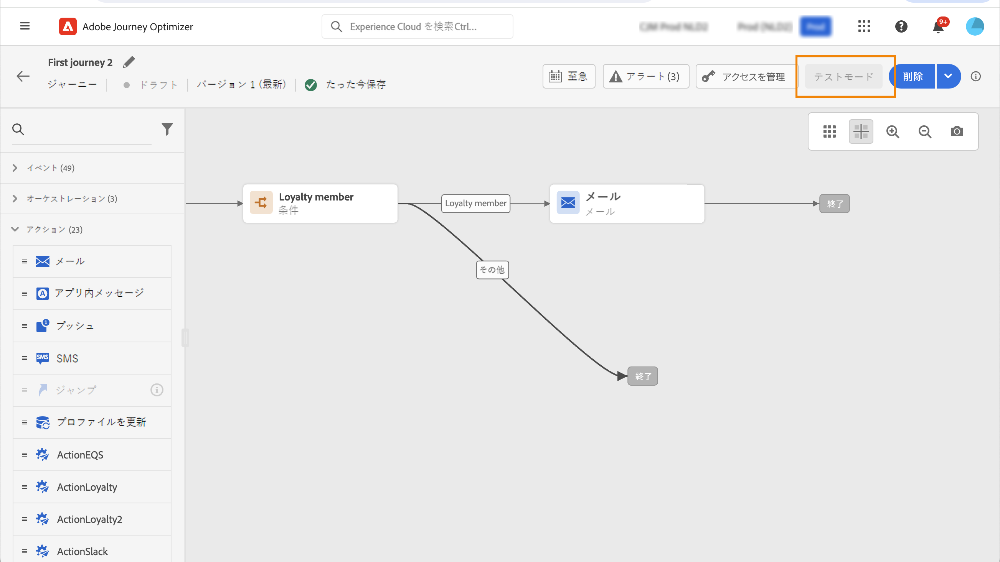

# ジャーニーでのオーディエンスの使用 {#segment-trigger-activity}

## 「オーディエンスを読み取り」アクティビティの追加 {#about-segment-trigger-actvitiy}

>[!CONTEXTUALHELP]
>id="ajo_journey_read_segment"
>title="「オーディエンスを読み取り」アクティビティ"
>abstract="「オーディエンスを読み取り」アクティビティを使用すると、Adobe Experience Platform オーディエンスに属するすべての個人をジャーニーにエントリさせることができます。ジャーニーへのエントリは、1 回限りと定期的のいずれも可能です。"

**オーディエンスを読み取り**&#x200B;アクティビティを使用すると、オーディエンスのすべての個人をジャーニーにエントリさせることができます。ジャーニーへのエントリは、1 回限りと定期的のいずれも可能です。

[オーディエンスの作成](../audience/about-audiences.md)ユースケースで作成した「Luma アプリのオープンとチェックアウト」オーディエンスを例に取ります。「オーディエンスを読み取り」アクティビティを使用すると、オーディエンスに属するすべての個人をジャーニーにエントリさせ、条件、タイマー、イベント、アクションなどのジャーニーのすべての機能を活用する個別のジャーニーに流入させることができます。

➡️ [この機能をビデオで確認](#video)

## ガードレールとベストプラクティス {#must-read}

* **オーディエンスを読み取り**&#x200B;アクティビティを使用するジャーニーの場合、同時に開始できるジャーニーの最大数が決まっています。再試行はシステムによって実行されますが、5 つを超えるジャーニー（**オーディエンスを読み取り**、スケジュール済み、または「できるだけ早く」開始）が同時に開始されることは避けてください。ベストプラクティスは、時間の経過と共に、5 分から 10 分の間隔で分散することです。

* エクスペリエンスのイベントフィールドグループは、**オーディエンスを読み取り**&#x200B;アクティビティ、**[オーディエンスの選定](audience-qualification-events.md)**&#x200B;アクティビティ、またはビジネスイベントアクティビティで始まるジャーニーでは使用できません。

* ベストプラクティスとして、バッチオーディエンスは、**オーディエンスを読み取り**&#x200B;アクティビティでのみ使用することをお勧めします。これにより、ジャーニーで使用されるオーディエンスが、高い信頼性かつ一貫してカウントされます。「オーディエンスを読み取り」は、バッチのユースケース向けに設計されています。ユースケースでリアルタイムデータが必要な場合は、**[オーディエンスの選定](audience-qualification-events.md)**&#x200B;アクティビティを使用します。

* [CSV ファイルから読み込まれた](https://experienceleague.adobe.com/docs/experience-platform/segmentation/ui/overview.html?lang=ja#import-audience)オーディエンスや、[コンポジションワークフロー](../audience/get-started-audience-orchestration.md)から生成されたオーディエンスは、「**オーディエンスを読み取り**」アクティビティで選択できます。これらのオーディエンスは、「**オーディエンスの選定**」アクティビティでは使用できません。

「**オーディエンスを読み取り**」アクティビティに関連するガードレールについては、[このページ](../start/guardrails.md#read-segment-g)を参照してください。

## アクティビティの設定 {#configuring-segment-trigger-activity}

「オーディエンスを読み取り」アクティビティを設定する手順は、次のとおりです。

1. **[!UICONTROL オーケストレーション]**&#x200B;カテゴリを展開し、**[!UICONTROL オーディエンスをを読み取り]**&#x200B;アクティビティをキャンバスにドロップします。

   アクティビティは、ジャーニーの最初のステップとして配置する必要があります。

1. アクティビティに&#x200B;**[!UICONTROL ラベル]**&#x200B;を追加します（オプション）。

1. 「**[!UICONTROL オーディエンス]**」フィールドで、ジャーニーにエントリする Adobe Experience Platform オーディエンスを選択し、「**[!UICONTROL 保存]**」をクリックします。[セグメント定義](../audience/creating-a-segment-definition.md)を使用して生成された Adobe Experience Platform オーディエンスを選択できます。

   >[!NOTE]
   >
   >また、[オーディエンスの構成](../audience/get-started-audience-orchestration.md)または [CSV ファイルからアップロード済み](https://experienceleague.adobe.com/docs/experience-platform/segmentation/ui/overview.html?lang=ja#import-audience){target="_blank"}を使用して作成された Adobe Experience Platform オーディエンスをターゲットにすることもできます。

   リストに表示される列は、カスタマイズして並べ替えることができます。

   

   オーディエンスが追加されると、「**[!UICONTROL コピー]**」ボタンを使用して、オーディエンスの名前と ID をコピーできます。

   `{"name":"Luma app opening and checkout","id":"8597c5dc-70e3-4b05-8fb9-7e938f5c07a3"}`

   

   >[!NOTE]
   >
   >オーディエンスの参加ステータスが&#x200B;**適合**&#x200B;および&#x200B;**既存**&#x200B;の個人のみが、ジャーニーにエントリします。オーディエンスの評価方法について詳しくは、[セグメント化サービスのドキュメント](https://experienceleague.adobe.com/docs/experience-platform/segmentation/tutorials/evaluate-a-segment.html?lang=ja#interpret-segment-results){target="_blank"}を参照してください。

1. 「**[!UICONTROL 名前空間]**」フィールドで、個人の識別に使用する名前空間を選択します。デフォルトでは、このフィールドには、最後に使用した名前空間が事前に入力されています。 [名前空間の詳細情報](../event/about-creating.md#select-the-namespace)。

   >[!NOTE]
   >
   >様々な ID の中から選択した ID（名前空間）を持たないオーディエンスに属する個人は、ジャーニーにエントリできません。ユーザーベースの ID 名前空間のみ選択できます。名前空間を参照テーブルに対して定義した場合（例：ProductID 名前空間を Product 参照に対して定義した場合）、その名前空間を&#x200B;**名前空間**&#x200B;ドロップダウンリストで使用することはできません。

1. **[!UICONTROL 読み取り率]**&#x200B;を設定します。これは、1 秒あたりにジャーニーにエントリできるプロファイルの最大数です。このレートは、このアクティビティにのみ適用され、ジャーニーの他のアクティビティには適用されません。例えば、カスタムのアクションに対してスロットルレートを定義する場合は、Throttling API を使用する必要があります。この[ページ](../configuration/throttling.md)を参照してください。

   この値は、ジャーニーバージョンのペイロードに格納されます。デフォルト値は、1 秒あたり 5,000 プロファイルです。この値は、1 秒あたり 500～20,000 プロファイルの範囲で変更できます。

   >[!NOTE]
   >
   >サンドボックスあたりの全体的な読み取り率は、1 秒あたり 20,000 プロファイルに設定されています。したがって、同じサンドボックスで同時に実行されるすべての「オーディエンスを読み取り」の読み取り率は、合計で 1 秒あたり最大 20,000 プロファイルになります。この上限は変更できません。

1. **[!UICONTROL オーディエンスを読み取り]**&#x200B;アクティビティを使用すると、オーディエンスがジャーニーにエントリする時間を指定できます。それには、「**[!UICONTROL ジャーニースケジュールを編集]**」リンクをクリックしてジャーニーのプロパティにアクセスし、「**[!UICONTROL スケジューラータイプ]**」フィールドを設定します。

   

   デフォルトでは、オーディエンスは&#x200B;**[!UICONTROL 至急]**&#x200B;ジャーニーにエントリします。オーディエンスを特定の日時にまたは繰り返しジャーニーにエントリさせる場合は、リストから目的の値を選択します。

   >[!NOTE]
   >
   >なお、「**[!UICONTROL スケジュール]**」セクションは、**[!UICONTROL オーディエンスを読み取り]**&#x200B;アクティビティがキャンバスにドロップされた場合にのみ使用できます。

   

   「**増分読み取り**」オプション：繰り返しの&#x200B;**オーディエンスを読み取り**&#x200B;を含んだジャーニーが初めて実行されると、オーディエンス内のすべてのプロファイルがジャーニーにエントリします。このオプションを使用すると、最初の実行後、ジャーニーの前回の実行以降にオーディエンスにエントリした個人のみをターゲットにすることができます。

       >[!NOTE]
       >
       >ジャーニーで [custom upload audience](../audience/about-audiences.md#segments-in-journey-optimizer) をターゲットにしている場合、繰り返しジャーニーでこのオプションが有効になっている場合、これらのオーディエンスが固定されるので、プロファイルは最初の繰り返しでのみ取得されます。
   
   **繰り返し時に再エントリを強制**：このオプションを使用すると、ジャーニーにまだ存在するすべてのプロファイルを、次の実行時に自動的に終了させることができます。例えば、毎日繰り返されるジャーニーに 2 日間の待機時間がある場合、このオプションをアクティブ化すると、プロファイルは、次回実行されるオーディエンスに含まれているかどうかにかかわらず、常に次のジャーニー実行時（つまり翌日）に進められます。このジャーニーでのプロファイルの存続期間が繰り返し頻度よりも長くなる可能性がある場合は、プロファイルがジャーニーを終了できるようにするために、このオプションをアクティブ化しないでください。

<!--

### Segment filters {#segment-filters}

[!CONTEXTUALHELP]
>id="jo_segment_filters"
>title="About segment filters"
>abstract="You can choose to target only the individuals who entered or exited a specific segment during a specific time window. For example, you can decide to only retrieve all the customers who entered the VIP segment since last week."

You can choose to target only the individuals who entered or exited a specific segment during a specific time window. For example, you can decide to only retrieve all the customers who entered the VIP segment since last week. Only the new VIP customers will be targeted. All the customers who were already part of the VIP segment before will be excluded.

To activate this mode, click the **Segment Filters** toggle. Two fields are displayed:

**Segment membership**: choose whether you want to listen to segment entrances or exits. 

**Lookback window**: define when you want to start to listen to entrances or exits. This lookback window is expressed in hours, starting from the moment the journey is triggered.  If you set this duration to 0, the journey will target all members of the segment. For recurring journeys, it will take into account all entrances/exits since the last time the journey was triggered.

-->

>[!NOTE]
>
>1 回限りの「オーディエンスを読み取り」ジャーニーは、ジャーニーの実行から 91 日（[ジャーニーグローバルタイムアウト](journey-properties.md#global_timeout)）後に&#x200B;**完了**&#x200B;ステータスに移行します。スケジュールされた「オーディエンスを読み取り」の場合は、最後の実行から 91 日後になります。

## ジャーニーのテストと公開 {#testing-publishing}

**[!UICONTROL オーディエンスを読み取り]**&#x200B;アクティビティを使用すると、単一プロファイルでジャーニーをテストできます。

それには、テストモードを有効にします。

通常どおりにテストモードを設定し実行します。[ジャーニーのテスト方法を学ぶ](testing-the-journey.md)。

テストを実行したら、「**[!UICONTROL ログを表示]**」ボタンを使用して、テスト結果を確認できます。詳しくは、[この節](testing-the-journey.md#viewing_logs)を参照してください。

テストが正常に完了すると、ジャーニーを公開できます（[ジャーニーの公開](publishing-the-journey.md)を参照）。オーディエンスに属する個人は、ジャーニーのプロパティの「**[!UICONTROL スケジューラー]**」セクションで指定された日時にジャーニーにエントリします。

>[!NOTE]
>
>繰り返しのオーディエンスベースジャーニーの場合、ジャーニーは、最後の実行が完了すると自動的にクローズします。終了日時が指定されていない場合は、新しいエントリに対するジャーニーを手動でクローズして終了する必要があります。

## オーディエンスベースのジャーニーでのオーディエンスのターゲティング

オーディエンスベースのジャーニーは常に、**オーディエンスを読み取り**&#x200B;アクティビティで始まり、Adobe Experience Platform オーディエンスに属する個人を取得します。

オーディエンスに属するオーディエンスは、1 回のみ、または定期的に取得されます。

ジャーニーへのエントリ後、オーディエンスオーケストレーションのユースケースを作成し、最初のオーディエンス内の個人をジャーニーの様々な分岐に流入させることができます。

**セグメント化**

条件を使用して、**条件**&#x200B;アクティビティでセグメント化を実行できます。例えば、VIP 顧客は特定のパス、VIP 以外の顧客は別のパスに沿って進むようにすることができます。

セグメント化は以下に基づいて実行できます。

* データソースのデータ
* ジャーニーデータのイベント部分のコンテキスト（例：ある人物が 1 時間前に受け取ったメッセージをクリックしたか）
* 日付（例：ある人物がジャーニーを経験したのは 6 月だったか？）。
* 時間（例：その人物のタイムゾーンで午前中か？）
* ジャーニーを経験しているオーディエンスを割合に基づいて分割するアルゴリズム（例：90% - 10%、コントロール母集団を除外）。

**除外**

セグメント化に使用するのと同じ&#x200B;**条件**&#x200B;アクティビティ（上記を参照）を使用すると、母集団の一部を除外することもできます。例えば、VIP を除外するには、そのユーザーを終了ステップ直前の分岐に送ります。

この除外は、母集団のカウントを目的として、または複数のステップから成るジャーニーに従って、オーディエンスの取得直後に発生する可能性があります。

**結合**

ジャーニーを使用すると、セグメント化の後に、N 個の分岐を作成および結合できます。

その結果、2 つのオーディエンスを同じエクスペリエンスに戻すことができます。

例えば、VIP と非 VIP の顧客は、ジャーニーで 10 日間別々のエクスペリエンスをした後で、同じパスに戻ることができます。

結合した後、セグメント化や除外を実行してオーディエンスを再度分割できます。

## 再試行 {#read-audience-retry}

再試行は、書き出しジョブの取得中に、オーディエンストリガージャーニー（**オーディエンスを読み取り**&#x200B;または&#x200B;**ビジネスイベント**&#x200B;で始まる）にデフォルトで適用されます。書き出しジョブの作成中にエラーが発生した場合、最大 1 時間、10 分ごとに再試行が行われます。それ以降は失敗と見なされます。したがって、これらのタイプのジャーニーは、スケジュールされた時間から最大 1 時間後に実行できます。

失敗した&#x200B;**オーディエンスを読み取り**&#x200B;トリガーはキャプチャされ、**アラート**&#x200B;に表示されます。「**オーディエンスを読み取りアラート**」は、スケジュールされた実行時間から 10 分経過しても、**オーディエンスを読み取り**&#x200B;アクティビティでプロファイルが処理されなかった場合に警告します。このエラーは、技術的な問題やオーディエンスが空であることが原因で発生する可能性があります。このエラーが技術的な問題によって発生した場合、問題のタイプに応じて、再試行が引き続き行われる可能性があります（例：書き出しジョブの作成に失敗した場合、最大 1 時間、10 分ごとに再試行されます）。[詳細情報](../reports/alerts.md#alert-read-audiences)

## チュートリアルビデオ {#video}

「オーディエンスを読み取り」アクティビティによってトリガーされるジャーニーに適用可能なユースケースを理解します。バッチベースのジャーニーを構築する方法と適用するベストプラクティスについて説明します。

>[!VIDEO](https://video.tv.adobe.com/v/3424997?quality=12)
