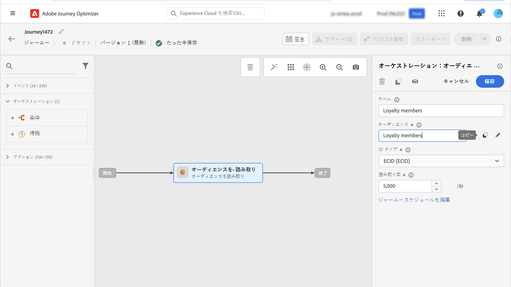
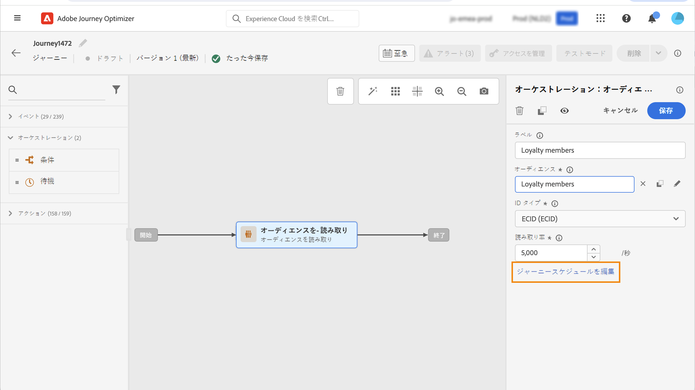

# ジャーニーでのオーディエンスの使用 {#segment-trigger-activity}

## 「オーディエンスの閲覧」アクティビティの追加 {#about-segment-trigger-actvitiy}

>[!CONTEXTUALHELP]
>id="ajo_journey_read_segment"
>title="オーディエンス読み取りアクティビティ"
>abstract="オーディエンスの読み取りアクティビティを使用すると、Adobe Experience Platformオーディエンスに属するすべての個人をジャーニーにエントリさせることができます。 ジャーニーへのエントリは、1 回限りと定期的のいずれも可能です。"

以下を使用： **オーディエンスの閲覧** アクティビティを使用して、オーディエンスのすべての個人をジャーニーにエントリさせることができます。 ジャーニーへのエントリは、1 回限りと定期的のいずれも可能です。

次に、 [オーディエンスの構築](../audience/about-audiences.md) ユースケース。 オーディエンスの閲覧アクティビティを使用すると、このオーディエンスに属するすべての個人をジャーニーにエントリさせ、すべてのジャーニー機能を活用する個々のジャーニーにフローさせることができます。条件、タイマー、イベント、アクション。

>[!NOTE]
>
>「オーディエンスの閲覧」アクティビティを使用するジャーニーの場合、同時に開始できるジャーニーの最大数があります。 再試行はシステムによって実行されますが、5～10 分の間隔で時間の経過と共に分散するなどして、同時に開始するジャーニーが 5 つを超える（オーディエンスを読み取り、スケジュールまたは開始する）のを避けてください。
>
>エクスペリエンスイベントフィールドグループは、オーディエンスの読み取り、オーディエンスの選定、ビジネスイベントアクティビティで始まるジャーニーでは使用できません。

### アクティビティの設定 {#configuring-segment-trigger-activity}

「オーディエンスの閲覧」アクティビティを設定する手順は次のとおりです。

1. 「 **[!UICONTROL Orchestration]** カテゴリとドロップ **[!UICONTROL オーディエンスの閲覧]** アクティビティをキャンバスに追加します。

   アクティビティは、ジャーニーの最初のステップとして配置する必要があります。

1. アクティビティに&#x200B;**[!UICONTROL ラベル]**&#x200B;を追加します（オプション）。

1. 内 **[!UICONTROL 対象ユーザ]** 「 」フィールドで、ジャーニーにエントリするAdobe Experience Platformオーディエンスを選択し、「 」をクリックします **[!UICONTROL 保存]**.

   リストに表示される列はカスタマイズして並べ替えることができます。

   >[!NOTE]
   >
   >個人のみ **実現済み** および **既存** オーディエンスパーティシペーションのステータスは、ジャーニーに入ります。 オーディエンスの評価方法について詳しくは、 [セグメント化サービスのドキュメント](https://experienceleague.adobe.com/docs/experience-platform/segmentation/tutorials/evaluate-a-segment.html?lang=ja#interpret-segment-results){target="_blank"}.

   

   オーディエンスを追加すると、 **[!UICONTROL コピー]** ボタンを使用すると、その名前と ID をコピーできます。

   `{"name":"Luma app opening and checkout",”id":"8597c5dc-70e3-4b05-8fb9-7e938f5c07a3"}`

   

1. **[!UICONTROL 名前空間]**&#x200B;フィールドで、個人の識別に使用する名前空間を選択します。デフォルトでは、このフィールドには、最後に使用した名前空間が事前に入力されています。 [名前空間の詳細情報](../event/about-creating.md#select-the-namespace)。

   >[!NOTE]
   >
   >異なる ID の中で選択された ID（名前空間）を持たないオーディエンスに属する個人は、ジャーニーにエントリできません。 ユーザーベースの ID 名前空間のみ選択できます。名前空間を参照テーブルに対して定義した場合（例：ProductID 名前空間を Product 参照に対して定義した場合）、その名前空間を&#x200B;**名前空間**&#x200B;ドロップダウンリストで使用することはできません。

1. を **[!UICONTROL スロットル率]** 「 」フィールドを「オーディエンスの読み取り」アクティビティのスループット制限に設定します。

   この値は、ジャーニーバージョンのペイロードに格納されます。デフォルト値は、1 秒あたり 5,000 メッセージです。この値は、1 秒あたり 500 から 20,000 メッセージの範囲で変更できます。

   >[!NOTE]
   >
   >サンドボックスあたりの全体的なスロットルレートは、1 秒あたり 20,000 メッセージに設定されています。したがって、同じサンドボックスで同時に実行されるすべての読み取りオーディエンスのスロットル率は、1 秒あたり最大 20,000 件のメッセージを追加します。 この上限は変更できません。

1. この **[!UICONTROL オーディエンスの閲覧]** 「 」アクティビティでは、オーディエンスがジャーニーにエントリする時間を指定できます。 これを行うには、「**[!UICONTROL ジャーニースケジュールを編集]** 」リンクをクリックしてジャーニーのプロパティにアクセスし、**[!UICONTROL スケジューラータイプ]**&#x200B;フィールドを設定します。

   

   デフォルトでは、オーディエンスはジャーニーにエントリします **[!UICONTROL できるだけ早く]**. オーディエンスを特定の日時または定期的にジャーニーにエントリさせる場合は、リストから目的の値を選択します。

   >[!NOTE]
   >
   >なお、 **[!UICONTROL スケジュール]** セクションは、 **[!UICONTROL オーディエンスの閲覧]** アクティビティがキャンバスにドロップされました。

   

   **増分読み取り** オプション：定期的な **オーディエンスの閲覧** が初めて実行されると、オーディエンスのすべてのプロファイルがジャーニーにエントリします。 このオプションを使用すると、初回発生後に、ジャーニーの最後の実行以降にオーディエンスに入った個人のみをターゲットにすることができます。

   **繰り返し時に再エントリを強制**：このオプションを使用すると、ジャーニーにまだ存在するすべてのプロファイルを、次の実行時に自動的に終了させることができます。例えば、毎日繰り返されるジャーニーに 2 日間の待機時間がある場合、このオプションをアクティブ化すると、プロファイルは、次回実行されるオーディエンスに含まれているかどうかにかかわらず、常に次のジャーニー実行時（つまり翌日）に進められます。このジャーニーでのプロファイルの存続期間が繰り返し頻度よりも長くなる可能性がある場合は、プロファイルがジャーニーを終了できるようにするために、このオプションをアクティブ化しないでください。

<!--

### Segment filters {#segment-filters}

[!CONTEXTUALHELP]
>id="jo_segment_filters"
>title="About segment filters"
>abstract="You can choose to target only the individuals who entered or exited a specific segment during a specific time window. For example, you can decide to only retrieve all the customers who entered the VIP segment since last week."

You can choose to target only the individuals who entered or exited a specific segment during a specific time window. For example, you can decide to only retrieve all the customers who entered the VIP segment since last week. Only the new VIP customers will be targeted. All the customers who were already part of the VIP segment before will be excluded.

To activate this mode, click the **Segment Filters** toggle. Two fields are displayed:

**Segment membership**: choose whether you want to listen to segment entrances or exits. 

**Lookback window**: define when you want to start to listen to entrances or exits. This lookback window is expressed in hours, starting from the moment the journey is triggered.  If you set this duration to 0, the journey will target all members of the segment. For recurring journeys, it will take into account all entrances/exits since the last time the journey was triggered.

-->

>[!NOTE]
>
>1 回限りの読み取りオーディエンスジャーニーは、ジャーニーの実行から 30 日後に完了ステータスに移行します。 スケジュールされた読み取りオーディエンスの場合、最後の読み取りオーディエンスの実行から 30 日後です。

### ジャーニーのテストと公開 {#testing-publishing}

この **[!UICONTROL オーディエンスの閲覧]** 「 」アクティビティでは、単一のプロファイルでジャーニーをテストすることも、オーディエンスの対象となるプロファイルの中から選択された 100 個のランダムテストプロファイルでジャーニーをテストすることもできます。

これを行うには、テストモードをアクティブにし、左側のペインから目的のオプションを選択します。

その後、通常どおりテストモードを設定して実行できます。[ジャーニーのテスト方法を学ぶ](testing-the-journey.md)。方法を学ぶ

テストが実行されると、「**[!UICONTROL ログを表示]**」ボタンを使用し、選択したテストオプションに従ってテスト結果を確認できます。

* **[!UICONTROL 一度に 1 つのプロファイル]**：テストログには、単一テストモードを使用した場合と同じ情報が表示されます。詳しくは、[この節](testing-the-journey.md#viewing_logs)を参照してください。

* **[!UICONTROL 一度に最大 100 個のプロファイル]**:テストログを使用すると、Adobe Experience Platformからのオーディエンスのエクスポートの進行状況と、ジャーニーに参加したすべての人の個々の進行状況を追跡できます。

  最大 100 個のプロファイルを一度に使用してジャーニーをテストした場合、視覚的なフローを使用してジャーニー内の個人の進行状況を追跡することはできません。

  

テストが正常に完了すると、ジャーニーを公開できます（[ジャーニーの公開](publishing-the-journey.md)を参照）。オーディエンスに属する個人は、ジャーニーのプロパティで指定された日時にジャーニーにエントリします **[!UICONTROL スケジューラ]** 」セクションに入力します。

>[!NOTE]
>
>繰り返しオーディエンスベースのジャーニーの場合、ジャーニーは最後の繰り返しが実行されると自動的に閉じます。 終了日時が指定されていない場合は、新しいエントリに対するジャーニーを手動でクローズして終了する必要があります。

## オーディエンスベースのジャーニーでのオーディエンスのターゲティング

オーディエンスベースのジャーニーは、常に **オーディエンスの閲覧** 「 」アクティビティを使用して、Adobe Experience Platformオーディエンスに属する個人を取得します。

オーディエンスに属するオーディエンスは、1 回取得するか、定期的に取得されます。

ジャーニーに入った後、Audience Orchestration のユースケースを作成し、最初のオーディエンスの個人をジャーニーの様々な分岐に流すことができます。

**セグメント化**

条件を使用して、**条件**&#x200B;アクティビティでセグメント化を実行できます。例えば、VIP 顧客は特定のパス、VIP 以外の顧客は別のパスに沿って進むようにすることができます。

セグメント化は以下に基づいて実行できます。

* データソースのデータ
* ジャーニーデータのイベント部分のコンテキスト（例：ある人物が 1 時間前に受け取ったメッセージをクリックしたか）
* 日付（例：ある人物がジャーニーを経験したのは 6 月だったか？）。
* 時間（例：ある人物のタイムゾーンでは朝か？）
* ジャーニーを経験しているオーディエンスを割合に基づいて分割するアルゴリズム（例：90% - 10%、コントロール母集団を除く）。

**除外**

セグメント化に使用するのと同じ&#x200B;**条件**&#x200B;アクティビティ（上記を参照）を使用すると、母集団の一部を除外することもできます。例えば、VIP を除外するには、そのユーザーを終了ステップ直前の分岐に送ります。

この除外は、オーディエンスの取得直後に、母集団のカウント目的や複数手順のジャーニーに沿って発生する可能性があります。

**結合**

ジャーニーを使用すると、セグメント化の後に、N 個の分岐を作成および結合できます。

その結果、2 つのオーディエンスを同じエクスペリエンスに戻すことができます。

例えば、VIP と非 VIP の顧客は、ジャーニーで 10 日間別々のエクスペリエンスをした後で、同じパスに戻ることができます。

結合した後、セグメント化や除外を実行してオーディエンスを再度分割できます。

