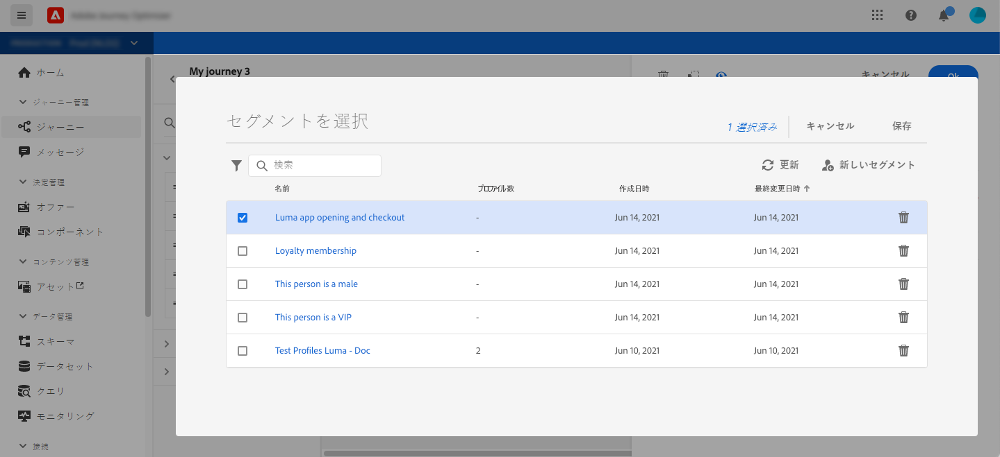
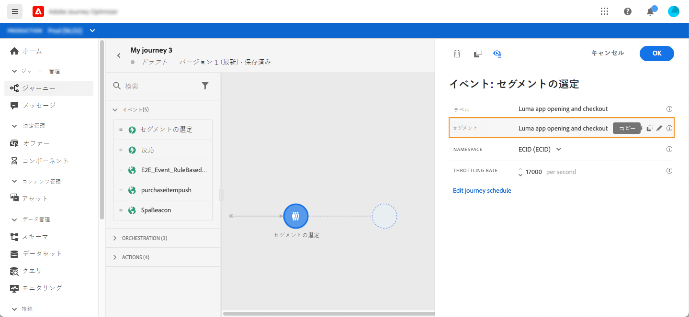
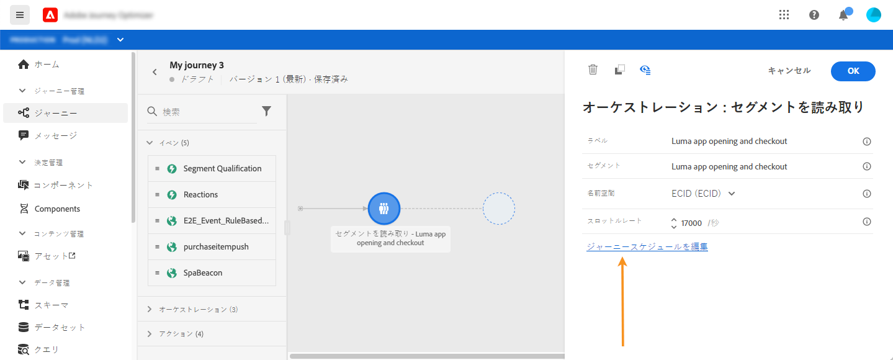
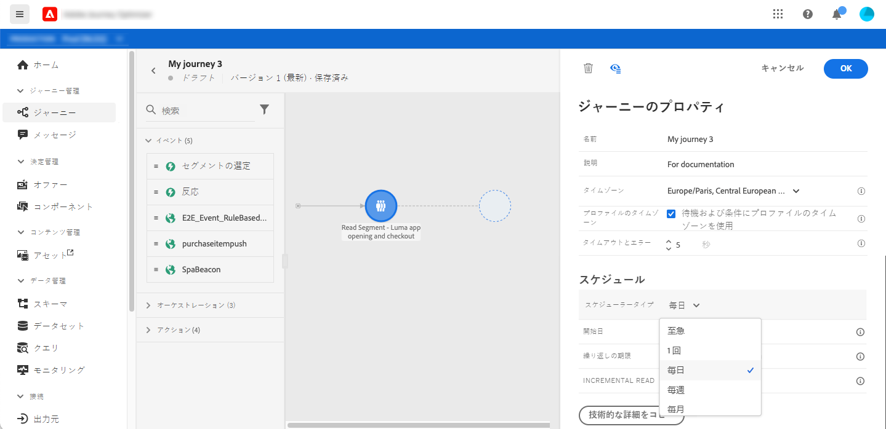
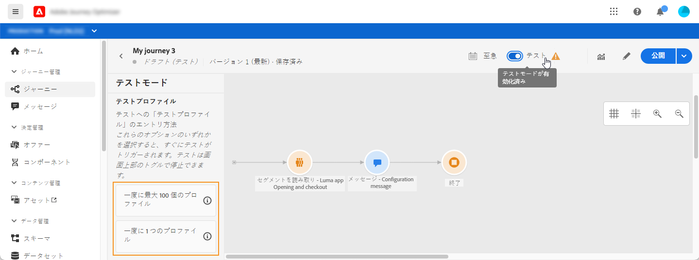
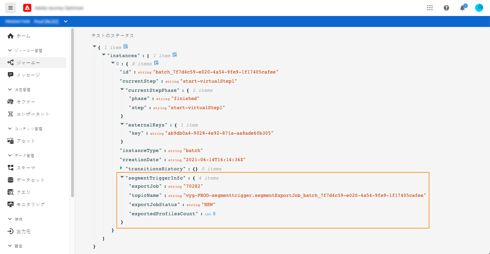
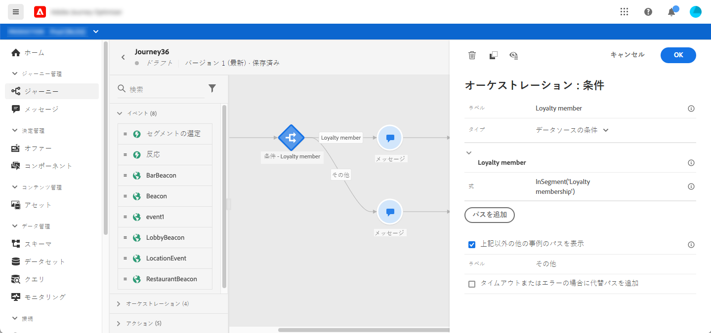
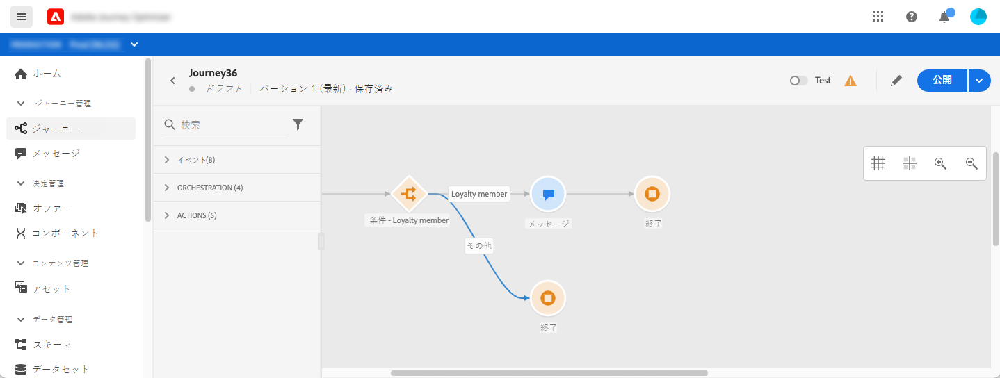
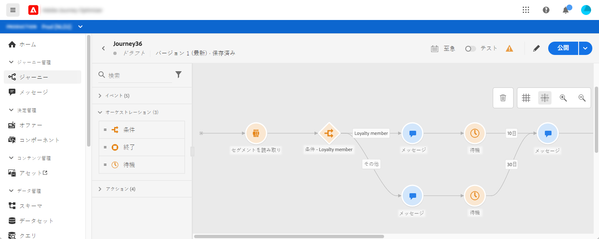

# ジャーニーでのセグメントの使用 {#segment-trigger-activity}

## セグメントの読み取りアクティビティについて {#about-segment-trigger-actvitiy}

セグメントの読み取りアクティビティを使用すると、Adobe Experience Platform セグメントに属するすべての個人をジャーニーにエントリさせることができます。ジャーニーへのエントリは、1 回きりと定期的のいずれも可能です。

例として、[セグメントの作成](../segment/about-segments.md)のユースケースで作成した「Luma アプリのオープンとチェックアウト」セグメントを見てみましょう。セグメントの読み取りアクティビティを使用すると、このセグメントに属するすべての個人をジャーニーがエントリし、すべてのジャーニー機能 （条件、タイマー、イベント、アクション）を活用したカスタムジャーニーの流れに沿うようにします。

>[!NOTE]
>
>バースト有料アドオンを使用すると、読み取りセグメントとシンプルなプッシュメッセージを含むシンプルなジャーニーに対して、非常に高速なプッシュメッセージを大量に送信できます。 詳しくは、[こちらの節](../building-journeys/journey-gs.md#burst)を参照してください。

### アクティビティの設定 {#configuring-segment-trigger-activity}

セグメントの読み取りアクティビティを設定する手順は次のとおりです。

1. **[!UICONTROL オーケストレーション]**&#x200B;カテゴリを展開し、「**[!UICONTROL セグメントを読み取り]**」アクティビティをキャンバスにドロップします。

   アクティビティは、ジャーニーの最初のステップとして配置する必要があります。

1. アクティビティに&#x200B;**[!UICONTROL ラベル]** を追加します（オプション）。

1. 「**[!UICONTROL セグメント]**」フィールドで、ジャーニーにエントリする Adobe Experience Platform セグメントを選択し、「**[!UICONTROL 保存]**」をクリックします。

   リストに表示される列はカスタマイズして並べ替えることができます。

   >[!NOTE]
   >
   >**実現**&#x200B;および&#x200B;**既存**&#x200B;のセグメント参加ステータスを持つ個人のみが個人のみがジャーニーにエントリします。セグメントの評価方法について詳しくは、[Segmentation Service のドキュメント](https://experienceleague.adobe.com/docs/experience-platform/segmentation/tutorials/evaluate-a-segment.html?lang=ja#interpret-segment-results){target=&quot;_blank&quot;}を参照してください。

   

   セグメントが追加されると、「**[!UICONTROL コピー]**」ボタンを使用して、セグメントの名前と ID をコピーできます。

   `{"name":"Luma app opening and checkout",”id":"8597c5dc-70e3-4b05-8fb9-7e938f5c07a3"}`

   

1. **[!UICONTROL 名前空間]**&#x200B;フィールドで、個人の識別に使用する名前空間を選択します。[名前空間の詳細情報](../event/about-creating.md#select-the-namespace)。

   >[!NOTE]
   >
   >異なる ID の中から選択した ID（名前空間）を持たないセグメントに属する個人は、ジャーニーにエントリできません。

1. 「**[!UICONTROL スロットルレート]**」フィールドを、「セグメントを読み取り」アクティビティのスループット限度に設定します。

   この値は、ジャーニーバージョンのペイロードに格納されます。デフォルト値は、1 秒あたり 20,000 メッセージです。この値は、1 秒あたり 500 から 20,000 メッセージの範囲で変更できます。

   >[!NOTE]
   >
   >サンドボックスあたりの全体的なスロットルレートは、1 秒あたり 20,000 メッセージに設定されています。したがって、同じサンドボックスで同時に実行されるすべての読み取りセグメントのスロットルレートは、合計で 1 秒あたり最大 20,000 メッセージになります。この上限は変更できません。

1. **[!UICONTROL セグメントを読み取り]**&#x200B;アクティビティを使用すると、セグメントがジャーニーにエントリする時間を指定できます。これを行うには、「**[!UICONTROL ジャーニースケジュールを編集]** 」リンクをクリックしてジャーニーのプロパティにアクセスし、**[!UICONTROL スケジューラータイプ]**&#x200B;フィールドを設定します。

   

   デフォルトでは、セグメントは&#x200B;**[!UICONTROL 早急に]**&#x200B;ジャーニーにエントリします。セグメントを特定の日時にまたは繰り返しジャーニーにエントリさせる場合は、リストから目的の値を選択します。

   >[!NOTE]
   >
   >「**[!UICONTROL スケジュール]**」セクションは、「**[!UICONTROL セグメントを読み取り]**」アクティビティがキャンバスにドロップされた場合にのみ使用できます。

   

   **増分読み取り**&#x200B;オプションを使用すると、ジャーニーの最後の実行以降にセグメントにエントリした個人のみをターゲットにすることができます。最初の実行では、常にすべてのセグメントメンバーがターゲットになります。このオプションは、繰り返し発生する&#x200B;**セグメントを読み取り**&#x200B;アクティビティでのみ使用できます。

<!--

### Segment filters {#segment-filters}

[!CONTEXTUALHELP]
>id="jo_segment_filters"
>title="About segment filters"
>abstract="You can choose to target only the individuals who entered or exited a specific segment during a specific time window. For example, you can decide to only retrieve all the customers who entered the VIP segment since last week."

You can choose to target only the individuals who entered or exited a specific segment during a specific time window. For example, you can decide to only retrieve all the customers who entered the VIP segment since last week. Only the new VIP customers will be targeted. All the customers who were already part of the VIP segment before will be excluded.

To activate this mode, click the **Segment Filters** toggle. Two fields are displayed:

**Segment membership**: choose whether you want to listen to segment entrances or exits. 

**Lookback window**: define when you want to start to listen to entrances or exits. This lookback window is expressed in hours, starting from the moment the journey is triggered.  If you set this duration to 0, the journey will target all members of the segment. For recurring journeys, it will take into account all entrances/exits since the last time the journey was triggered.

-->

### ジャーニーのテストと公開 {#testing-publishing}

**[!UICONTROL セグメントを読み取り]**&#x200B;アクティビティを使用すると、ジャーニーを単一プロファイル、またはセグメントに該当するプロファイルからランダムに選択した 100 個のテストプロファイルでテストを実行できます。

これを行うには、テストモードをアクティブにし、左側のペインから目的のオプションを選択します。

その後、通常どおりテストモードを設定して実行できます。[ジャーニーのテスト方法を学ぶ](testing-the-journey.md)。方法を学ぶ

テストが実行されると、「**[!UICONTROL ログを表示]**」ボタンを使用し、選択したテストオプションに従ってテスト結果を確認できます。

* **[!UICONTROL 一度に 1 つのプロファイル]**：テストログには、単一テストモードを使用した場合と同じ情報が表示されます。詳しくは、[この節](testing-the-journey.md#viewing_logs)を参照してください。

* **[!UICONTROL 一度に最大 100 個のプロファイル]**：テストログでは、Adobe Experience Platform からのセグメント書き出しの進行状況と、ジャーニーにエントリしたすべての人の個人の進行状況を追跡できます。

   最大 100 個のプロファイルを一度に使用してジャーニーをテストした場合、視覚的なフローを使用してジャーニー内の個人の進行状況を追跡することはできません。

   

テストが正常に完了すると、ジャーニーを公開できます（[ジャーニーの公開](publishing-the-journey.md)を参照）。セグメントに属する個人は、ジャーニーのプロパティの「**[!UICONTROL スケジューラー]**」セクションで指定された日時にジャーニーにエントリします。

>[!NOTE]
>
>繰り返しセグメントベースのジャーニーの場合、ジャーニーは、最後の処理が実行されると自動的にクローズします。終了日時が指定されていない場合は、新しいエントリに対するジャーニーを手動でクローズして終了する必要があります。

## セグメントベースのジャーニーでのオーディエンスのターゲティング

セグメントベースのジャーニーは常に、Adobe Experience Platform セグメントに属する個人を取得する「**セグメントを読み取り**」アクティビティで開始します。

セグメントに属するオーディエンスは、1 回のみ、または定期的に取得されます。

ジャーニーへのエントリ後、オーディエンスオーケストレーションのユースケースを作成し、最初のセグメントの個人をジャーニーの異なる分岐に誘導することができます。

**セグメント化**

条件を使用して、**条件**&#x200B;アクティビティでセグメント化を実行できます。例えば、VIP 顧客は特定のパス、VIP 以外の顧客は別のパスに沿って進むようにすることができます。

セグメント化は以下に基づいて実行できます。

* データソースのデータ
* ジャーニーデータのイベント部分のコンテキスト（例：ある人物が 1 時間前に受け取ったメッセージをクリックしたか）
* 日付（例：ある人物がジャーニーを経験したのは 6 月だったか？）。
* 時間（例：ある人物のタイムゾーンでは朝か？）
* ジャーニーを経験しているオーディエンスを割合に基づいて分割するアルゴリズム（例：90% - 10%、コントロール母集団を除く）。

**除外**

セグメント化に使用するのと同じ&#x200B;**条件**&#x200B;アクティビティ（上記を参照）を使用すると、母集団の一部を除外することもできます。例えば、VIP を除外するには、そのユーザーを終了ステップ直前の分岐に送ります。

この除外は、セグメントの取得直後に発生する可能性があります。これは、母集団のカウント目的や、複数手順のジャーニーに沿ったものです。

**結合**

ジャーニーを使用すると、セグメント化の後に、N 個の分岐を作成および結合できます。

その結果、2つのオーディエンスを同じエクスペリエンスに戻すことができます。

例えば、VIP と非 VIP の顧客は、ジャーニーで 10 日間別々のエクスペリエンスをした後で、同じパスに戻ることができます。

結合した後、セグメント化や除外を実行してオーディエンスを再度分割できます。

