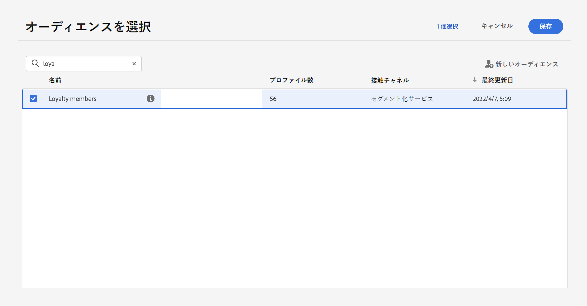
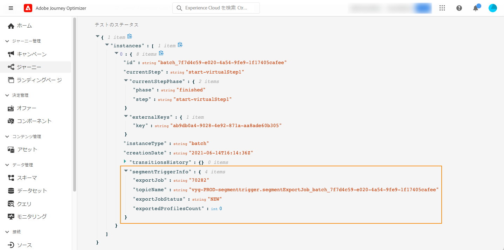

# 過程でのセグメントの使用 {#segment-trigger-activity}

## 「セグメントの読み取り」アクティビティーの追加 {#about-segment-trigger-actvitiy}

>[!CONTEXTUALHELP]
>id="ajo_journey_read_segment"
>title="セグメントの読み取り操作"
>abstract="「セグメントの読み取り」アクティビティーを使用すると、Adobe 体験プラットフォームセグメントに属するすべてのユーザーに、旅を行うことができます。 旅への入り口は、1回だけ実行することも、定期的に実行することもできます。"

セグメントのすべての個人が旅に入るようにするには、 **「セグメント** の読み取り」アクティビティーを使用します。 旅への入り口は、1回だけ実行することも、定期的に実行することもできます。

次に、Build segment ](../segment/about-segments.md) ユースケースで作成した「ルミナンスアプリケーションの開始とチェックアウト」セグメントに [ ついて説明します。「セグメントを読み取る」機能を使用すると、この分野に属するすべての個人に、旅を入力して、状況、タイマー、イベント、アクションなどのすべての道強化機能を活用する個別の journeys にフローさせることができます。

>[!NOTE]
>
>Journeys でのセグメントの読み取りアクティビティについては、一度に1つの journeys を開始することができます。 リトライはシステムによって実行されますが、5 ~ 10 分などの時間と共に展開することによって、journeys (「できるだけ早く」セグメント、「可能な場合はすぐに開始」) を同時に開始することによって、5個を超える (「できるだけ早く」セグメント、スケジューリングされた、または開始 &quot;)
>
>エクスペリエンスイベントフィールドグループを journeys で使用するには、読み取りセグメント、セグメント認定、またはビジネスイベントアクティビティから開始する必要があります。

### アクティビティを設定します。 {#configuring-segment-trigger-activity}

セグメントの読み取りアクティビティーを設定する手順は、次のとおりです。

1. **[!UICONTROL Orchestration]**&#x200B;カテゴリを展開し、キャンバスにアクティビティを **[!UICONTROL Read Segment]** ドロップします。

   アクティビティは、旅の最初のステップとして位置づける必要があります。

1. **[!UICONTROL Label]**&#x200B;アクティビティにを追加します (オプション)。

1. **[!UICONTROL Segment]**&#x200B;フィールドで、旅に入る Adobe エクスペリエンスプラットフォームセグメントを選択して、をクリック **[!UICONTROL Save]** します。

   リストに表示される列をカスタマイズして、並べ替えることができます。

   >[!NOTE]
   >
   >このような **参加状況には、実際** **に参加した参加者と既存** のセグメントに参加する人員のみが入ります。 セグメントを検証する方法について詳しくは、セグメンテーションサービスの [ マニュアル ](https://experienceleague.adobe.com/docs/experience-platform/segmentation/tutorials/evaluate-a-segment.html#interpret-segment-results) を参照してください {target = &quot;_blank&quot;} を参照してください。

   

   セグメントが追加されると、このボタンを使用して、 **[!UICONTROL Copy]** その名前と ID をコピーできます。

   `{"name":"Luma app opening and checkout",”id":"8597c5dc-70e3-4b05-8fb9-7e938f5c07a3"}`

   

1. **[!UICONTROL Namespace]**「」フィールドで、個人を識別するために使用する名前空間を選択します。[名前空間 ](../event/about-creating.md#select-the-namespace) について説明します。

   >[!NOTE]
   >
   >セグメントに属していて、それらのアイデンティティ間に選択した id (名前空間) を持っていない人物は、旅に入ることはできません。

1. **[!UICONTROL Throttling rate]**「セグメントを読み取り」アクティビティーの「スループット制限」にフィールドを設定します。

   この値は、旅のバージョンのペイロードに格納されます。 デフォルト値は、1秒間に2万メッセージです。 この値は、1秒間に 500 ~ 2万メッセージに変更できます。

   >[!NOTE]
   >
   >サンドボックスあたりの全体的なスロットル率は、1秒間に2万メッセージに設定されています。 したがって、同じサンドボックスで同時に実行されるすべての読み取りセグメントのスロットル率が、1秒間に最大2万個のメッセージに加算されます。 この cap を変更することはできません。

1. **[!UICONTROL Read Segment]**&#x200B;アクティビティーを使用すると、セグメントが旅に入る時刻を指定することができます。これを行うには、リンクをクリックし **[!UICONTROL Edit journey schedule]** て、その旅のプロパティにアクセスし、フィールドを設定 **[!UICONTROL Scheduler type]** します。

   

   デフォルトでは、セグメントは、旅 **[!UICONTROL As soon as possible]** に入ります。 セグメントが特定の日時に、または定期的に旅を開始するようにするには、リストから目的の値を選択します。

   >[!NOTE]
   >
   >**[!UICONTROL Schedule]**&#x200B;このセクションは、キャンバスにアクティビティがドロップされた場合に **[!UICONTROL Read Segment]** のみ使用できます。

   

   **「インクリメンタル読み取り** 」オプション: 定期的 **に実行される読み取りセグメント** との旅が最初に実行されたときに、セグメント内のすべてのプロファイルにその過程が入ります。 このオプションを使用すると、最初の実行後に対象を指定することができます。これにより、最後に実行された後のセグメントに入力した人物のみが対象となります。

   **「定期的** に再入」: このオプションを使用すると、次回の実行時に、すべてのプロファイルが自動的に終了するようになります。 例えば、1日1回の繰り返し処理で2日の待機時間がある場合、このオプションを有効にすることで、プロファイルは、次に実行したときに常に移動します。その後 (日) になるのは、次回の実行者であるかどうかに関係なく、次の実行時です。 このような場合に、プロファイルが定期的に実行頻度より長い場合は、このオプションを有効にせず、プロファイルによる処理を完了させることはできません。

<!--

### Segment filters {#segment-filters}

[!CONTEXTUALHELP]
>id="jo_segment_filters"
>title="About segment filters"
>abstract="You can choose to target only the individuals who entered or exited a specific segment during a specific time window. For example, you can decide to only retrieve all the customers who entered the VIP segment since last week."

You can choose to target only the individuals who entered or exited a specific segment during a specific time window. For example, you can decide to only retrieve all the customers who entered the VIP segment since last week. Only the new VIP customers will be targeted. All the customers who were already part of the VIP segment before will be excluded.

To activate this mode, click the **Segment Filters** toggle. Two fields are displayed:

**Segment membership**: choose whether you want to listen to segment entrances or exits. 

**Lookback window**: define when you want to start to listen to entrances or exits. This lookback window is expressed in hours, starting from the moment the journey is triggered.  If you set this duration to 0, the journey will target all members of the segment. For recurring journeys, it will take into account all entrances/exits since the last time the journey was triggered.

-->

>[!NOTE]
>
>ワンショット読み取りセグメント journeys、旅実行後30日後に終了状態に移動します。 予約された読み取りセグメントについては、最後の発生が実行された30日後になります。

### 旅のテストと公開 {#testing-publishing}

**[!UICONTROL Read Segment]**&#x200B;アクティビティを使用すると、1つのユニタリプロファイル上で、または100に、セグメント用に認定されたプロファイルからランダムにテストプロファイルを選択してテストすることができます。

これを行うには、テストモードをアクティブにしてから、左側のペインで目的のオプションを選択します。

その後、通常どおりにテストモードを設定して実行できます。 [ここでは、旅 ](testing-the-journey.md) をテストする方法について説明します。

テストが実行されると、 **[!UICONTROL Show logs]** このボタンを使用して、選択したテストオプションに応じたテスト結果を表示できます。

* **[!UICONTROL Single profile at a time]**: テストログには、ユニタリテストモードを使用する場合と同じ情報が表示されます。 詳細については、以下の項を [ 参照してください。](testing-the-journey.md#viewing_logs)

* **[!UICONTROL Up to 100 profiles at once]**: 「テストログ」を使用すると、Adobe エクスペリエンスプラットフォームでのセグメントの進行状況を追跡することができます。また、その過程を開始したすべての人物の進行状況を追跡することもできます。

   最大で100のプロファイルを同時に使用して旅にテストすることはできないので、視覚的な流れを使用して、個々のユーザーの進行状況を追跡することはできません。

   

テストが成功したら、あなたは旅をパブリッシュすることができます (詳しくは、「公開の ](publishing-the-journey.md) パブリッシュ」を参照してください [ )。セグメントに属している個人は、旅のプロパティ **[!UICONTROL Scheduler]** セクションで指定された日時に旅に入るようになります。

>[!NOTE]
>
>反復セグメントベースの journeys については、最後に出現する部分が実行されると、その旅は自動的に閉じられます。 最後に日付/時刻が指定されていない場合は、手動で新しい入り口への旅を終了する必要があります。

## セグメントベースの journeys の対象ユーザーの設定

セグメントベースの journeys は、常に「セグメント **の** 読み取り」アクティビティーから始まり、Adobe 体験プラットフォームセグメントに属している個人を取得します。

セグメントに属している対象ユーザーは、1回または定期的に取得されます。

旅に移行した後は、最初のセグメントから、旅の別のブランチに移行することができます。

**分類**

Condition **アクティビティを使用して、** 区分化を行うことができます。例えば、別のパスにある特定のパスと非 VIP フローを VIP ユーザーに実行させることができます。

セグメンテーションは、次のようにすることができます。

* データソースデータ
* イベントの内容 (例えば、次のような旅データ) の一部: 1 時間前にメッセージをクリックしたことがありますか。
* 例えば、次のような日付になります。これは、ユーザーが旅を進んだときに6月に開催されます。
* 次に例を示します。これは、従業員のタイムゾーンにおける朝のような場合です。
* 次の例に示すように、フロー上で視聴者が流れるように、例えば 90% ~ 10% のアルゴリズムを使用して、制御グループを除外します。

**免責**

セグメンテーション (上記参照) と同じ **条件** アクティビティーを使用して、母集団の一部を除外することもできます。 例えば、その後、最後のステップで、VIP を除外することができます。

このような除外は、セグメントの取得直後に行うこともできます。作成回数を数えたり、複数のステップを実行したりすることができます。

**接合**

Journeys を使用すると、1つのブランチを作成して、セグメンテーション後に参加することができます。

その結果、2人のユーザーに共通の操作を返すことができます。

例えば、1回の旅において、10日で別の操作を行った後は、VIP および非 VIP ユーザーが同じ経路に戻ることができます。

結合した後で、セグメンテーションまたは除外を実行することによって、1つの参加者をもう一度分割することができます。

