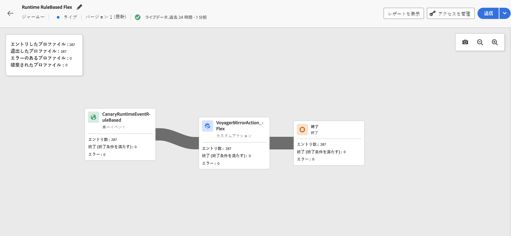

# ジャーニーキャンバスのライブレポート {#report-journey}

>[!NOTE]
>
>ジャーニーライブレポートにデータが表示されない場合は、アクセス権を拡張して&#x200B;**[!UICONTROL ジャーニーレポートの表示]**&#x200B;権限を含める必要があります。[詳細情報](../administration/permissions.md)

ジャーニーが公開されると、**ライブレポーティング**&#x200B;は、過去 24 時間の指標をジャーニーキャンバス内で直接提供します。

表示されたイベントは過去 24 時間以内に発生したもので、イベントと表示の間に少なくとも 2 分の間隔（通常 5 分以内）があります。

ライブジャーニーの場合は、次にアクセスできます。

* **[!UICONTROL エントリ済みプロファイル]**：このアクティビティにエントリ済みの個人の合計数。
* **[!UICONTROL 退出済みプロファイル]**：終了条件が原因でジャーニーをそのアクティビティから退出した個人の合計数。
* **[!UICONTROL エラーのあるプロファイル]**：ジャーニー中にエラーが発生した個人の合計数。
* **[!UICONTROL 破棄されたプロファイル]**：次のいずれかの理由でジャーニーから破棄された個人の合計数。

   * **オーディエンス選定**&#x200B;アクティビティでは、オーディエンスの選定に必要な動詞と受け取ったジャーニーが一致しない場合（例：「realized」ではなく「exited」）、破棄が発生する可能性があります。
   * **イベントトリガー**&#x200B;ジャーニーの場合、個人がジャーニーに再エントリしようとするのが早すぎた場合や再エントリが許可されなかった場合、破棄が発生する可能性があります。
   * **繰り返し**&#x200B;ジャーニーでは、個人が既にジャーニーにエントリし、再エントリポリシーが「再エントリを強制」に設定されていない場合、破棄は繰り返しのたびにカウントされます。
   * **オーディエンスを読み取り**&#x200B;アクティビティでは、書き出された個人の ID が設定されていない場合や、受信した ID 名前空間がジャーニーで想定されている名前空間と一致しない場合、破棄が発生します。

すべてのライブジャーニー内の各アクティビティに対して、次の項目にアクセスできます。

* **[!UICONTROL エントリ済みプロファイル]**：このアクティビティにエントリ済みの個人の合計数。
* **[!UICONTROL 退出済みプロファイル]**：終了条件が原因でジャーニーをそのアクティビティから退出した個人の合計数。
* **[!UICONTROL エラー]**：そのアクティビティでエラーが発生した個人の合計数。
