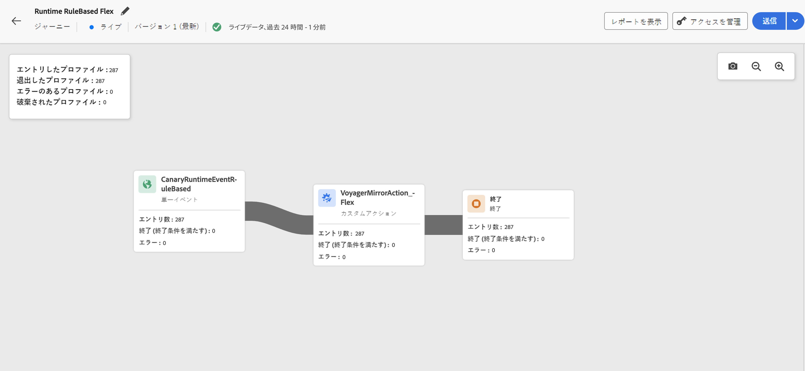

# ジャーニーキャンバスのライブレポート {#report-journey}

>[!BEGINSHADEBOX]

**このページ：** ライブレポートを使用して、過去24時間の主要なジャーニー指標をジャーニーキャンバス内で直接監視する方法を説明します。

>[!ENDSHADEBOX]

ジャーニーが公開され、[ドライランモード](journey-dry-run.md)がアクティブ化されると、**ライブレポート**&#x200B;により、過去 24 時間の指標がジャーニーキャンバス内で直接提供されます。

>[!AVAILABILITY]
>
>ジャーニーライブレポートにデータが表示されない場合は、アクセス権を拡張して&#x200B;**[!UICONTROL ジャーニーレポートの表示]**&#x200B;権限を含める必要があります。 [詳細情報](../administration/permissions.md)

表示されたイベントは過去 24 時間以内に発生したもので、イベントと表示の間に少なくとも 2 分の間隔（通常 5 分以内）があります。

ライブモードまたは[ドライランモード](journey-dry-run.md)のジャーニーでは、次の項目を確認できます。

* **[!UICONTROL エントリ済みプロファイル]**：ジャーニーにエントリ済みの個人の合計数。
* **[!UICONTROL 退出したプロファイル]**：ジャーニーから退出した個人の合計数（エラーを含む）。
* **[!UICONTROL エラーのあるプロファイル]**：ジャーニー中にエラーが発生した個人の合計数。
* **[!UICONTROL 破棄されたプロファイル]**：次のいずれかの理由でジャーニーから破棄された個人の合計数。

   * **オーディエンス選定**&#x200B;アクティビティでは、オーディエンスの選定に必要な動詞と受け取ったジャーニーが一致しない場合（例：「realized」ではなく「exited」）、破棄が発生する可能性があります。
   * **イベントトリガー**&#x200B;ジャーニーの場合、個人がジャーニーに再エントリしようとするのが早すぎた場合や再エントリが許可されなかった場合、破棄が発生する可能性があります。
   * **繰り返し**&#x200B;ジャーニーでは、個人が既にジャーニーにエントリし、再エントリポリシーが「再エントリを強制」に設定されていない場合、破棄は繰り返しのたびにカウントされます。
   * **オーディエンスを読み取り**&#x200B;アクティビティでは、エクスポートされた個人の ID が設定されていない場合や、受信した ID 名前空間がジャーニーで想定されている名前空間と一致しない場合、破棄が発生します。

ライブランモードまたは[ドライランモード](journey-dry-run.md)のすべてのジャーニー内の各アクティビティに対して、次の項目にアクセスできます。

* **[!UICONTROL エントリ済み]**：このアクティビティにエントリ済みの個人の合計数。 **アクション**&#x200B;アクティビティの場合、ドライランモードでは実行されないので、この指標はプロファイルが通過したことを示します。
* **[!UICONTROL 退出済み（終了基準を満たす）]**：終了基準（エラーを含む）に従って、そのアクティビティからジャーニーを退出した個人の合計数。
* **[!UICONTROL 離脱済み（強制離脱）]**：ジャーニー実務担当者の設定により、一時停止中にジャーニーを離脱した個人の合計数。 ドライランモードのジャーニーでは、この指標は常にゼロになります。
* **[!UICONTROL エラー]**：そのアクティビティでエラーが発生した個人の合計数。

## レポートデータが欠落している場合のトラブルシューティング {#troubleshooting-missing-data}

ジャーニーレポートに予期されたデータが表示されない場合は、次の点を考慮します。

* **ジャーニー名の同期**: [!DNL Adobe Journey Optimizer]のジャーニー名が、レポートデータセットに保存されている名前と一致することを確認します。 これらの名前が一致しないと、レポートデータが正しく表示されない場合があります。

* **データ更新のタイミング**：ジャーニー名または設定を更新した後は、データが更新されるまで十分な時間を確保します。 レポートデータは通常、数分以内に表示されますが、場合によってはそれ以上かかることがあります。

* **アクセス権限**：ジャーニーレポートを表示するために必要な権限があることを確認します。 データが表示されない場合は、管理者に&#x200B;**[!UICONTROL ジャーニーレポートを表示]**&#x200B;権限が有効になっていることを確認します。 [詳しくは、権限を参照してください。](../administration/permissions.md)

* **ジャーニーのステータス**：レポートデータは、公開済みのジャーニーまたは[ドライランモード](journey-dry-run.md)で実行中のジャーニーでのみ使用できます。 ドラフトジャーニーでは、レポートデータは生成されません。

これらの項目を確認した後も問題が解決しない場合は、Adobe管理者または[Adobe サポート &#x200B;](../start/user-interface.md#support-ticket-guidelines)にお問い合わせください。

>[!MORELIKETHIS]
>
>* [レポートの概要](../reports/gs-reports.md)
>* [ジャーニーの公開](publish-journey.md)
>* [ジャーニーのドライラン](journey-dry-run.md)
>* [ジャーニー指標の設定とトラッキング](success-metrics.md)
>* [カスタムジャーニーレポート](../reports/sharing-overview.md)

+++ AI ナレッジリファレンス

このセクションには、このトピックに関連する解釈、検索、質問への回答をサポートすることを目的とした構造化された知識が含まれています。

理解を深めるには、この情報をこのページのドキュメントと組み合わせる必要があります。 どちらのソースも単独で使用することを意図していません。このページでは、機能について説明しますが、この節では、用語、意図、適用可能性、および制約の曖昧さを解消するのに役立つ追加のコンテキストを提供します。

* **TL;DR:**&#x200B;このページでは、ジャーニーキャンバスに埋め込まれたライブレポートを表示および解釈する方法について説明し、ドライラン モードで公開されたジャーニーとジャーニーで使用できる主要なプロファイルフロー指標について説明します。

**インテント：**
* ジャーニーキャンバスでリアルタイムのジャーニーパフォーマンス指標を直接表示できます
* ジャーニーと各アクティビティの入力済みプロファイル、終了済みプロファイル、エラー数、破棄されたプロファイル数を解釈する
* ジャーニーからプロファイルが破棄される理由を理解する
* ジャーニーライブレポートのデータが欠落している、または予期しない場合のトラブルシューティング
* ジャーニーライブレポートにアクセスするための必要な権限を確認します

**用語集：**
* **ライブレポート**：過去24時間をカバーするジャーニーキャンバスにリアルタイム指標が直接表示されます&#x200B;*（製品固有）*
* **ドライランモード**：実際のメッセージを送信せずにジャーニーをシミュレートするジャーニー実行モード。ライブレポートも利用できます&#x200B;*（製品固有）*
* **破棄されたプロファイル**：資格情報の不一致、再入力の制限、またはIDの問題が原因で、ジャーニーにエントリしようとしたが拒否されたプロファイル *（製品固有）*
* **離脱（強制終了）**: ジャーニー実務担当者によって一時停止されている間にジャーニーから削除されたプロファイル。ドライランモードでは常にゼロになる&#x200B;*（製品固有）*

**ガードレール：**
* ライブレポートデータは過去24時間のみをカバーします。
* イベントは、発生から最低2分の間隔（通常は5分以内）で表示されます。
* ライブレポートデータを表示するには、ジャーニーレポートを表示する権限が必要です。
* レポート データは、ドライラン モードで公開されたジャーニーまたはジャーニーでのみ使用できます。ドラフトジャーニーではデータは生成されません。
* アクションアクティビティの場合、入力済み指標には、ドライランモードで通過する（実行されない）プロファイルが表示されます。
* ドライランモードでは、「離脱（強制終了）」指標は常にゼロになります。

**用語：**
* 正式名称：ライブレポート（ジャーニーキャンバス） – 略語：none — バリアント：ジャーニーライブレポート、キャンバス内レポート
* 同義語：「入力済みプロファイル」 = 「ジャーニーにエントリしたプロファイル」
* 「ライブレポート」≠「ジャーニーグローバルレポート」（ライブレポートはキャンバスの最後の24時間です。グローバルレポートは、レポート UIでより広い履歴の時間範囲をカバーします）

**FAQ:**
* **Q: ライブレポートに表示されるデータは現在の値ですか？**  – 過去24時間のイベントが表示され、最小表示遅延は2分、通常は5分以内です。
* **Q: ジャーニーライブレポートにデータが表示されないのはなぜですか？** — ジャーニーレポートを表示する権限、ジャーニーが（ドラフトではなく）公開されていること、ジャーニー名がレポートデータセットの名前と一致していることを確認します。
* **Q: プロファイルが破棄される原因は何ですか？** — オーディエンスの選定の動詞の不一致、定期的なジャーニーまたはイベントがトリガーされたジャーニーでの再入力ポリシー違反、オーディエンスの読み取りアクティビティでのID名前空間の欠落または不一致により、破棄が発生する可能性があります。
* **Q: ドライラン モード中にライブ レポートを利用できますか？**  – はい。ライブレポートは、公開済みのライブジャーニーとドライランモードで実行されているジャーニーの両方で使用できます。
* **Q: ドライ実行モードのアクションアクティビティでは、入力済み指標はどのような意味がありますか？** — アクションは実際にはドライラン モードで実行されないため、アクティビティを通過するプロファイルを示します。

+++
