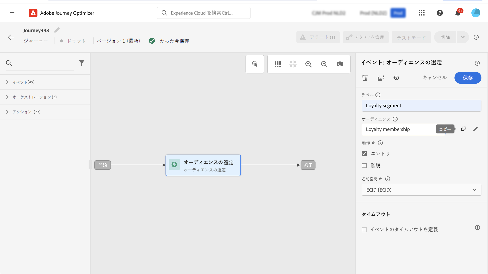
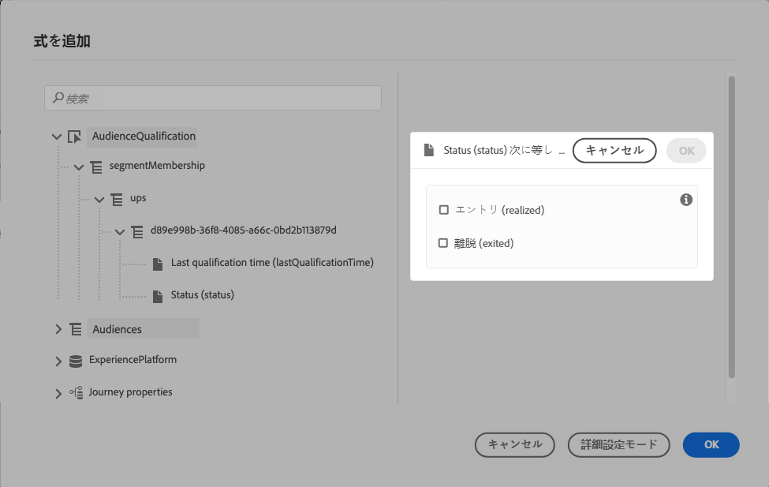
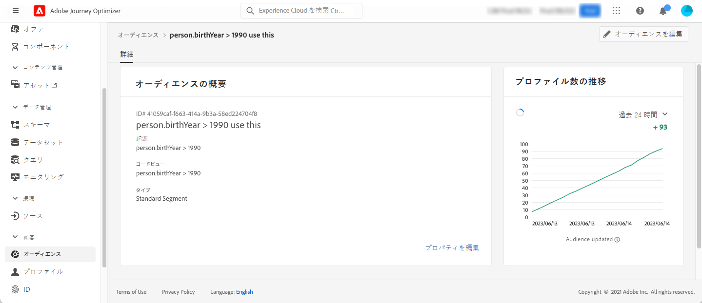

# セグメントの認定イベント {#segment-qualification}

## セグメントの認定イベントについて{#about-segment-qualification}

>[!CONTEXTUALHELP]
>id="ajo_journey_event_segment_qualification"
>title="セグメントの認定イベント"
>abstract="このアクティビティにより、Adobe 体験プラットフォーム分野のプロファイルの入り口や出口を耳にして、ユーザーが旅に出たり、前進させたりすることができます。"

このアクティビティにより、Adobe 体験プラットフォーム分野のプロファイルの入り口や出口を耳にして、ユーザーが旅に出たり、前進させたりすることができます。 セグメントの作成について詳しくは、次 [ の項 ](../segment/about-segments.md) を参照してください。

&quot;シルバーカスタマー&quot; セグメントがあるとします。 このアクティビティを使用すると、すべての新しいシルバーユーザーが旅に入り、一連の個人用設定メッセージを送信することができます。

このタイプのイベントは、最初のステップとして、またはその後で移動することができます。

>[!IMPORTANT]
>
>Adobe エクスペリエンスプラットフォームセグメントは、1日 **** に1回、または、Adobe エクスペリエンスプラットフォームの「高周波数ユーザー」のオプションを使用してリアルタイム ( **ストリーミング** セグメント) に計算されることに注意してください。
>
>選択されたセグメントがストリーミングされる場合は、そのセグメントに属している個人が、リアルタイムでの旅に入る可能性があります。 セグメントがバッチ化されている場合、このセグメントに新しく限定された人物は、Adobe エクスペリエンスプラットフォームでセグメント計算が実行されるときに、その過程に入る可能性があります。
>
>エクスペリエンスイベントフィールドグループを journeys で使用するには、読み取りセグメント、セグメント認定、またはビジネスイベントアクティビティから開始する必要があります。

1. **[!UICONTROL Events]**&#x200B;カテゴリを展開し、キャンバスにアクティビティを **[!UICONTROL Segment Qualification]** ドロップします。

   

1. **[!UICONTROL Label]**&#x200B;アクティビティにを追加します。この手順はオプションです。

1. **[!UICONTROL Segment]**&#x200B;フィールドをクリックして、活用するセグメントを選択します。

   >[!NOTE]
   >
   >リストに表示される列をカスタマイズして、並べ替えることができます。

   

   セグメントが追加されると、このボタンを使用して、 **[!UICONTROL Copy]** その名前と ID をコピーできます。

   `{"name":"Loyalty membership“,”id":"8597c5dc-70e3-4b05-8fb9-7e938f5c07a3"}`

   

1. **[!UICONTROL Behaviour]**&#x200B;フィールドで、セグメントの入口、出口、またはその両方を再生するかどうかを選択します。

   >[!NOTE]
   >
   >Adobe エクスペリエンスプラットフォームによって実現される **[!UICONTROL Enter]** のは、これによって実現 **された、または** 終了 **し** たセグメントに対応し **[!UICONTROL Exit]** ています。セグメントを検証する方法について詳しくは、セグメンテーションサービスの [ マニュアル ](https://experienceleague.adobe.com/docs/experience-platform/segmentation/tutorials/evaluate-a-segment.html#interpret-segment-results) を参照してください {target = &quot;_blank&quot;} を参照してください。

1. 名前空間を選択します。 これは、イベントが旅の最初のステップとして位置づけられている場合にのみ必要です。

   

ペイロードには、次のコンテキスト情報が含まれています。これは、条件と操作で使用することができます。

* ビヘイビアー (入口、出口)
* 認定のタイムスタンプ
* セグメント id

アクティビティに従う **[!UICONTROL Segment Qualification]** 条件またはアクションで式エディターを使用する場合は、ノードに **[!UICONTROL SegmentQualification]** アクセスできます。 とは **[!UICONTROL status]** 、とを選択 **[!UICONTROL Last qualification time]** することもできます。

条件付き処理 ](../building-journeys/condition-activity.md#about_condition) を参照して [ ください。

セグメントの認定イベントを含む新しい旅は、公開後10分間は操作可能になります。 この間隔は、専用サービスのキャッシュ更新間隔に対応しています。 そのため、この方法を使用するには10分待つ必要があります。

## ベストプラクティス {#best-practices-segments}

このアクティビティにより、 **[!UICONTROL Segment Qualification]** Adobe 体験プラットフォームセグメントから認定された、または認定されていない人物に対して、journeys の即時入り口ができます。

この情報の受信速度が高くなっています。 作成された計測値は、1秒あたりに受信される 10 000 イベントの速度を示します。 そのためには、入口のピークがどのように変わるか、それを回避して、そのような旅を可能にする方法について理解しておく必要があります。

### Batch セグメント{#batch-speed-segment-qualification}

セグメントの認定をバッチセグメントに使用する場合は、デイリー計算の実行時にピークのピークが発生することに注意してください。 ピークのサイズは、セグメントを1日あたりに入力 (または終了) した人物の数によって異なります。

さらに、バッチセグメントが新たに作成されて、その過程ですぐに使用される場合、最初の計算を行うと、非常に多くの個人が旅に入ることになります。

### ストリーミングセグメント{#streamed-speed-segment-qualification}

ストリーミングセグメントに対してセグメント修飾子を使用すると、セグメントの継続的な評価により大規模な入り口が発生するリスクが少なくなります。 その一方で、セグメント定義が大規模な顧客を同時に見込みありとするような場合は、負荷がピークになる可能性があります。

セグメンテーションのストリーミングについて詳しくは、『 Adobe エクスペリエンス Platform のマニュアルを [ 参照してください。](https://experienceleague.adobe.com/docs/experience-platform/segmentation/api/streaming-segmentation.html#api)

### オーバーロードを避ける方法{#overloads-speed-segment-qualification}

ここでは、journeys (データソース、カスタムアクション、チャネルアクションアクティビティ) で使用されているシステムの過負荷を回避するためのベストプラクティスについて説明します。

アクティビティに **[!UICONTROL Segment Qualification]** は、作成直後のバッチセグメントを使用しないでください。 最初の計算ピークが回避されます。 まだ計算されていないセグメントを使用しようとすると、旅の canvas には黄色の警告が表示されます。

Journeys で使用されるデータソースとアクションに対して、このような負荷が発生しないように設定します。 詳細については、このドキュメント ](https://experienceleague.adobe.com/docs/journeys/using/working-with-apis/capping.html) で説明しています {target = &quot;_blank&quot;} を [ 参照してください。このようにして、「上限」が再試されることに注意してください。 再実行する必要がある場合は、「条件」または「操作」チェックボックス **[!UICONTROL Add an alternative path in case of a timeout or an error]** をオンにして、別のパスを使用する必要があります。

このセグメントを本番の過程で使用する前に、まず最初にこの分野に適合している個人の容量を評価してください。 これを行うには、メニューを確認 **[!UICONTROL Segments]** してから、セグメントを開き、グラフを表示 **[!UICONTROL Profiles over time]** します。

