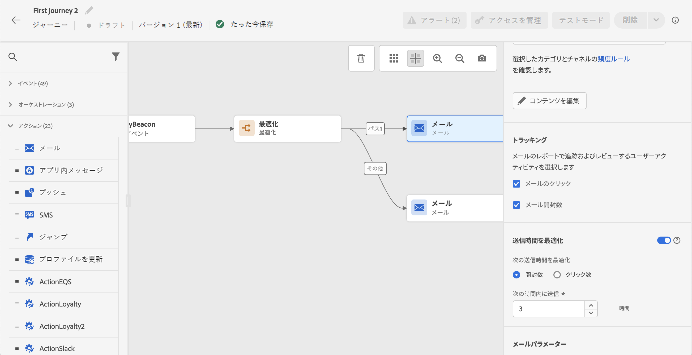
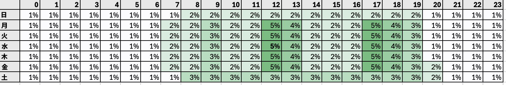
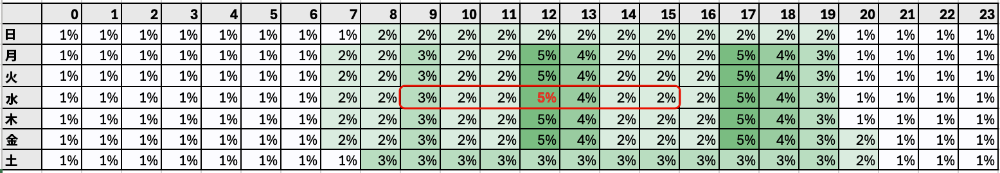

# 送信時間の最適化{#send-time-optimization}

>[!CONTEXTUALHELP]
>id="jo_bestsendtime_disabled"
>title="送信時間の最適化について"
>abstract="Adobe Journey Optimizer の送信時間最適化機能（アドビの AI サービスを利用）は、メールまたはプッシュメッセージの送信に最適な時間を予測し、過去の開封率とクリック率に基づいてエンゲージメントを最大化できます。"

>[!CONTEXTUALHELP]
>id="jo_bestsendtime_email"
>title="送信時間最適化のアクティベート"
>abstract="適切なラジオボタンを選択して、メールの開封数とクリックスルー数のどちらを最適化するかを選択します。また、「次の時間内に送信」オプションに値を入力して、システムで使用される送信時間を区切ることもできます。"

>[!CONTEXTUALHELP]
>id="jo_bestsendtime_push"
>title="送信時間最適化のアクティベート"
>abstract="プッシュメッセージではクリック数が適用されないため、デフォルトは「開封数」オプションになります。また、「次の時間内に送信」オプションに値を入力して、システムで使用される送信時間を区切ることもできます。"

Adobe Journey Optimizer の送信時間の最適化機能（アドビのジャーニー AI サービスを利用）は、顧客の過去の開封およびクリック動作に基づいて、メールとプッシュメッセージの最適な送信時間を選択し、顧客エンゲージメントを最大化します。

送信時間の最適化は、Journey Optimizer のビルトインのメールおよびプッシュアクションタイプでのみ使用できます。カスタムアクションを通じて送信されるメッセージやその他のアクションタイプでは現在使用できません。送信時間の最適化は、ジャーニー内のメールおよびプッシュアクションでのみ使用できます。キャンペーンを通じて送信されるメッセージでは現在使用できません。

>[!AVAILABILITY]
>
>* 送信時間の最適化機能は、リクエストに応じて Adobe Journey Optimizer のお客様に対して有効になります。組織でこの機能を有効にするには、アドビカスタマーケアまたはアドビ担当者にお問い合わせください。
>
>* 送信時間の最適化は、**メール**&#x200B;チャネルと&#x200B;**プッシュ通知**&#x200B;チャネルにのみ適用されます。
>

## 送信時間の最適化の使用{#use-send-time-optimization}

アクションのパラメーターから送信時間の最適化スイッチをオンに切り替えて、メールアクションまたはプッシュアクションで送信時間の最適化を使用します。

送信時間の最適化は、注文確認、パスワードリセット通知、フライトゲート変更通知など、緊急で時間的制約がある運用上のメッセージには使用しないでください。送信時間の最適化は、週次広告、新製品のプロモーション情報、1 か月間の販売に関する情報など、緊急性の低いマーケティングコミュニケーションに最適です。

メールメッセージの場合は、適切なラジオボタンを選択して、メールの開封数とクリックスルー数のどちらを最適化するかを選択します。プッシュメッセージは、開封数に関して常に最適化されます。

>[!TIP]
>
>最も良い結果を得るには、ほとんどのメールメッセージをクリック数に合わせて最適化する必要があります。メールメッセージが本質的に情報提供であり、アクションを直接推進することを目的としていない場合は、開封数に合わせて最適化することを選択します。

メールメッセージとプッシュメッセージの両方で、「次の時間内に送信」オプションに値を設定して、メッセージを送信する前にシステムが待機する最大時間数を選択します。1～168 時間の値を選択できます。

>[!TIP]
>
>最も良い結果を得るには、6～24 時間の最大待機時間を選択します。最大待機時間に低い値を選択すると、使用可能な送信時間の数が減少するので、送信時間の最適化の潜在的な値が減少する場合があります。最大待機時間に高い値を選択すると、メッセージが送信されるまでに古くなったり、関連性がなくなったりする場合があります。

ジャーニーをアクティブ化し、顧客がジャーニーのメールアクションまたはプッシュアクションに到達すると、送信時間の最適化により、指定した制限内で各ユーザーに使用できる最適な予測送信時間が選択されます。

## 送信時間の最適化の仕組み {#how-send-time}

送信時間の最適化モデルは、組織の Adobe Journey Optimizer の顧客行動データを取り込み、ユーザーレベルの開封イベントおよびクリックイベントを調べて、顧客がメッセージにエンゲージする可能性が最も高い時間を判断します。

送信時間の最適化では、次の 3 つのタイプの行動データに基づいて、各ユーザーに対する 1 週間の時間ごとの予測を行います。

1. ユーザー全体の行動
1. 同じタイムゾーンにいる類似ユーザーの行動
1. その個々のユーザーの行動

これらの予測は、ベイジアンアプローチを使用して重み付けされ、組み合わせられます。その結果、各顧客について、各指標（メールの開封数、メールのクリック数、プッシュの開封数）の「ヒートマップ」が作成されます。これは、以下のヒートマップの例に示すように、そのユーザーと連絡することで目的のエンゲージメント結果（開封数数／クリック数）が得られる可能性が最も高い 1 週間の時間と最も低い 1 週間の時間を示します。

上記の予測確率を持つユーザーが、送信時間の最適化をオンに切り替えて最大待機時間を 7 時間に設定し、水曜日の午前 9 時にメッセージを送信する場合、メッセージの送信時間は午後 12 時になります。

## 送信時間の最適化モデルのトレーニングとスコアリングの詳細  {#model-send-time}

組織で送信時間の最適化機能を有効にすると、そのアクションで送信時間の最適化が使用されるかどうかに関係なく、過去 16 週間にわたる組織のすべてのジャーニーとアクションのメールおよびプッシュの送信、開封、クリックイベントについてジャーニー AI モデルのトレーニングが行われます。これにより、送信時間の最適化では顧客が生成したすべてのデータを活用できます。

モデルは、最初にトレーニングが行われ、毎週スコアリングされます。16 週間後、モデルは毎月、再トレーニングが行われ、再スコアリングされます。モデルのスコアリングには、前回のスコアリング実行以降の既存および新規のすべての顧客プロファイルが含まれます。

送信時間の最適化によって送信されたメッセージでは、様々な送信時間をテストして顧客の反応を確認するのに選択された「探索」メッセージ送信時間や、クリック／開封率を最大化するのに選択された「最適化」メッセージ送信時間のいずれかを受信します。送信イベントの 5％は「探索」送信時間を受信し、送信イベントの 95％は「最適化」されます。

探索送信時間は、設定された最大待機時間で使用可能な送信時間からランダムに選択されます。例えば、送信時間の最適化をオンに切り替えて、最大待機時間を 3 時間に設定し、水曜日の午前 9 時にメッセージを選択した場合、メッセージの探索送信時間は午前 9 時、午前 10 時、午前 11 時、午後 12 時に均等に分割されます。

## よくある質問 {#faq-send-time}

+++送信時間の最適化を使用するまで、どの程度待つ必要がありますか。

組織では、メール内で送信時間の最適化を使用する前に、少なくとも 30 日間は Journey Optimizer 内でメールアクションを使用して、メールの送信、開封、クリックイベントの一部を収集できるようにする必要があります。

組織では、プッシュ内で送信時間の最適化を使用する前に、少なくとも 30 日間は Journey Optimizer 内でプッシュアクションを使用して、プッシュの送信と開封イベントの一部を収集できるようにする必要があります。

組織で既にメールやプッシュのアクションタイプを 30 日以上使用している場合は、アドビが送信時間の最適化を有効にした後に、組織では送信時間の最適化を使用するのにそれ以上待機する必要はありません。組織で最大 16 週間にわたってデータを収集するにつれて、結果は引き続き改善されます。

+++

+++特定のユーザーがでメッセージを受信する送信時間を確認する方法

プロファイルリッチネスに対するモデルの影響を最小限に抑えるために、モデルスコアは `_experience.intelligentServices.journeyAI.sendTimeOptimization` に保存される 3 つのプロファイル属性に圧縮されて保存されます。人間が判読できるように設計されていません。

+++

+++送信時間の最適化の平均的なメリットは何ですか。

送信時間の最適化により、組織が最適化したすべてのメッセージにわたって、メールのクリック率とプッシュ開封率が約 2％～10％増加する場合があります。

例えば、送信時間の最適化を行わずにメールを送信する組織の平均クリック率が 5.0％の場合、送信時間の最適化を行った同じメールセットでは、平均クリック率が 5.5％に達する可能性があります（5.0% * (1+10%) = 5.5%）。

小さなサンプルサイズ内では変動が生じるので、単一メッセージの送信では送信時間の最適化によるメリットが確認できない場合があります。

組織は、次のような場合に、送信時間の最適化を使用することでより大きなメリットが得られる可能性が高くなります。

* 既存のジャーニーで送信時間が固定されており、十分に最適化されていない
* 顧客行動（クリック数および開封数）の変動が、顧客の場所や顧客の好みに応じて異なる
* 組織がメールメッセージとプッシュメッセージの大部分で送信時間の最適化を使用している
* 組織が推奨される 6～12 時間の範囲内で最大待機時間を選択する

+++

+++私はいつも午後 12 時にメールまたはプッシュメッセージをクリックしますが、アルゴリズムが午後 12 時にメッセージを送信しなかったのはなぜですか？

これは、次のような複数の理由で発生する場合があります。

* 「最適化」メッセージ送信時間ではなく、「探索」メッセージ送信時間としてメッセージが選択された。
* 類似ユーザーの行動が、モデルに影響を与え、別の送信時間を推奨した。

+++

+++送信時間の最適化でユーザーのタイムゾーンを把握する方法

送信時間の最適化では、`timeZone` プロファイルフィールドを使用してユーザーのタイムゾーンを決定します。そのユーザーが使用できない場合、送信時間の最適化では、国や都道府県など、ユーザーのプロファイル内の他の地理情報からユーザーのタイムゾーンを推測しようとします。

+++

+++送信時間の最適化では、ユーザーのローカルタイムゾーンの夜間にプッシュメッセージを送信しますか？

送信時間の最適化では、次の状況で、ユーザーのローカルタイムゾーンの夜間にプッシュメッセージが送信される場合があります。

* ユーザーが夜間に送信されたメッセージとやり取りする可能性が高いことを示す行動を示した場合
* モデルが「探索」送信時間を選択した場合

夜間に顧客にプッシュメッセージを送信しないようにするには、バッチプッシュメッセージの送信を午前中または午後の早い時間に行うようにスケジュールし、送信時間の最適化の期間を短く選択します（例えば、送信時間を午前 9 時、最大待機時間を 8 時間に設定します）。

+++

