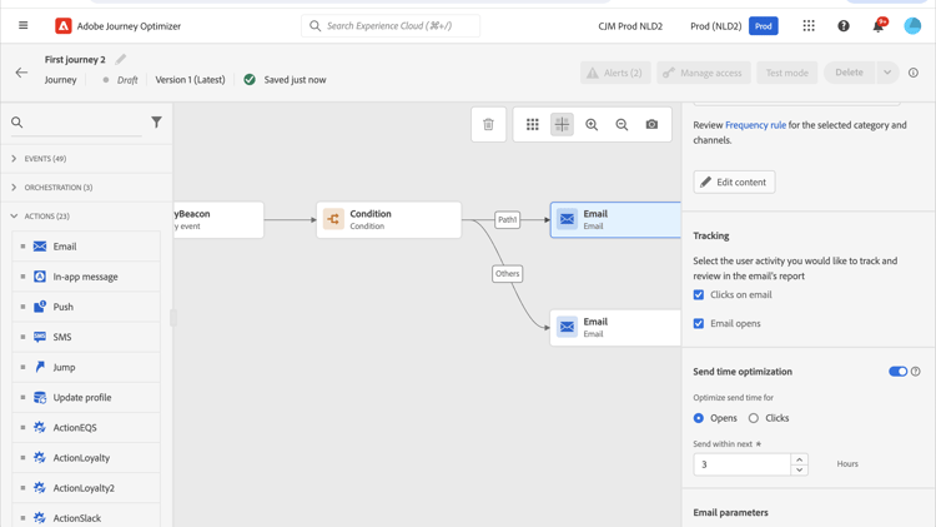

# 送信時間の最適化{#send-time-optimization}

>[!CONTEXTUALHELP]
>id="jo_bestsendtime_disabled"
>title="送信時間の最適化について"
>abstract="Adobe Journey Optimizer の送信時間最適化機能（アドビの AI サービスを利用）は、メールまたはプッシュメッセージの送信に最適な時間を予測し、過去の開封率とクリック率に基づいてエンゲージメントを最大化できます。"

>[!CONTEXTUALHELP]
>id="jo_bestsendtime_disabled"
>title="送信時間の最適化について"
>abstract="Adobe Journey Optimizer の送信時間最適化機能（アドビの AI サービスを利用）は、メールまたはプッシュメッセージの送信に最適な時間を予測し、過去の開封率とクリック率に基づいてエンゲージメントを最大化できます。"

>[!CONTEXTUALHELP]
>id="jo_bestsendtime_email"
>title="送信時間最適化の有効化"
>abstract="適切なラジオボタンを選択して、メールの開封数とクリックスルー数のどちらを最適化するかを選択します。また、「次のオプション内で送信」に値を入力して、システムで使用される送信時間を区切ることもできます。"

>[!CONTEXTUALHELP]
>id="jo_bestsendtime_push"
>title="送信時間最適化の有効化"
>abstract="プッシュメッセージではクリック数が適用されないため、デフォルトは「開封数」オプションになります。また、「次のオプション内で送信」に値を入力して、システムで使用される送信時間を区切ることもできます。"

Adobe Journey OptimizerのジャーニーAI サービスを活用したAdobeの送信時間最適化機能では、メールおよびプッシュメッセージの最適な送信時間を選択して、顧客の過去のオープンおよびクリック行動に基づいて顧客エンゲージメントを最大化します。

送信時間の最適化は、Journey Optimizerに組み込まれているメールおよびプッシュのアクションタイプでのみ使用できます。現在、カスタムアクションを介して送信されたメッセージや、その他のアクションタイプでは使用できません。 送信時間の最適化は、ジャーニー内のメールおよびプッシュアクションでのみ使用でき、現在、キャンペーンを通じて送信されるメッセージでは使用できません。

>[!AVAILABILITY]
>
>* 最初の送信時間最適化のトレーニングとスコアリングには、最近のメッセージングデータを含む少なくとも 1,000 個のプロファイルを使用することをお勧めします。
>
>* 送信時間の最適化は、**メール** および **プッシュ通知** チャネルにのみ適用されます。

## 送信時間の最適化を有効にする{#enable-send-time-optimization}

リクエストに応じて、Adobe Journey Optimizerのお客様は送信時間の最適化機能を有効にすることができます。 お客様の組織でこの機能を有効化する場合は、Adobe カスタマーケアまたはAdobeの担当者にお問い合わせください。

## 送信時間の最適化の使用{#use-send-time-optimization}

アクションパラメーターの送信時間の最適化スイッチをオンにして、メールまたはプッシュアクションで送信時間の最適化を使用します。

>[!TIP]
>
>送信時間の最適化は、注文確認、パスワードリセット通知、フライトゲート変更通知など、緊急で時間に依存する操作メッセージには使用しないでください。 送信時間の最適化は、緊急を要しないマーケティング通信（週次広告、新製品のプロモーション情報、1 か月の販売に関する情報など）に最適です。

メールメッセージの場合は、適切なラジオボタンを選択して、メールの開封数とクリックスルー数のどちらを最適化するかを選択します。プッシュメッセージは、開封数に関して常に最適化されています。

>[!TIP]
>
>最良の結果を得るには、ほとんどのメールメッセージをクリック数に合わせて最適化する必要があります。 メールメッセージが情報目的であり、アクションを直接実行することを目的としていない場合は、開封数を最適化するように選択します。

メールとプッシュメッセージの両方で、「次の時間内に送信」オプションの値を設定して、メッセージが送信されるまでシステムが待機する最大時間数を選択します。 1～168 時間の値を選択できます。

>[!TIP]
>
>最適な結果を得るには、6 ～ 24 時間の最大待機時間を選択してください。 最大待ち時間に小さい値を選択すると、使用可能な送信時間が短くなるため、送信時間の最適化で得られる可能性が低くなる場合があります。 最大待機時間に大きい値を選択すると、メッセージが送信される時点で古くなっているか関係がない場合があります。

ジャーニーがアクティブ化され、顧客がジャーニーのメールまたはプッシュアクションに到達すると、送信時間の最適化により、指定した制限内で各ユーザーに利用できる最適な予測送信時間が選択されます。

## 送信時間の最適化の仕組み {#how-send-time}

送信時間最適化モデルは、組織のAdobe Journey Optimizer顧客行動データを取り込み、ユーザーレベルの開封数とクリックイベントを調べて、お客様がメッセージングに関与する可能性が最も高いタイミングを判断します。

送信時間の最適化では、次の 3 種類の行動データに基づいて、ユーザーごとに 1 時間ごとの予測を行います。

1. ユーザー全体の行動
1. 同じタイムゾーンでの類似ユーザーの動作
1. その個々のユーザーの行動

これらの予測は、ベイジアンアプローチを使用して重み付けされ、組み合わされます。以下のヒートマップの例に示すように、各顧客の各指標（メール開封数、メールのクリック数、プッシュの開封数）の「ヒートマップ」が得られ、そのユーザーに連絡する時間が最も多く、最も少ない場合が目的のエンゲージメント結果（オープン/クリック数）につながります。

上記の確率で予測されたユーザーが、送信時間の最適化がオンで、最長 7 時間の待機時間を持つ水曜日の午前 9 時のメッセージをターゲットにした場合、メッセージの選択された送信時間は午後 12 時になります。

## 送信時間最適化モデルのトレーニングとスコアリングの詳細  {#model-send-time}

組織で送信時間の最適化機能が有効になると、送信時間の最適化を使用するかどうかに関係なく、過去 16 週間にわたるすべての組織のジャーニーおよびアクションにわたって、メールおよびプッシュの送信、開封、クリックイベントに関するジャーニーAI モデルのトレーニングが行われます。 これにより、顧客が生成したすべてのデータを活用して送信時間の最適化を行うことができます。

モデルは最初に訓練され、毎週採点されます。 16 週間後、モデルは毎月再トレーニングおよび再スコアリングされます。 モデルスコアリングには、すべての顧客プロファイル（前回のスコアリング実行以降に作成された既存と新規の両方）が含まれます。

送信時間の最適化で送信されたメッセージには、様々な送信時間をテストして顧客の反応を確認するために選択された「探索」メッセージ送信時間、またはクリック/開封率を最大化するために選択された「最適化」メッセージ送信時間が届きます。 送信イベントの 5% が「探索」送信時間を受け取り、送信イベントの 95% が「最適化」されています。

探査送信時間は、設定された最大待機時間で使用可能になった送信時間からランダムに選択されます。 例えば、水曜日の午前 9 時に、送信時間の最適化がオンで、最大待機時間が 3 時間のメッセージを選択した場合、メッセージの探索の送信時間は午前 9 時、午前 10 時、午前 11 時、午後 12 時に均等に分割されます。

## よくある質問 {#faq-send-time}

+++送信時間の最適化を使用するまで、どの程度待つ必要がありますか？

メールの送信、開封、クリックイベントを収集できるように、メール内で送信時間の最適化を使用する前に、少なくとも 30 日間はJourney Optimizer内でメールアクションを使用する必要があります。

一部のプッシュ送信およびオープンイベントを収集できるように、プッシュ内で送信時間の最適化を使用する前に、Journey Optimizer内で少なくとも 30 日間はプッシュアクションを使用する必要があります。

組織が既に 30 日以上にわたってメールおよび/またはプッシュのアクションタイプを使用している場合、Adobeによって有効にされた後、送信時間の最適化が使用されるまで待つ必要はありません。 組織が最大 16 週間データを収集するため、結果は引き続き改善されます。

+++

+++特定のユーザーがでメッセージを受信する送信時間を確認するにはどうすればよいですか？

プロファイルの充実度に対するモデルの影響を最小限に抑えるために、モデルスコアは `_experience.intelligentServices.journeyAI.sendTimeOptimization` に保存された 3 つのプロファイル属性に圧縮されて保存されます。また、人間が判読できるように設計されていません。

+++

+++送信時間の最適化の平均的なメリットは何ですか？

送信時間の最適化により、組織が最適化したすべてのメッセージで、メールのクリック率とプッシュの開封率が約 2%～10% の範囲で高くなる場合があります。

例えば、送信時間の最適化のないメールを送信する組織のクリック率が平均で 5.0% の場合、送信時間の最適化を含む同じメールセットでは、平均で 5.5% のクリック率（5.0% * （1+10%） = 5.5%）になる場合があります。

小さなサンプルサイズ内のばらつきにより、単一メッセージの送信で送信時間の最適化のメリットが観察できない場合があります。

組織は、次のような場合に、送信時間の最適化を使用することでより大きなメリットが得られる可能性が高くなります。

* 既存のジャーニーは、固定されており、適切に最適化されていない送信時間を使用します
* お客様の行動（クリック数および開封数）のばらつきは、お客様の場所およびお客様の好みに対応します
* 組織では、メールやプッシュメッセージの大部分で送信時間の最適化を使用しています
* 組織は、6～12 時間の推奨範囲内で最大待機時間を選択します

+++

+++いつも午後 12 時にメールやプッシュメッセージをクリックしますが、アルゴリズムが午後 12 時にメッセージを送信しなかったのはなぜですか？

これは、次のような複数の理由で発生する場合があります。

* メッセージが、「最適化された」メッセージ送信時間ではなく、「探索」メッセージ送信時間として選択されました。
* 類似ユーザーの動作は、別の送信時間を推奨するというモデルに影響を与えました。

+++

+++送信時間の最適化によってユーザーのタイムゾーンを把握する方法

送信時間の最適化は、`timeZone` プロファイルフィールドを使用して、ユーザーのタイムゾーンを判断します。 そのユーザーが利用できない場合、送信時間の最適化は、ユーザーのプロファイル内の他の地理情報（国や州など）からユーザーのタイムゾーンを推測しようとします。

+++

+++送信時間の最適化によって、ユーザーのローカルタイムゾーンの夜間にプッシュメッセージが送信されますか？

送信時間の最適化は、次の状況の場合、ユーザーのローカルタイムゾーンで夜間にプッシュメッセージを送信する場合があります。

* 夜間に送信されるメッセージとやり取りする可能性が高いことを示す動作がユーザーに表示された場合
* モデルが「探索」送信時間を選択した場合

夜間に顧客にプッシュメッセージを送信しないようにするには、バッチプッシュメッセージの送信を午前または午後の早い時間に実行するようにスケジュールし、送信時間の最適化により短い時間を選択します。 （例えば、午前 9 時の送信時間と最大 8 時間の待機時間。）

+++

