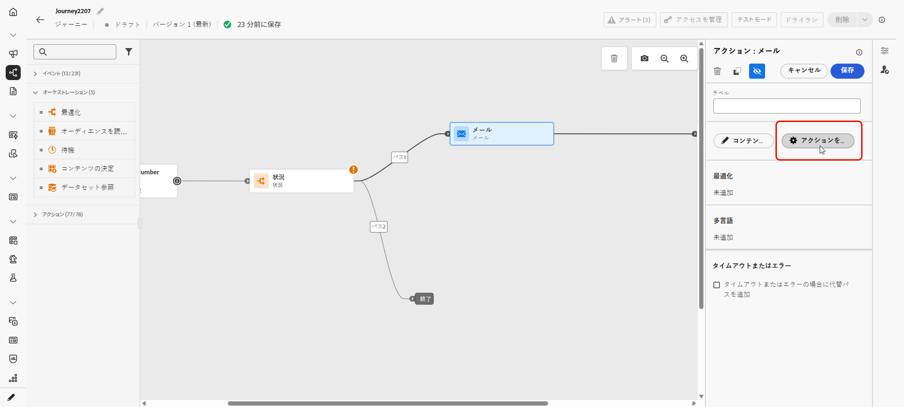
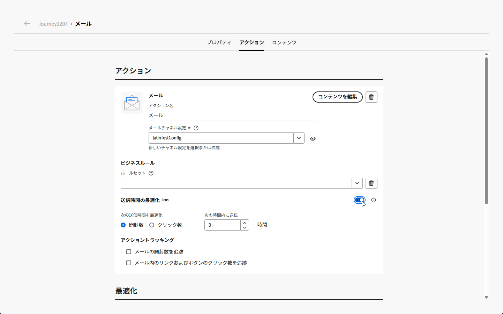
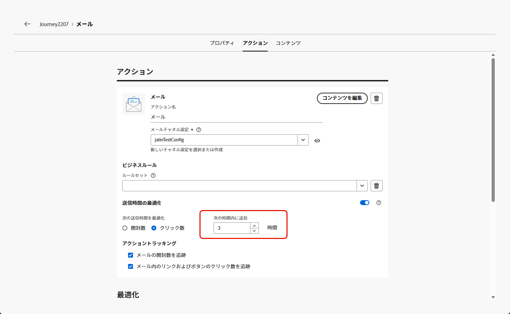
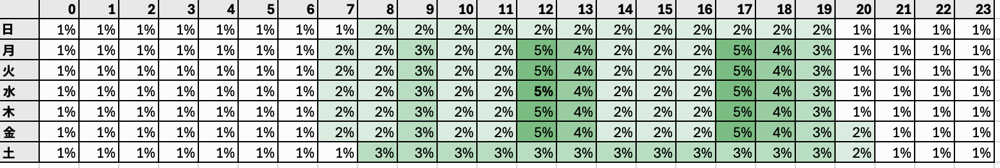
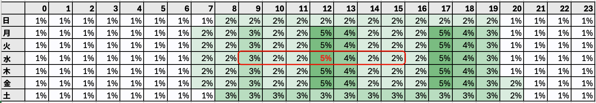

# 送信時間の最適化{#send-time-optimization}

>[!BEGINSHADEBOX]

**このページ：** AdobeのAIが、各顧客の過去の開封履歴とクリック履歴に基づいて、メールとプッシュメッセージを配信する最適な時間を予測できるように、送信時間の最適化を有効にする方法を説明します。

>[!ENDSHADEBOX]

>[!CONTEXTUALHELP]
>id="jo_bestsendtime_disabled"
>title="送信時間の最適化について"
>abstract="アドビの AI サービスを利用した、[!DNL Adobe Journey Optimizer] の送信時間最適化機能は、メールまたはプッシュメッセージの送信に最適な時間を予測し、過去の開封率とクリック率に基づいてエンゲージメントを最大化できます。"

>[!CONTEXTUALHELP]
>id="jo_bestsendtime_email"
>title="送信時間最適化のアクティベート"
>abstract="ラジオボタンでは、メール開封数を最適化するか、メールクリックスルー数を最適化するかを決定します。 また、システムで使用される送信時間は、「次の時間内に送信」オプションの値で区切ることもできます。"

>[!CONTEXTUALHELP]
>id="jo_bestsendtime_push"
>title="送信時間最適化のアクティベート"
>abstract="プッシュメッセージではクリック数が適用されないため、デフォルトは「開封数」オプションになります。 また、システムで使用される送信時間は、「次の時間内に送信」オプションの値で区切ることもできます。"

AdobeのジャーニーAI サービスを活用した[!DNL Adobe Journey Optimizer]の送信時間の最適化機能では、顧客の過去の開封履歴やクリック履歴に基づいて、顧客エンゲージメントを最大化するために、電子メールやプッシュメッセージの最適な送信時間を選択します。

送信時間の最適化は、Journey Optimizer のビルトインのメールおよびプッシュアクションタイプでのみ使用できます。カスタムアクションを通じて送信されるメッセージやその他のアクションタイプでは現在使用できません。 送信時間の最適化は、ジャーニー内のメールおよびプッシュアクションでのみ使用できます。キャンペーンを通じて送信されるメッセージでは現在使用できません。

>[!AVAILABILITY]
>
>* リクエストに応じて、[!DNL Adobe Journey Optimizer]人のお客様に対して送信時間最適化機能が有効になります。 組織でこの機能を有効にするには、アドビカスタマーケアまたはアドビ担当者にお問い合わせください。
>
>* 送信時間の最適化は、**メール**&#x200B;チャネルと&#x200B;**プッシュ通知**&#x200B;チャネルにのみ適用されます。
>
>* Send-Time Optimizationは、次のAEP ハブ リージョンでサポートされています：**VA7、NLD2、AUS5、CAN2、GBR9、IND2、CHE2**。 これらはAdobe デプロイメントのリージョン コードです。組織がどのリージョンを使用しているかわからない場合は、Adobe担当者にお問い合わせください。
>

## 送信時間の最適化の使用{#use-send-time-optimization}

メールまたはプッシュアクションで送信時間の最適化を有効にして設定するには、次の手順に従います。

始める前に、オンにする前に、どのメッセージが適しているかを検討してください。 送信時間の最適化は、注文確認、パスワードリセット通知、フライトゲート変更通知など、緊急の時間制限のある運用メッセージには使用しないでください。 週次広告、新製品のプロモーション情報、1 ヶ月分のセール情報など、緊急性の低いマーケティングコミュニケーションに最適です。

1. ジャーニーから、**[!UICONTROL Configure action]** メニューを開きます。

   

1. 送信時間最適化メニューの&#x200B;**[!UICONTROL 送信時間最適化]** スイッチをオンにします。

   

1. メールメッセージの場合は、適切なオプションを選択して、開封数とクリックスルー数のどちらを最適化するかを選択します。 プッシュメッセージは、開封数に関して常に最適化されます。

   最適な結果を得るには、**クリック数**&#x200B;のほとんどの電子メールを最適化してください。 メッセージが情報提供であり、特定のアクションを促すためのものではない場合は、**Opens**&#x200B;を選択します。

1. 電子メールとプッシュメッセージの両方で、**[!UICONTROL 次の]**&#x200B;以内に送信する時間を、システムがメッセージを送信するまでの最大時間数（2 ～ 100）に設定します。

   最適な結果を得るには、6 ～ 24時間の値を選択してください。 値を小さくすると、使用可能な送信時間が減り、送信時間の最適化のメリットが制限される可能性があります。 値が大きいほど、メッセージが古くなったり、送信されるまでに関連性が低くなったりする可能性があります。

   

1. メールメッセージの場合は、アクショントラッキングの設定方法を選択します。 電子メールの開封率を追跡したり、電子メール内のリンクやボタンのクリック数を追跡したりできます。

ジャーニーをアクティブ化し、顧客がジャーニーのメールアクションまたはプッシュアクションに到達すると、送信時間の最適化により、指定した制限内で各ユーザーに使用できる最適な予測送信時間が選択されます。

ジャーニーのパフォーマンスを監視するには、[概要ページ &#x200B;](../reports/channel-report-cja.md)を参照してください。

## 送信時間の最適化の仕組み {#how-send-time}

Send-Time Optimization モデルは、組織の[!DNL Adobe Journey Optimizer]件の顧客行動データを収集し、ユーザーレベルの開封済みイベントとクリック済みイベントを調べて、顧客がメッセージにエンゲージする可能性が最も高いタイミングを判断します。

送信時間の最適化では、次の 3 つのタイプの行動データに基づいて、各ユーザーに対する 1 週間の時間ごとの予測を行います。

1. ユーザー全体の行動
1. 同じタイムゾーンにいる類似ユーザーの行動
1. その個々のユーザーの行動

これらの予測は、ベイジアンアプローチを使用して重み付けされ、組み合わせられます。その結果、各顧客について、各指標（メールの開封数、メールのクリック数、プッシュの開封数）の「ヒートマップ」が作成されます。これは、以下のヒートマップの例に示すように、そのユーザーと連絡することで目的のエンゲージメント結果（開封数数／クリック数）が得られる可能性が最も高い 1 週間の時間と最も低い 1 週間の時間を示します。

上記の予測確率を持つユーザーが、送信時間の最適化をオンに切り替えて最大待機時間を 7 時間に設定し、水曜日の午前 9 時にメッセージを送信する場合、メッセージの送信時間は午後 12 時になります。

## 送信時間の最適化モデルのトレーニングとスコアリングの詳細  {#model-send-time}

組織で送信時間の最適化機能を有効にすると、そのアクションで送信時間の最適化が使用されるかどうかに関係なく、過去 16 週間にわたる組織のすべてのジャーニーとアクションのメールおよびプッシュの送信、開封、クリックイベントについてジャーニー AI モデルのトレーニングが行われます。 これにより、送信時間の最適化では顧客が生成したすべてのデータを活用できます。

モデルは、最初にトレーニングが行われ、毎週スコアリングされます。 16 週間後、モデルは毎月、再トレーニングが行われ、再スコアリングされます。 モデルのスコアリングには、前回のスコアリング実行以降の既存および新規のすべての顧客プロファイルが含まれます。

送信時間の最適化によって送信されたメッセージでは、様々な送信時間をテストして顧客の反応を確認するのに選択された「探索」メッセージ送信時間や、クリック／開封率を最大化するのに選択された「最適化」メッセージ送信時間のいずれかを受信します。 送信イベントの 5％は「探索」送信時間を受信し、送信イベントの 95％は「最適化」されます。

探索送信時間は、設定された最大待機時間で使用可能な送信時間からランダムに選択されます。 例えば、送信時間の最適化をオンに切り替えて、最大待機時間を 3 時間に設定し、水曜日の午前 9 時にメッセージを選択した場合、メッセージの探索送信時間は午前 9 時、午前 10 時、午前 11 時、午後 12 時に均等に分割されます。

## よくある質問 {#faq-send-time}

送信時間の最適化に関するよくある質問を以下に示します。

さらに詳細が必要ですか？ このページの下部にあるフィードバックオプションを使用して質問を提起するか、[[!DNL Adobe Journey Optimizer]  コミュニティ &#x200B;](https://experienceleaguecommunities.adobe.com/t5/adobe-journey-optimizer/ct-p/journey-optimizer?profile.language=ja){target="_blank"}とつながってください。

+++送信時間の最適化を使用する前に、どのくらいの時間を待機する必要がありますか？

組織では、メール内で送信時間の最適化を使用する前に、少なくとも 30 日間は Journey Optimizer 内でメールアクションを使用して、メールの送信、開封、クリックイベントの一部を収集できるようにする必要があります。

組織では、プッシュ内で送信時間の最適化を使用する前に、少なくとも 30 日間は Journey Optimizer 内でプッシュアクションを使用して、プッシュの送信と開封イベントの一部を収集できるようにする必要があります。

組織で既にメールやプッシュのアクションタイプを 30 日以上使用している場合は、アドビが送信時間の最適化を有効にした後に、組織では送信時間の最適化を使用するのにそれ以上待機する必要はありません。 組織で最大 16 週間にわたってデータを収集するにつれて、結果は引き続き改善されます。

+++

+++特定のユーザーがメッセージを受信する送信時間を確認するにはどうすればよいですか？

プロファイルリッチネスに対するモデルの影響を最小限に抑えることを目的に、モデルスコアは `_experience.intelligentServices.journeyAI.sendTimeOptimization` に保存される 3 つのプロファイル属性に圧縮されて保存されます。人間が判読できるように設計されていません。

+++

+++送信時間の最適化の平均的なメリットは何ですか？

送信時間の最適化により、組織が最適化したすべてのメッセージにわたって、メールのクリック率とプッシュ開封率が約 2％～10％増加する場合があります。

例えば、送信時間の最適化を行わずにメールを送信する組織の平均クリック率が 5.0％の場合、送信時間の最適化を行った同じメールセットでは、平均クリック率が 5.5％に達する可能性があります（5.0% * (1+10%) = 5.5%）。

小さなサンプルサイズ内では変動が生じるので、単一メッセージの送信では送信時間の最適化によるメリットが確認できない場合があります。

組織は、次のような場合に、送信時間の最適化を使用することでより大きなメリットが得られる可能性が高くなります。

* 既存のジャーニーで送信時間が固定されており、十分に最適化されていない
* 顧客行動（クリック数および開封数）の変動が、顧客の場所や顧客の好みに応じて異なる
* 組織がメールメッセージとプッシュメッセージの大部分で送信時間の最適化を使用している
* 組織が推奨される 6～12 時間の範囲内で最大待機時間を選択する

+++

+++常に午後 12 時にメールメッセージやプッシュメッセージをクリックしますが、アルゴリズムが午後 12 時にメッセージを送信しなかったのはなぜですか？

これは、次のような複数の理由で発生する場合があります。

* 「最適化」メッセージ送信時間ではなく、「探索」メッセージ送信時間としてメッセージが選択された。
* 類似ユーザーの行動が、モデルに影響を与え、別の送信時間を推奨した。

+++

+++送信時間の最適化では、ユーザーのタイムゾーンをどのように認識しますか？

送信時間の最適化では、`timeZone` プロファイルフィールドを使用してユーザーのタイムゾーンを決定します。 そのユーザーが使用できない場合、送信時間の最適化では、国や都道府県など、ユーザーのプロファイル内の他の地理情報からユーザーのタイムゾーンを推測しようとします。

+++

+++送信時間の最適化では、ユーザーのローカルタイムゾーンの夜間にプッシュメッセージが送信されますか？

送信時間の最適化では、次の状況で、ユーザーのローカルタイムゾーンの夜間にプッシュメッセージが送信される場合があります。

* ユーザーが夜間に送信されたメッセージとやり取りする可能性が高いことを示す行動を示した場合
* モデルが「探索」送信時間を選択した場合

夜間に顧客にプッシュメッセージを送信しないようにするには、バッチプッシュメッセージの送信を午前中または午後の早い時間に行うようにスケジュールし、送信時間の最適化の期間を短く選択します （例えば、送信時間を午前 9 時、最大待機時間を 8 時間に設定します）。

+++

+++ AI ナレッジリファレンス

このセクションには、このトピックに関連する解釈、検索、質問への回答をサポートすることを目的とした構造化された知識が含まれています。

理解を深めるには、この情報をこのページのドキュメントと組み合わせる必要があります。 どちらのソースも単独で使用することを意図していません。このページでは、機能について説明しますが、この節では、用語、意図、適用可能性、および制約の曖昧さを解消するのに役立つ追加のコンテキストを提供します。

* **TL;DR:**&#x200B;このページでは、Adobe Journey Optimizerで送信時間の最適化を設定および使用する方法について説明します。この機能は、AIを活用して、エンゲージメントを最大化するために、各個人にメールまたはプッシュメッセージを送信する最適な時間を予測する機能です。

**インテント：**
* 電子メールまたはジャーニー内のプッシュアクションに対する送信時間の最適化を有効にする
* メールメッセージの開封率とクリック率を最適化するかどうかを選択します
* 遅延配信の最大待機時間（次の時間内に送信）を設定します
* AI モデルが行動データを使用して最適な送信時間を予測する方法を理解する
* 特定のメッセージタイプに適した送信時間最適化かどうかを判断します

**用語集：**
* **送信時間最適化（STO）**：設定された時間枠&#x200B;*（製品固有）*&#x200B;内に、予測された最適なエンゲージメント時間まで各プロファイルへのメッセージ配信を遅らせる、AIを活用した機能
* **ジャーニーAI**: Journey Optimizer *（製品固有）*&#x200B;内のSend-Time Optimizationを強化するAdobeのAI サービス
* **探索送信時間**：ランダムに選択された送信時間（送信の5%に使用）を使用して、異なる時間をテストし、モデルの精度を向上させます&#x200B;*（製品固有）*
* **送信時間の最適化**: クリック率または開封率を最大化するために選択されたモデルで予測される送信時間（送信の95%に使用） *（製品固有）*
* **次の**&#x200B;以内に送信：システムがメッセージを特定のプロファイル *（製品固有）*&#x200B;に送信するまでの最大時間数（2 ～ 100）

**ガードレール：**
* Send-Time Optimizationは、組織のAdobeで有効にする必要があります。Adobe カスタマーケアまたはAdobe担当者に連絡して有効にしてください。
* Send-Time Optimizationは、ジャーニー内のメールおよびプッシュ通知チャネルにのみ適用されます。キャンペーンやカスタムアクションでは使用できません。
* Send-Time Optimizationが意味のある結果を生成するには、Journey Optimizerでメールまたはプッシュのアクションを少なくとも30日間使用している必要があります。
* 緊急性の高いメッセージや時間制限のある運用メッセージ（注文確認、パスワードリセット、フライトゲートの変更など）には、Send-Time Optimizationを使用しないでください。
* 最大待機時間の範囲は2 ～ 100時間です。最良の結果を得るには、推奨される範囲は6 ～ 24時間です。
* モデル スコアは`_experience.intelligentServices.journeyAI.sendTimeOptimization`のプロファイル属性に保存され、人間が読み取ることはできません。
* モデルは毎週トレーニングされ、その後16週間後に毎月再学習およびスコアリングされます。

**用語：**
* 正規名：送信時間最適化 – 頭字語：STO – 変種：最適な送信時間、送信時間AI、インテリジェントな送信時間
* 同義語：「送信時間の最適化」 = 「最適な送信時間」 = 「AI送信時間」
* 「探索の送信時間」≠「最適化された送信時間」は混同しないでください（探索はモデルテストではランダムです。最適化はエンゲージメントのためにモデル予測されます）

**FAQ:**
* **Q：送信時間の最適化をサポートしているチャネルはどれですか？** — ジャーニー内のメールおよびプッシュ通知チャネルのみ。キャンペーンおよびカスタムアクションはサポートされていません。
* **Q：電子メールの開封数またはクリック数を最適化する必要がありますか？**  – ほとんどのメールのクリック数を最適化します。 メッセージが情報提供であり、特定のアクションを促すことを意図していない場合は、「開く」を選択します。
* **Q：組織がSTOを有効にするまでにどのくらい待つ必要がありますか？**  – 十分な行動データを収集するには、Journey Optimizerでの電子メールまたはプッシュ通知の使用方法が少なくとも30日間必要です。 結果は最大16週間にわたって改善し続けます。
* **Q: STOは夜間にプッシュ通知を送信できますか？**  – はい、ユーザーの行動が夜間のエンゲージメントを示唆している場合や、探索の送信時間が選択されている場合に使用できます。 これを避けるには、最大待機時間が短いモーニング送信時間を使用します。
* **Q: Send-Time Optimizationの期待されるメリットは何ですか？** — メールのクリック率またはプッシュ開封率は、最適化されたすべてのメッセージで約2～10%改善しますが、個々の少量の送信ではメリットが観察できない場合があります。

+++

