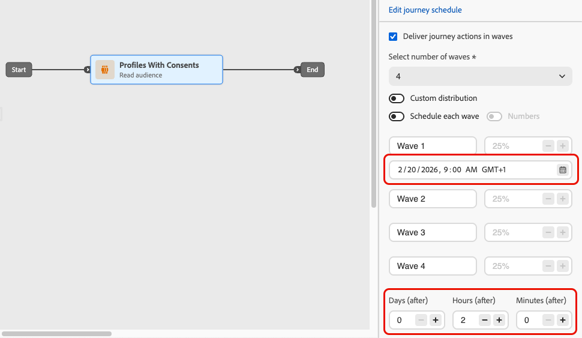

# ジャーニーでのウェーブを使用した送信 {#send-using-waves-journeys}

>[!AVAILABILITY]
>
>この機能は限定提供（LA）です。 アクセス権を取得するには、アドビ担当者にお問い合わせください。

アウトバウンドメッセージは、すべてを一度に配信するのではなく、ジャーニーからバッチ（ウェーブ）で時間の経過と共に配信できます。 ウェーブ送信は、負荷の分散、ダウンストリームの過剰なシステム（コールセンターやランディングページなど）の回避、配信品質と送信者の評価のサポートに役立ちます。特に、大量のオーディエンスを読み取るジャーニーの場合に役立ちます。

<!--
>[!CAUTION]
>
>Wave sending is available for read audience journeys only and applies to **outbound** actions only (Email, SMS, Push, Direct mail).-->

オーディエンスのエントリ方法とアクションのスケジュール方法を定義する際に、ジャーニーレベルで設定します。 ウェーブの数、サイズ（オーディエンスのパーセンテージまたは絶対数）、および各ウェーブの実行時間を定義します。

## 制限とガードレール {#limitations-guardrails}

* ウェーブ送信は、**[!DNL As soon as possible]** および **[!UICONTROL 1 回]** スケジューラータイプを持つオーディエンスを読み取りジャーニーでのみ使用できます。 詳しくは、[ ジャーニースケジュール ](read-audience.md#schedule) を参照してください。
* ウェーブ送信は、繰り返しジャーニー、イベントトリガー型ジャーニー、ビジネスイベント型ジャーニー、テストモードまたはドライラン型ジャーニーでは使用できません。
* 少なくとも **2 ウェーブ** を定義する必要があり、最大 **10 ウェーブ** を追加できます。
* 2 つのウェーブの開始間の最小間隔は **30 分** です。
* ウェーブ開始をジャーニー開始より前または過去にすることはできません。
* オーディエンスをウェーブに分割するには、最大 1 時間かかる場合があります。 プロファイルは、その時までジャーニーにエントリできません。
* 1 つのジャーニーバージョン内では、2 つのウェーブが同時に実行されることはありません。 次のウェーブは、前のウェーブが終了した後にのみ開始します。 例えば、ウェーブが 1 時間離れてスケジュールされていても、最初のウェーブが 2 時間実行される場合、2 番目のウェーブは、スケジュールされた時間ではなく、最初のウェーブが終了したときに開始されます。
* プラットフォームが割り当て量の制限を適用する場合や、システム容量の負荷が高い場合は、ウェーブ開始を遅延させることができます。

## ジャーニーでのウェーブ送信の設定 {#configure-wave-sending}

1. [ オーディエンスを読み取り ](read-audience.md) アクティビティでジャーニーを開始します。

1. **[!UICONTROL オーディエンスを読み取り]** アクティビティをダブルクリックしてプロパティを開き、「**[!UICONTROL ジャーニーアクションをウェーブで配信]**」オプションを選択します。

   {width="100%"}

1. **ウェーブの数** を設定します（例：4）。

   {width="80%"}

   >[!NOTE]
   >
   >少なくとも 2 つのウェーブを定義する必要があり、最大 10 個のウェーブを追加できます。

1. 以下に説明するように、ウェーブサイズとタイミングを定義する方法を選択します。

### 等しい波 {#equal-waves}

デフォルトでは、オーディエンスは同じサイズのウェーブに分割されます。 各ウェーブの開始間の固定間隔（例：2 時間）を設定します。

{width="70%"}

>[!NOTE]
>
>2 つのウェーブの開始間の最小間隔は **30 分** です。

次に、システムは自動的に後続のウェーブのスケジュールを設定します（例えば、最初のウェーブ :00 午前 9 時、2 番目のウェーブは午前 11:00、3 番目のウェーブは午後 1:00、4 番目のウェーブは午後 3:00）。

### カスタム配分 {#custom-distribution}

**[!UICONTROL カスタム配分]** オプションを選択して、各ウェーブのサイズを合計オーディエンスの割合（例：15%、20%、25%、40%）として定義します。

{width="70%"}

**[!UICONTROL 数値]** を選択して、各ウェーブのサイズをプロファイルの絶対数として定義します（例：10,000、50,000）。

{width="70%"}

>[!NOTE]
>* 割合を使用する場合は、すべてのウェーブの合計が 100% である必要があります。 そうでない場合は、警告が表示されます。
>* 数値を使用する場合、システムはカバレッジを検証しません。ウェーブサイズが対象オーディエンスをカバーしていることを確認します。 [詳細情報](#faq)

### カスタムスケジュール {#custom-schedule}

**[!UICONTROL 各ウェーブをスケジュール]** を選択して、各ウェーブの特定の開始日時を定義します。 波は、均等に配置する必要はありません（例えば、午前 9:00、午前 11:00、午後 5:00、午後 8:30）。

{width="70%"}

>[!NOTE]
>
>2 つのウェーブの開始間の最小間隔は **30 分** です。

## ユースケース {#use-cases}

Wave 送信は、送信するメッセージのタイミングと数を制御するのに役立ちます。これにより、配信品質の向上、送信者のレピュテーションの保護、運用能力に合わせた送信が可能になります。 次のシナリオでは、ウェーブの使用を検討します。

* **コールセンターまたは応答管理：** 下流チーム（カスタマーケアなど）が応答を処理できるように、1 日または 1 時間に送信するメッセージ数を制限します。 例えば、コールセンターの処理能力に合わせて、1 日に 20 メッセージを送信します。

  {width="55%"}

* **大量の配信と配信品質：** 非常に大きなジャーニーを 1 回で送信することは避けます。 送信者の評判を維持し、スパムとしてフラグ付けされるリスクを軽減するために、配信を時間の経過と共に分散させる。

  {width="55%"}

* **ランプアップ：** 新しいプラットフォームまたは IP を使用する場合は、ボリュームを徐々に増やし（例えば、最初のウェーブで 10%、次に 15%、20% など）、評判を徐々に構築します。

  {width="55%"}

## よくある質問 {#faq}

+++ 波のサイズの合計がオーディエンスの合計と等しくない場合はどうなりますか？

* ウェーブサイズの合計がオーディエンス **超える** 場合（例えば、最初のウェーブで 10 万をスケジュールし、オーディエンスが 10 万の場合）、最初のウェーブは完全なオーディエンスに送信され、残りのウェーブには送信先が残っていません。これらのウェーブは実行されません。
* 合計がオーディエンス **下** の場合（例えば、100,000 のオーディエンスに対して 40,000 件のプロファイルを合計した 4 つのウェーブを定義）、それらのウェーブに含まれるプロファイルのみがメッセージを受信します。 残りのオーディエンスは通信を受信せず、後のウェーブでは再試行されません。

+++

+++ 個々のウェーブに異なるセグメントや条件を割り当てることはできますか？

ウェーブのサイズとタイミングのみを定義できます。 同じオーディエンスがジャーニーを進みます。個々のウェーブに異なるセグメントや条件を割り当てることはできません。

+++

## 関連トピック {#see-also}

* [ ジャーニーでのオーディエンスの使用 ](read-audience.md) - オーディエンスを読み取りアクティビティを設定します。
