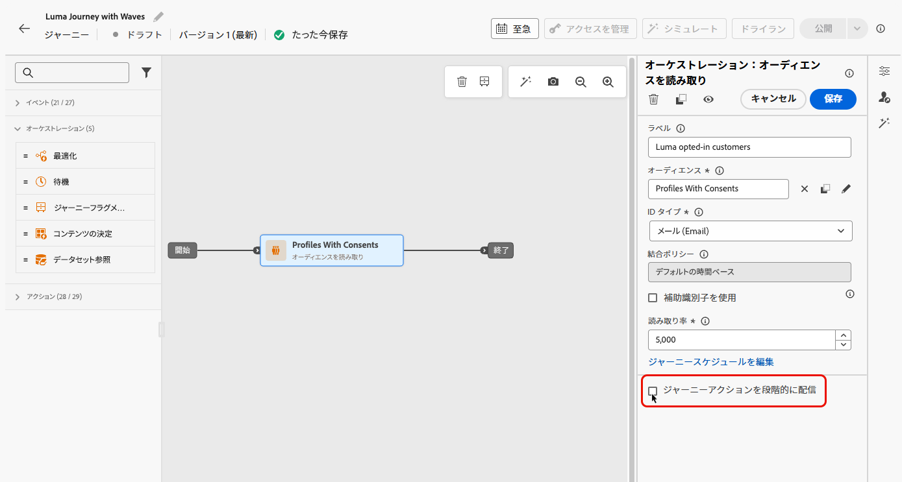
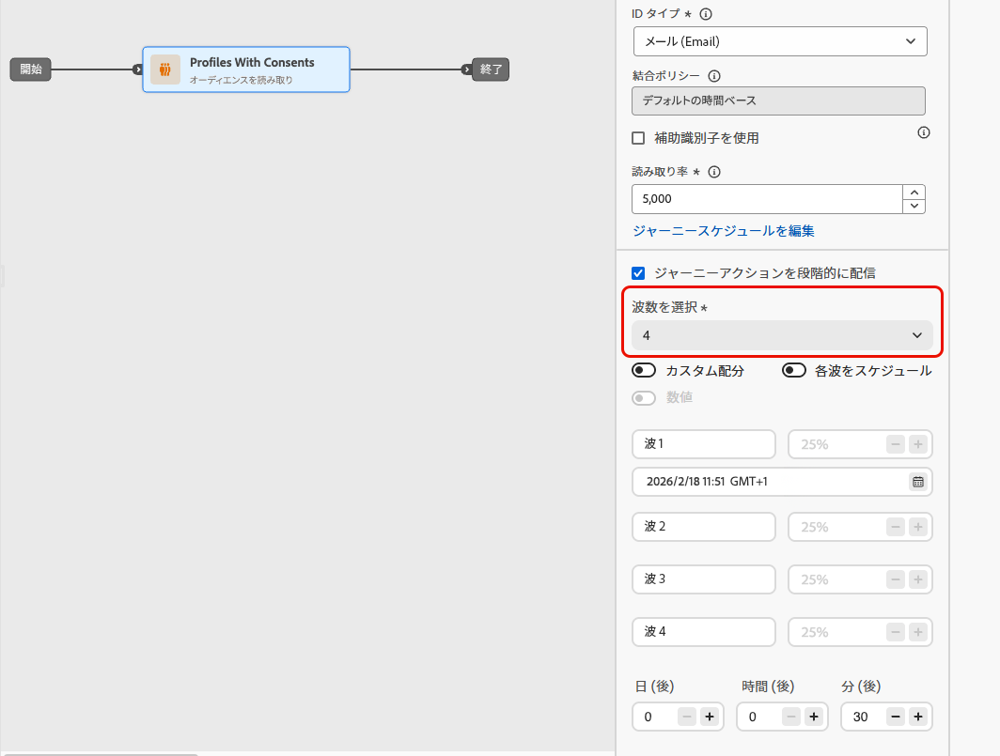
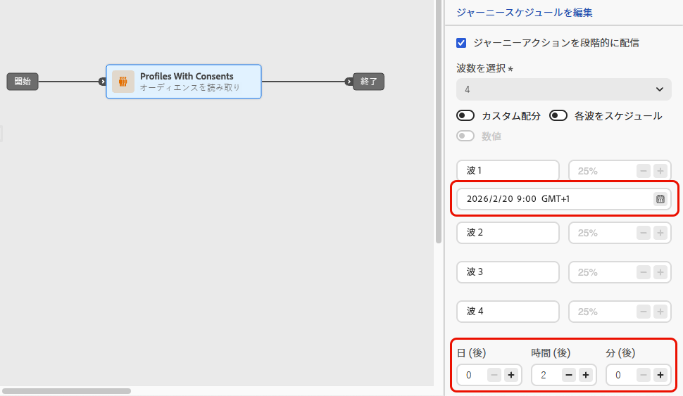
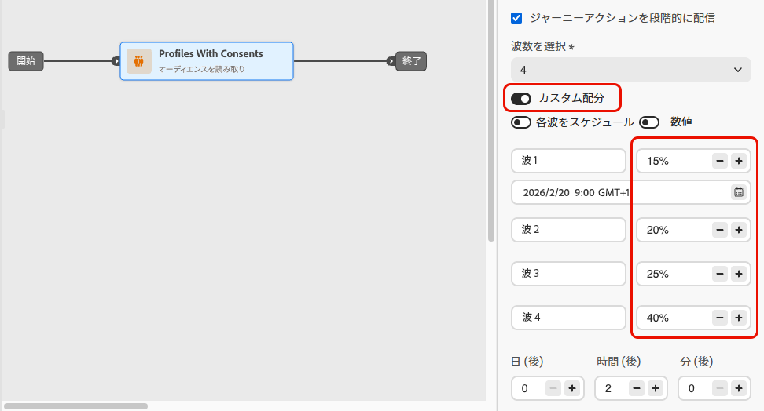
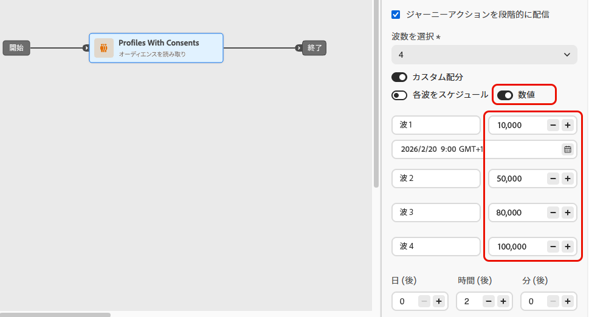
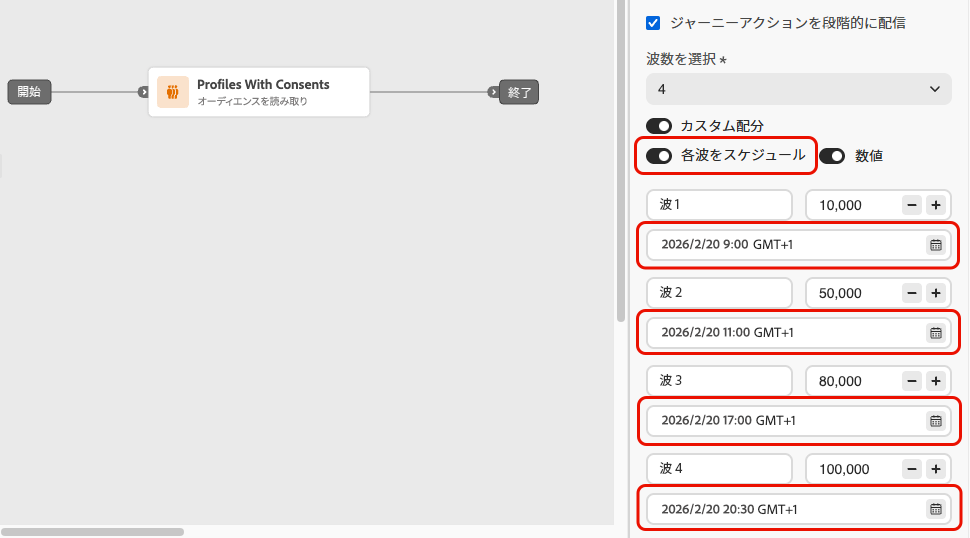
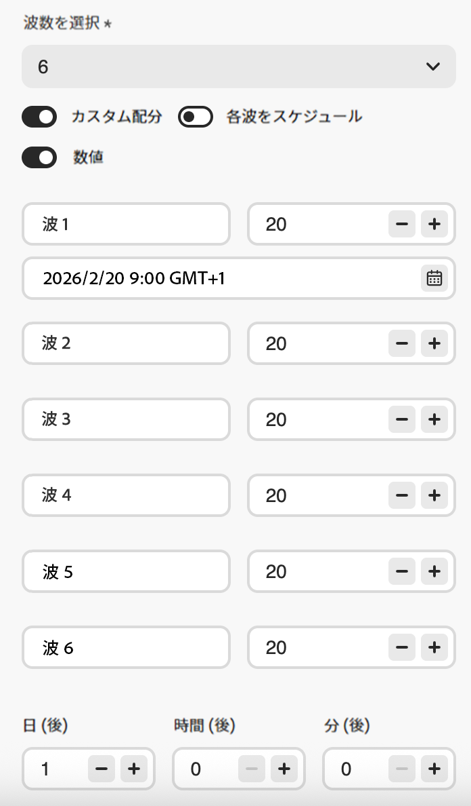
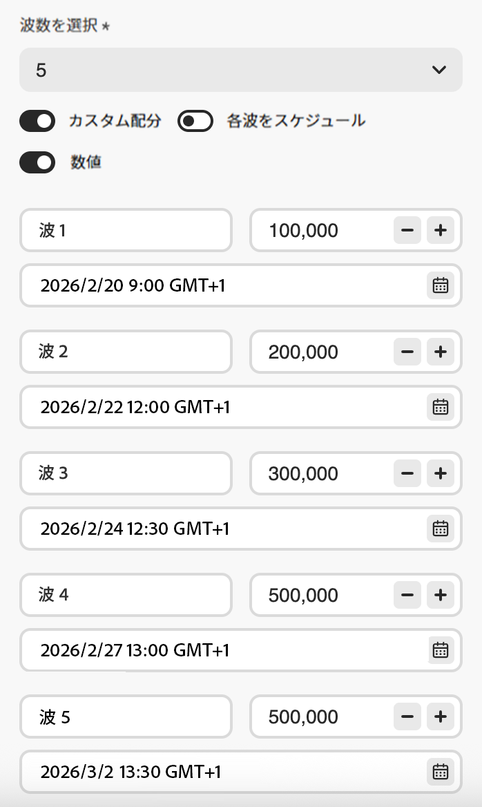
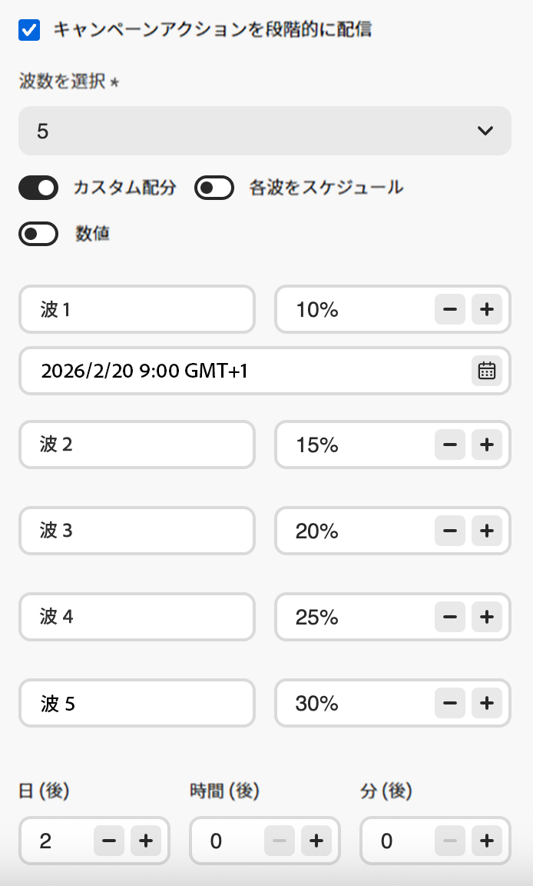

# ジャーニーでのウェーブを使用した送信 {#send-using-waves-journeys}

>[!BEGINSHADEBOX]

**このページでは、**&#x200B;読み取りオーディエンスジャーニーから送信メッセージをウェーブと呼ばれるスケジュールされたバッチで配信し、負荷のバランスを取り、下流システムを保護し、配信品質をサポートする方法について説明します。

>[!ENDSHADEBOX]

ジャーニーからのアウトバウンドメッセージを、一度にではなくバッチ（ウェーブ）で送信できます。 ウェーブ送信は、負荷のバランスを取り、ダウンストリームの圧倒的なシステム（コールセンターやランディングページなど）を回避し、配信品質と送信者のレピュテーション（特に大量の読み取りオーディエンスジャーニー）をサポートするのに役立ちます。

<!--
>[!CAUTION]
>
>Wave sending is available for read audience journeys only and applies to **outbound** actions only (Email, SMS, Push, Direct mail).
-->

オーディエンスの入力方法とアクションのスケジュール方法を定義する場合は、ジャーニーレベルで設定します。 波の数、波のサイズ（オーディエンスのパーセンテージまたは絶対数）、および各波の実行時間を定義します。

## 制限とガードレール {#limitations-guardrails}

* ウェーブ送信は、**[!DNL As soon as possible]**&#x200B;および&#x200B;**[!UICONTROL Once]** スケジューラータイプの読み取りオーディエンスジャーニーでのみ使用できます。 詳しくは、[ ジャーニースケジュール ](read-audience.md#schedule)を参照してください。
* ウェーブ送信は、繰り返し、イベントトリガー、ビジネスイベント、テストモードまたはドライランのジャーニーでは使用できません。
* 少なくとも&#x200B;**2個のウェーブ**&#x200B;を定義する必要があり、最大&#x200B;**10個のウェーブ**&#x200B;を追加できます。
* 2つのウェーブの開始の最小間隔は&#x200B;**30分**&#x200B;です。
* ウェーブ開始は、ジャーニー開始の前または過去にすることはできません。
* オーディエンスを波に分割すると、最大1時間かかる場合があります。 プロファイルはその時点までジャーニーにエントリしない場合があります。
* 1つのジャーニーバージョン内では、2つの波が同時に実行されることはありません。 次の波は、前の波が終わった後にのみ始まります。 例えば、波が1時間間隔でスケジュールされているが、第1波が2時間実行されている場合、第2波は、スケジュールされた時間ではなく、第1波が終了したときに開始されます。
* ウェーブ開始は、プラットフォームがクォータ制限を適用する場合や、システム容量が負荷の大きい場合に遅れる可能性があります。

## ジャーニーでのウェーブ送信の設定 {#configure-wave-sending}

1. [ オーディエンスの読み取り](read-audience.md) アクティビティでジャーニーを開始します。

1. 「**[!UICONTROL オーディエンスを読み取り]**」アクティビティをダブルクリックしてプロパティを開き、「**[!UICONTROL ウェーブでジャーニーアクションを配信]**」オプションを選択します。

   {width="100%"}

1. **ウェーブ数** （例：4）を設定します。

   {width="80%"}

   >[!NOTE]
   >
   >少なくとも2つの波を定義し、最大10の波を追加できます。

1. 波のサイズとタイミングを定義する方法を以下に説明します。

### 等しい波 {#equal-waves}

デフォルトでは、オーディエンスは同じサイズのウェーブに分割されます。 各波の開始間隔（2時間など）を一定の間隔で設定します。

{width="70%"}

>[!NOTE]
>
>2つのウェーブの開始の最小間隔は&#x200B;**30分**&#x200B;です。

次に、後続の波を自動的にスケジュールします（例えば、午前9:00、午前11:00、午後1:00、午後3:00、第3）。

### カスタム配布 {#custom-distribution}

「**[!UICONTROL カスタム分布]**」オプションを選択して、各ウェーブのサイズをオーディエンス全体に対する割合で定義します（例：15%、20%、25%、40%）。

{width="70%"}

**[!UICONTROL Numbers]**&#x200B;を選択して、各波のサイズをプロファイルの絶対数として定義します（例：10,000; 50,000）。

{width="70%"}

>[!NOTE]
>* パーセンテージを使用する場合、すべての波は合計100%である必要があります。 そうでない場合は警告が表示されます。
>* 数値を使用する場合、システムはカバレッジを検証しません。ウェーブサイズが意図したオーディエンスをカバーしていることを確認してください。 [詳細情報](#faq)

### カスタムスケジュール {#custom-schedule}

**[!UICONTROL 各波のスケジュール]**&#x200B;を選択して、各波の特定の開始日時を定義します。 波の間隔を均等にする必要はありません（例えば、午前9:00、午前11:00、午後5:00、午後8:30）。

{width="70%"}

>[!NOTE]
>
>2つのウェーブの開始の最小間隔は&#x200B;**30分**&#x200B;です。

## ユースケース {#use-cases}

Wave送信は、送信するメッセージの数とタイミングを制御するのに役立ちます。これにより、配信品質を向上させ、送信者のレピュテーションを保護し、送信を運用能力に合わせることができます。 以下のシナリオでウェーブを使用することを検討してください。

* **コールセンターまたは応答管理：** 1日または1時間あたりのメッセージ数を制限して、ダウンストリーム チーム（カスタマーケアなど）が応答を処理できるようにします。 例えば、コールセンターのキャパシティに合わせて、1日あたり20通のメッセージを送信します。

  {width="55%"}

* **配信数と配信品質が多い：** 1回のショットで非常に大きなジャーニーの送信を避けます。 配信を長期的に分散することで、送信者のレピュテーションを維持し、スパムとしてフラグが立てられるリスクを低減します。

  {width="55%"}

* **ランプアップ：**&#x200B;新しいプラットフォームまたはIPを使用する場合、徐々にボリュームを増やして（たとえば、最初の波で10%、次に15%、20%など）、徐々にレピュテーションを構築します。

  {width="55%"}

## よくある質問 {#faq}

+++ 波のサイズの合計がオーディエンスの合計と等しくない場合はどうなりますか？

* 波のサイズの合計がオーディエンスの&#x200B;**を超える**&#x200B;場合（例えば、100,000人のオーディエンスの最初の波で100,000人をスケジュールする）、最初の波は完全なオーディエンスに送信され、残りの波には送信する残りの1人が残りません。実行されません。
* 合計&#x200B;**がオーディエンスより小さい**&#x200B;場合（例えば、100,000人のオーディエンスに対して合計40,000個のプロファイルを含む4つのウェーブを定義する）、これらのウェーブに含まれるプロファイルのみがメッセージを受信します。 他のオーディエンスは通信を受け取らず、後の波で再試行されません。

+++

+++ 個々のウェーブに異なるセグメントや基準を割り当てることはできますか？

波のサイズとタイミングのみを定義できます。 同じオーディエンスがジャーニーを流れます。個々のウェーブに異なるセグメントや基準を割り当てることはできません。

+++

## 関連トピック {#see-also}

* [ ジャーニーでオーディエンスを使用](read-audience.md) - オーディエンスの読み取りアクティビティを設定します。

+++ AI ナレッジリファレンス

このセクションには、このトピックに関連する解釈、検索、質問への回答をサポートすることを目的とした構造化された知識が含まれています。

理解を深めるには、この情報をこのページのドキュメントと組み合わせる必要があります。 どちらのソースも単独で使用することを意図していません。このページでは、機能について説明しますが、この節では、用語、意図、適用可能性、および制約の曖昧さを解消するのに役立つ追加のコンテキストを提供します。

* **TL;DR:**&#x200B;このページでは、Adobe Journey Optimizerでウェーブ送信を設定してオーディエンスジャーニーを読み取り、制御されたバッチで送信メッセージを長期的に配信し、配信品質を向上させ、送信者のレピュテーションを保護する方法について説明します。

**インテント：**
* オーディエンスを読み取りジャーニーでのウェーブ送信を有効にして、メッセージを一括配信します
* 各波の間隔を固定した等波を設定します
* カスタム波サイズをパーセンテージまたは絶対プロファイル数として定義します
* カスタムスケジューリングを使用して、特定の開始日時で各波をスケジューリングします
* 送信者のレピュテーションを保護したり、業務上のキャパシティに合わせて配信量を管理したい

**用語集：**
* **ウェーブ送信**：読み取りオーディエンスをバッチ（ウェーブ）に分割し、一度にすべてを送信するのではなく、スケジュールされた間隔で各バッチにメッセージを送信する配信モード *（製品固有）*
* **等波**: オーディエンスが等幅の部分に分割され、波の間隔が固定された波の設定は、*（製品固有）*&#x200B;を開始します
* **カスタム配布**：各ウェーブのサイズをパーセントまたはプロファイルの絶対数として手動で定義するウェーブ構成&#x200B;*（製品固有）*
* **カスタムスケジュール**：各波に特定の開始日時が設定されており、不均等な間隔&#x200B;*（製品固有）*&#x200B;を許可する波形設定

**ガードレール：**
* ウェーブ送信は、「できるだけ早く」および「一度」スケジューラータイプを持つオーディエンスを読み取りジャーニーでのみ使用できます。繰り返しジャーニー、イベントトリガー型、ビジネスイベント型、テストモードまたはドライ実行ジャーニーでは使用できません。
* 最低2波、最大10波を定義する必要があります。
* 2つの連続した波の開始の最小間隔は30分です。
* 波の開始時間は、ジャーニーの開始前または過去にすることはできません。
* オーディエンスを波に分割するには、最大1時間かかります。プロファイルはその時間まで入力できません。
* 1つのジャーニーバージョン内では、2つのウェーブが同時に実行されることはありません。次のウェーブは、前のウェーブが終了した後にのみ開始されます。
* ウェーブの開始は、プラットフォームのクォータ制限やシステム負荷が大きい場合に遅れる可能性があります。
* パーセントベースのカスタム分布を使用する場合、すべてのウェーブの合計は100%である必要があります。
* 数値ベースのカスタム分布を使用する場合、システムは合計カバレッジを検証しません。ユーザーは、波のサイズが意図したオーディエンスをカバーしていることを確認する必要があります。
* 波のサイズがオーディエンスを超えると、最初の波はオーディエンス全体に送信され、残りの波は実行されません。
* 波のサイズがオーディエンスの合計よりも小さい場合は、定義された波のプロファイルのみがメッセージを受け取り、残りは再試行されません。

**用語：**
* 正規名：波形送信 – 頭字語：なし – バリエーション：バッチ配信、波形ベース配信、段階的な送信
* 同義語：「ウェーブ」 = 「バッチ」 = 「配信フェーズ」
* 混同しないでください。「波送信」≠「繰り返しジャーニー」（波送信は、1つのオーディエンスをタイムリーなバッチに分割します。繰り返しジャーニーは、スケジュールに従ってオーディエンスを再読み取りします）

**FAQ:**
* **Q：繰り返しジャーニーでウェーブ送信を使用できますか？**  – いいえ。ウェーブ送信は、「できるだけ早く」または「一度」スケジューラータイプの「オーディエンスを読み取り」ジャーニーでのみ使用できます。
* **Q: 2つのウェーブ間の最小時間を教えてください。**  – 連続する2つの波の開始の間に30分。
* **Q：波のサイズがオーディエンスの合計を上回った場合はどうなりますか？**  – 最初のウェーブは完全なオーディエンスに送信され、その後のウェーブには送信するプロファイルが残っておらず、実行されません。
* **Q：個々のウェーブに異なるコンテンツまたはセグメントを割り当てることはできますか？**  – いいえ。すべてのウェーブで同じオーディエンスとジャーニーコンテンツが使用されます。 波ごとにカスタマイズできるのはサイズとタイミングのみです。
* **Q：設定できるウェーブの数は？** — 1 ジャーニーにつき2～10 ウェーブの範囲。
* **Q: ウェーブ送信を使用するタイミング？**  – 大量の送信に対する送信者のレピュテーションを保護したり、ダウンストリームのチームのキャパシティ（コールセンターなど）に合わせて配信したり、新しいIPまたはプラットフォームで徐々に配信数を増やしたりするために使用します。

+++
