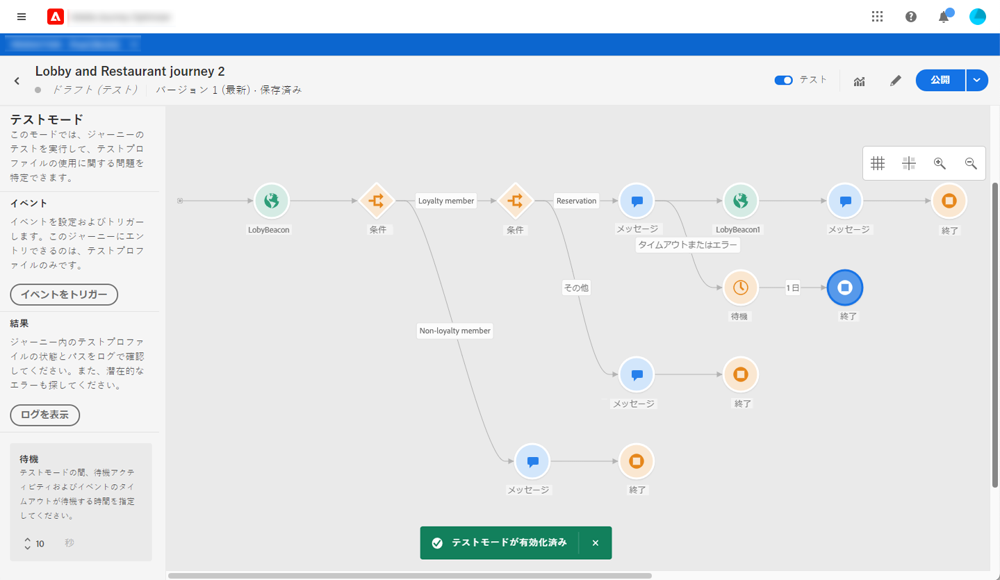
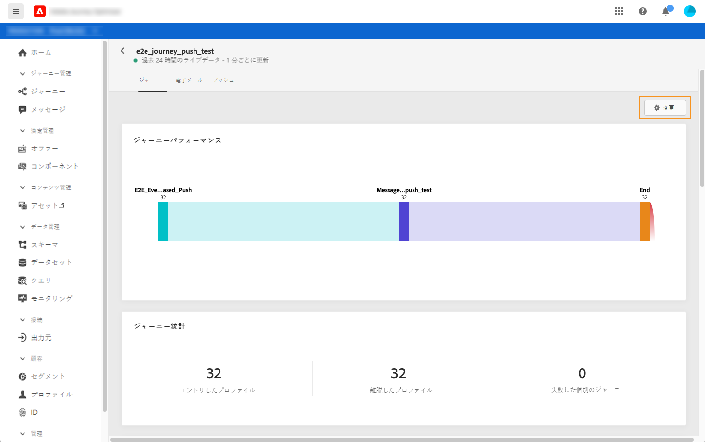
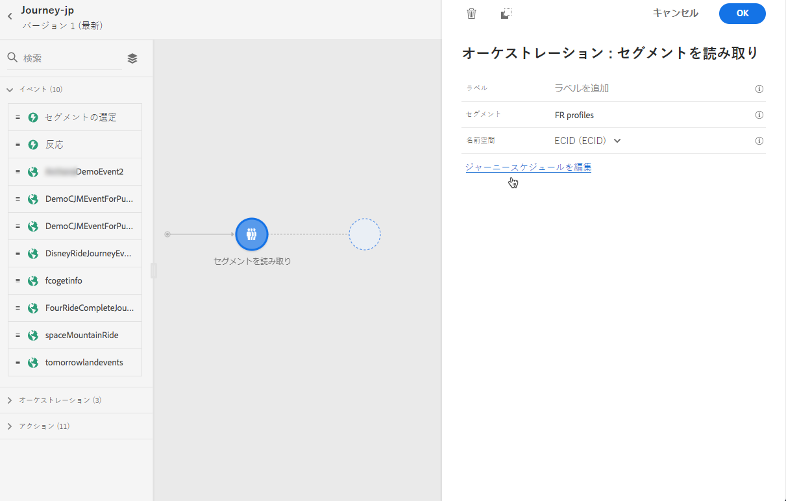
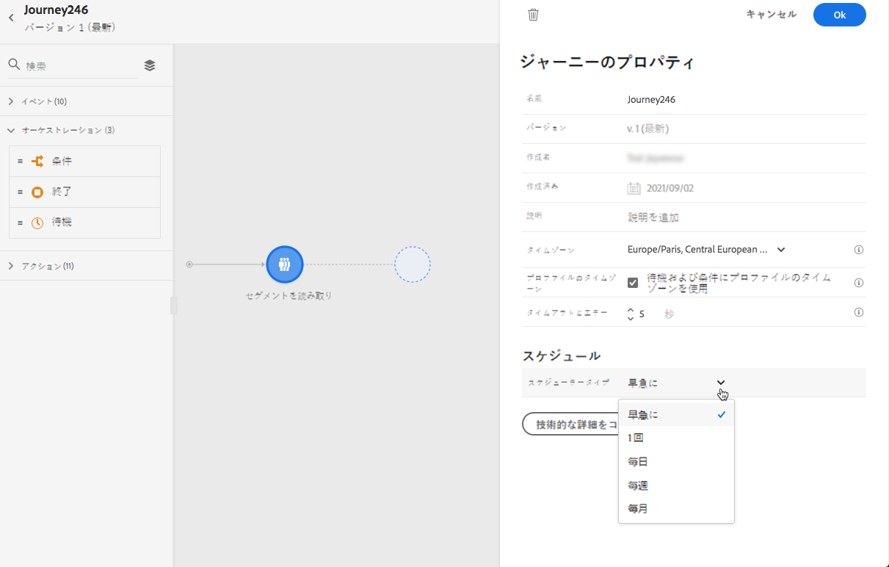
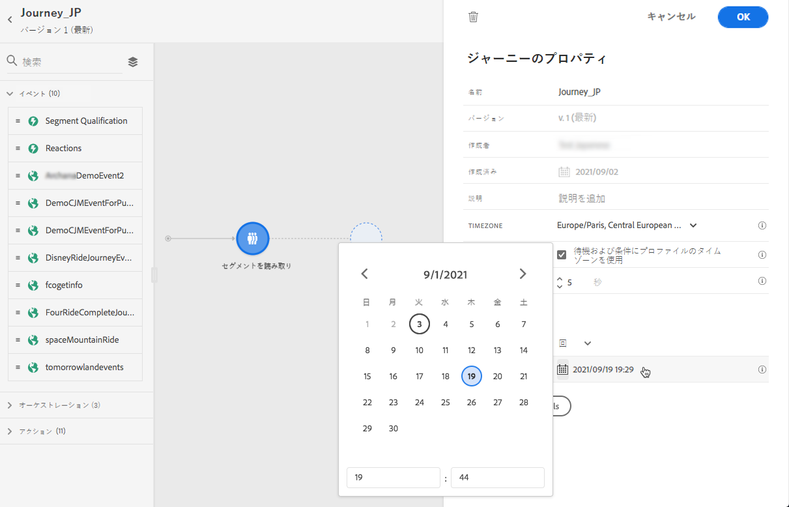
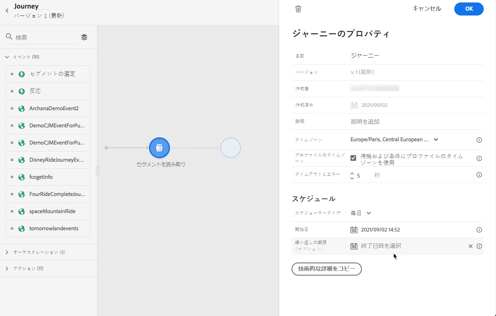

# ジャーニーの実行 {#message-execution}

## ジャーニーのテスト

テストプロファイルを使用してジャーニーをテストできます。設定とメッセージを検証する場合は、この手順を実行することをお勧めします。

詳しくは、この[節](testing-the-journey.md)を参照してください。

## ジャーニーの有効化

ジャーニーを公開して有効化する必要があります。

詳しくは、この[節](publishing-the-journey.md)を参照してください。

公開したら、専用のレポートツールを使用してジャーニーを監視し、ジャーニーの有効性を測定できます。

[レポートの詳細情報](../reports/live-report.md)

## メッセージの送信 {#send-messages}

メッセージでコンテンツを定義し、そのメッセージが公開されると、[ジャーニー](journey.md)を介して送信できる状態になります。

>[!NOTE]
>
>ドラフトモードのメッセージをジャーニーに追加することはできますが、ジャーニーを公開する前に、メッセージが公開されていることを確認してください。

メッセージが送信されたら、複数のインジケーターを使用してメッセージの実行を監視できます。[メッセージ実行の監視の詳細情報](../message-monitoring.md)。

## メッセージのスケジュール {#schedule-messages}

メッセージは、[ジャーニー](journey.md)の「**[!UICONTROL セグメントを読み取り]**」アクティビティを通じてスケジュールできます。セグメントがジャーニーにエントリするタイミングを指定できます。[セグメントの読み取りアクティビティの詳細](read-segment.md)。

これを行うには、以下の手順に従います。

1. ジャーニーを編集し、 **[!UICONTROL セグメントの読み取り]** アクティビティをドラッグ＆ドロップして設定を開始します。[セグメントの読み取りクティビティの設定の詳細](read-segment.md#configuring-segment-trigger-activity)。

1. 「**[!UICONTROL ジャーニースケジュールを編集]**」リンクをクリックして、ジャーニーのプロパティにアクセスします。

   

1. 「**[!UICONTROL スケジューラータイプ]**」フィールドを設定します。リストから目的の値を選択し、特定の日時または定期的にセグメントがジャーニーにエントリするようにします。

   >[!NOTE]
   >
   >「**[!UICONTROL スケジュール]**」セクションは、**[!UICONTROL セグメントを読み取り]**&#x200B;アクティビティがキャンバスにドロップされた場合にのみ使用できます。

   

1. 「**[!UICONTROL 1 回]**」を選択した場合は、セグメントがジャーニーにエントリする特定の日時を定義します。

   

1. 繰り返しメソッドを選択した場合は、開始日時を編集します。オプションで終了日時を定義することもできます。

   

   >[!NOTE]
   >
   >デフォルトでは、セグメントはジャーニーに&#x200B;**[!UICONTROL できるだけ早く]**（ジャーニーが公開されてから 1 時間後に）エントリします。

1. 「**[!UICONTROL OK]**」をクリックして変更を保存します。

<!--Unitary messages that are triggered by an event within a journey cannot be scheduled.-->
