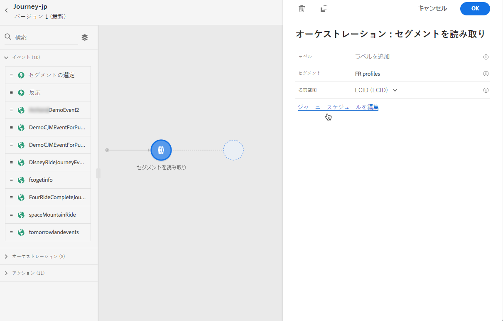
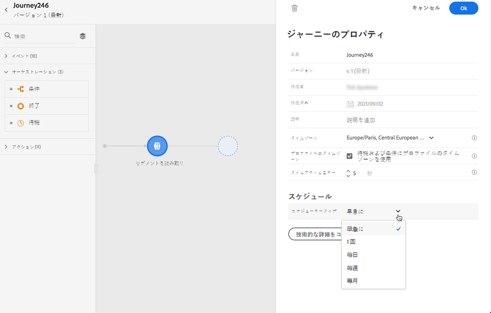
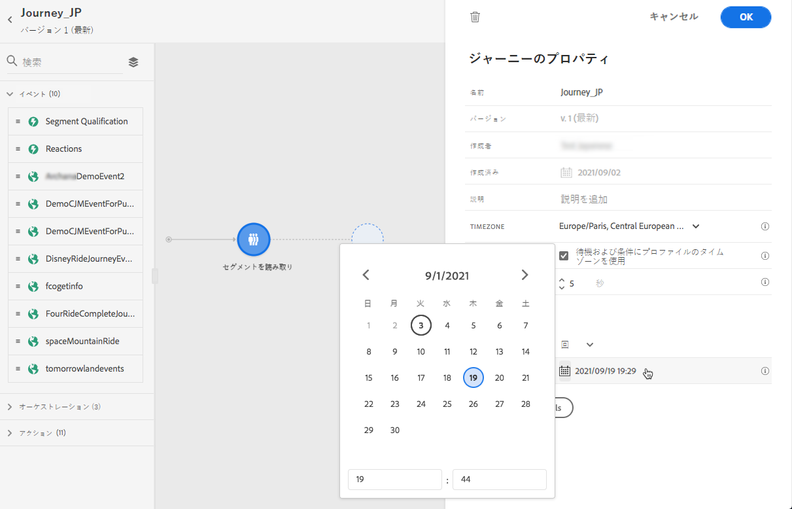
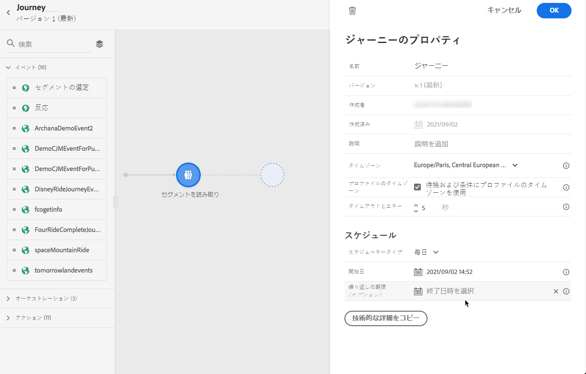

# 旅の実行 {#message-execution}

## 旅のテスト

テストプロファイルを使用して、旅のテストを行うことができます。 設定とメッセージを確認するために、この手順を実行することをお勧めします。

詳しくは、ここを  参照してください。

## 旅のアクティブ化

有効にするには、旅を公開する必要があります。

詳しくは、ここを  参照してください。

パブリッシュされた後、自分の旅を監視して、専用のレポートツールを使用して、旅の実効性を測定できます。

[レポートについて詳しくは、](../reports/live-report.md)

## メッセージを送信 {#send-messages}

コンテンツが定義されている場合は、メッセージを送信  することができます。

メッセージが送信されると、複数のインジケーター間でその実行を監視することができます。 [レポート ](../global-report.md) について詳しくは、こちらを参照してください。

## メッセージのスケジュール {#schedule-messages}

メッセージは、1つ  のステップから順番に実行 **[!UICONTROL Read Segment]** されます。セグメントがどのようにして旅に入るかを指定できます。 [「セグメントの読み取り」アクティビティ ](read-segment.md) について詳しく説明しています。

これを行うには、次の手順を実行します。

1. 移動を編集し、アクティビティーをドラッグ &amp; ドロップ **[!UICONTROL Read Segment]** して、構成を開始します。 [セグメントの読み取りアクティビティ ](read-segment.md#configuring-segment-trigger-activity) の設定について詳しくは、こちらを参照してください。

1. **[!UICONTROL Edit journey schedule]**&#x200B;リンクをクリックして、旅のプロパティにアクセスします。

   

1. 次の **[!UICONTROL Scheduler type]** ようにフィールドを設定します。一覧から必要な値を選択して、特定の日時に、または定期的にセグメントを入力するようにします。

   >[!NOTE]
   >
   >**[!UICONTROL Schedule]**&#x200B;このセクションは、操作が canvas にドロップされた場合に **[!UICONTROL Read Segment]** のみ使用できます。

   

1. このオプションを選択 **[!UICONTROL Once]** した場合は、セグメントが旅に入る日付と時刻を指定します。

   

1. 定期的なメソッドを選択した場合は、開始日時を変更します。 また、必要に応じて、最後に日付と時刻を指定することもできます。

   

   >[!NOTE]
   >
   >デフォルトでは、セグメントは、旅が公開された後1時間分、旅 **[!UICONTROL As soon as possible]** に入ります。

1. 変更を保存するには、をクリック **[!UICONTROL OK]** します。

<!--Unitary messages that are triggered by an event within a journey cannot be scheduled.-->
