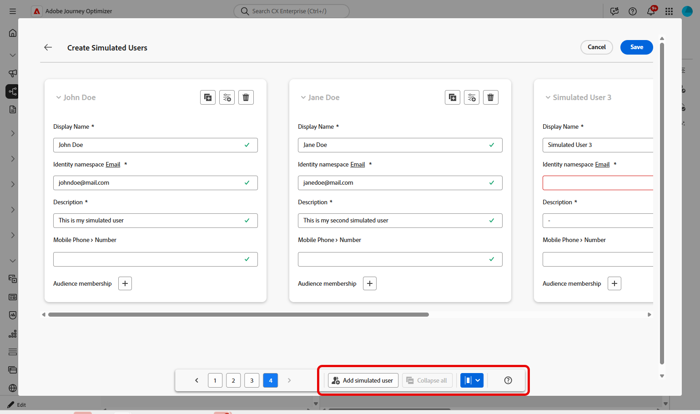
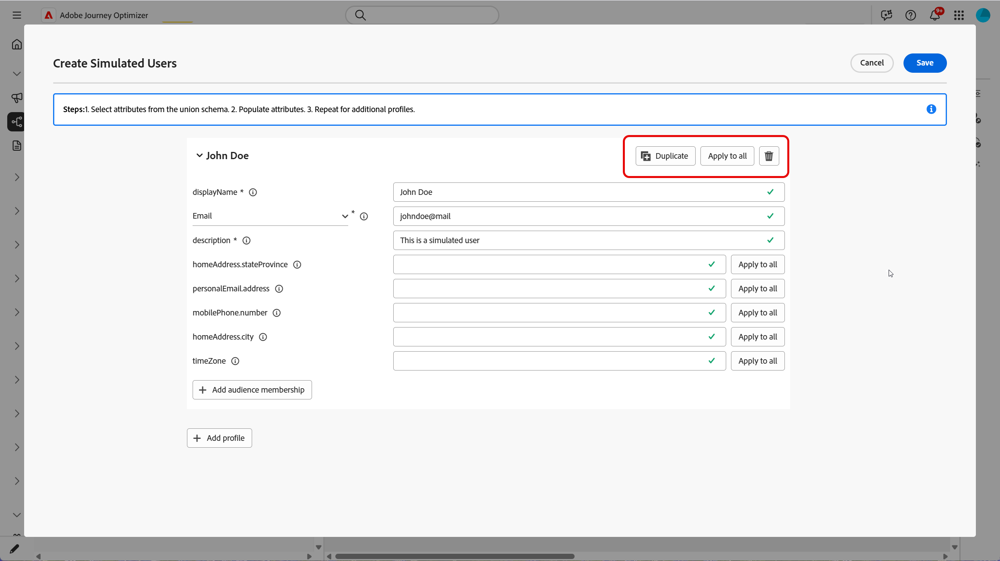
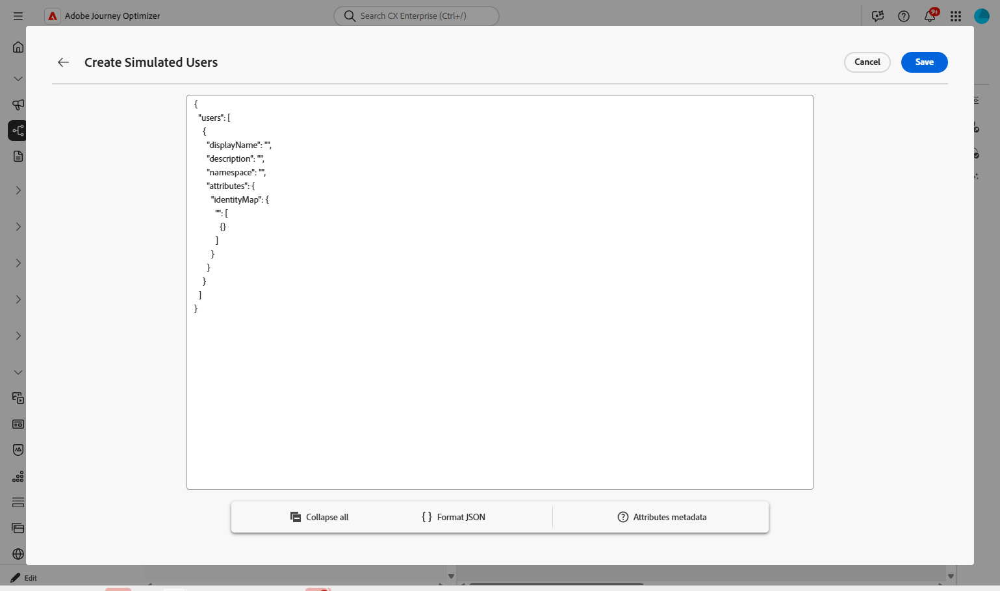
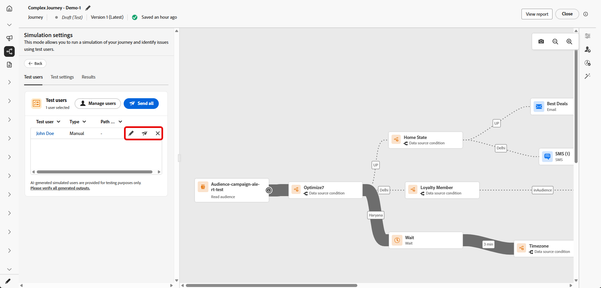
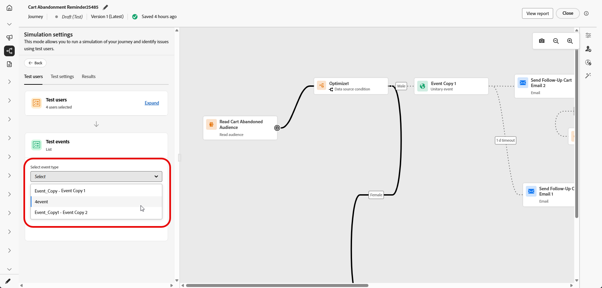

# ジャーニーのシミュレート{#simulate-journey}

**[!UICONTROL シミュレーション]**&#x200B;を使用して、公開前に&#x200B;**シミュレートされたユーザー**&#x200B;とジャーニーを検証します。 このページでは、**[!UICONTROL クイックシミュレーション]**&#x200B;と&#x200B;**[!UICONTROL 手動シミュレーション]**、シミュレートされたユーザーの作成と送信、ジャーニーが必要なときに単一イベントのトリガー、**[!UICONTROL 結果]** ログの確認について説明します。

ジャーニーのタイプ別の概要については、[ジャーニーシミュレーションの基本を学ぶ](simulate-journey-gs.md)を参照してください。

## シミュレーションの種類 {#simulation-types}

アクティベーション後、オーディエンスの読み取りエントリを含むバッチジャーニーでは、シミュレーションを実行する2つの方法が提供されます。

* **[!UICONTROL クイックシミュレーション]**&#x200B;は、生成されたユーザーとデフォルトでエンドツーエンドで実行されます。 クイックシミュレーションは、単一ジャーニーでは使用できないことに注意してください。

* **[!UICONTROL 手動シミュレーション]**&#x200B;を使用すると、ユーザーの選択、注文の送信、イベントペイロード、待機の上書きをステップバイステップで実行できます。

### クイックシミュレーション {#quick-simulation}

**[!UICONTROL シミュレーション]**&#x200B;のバッチジャーニーで、**[!UICONTROL クイックシミュレーション]**&#x200B;は、生成されたユーザーと事前入力された設定を使用してジャーニーを実行します。

1. **[!UICONTROL クイックシミュレーション]**&#x200B;を選択します。

1. 実行用に収集したフィールドを確認します。Adobe Journey Optimizer 「**[!UICONTROL 値を更新]**」をクリックして、プルーフまたはチャネルの設定を変更するか、変更なしで続行します。

   

1. **[!UICONTROL 値を更新]**&#x200B;を開いた場合、メッセージの校正に使用するアドレスなどの設定を編集し、シミュレーションを開始することを確認します。

   

1. Adobe Journey Optimizerは、ジャーニー定義からシミュレートされたユーザーを生成し、各ユーザーをジャーニーにトリガーします。

1. 実行が完了したら、**[!UICONTROL 結果を表示]**&#x200B;をクリックして、パス、エラー、および検出された分岐を確認します。 [結果を表示](#viewing-results)を参照してください。

   

### 手動シミュレーション {#manual-simulation}

シミュレートされた各ユーザーを選択し、送信順序を制御し、イベントペイロードを設定し、実行の&#x200B;**[!UICONTROL 待機]**&#x200B;期間を上書きする必要がある場合は、**[!UICONTROL 手動シミュレーション]**&#x200B;を選択します。 このフローは、バッチおよび単一ジャーニーに適用されます。

[&#x200B; シミュレートされたユーザーの作成と管理](#test-users)、[&#x200B; イベントのトリガー](#firing_events)、[結果の表示](#viewing-results)を続行します。

## シミュレートされたユーザーの作成と管理 {#test-users}

>[!IMPORTANT]
>
>**[!UICONTROL シミュレーション]**&#x200B;機能にアクセスするには、少なくとも次のいずれかの権限が必要です：**ジャーニーをシミュレート**、**ジャーニーを公開**&#x200B;または&#x200B;**ジャーニーを承認して公開**。 [詳細情報](../administration/permissions.md)

シミュレートされたユーザーは、**[!UICONTROL シミュレーション設定]**&#x200B;で定義した一時的なプロファイルのようなエンティティです。 この節では、それらを作成し、再利用するために保存し、リストから調整または削除して、ジャーニーに送信する方法について説明します。

1. **[!UICONTROL テストユーザー]**&#x200B;のリストを入力することから始めます。

   +++ AIを活用したユーザー生成

   Adobe Journey Optimizerは、ジャーニー定義からシミュレートされた一連のユーザーを生成します。

   電子メールまたはSMS ノードを使用するジャーニーの場合、AIは、使用する電子メールアドレスまたは電話番号の確認を求めるプロンプトを表示します。 完了したら、**[!UICONTROL 生成]**&#x200B;をクリックします。

   

   +++

   +++ 在庫の参照

   **[!UICONTROL インベントリを参照]**&#x200B;を選択して、既に保存したシミュレートされたユーザー（フォームやJSONから作成したユーザー、AI生成実行後に保持したユーザーなど）を追加します。

   

   +++

   +++ フォームから作成

   1. **[!UICONTROL 表示名]**、**[!UICONTROL ID名前空間]**&#x200B;および&#x200B;**[!UICONTROL 説明]**&#x200B;を入力して、このシミュレートされたユーザーを識別します。

      

   1. 次に、このユーザーに入力する結合スキーマから属性を選択します。

   1. 「**[!UICONTROL オーディエンスメンバーシップを追加]**」をクリックして、セグメントメンバーシップをシミュレートします。

   1. **[!UICONTROL シミュレートされたユーザーの作成]** ウィンドウで、**[!UICONTROL シミュレートされたユーザーの追加]**&#x200B;をクリックして、1つのセッションで複数のシミュレートされたユーザーを定義します。

      リストにユーザーを表示する方法を変更したり、積み重ね表示ですべてのカードを折りたたんだり、ユーザーの属性メタデータを開いたりできます。

      

   1. シミュレートされたユーザーメニューから、**[!UICONTROL 重複]**&#x200B;を使用してユーザーをコピーし、**[!UICONTROL すべての属性を他のユーザーに適用]**&#x200B;して、1人のユーザーの属性をセッション内の他のすべてのユーザーにコピーするか、**[!UICONTROL 削除]**&#x200B;してユーザーを削除します。

      

   1. このセッションでユーザーの設定を完了したら、**[!UICONTROL 保存]**&#x200B;をクリックします。

   +++

   +++ JSONから作成

   シミュレートされたユーザーデータを使用して対応するフィールドを更新することで、新しいシミュレートされたユーザーを定義します。

   

   +++

1. 作成したシミュレートされたユーザーは、**[!UICONTROL ユーザーのテスト]** リストに表示されます。 各エントリについて、次のいずれかを選択します。

   * ：シミュレートされたユーザーの詳細を更新します。
   * ：このシミュレートされたユーザーのみのシミュレーションを実行します。
   * ：このリストからユーザーを削除します。 シミュレートされたユーザーは削除されず、「シミュレートされたユーザー」選択で引き続き使用できます。

   

1. 選択後にリストを変更するには、**[!UICONTROL ユーザーの管理]**&#x200B;をクリックして、インベントリから、または新しいユーザーを作成して、さらにシミュレートされたユーザーを追加します。 この実行の&#x200B;**[!UICONTROL テストユーザー]** リストから各ユーザーを削除するには、**[!UICONTROL すべてのユーザーをクリア]**&#x200B;を選択します。

   

1. ジャーニーに&#x200B;**[!UICONTROL 待機]** アクティビティが含まれる場合は、「**[!UICONTROL テスト設定]**」タブを開いて、シミュレーション中に待機時間を微調整します。 例えば、ライブ **[!UICONTROL 待機]** アクティビティが数日間設定されている場合、それを10秒に上書きして、シミュレートされたユーザーが次のアクティビティに移動する前にノードでその長さを費やすようにすることができます。

1. **[!UICONTROL すべてを送信]**&#x200B;をクリックして、リスト内のすべてのシミュレートされたユーザーをジャーニーに送信するか、行のをクリックして、そのユーザーのみを送信します。 シミュレートされたユーザーがジャーニーに正常にエントリすると、`Simulated users have entered the journey successfully.`確認メッセージが表示されます。

   

1. ジャーニーに単一イベントが含まれる場合は、トリガーするイベントを選択する必要があります。 [&#x200B; イベントのトリガー](#firing_events)を参照してください。

1. 「**[!UICONTROL 結果]**」タブにアクセスして実行ログを開き、各ステップの実行方法を確認します。 詳しくは、[結果の表示](#viewing-results)を参照してください。

**[!UICONTROL シミュレーション]**&#x200B;でジャーニーを検証したら、**[!UICONTROL 結果]** ログを確認します。 エラーが表示された場合は、**[!UICONTROL シミュレーション]**&#x200B;を終了し、必要な変更をジャーニーに適用し、実行が正しく表示されるまで&#x200B;**[!UICONTROL シミュレーション]**&#x200B;を再度実行します。 そして、ジャーニーを公開することができます。 「[&#x200B; ジャーニーを公開する](../building-journeys/publish-journey.md)」を参照してください。

## イベントのトリガー {#firing_events}

ジャーニーに1つ以上の単一イベントが含まれている場合は、シミュレーションがアクティブな間にトリガーを実行します。

1. **[!UICONTROL イベントタイプを選択]**&#x200B;で、このシミュレーションに適用するイベントを選択します。

   

1. リスト内のすべてのユーザーに同じ変更を適用するには、**[!UICONTROL イベントの管理]** オプションを使用して、次の操作を行います。

   * **[!UICONTROL イベント値を生成]**&#x200B;して、Adobe Journey OptimizerがAIを使用してペイロードを生成できるようにする。 値が生成されると、ユーザーは&#x200B;**[!UICONTROL 送信準備完了]**&#x200B;とマークされます。
   * **[!UICONTROL イベント日]**&#x200B;を編集して、シミュレートされたユーザーのみのペイロードを変更します。

   

1. ユーザーの横にある「」をクリックして、各ユーザーのイベントペイロードを設定します。

   * **[!UICONTROL イベント値を生成]**&#x200B;して、Adobe Journey OptimizerがAIを使用してペイロードを生成できるようにする。 値が生成されると、ユーザーは&#x200B;**[!UICONTROL 送信準備完了]**&#x200B;とマークされます。
   * **[!UICONTROL イベント日]**&#x200B;を編集して、シミュレートされたユーザーのみのペイロードを変更します。

   

1. **[!UICONTROL テストイベント]**&#x200B;で、「**[!UICONTROL すべてを送信]**」を選択して、**[!UICONTROL ユーザー]**&#x200B;にリストされているすべてのシミュレートされたユーザーをジャーニーに送信するか、1人のユーザーに「」を選択して、そのユーザーのシミュレーションのみを実行します。

   

1. イベントが発生すると、各ユーザーの進行状況を反映するようにキャンバスが更新されます。 **[!UICONTROL ユーザーをテスト]** リストの任意の行をクリックして、ユーザーがジャーニーを通過した新しいパスを確認します。

1. 「**[!UICONTROL 結果]**」タブにアクセスして実行ログを開き、各ステップの実行方法を確認します。 詳しくは、[結果の表示](#viewing-results)を参照してください。

## 結果の表示 {#viewing-results}

「**[!UICONTROL 結果]**」タブでは、テスト結果を表示できます。 「**[!UICONTROL ユーザーをテスト]**」ドロップダウンで、実行を検査するシミュレートされたユーザーを選択します。

**[!UICONTROL すべて]**&#x200B;を選択すると、実行中のシミュレートされたユーザーごとに集計された結果が表示されます。 このビューでは、シミュレートされたユーザーを最初に選択することなく、シミュレーション全体、アクティビティ、結果、エラーを一目で確認できます。

各アクティビティについて、シミュレートされたユーザーがステップにエントリしたか離脱したか、およびシミュレーション中に発生したエラーがログに表示されます。

**Wait** アクティビティの場合、ログには期間に関連する2つの値が含まれます。

* **定義された期間**：公開されたジャーニーの&#x200B;**Wait** アクティビティで指定され、ジャーニーがライブになると適用される期間。 ログは、ジャーニーで定義された値のみに依存するのではなく、Simulationがテスト設定からオーバーライド（例えば10秒）を適用するかどうかを記録します。
* **実際の期間**：シミュレートされたユーザーが&#x200B;**待機** アクティビティに残った経過時間。 この値は、**[!UICONTROL テスト設定]** タブから設定されます。

ログにエラーが表示されたら、**シミュレーション**&#x200B;を終了し、必要な変更をジャーニーに適用して、**シミュレーション**&#x200B;を再度実行します。 検証が成功したら、ジャーニーを公開します。 「[&#x200B; ジャーニーを公開する](../building-journeys/publish-journey.md)」を参照してください。
