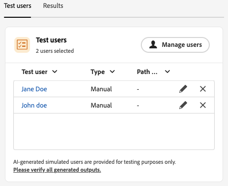
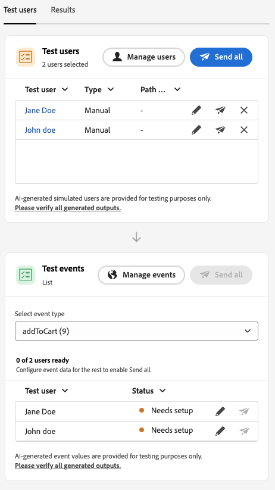

# ジャーニーシミュレーションの基本を学ぶ {#simulate-journey-gs}

>[!IMPORTANT]
>
>**[!UICONTROL シミュレーション]**&#x200B;機能にアクセスするには、少なくとも次のいずれかの権限が必要です：**ジャーニーをシミュレート**、**ジャーニーを公開**&#x200B;または&#x200B;**ジャーニーを承認して公開**。 [詳細情報](../administration/permissions.md)

ジャーニーは、**ドラフト**、**テストモード**、**ライブ**&#x200B;に加えて、**[!UICONTROL シミュレーション]**&#x200B;に設定できます。 Simulationでは、**simulated users**&#x200B;でテストを行います。Adobe Experience Platformで永続的なテストプロファイルを使用せずに、追加した一時的なプロファイルのようなエンティティです。

Adobe Journey Optimizerでは、ジャーニーをテストおよび検証する2つの方法があります。

* **[シミュレーション](simulate-journey.md#test-users)**: Adobe Experience Platformで&#x200B;**[!UICONTROL シミュレーション]**&#x200B;機能とシミュレートされたユーザーを使用し、事前に作成されたプロファイルを持たないユーザーを、AIを活用したユーザーと手動で作成されたユーザーの両方をサポートします。

* **[テストモード](testing-the-journey.md)**: Adobe Experience Platformでテストプロファイルとしてフラグ付けされた永続的なプロファイルを使用します。セッション間で再利用可能です。 あらかじめ定義された一貫性のあるデータが必要な場合は、このアプローチを選択します。 [テストプロファイルの作成方法の詳細情報](../audience/creating-test-profiles.md)。

## ジャーニータイプ別シミュレーション {#by-journey-type}

**[!UICONTROL シミュレーション]** パネルには、ジャーニーに必要な手順のみが表示されます。 これは、プロファイルがジャーニーにエントリする方法によって異なります。 これらの要因から、Adobe Journey Optimizerは異なるシミュレーション体験を明らかにします。 以下の各タイプを展開して、実行の違いと、使用するパネルを確認します。

詳しくは、[&#x200B; ジャーニーのシミュレーション &#x200B;](simulate-journey.md)を参照してください。

+++ 「オーディエンスを読み込む」を使用したバッチジャーニー

ジャーニーは&#x200B;**[!UICONTROL 読み取りオーディエンス]**&#x200B;によってトリガーされ、キャンバスには単一のイベントアクティビティがありません。シミュレーション中は、オーディエンス母集団はトリガーされません。ジャーニーにエントリするのはシミュレートされたユーザーのみです。
シミュレーション用に選択されたシミュレートされたユーザーは、**ユーザーのテスト** セクションに表示されます。

読み取りオーディエンスのみのバッチジャーニーの

**[!UICONTROL オーディエンス]**&#x200B;を読むジャーニーの場合、**[!UICONTROL クイックシミュレーション]**&#x200B;または&#x200B;**[!UICONTROL 手動シミュレーション]**&#x200B;にアクセスできます。

読み取りオーディエンスのみのバッチジャーニーの

+++

+++ 読み取りオーディエンスと単一イベントを使用したバッチジャーニー

トリガーに沿った1つ以上の単一イベントを含む、セグメント経路のジャーニー。最初にシミュレートされたユーザーをトリガーしてシミュレーションを開始し、次にイベントノードで待機するユーザーのイベントをトリガーします。
シミュレーション用に選択されたシミュレートされたユーザーと設定されたイベントは、「ユーザーをテスト」セクションと「イベントをテスト」セクションにそれぞれ表示されます。テストイベントセクションは、シミュレートされたユーザーがジャーニーにエントリするまで表示されません。

読み取りオーディエンスのみのバッチジャーニーの

読み取りオーディエンスと単一イベント **を含む** バッチジャーニーを使用すると、**[!UICONTROL クイックシミュレーション]**&#x200B;または&#x200B;**[!UICONTROL 手動シミュレーション]**&#x200B;にアクセスできます。

+++

+++ 単一ジャーニー

ジャーニーは、オーディエンスの読み取りではなく、単一のイベントから始まります。シミュレートされたユーザーは、その開始イベントが実行されるまでジャーニーにエントリしません。
シミュレーション用に選択されたシミュレートされたユーザーと設定されたイベントは、それぞれ&#x200B;**テストユーザー**&#x200B;および&#x200B;**テストイベント** セクションに表示されます。**ユーザーのテスト** セクションには、シミュレートされたユーザーをジャーニーにトリガーする操作は含まれていません。**テストイベント**&#x200B;からエントリをトリガーしました。

読み取りオーディエンスのみのバッチジャーニーの

**単一ジャーニー**&#x200B;では、手動シミュレーションメニューに直接アクセスできます。

単一ジャーニーの

+++

## 起動シミュレーション {#launch}

ジャーニーを&#x200B;**[!UICONTROL シミュレーション]**&#x200B;に切り替えて、シミュレートされたユーザーでテストします。 ステップバイステップのタスクについて詳しくは、[&#x200B; ジャーニーのシミュレーション &#x200B;](simulate-journey-2.md)を参照してください。

1. ジャーニーから、**[!UICONTROL Simulate]**&#x200B;をクリックし、**[!UICONTROL Simulation]**&#x200B;を選択します。

   

1. アクティベーションが完了するまで待ちます。 ジャーニーが&#x200B;**[!UICONTROL シミュレーション]**&#x200B;に切り替わる間、パネル内のコントロールは無効になり、アクティベーションが完了すると自動的に再度有効になります。

## 制限事項 {#limitations}

このリリースでは、**[!UICONTROL シミュレーション]**&#x200B;は、**[!UICONTROL テストモード]**&#x200B;またはライブジャーニーがサポートするすべてのアクティビティ、チャネル、または統合をサポートしていない可能性があり、機能の成熟度に応じて動作が変更される可能性があります。 サポートされるワークフローについては、この記事を使用してください。

シミュレーションの制限について詳しくは、以下のドロップダウンを参照してください。

+++ ノードレベルの制限

一部のノードが&#x200B;**[!UICONTROL シミュレーション]**&#x200B;の開始を妨げています。 その他の場合は、以下に説明する動作でシミュレーションを実行します。 シミュレーションを実行する前にノードを削除または変更する必要がある場合は、まずジャーニーを更新します。

| 制限付きノード | メモ |
| --- | --- |
| ビジネスイベント | **[!UICONTROL シミュレーション]**&#x200B;でビジネスイベントで始まるジャーニーを実行することはできません。 |
| 補足ID （複数回の再入力） | 複数の再エントリが有効になっていて、同じシミュレートされたユーザーが一度に複数のアクティブなインスタンスを持つ可能性がある場合、**[!UICONTROL シミュレーション]**&#x200B;は開始されません。 |
| コンテンツ決定ノード | ジャーニーをシミュレートする前に、このアクティビティを削除または変更します。 |
| データセットのルックアップ | **[!UICONTROL シミュレーション]**&#x200B;は、キーによる顧客データセットの検索をサポートしていません。 シミュレーションを実行する前に、このアクティビティを削除または変更します。 |
| **[!UICONTROL 最適化]** アクティビティ | **[!UICONTROL 実験]**&#x200B;と&#x200B;**[!UICONTROL ターゲティングルール]**&#x200B;はサポートされていません。 シミュレーションを実行する前に、ノードを削除または変更します。  その他&#x200B;**[!UICONTROL Optimize]** メソッドは、次のように動作します。  **[!UICONTROL &#x200B; パーセンテージ分割&#x200B;]**: Journey Agentは、分岐のパーセンテージに従わず、分岐ごとに1人のシミュレートされたユーザーを作成します。 実行時に、ライブ評価はブランチを選択し、生成されたパスとは異なる場合があります。 分岐選択をモックすることはできません。 ユーザーをステアリングするには、キャンバス上のブランチ順序に依存します。 常に一番上のブランチが選択されます。  **[!UICONTROL 時間条件]**：条件は、ライブジャーニーと同様に、実行時に適用されます。 例えば、8:00から20:00までのウィンドウでは、そのウィンドウ内でシミュレーションを実行している間のみユーザーが実行できます。 実行時間をモックすることはできません。 テスト時の現在の時間に合わせて条件を設定します。  **[!UICONTROL 日付条件&#x200B;]**：条件は、ライブジャーニーと同様に、実行時に適用されます。 例えば、2026年6月8日の日付では、その日付にシミュレーションが実行された場合にのみユーザーが実行できます。 実行日をモックすることはできません。 テスト時に条件を現在の日付に設定します。  **[!UICONTROL &#x200B; プロファイル キャップ]**: シミュレーション中にキャップが適用されません。 Journey Agentでは、ブランチごとに1人のシミュレートされたユーザーが作成されます。 分岐選択をモックすることはできません。 ユーザーをステアリングするには、キャンバス上のブランチ順序に依存します。 常に一番上のブランチが選択されます。 |
| タイムアウトとエラー分岐 | Journey Agentは、アクティビティタイムアウトまたはエラーブランチのユーザーを生成しません。 シミュレーション中にリアルタイムのタイムアウトまたはエラーが発生した場合にのみ、ユーザーはこれらのパスを入力します。 |
| タイムアウトブランチ（イベントアクティビティ） | シミュレートされたユーザーは作成されますが、**[!UICONTROL 手動シミュレーション]**&#x200B;では、Journey Agentはイベントタイムアウトブランチにエントリするユーザーを決定しません。 イベントを送信または送信しないことによって、パスを制御します。 例えば、タイムアウトブランチをテストするには、設定されたタイムアウトを待ち、イベントを送信しません。 **[!UICONTROL クイックシミュレーション]**&#x200B;では、タイムアウト分岐をカバーするためにイベントを自動的に送信または保留できます。 |
| 反応イベント | 反応イベントはシミュレーションで実行されますが、アクションは実際に発生する必要があります。 例えば、電子メール **open**&#x200B;の反応には、プルーフメッセージを開く必要があります。 シミュレーション UIではリアクションをモックすることはできません。 |
| 外部データソース | シミュレーション中の呼び出しは、ライブジャーニーと同じように実行されます。 ダウンストリームアクティビティは応答を使用できますが、モックすることはできません。 応答値が&#x200B;**[!UICONTROL Optimize]** アクティビティをフィードすると、Journey Agentはその出力を発明できません。 呼び出しの入力のみを生成します。 例えば、呼び出しがプロファイル都市を取り、天気を返す場合、エージェントはシミュレートされたユーザーに都市を設定し、ライブ呼び出しは天気を返します。 |
| カスタムアクション | 行動は外部データソースに一致します。 発信コールがリアルに実行されます。 Journey Agentは入力を入力します。 出力はライブ応答から得られます。 回答をモックすることはできません。 |
| 外部オーディエンス属性の強化 | この検証が適用される場合、外部オーディエンスソースからパーソナライズされた属性を使用するジャーニーは&#x200B;**[!UICONTROL シミュレーション]**&#x200B;で開始されません。 |

+++

 

+++ 機能の制限

次の機能は、**[!UICONTROL シミュレーション]**&#x200B;ではサポートされていません。

| 機能 | メモ |
| --- | --- |
| 終了条件 | **[!UICONTROL シミュレーション]**&#x200B;を実行すると、終了条件は適用されません。 |
| Adobe Journey Optimizer decisioningを使用した電子メールコンテンツなど、アクション内の[!DNL Adobe Journey Optimizer]決定 | [!DNL Adobe Journey Optimizer]決定を使用するコンテンツのアクションプルーフは生成されません。 |
| カスタムアクション応答をモック | [!UICONTROL &#x200B; カスタムアクション &#x200B;]は、デフォルトで実際のアウトバウンドコールを実行します。 外部呼び出しの実行がサポートされないように応答をモックします。 |
| 同意ポリシーの評価 | 同意はシミュレートされたユーザーレベルでモックできず、同意ポリシーはシミュレーション中に評価されません。 |
| ジャーニーの上限と調停 | シミュレーション中に評価も実行もされません。 |
| 配信頻度の上限設定（チャネルまたは通信タイプ別） | シミュレーション中に評価も実行もされません。 |
| オプトアウトの管理、抑制、許可リスト | シミュレーション中に評価も適用もされません。 |
| チャネル設定における動的サブドメインと動的属性 | サポートされていません。 |
| 送信時間最適化（STO） | シミュレーション中に評価も適用もされません。 |
| サンドボックスツール（サンドボックス間でシミュレートされたユーザーをコピー） | サポートされていません。 |
| ジャーニー内でのウェーブ送信 | サポートされていません。 |
| クワイエットアワー | シミュレーション中に評価も適用もされません。 |
| プライバシーサービス | シミュレートされたユーザーは、GDPRに準拠した永続的なプロファイルではありません。 シミュレーションユーザーに実際の顧客データを含めないでください。 |

+++

 

+++ 定量的ガードレール 

これらのガードレールは、**[!UICONTROL シミュレーション]**&#x200B;に適用されます。 数値キャップは、ジャーニーインターフェイスおよび実行時に適用されます。 制限は、後のリリースで変更される場合があります。 天井付近で実行する場合は、サンドボックス内の動作を確認します。

| ガードレール | 上限 | メモ |
| --- | --- | --- |
| 1回のバッチで選択およびトリガーできる最大シミュレーションユーザー（バッチジャーニー、イベントトリガーフロー、オーディエンス選定フロー） | 20 | 各&#x200B;**[!UICONTROL Send all]**&#x200B;または&#x200B;**[!UICONTROL トリガーが選択したイベント]**&#x200B;ごとにカウントされ、ジャーニー全体の累積上限ではありません。 |
| 生成リクエストごとにシミュレートされる最大ユーザー数 | 50 | Journey Agentが1回のリクエストで生成する最大シミュレーションユーザー数（**[!UICONTROL クイックシミュレーション]**&#x200B;または&#x200B;**[!UICONTROL AIで生成]**）（**[!UICONTROL 手動シミュレーション]**）です。 ジャーニーに&#x200B;**50**&#x200B;個を超えるパスがある場合、Journey Agentは、それらの&#x200B;**50**&#x200B;人のシミュレーションユーザーを生成するパスをランダムに選択します。 |
| 1回のシミュレーション実行でテストされた最大一意のシミュレートされたユーザー | 100 | 1回の実行ブロックで&#x200B;**100**&#x200B;人のユニークユーザーにリーチ **[!UICONTROL 新しいシミュレーションユーザーのシミュレーションユーザー]**&#x200B;を選択します。 **90**&#x200B;の場合は、同じブロックの前に最大&#x200B;**10**&#x200B;個まで追加できます。 |
| 1つのサンドボックスで同時に&#x200B;**[!UICONTROL シミュレーション]**&#x200B;で実行できる最大ジャーニー | 20 | Capは、そのサンドボックス内のすべての&#x200B;**[!UICONTROL シミュレーション]** ジャーニーで一度に共有されます。 |
| 1つのサンドボックス内の最大アクティブなシミュレーションユーザー | 2,000 | 一度にサンドボックスに存在できるシミュレートされた最大ユーザー。 Adobeは、お客様からのフィードバックに基づいて、この制限を調整する場合があります。 |
| イベントの事前入力（ブラウザーのみ） | — | イベントペイロードフィールドを事前入力できるのは、ブラウザーベースのシミュレーション UIのみです。 事前入力された値は、そのブラウザー内に残り、他のブラウザー、デバイス、セッションとは同期されないため、テストする場所ごとに異なる事前入力データが表示される場合があります。 |

+++
