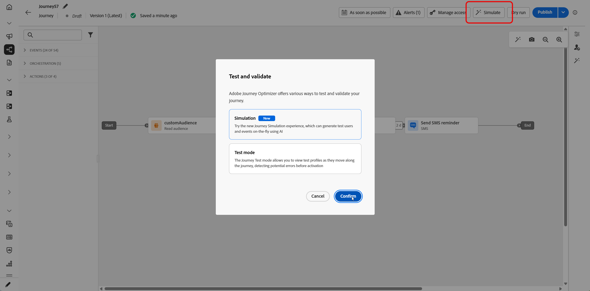

# ジャーニーシミュレーションの基本を学ぶ {#simulate-journey-gs}

ジャーニーは、**ドラフト**、**テストモード**、**ライブ**&#x200B;に加えて、**[!UICONTROL シミュレーション]**&#x200B;に設定できます。 Simulationでは、**simulated users**&#x200B;でテストを行います。Adobe Experience Platformで永続的なテストプロファイルを使用せずに、追加した一時的なプロファイルのようなエンティティです。

Adobe Journey Optimizerでは、ジャーニーをテストおよび検証する2つの方法があります。

* **[シミュレーション](#test-users)**: Adobe Experience Platformで事前に作成されたプロファイルを使用せずにクイック実行するには、**[!UICONTROL シミュレーション]** ジャーニー機能とシミュレートされたユーザーを使用します。

* **[テストモード](testing-the-journey.md)**: Adobe Experience Platformでテストプロファイルとしてフラグ付けされた永続的なプロファイルを使用します。セッション間で再利用可能です。 あらかじめ定義された一貫性のあるデータが必要な場合は、このアプローチを選択します。 [テストプロファイルの作成方法の詳細情報](../audience/creating-test-profiles.md)。

## ジャーニータイプ別シミュレーション {#by-journey-type}

**[!UICONTROL シミュレーション]** パネルには、ジャーニーに必要な手順のみが表示されます。 これは、プロファイルがジャーニーにエントリする方法によって異なります。 これらの要因から、Adobe Journey Optimizerは異なるシミュレーション体験を明らかにします。 以下の各タイプを展開して、実行の違いと、使用するパネルを確認します。

詳しくは、[ ジャーニーのシミュレーション ](simulate-journey.md)を参照してください。

+++ オーディエンスを読み込んだバッチジャーニー

ジャーニーは、**オーディエンスを読み取り**&#x200B;によってトリガーされます。 キャンバスには単一のイベントアクティビティはなく、プロファイルは条件、待機、およびチャネルアクションのみを通して移動します。

読み取りオーディエンスを含む&#x200B;**バッチジャーニー**&#x200B;を使用すると、クイックシミュレーションまたは手動シミュレーションにアクセスできます。

読み取りオーディエンスのみのバッチジャーニーの

+++

+++ 読み取りオーディエンスと単一イベントを使用したバッチジャーニー

トリガーに沿った1つ以上の単一イベントを含む、セグメント経路のジャーニー。 でユーザーを送信した後、イベントノードで待機しているユーザーのイベントをトリガーします。

読み取りオーディエンスと単一イベント **を含む** バッチジャーニーを使用すると、クイックシミュレーションまたは手動シミュレーションにアクセスできます。

+++

+++ 単一ジャーニー

ジャーニー&#x200B;**は**&#x200B;を開始し、読み取りオーディエンスではなく単一イベントで開始します。 シミュレートされたユーザーは、その開始イベントが実行されるまでジャーニーにエントリしません。

**単一ジャーニー**&#x200B;では、手動シミュレーションメニューに直接アクセスできます。

単一ジャーニーの

+++

## 起動シミュレーション {#launch}

ジャーニーを&#x200B;**[!UICONTROL シミュレーション]**&#x200B;に切り替えて、シミュレートされたユーザーでテストします。 ステップバイステップのタスクについて詳しくは、[ ジャーニーのシミュレーション ](simulate-journey.md)を参照してください。

1. ジャーニーから、**[!UICONTROL Simulate]**&#x200B;をクリックし、**[!UICONTROL Simulation]**&#x200B;を選択します。

   

1. アクティベーションが完了するまで待ちます。 ジャーニーが&#x200B;**[!UICONTROL シミュレーション]**&#x200B;に切り替わる間、パネル内のコントロールは無効になり、アクティベーションが完了すると自動的に再度有効になります。

## 制限事項 {#limitations}

このリリースでは、**[!UICONTROL シミュレーション]**&#x200B;は、**[!UICONTROL テストモード]**&#x200B;またはライブジャーニーがサポートするすべてのアクティビティ、チャネル、または統合をサポートしていない可能性があり、機能の成熟度に応じて動作が変更される可能性があります。 サポートされるワークフローについては、この記事を使用してください。

シミュレーションの制限について詳しくは、以下のドロップダウンを参照してください。

+++ ノードレベルの制限

ジャーニーに次のいずれかのノードが含まれている場合、**[!UICONTROL シミュレーション]**&#x200B;でジャーニーを開始することはできません。 シミュレーションを実行する前に、ジャーニーを変更するか、関連するノードを削除する必要があります。

| 制限付きノード | メモ |
| --- | --- |
| ビジネスイベント | ビジネスイベントで始まるジャーニーは、**[!UICONTROL シミュレーション]**&#x200B;で実行できません。 |
| 補足ID （複数回の再入力） | 同時再エントリ（同じシミュレートされたユーザーに対して複数のアクティブなインスタンス）では、**[!UICONTROL シミュレーション]**&#x200B;を開始できません。 |
| コンテンツ決定ノード | ジャーニーをシミュレートする前に、このアクティビティを削除または変更する必要があります。 |
| データセットのルックアップ | キーによる顧客データセットの検索はサポートされていません。このアクティビティを含むジャーニーは&#x200B;**[!UICONTROL シミュレーション]**&#x200B;で実行できません。 |
| パスの実験（最適化 – 実験のバリアント） | **[!UICONTROL シミュレーション]**&#x200B;ではサポートされていません。 **[!UICONTROL 条件]**&#x200B;の下に存在していたフロー（データソース条件など）に対しては、**[!UICONTROL 最適化]**&#x200B;を引き続き使用できます。 |
| パスのターゲティング（最適化、ターゲティングルールのバリエーション） | **[!UICONTROL シミュレーション]**&#x200B;ではサポートされていません。 |
| 外部オーディエンス属性の強化 | この検証がアクティブな場合、外部オーディエンスソースからパーソナライズされた属性を使用するジャーニーは&#x200B;**[!UICONTROL シミュレーション]**&#x200B;で開始されません。 |

+++

 

+++ 機能の制限

次の機能は、**[!UICONTROL シミュレーション]**&#x200B;ではサポートされていません。

| 機能 | メモ |
| --- | --- |
| 終了条件 | **[!UICONTROL シミュレーション]**&#x200B;を実行すると、終了条件は適用されません。 |
| アクション内の[!DNL Adobe Journey Optimizer]決定（Adobe Journey Optimizer decisioningを使用した電子メールコンテンツなど） | [!DNL Adobe Journey Optimizer]決定を使用するコンテンツのアクションプルーフは生成されません。 |
| カスタムアクション応答をモック | [!UICONTROL  カスタムアクション ]は、デフォルトで実際のアウトバウンドコールを実行します。 外部呼び出しの実行がサポートされないように応答をモックします。 |
| 同意ポリシーの評価 | シミュレートされたユーザーレベルでは、同意をモックすることはできません。 |
| ジャーニーの上限と調停 | **[!UICONTROL シミュレーション]**&#x200B;ではサポートされていません。 |
| 配信頻度の上限設定（チャネルまたは通信タイプ別） | **[!UICONTROL シミュレーション]**&#x200B;ではサポートされていません。 |
| オプトアウトの管理、抑制、許可リスト | メッセージのルーティング設定が適用される場所に従います。 |
| チャネル設定における動的サブドメインと動的属性 | メッセージのルーティング設定が適用される場所に従います。 |
| 送信時間最適化（STO） | **[!UICONTROL シミュレーション]**&#x200B;ではサポートされていません。 |
| サンドボックスツール（サンドボックス間でシミュレートされたユーザーをコピー） | サポートされていません。 |
| ジャーニー内でのウェーブ送信 | サポートされていません。 |
| クワイエットアワー | サポートされていません。 |
| オプトアウトの管理、抑制、許可リスト | サポートされていません。 |
| チャネル設定における動的サブドメインと動的属性 | サポートされていません。 |
| プライバシーサービス | シミュレートされたユーザーは、GDPRに準拠した永続的なプロファイルではありません。 シミュレーションユーザーに実際の顧客データを含めないでください。 |

+++

 

+++ 定量的ガードレール 

これらのガードレールは、**[!UICONTROL シミュレーション]**&#x200B;に適用されます。 数値キャップは、ジャーニーインターフェイスおよび実行時に適用されます。 制限は、後のリリースで変更される可能性があります。上限の近くで実行する場合は、サンドボックス内の動作を確認してください。

| ガードレール | 上限 | メモ |
| --- | --- | --- |
| 1回のバッチで選択およびトリガーできる最大シミュレーションユーザー（バッチジャーニー、イベントトリガーフロー、オーディエンス選定フロー） | 20 | 各&#x200B;**[!UICONTROL Send all]**&#x200B;または&#x200B;**[!UICONTROL トリガーが選択したイベント]**&#x200B;ごとにカウントされます。ジャーニー全体の累積上限ではありません。 |
| 1回のシミュレーション実行でテストされた最大一意のシミュレートされたユーザー | 100 | 1回の実行ブロックで&#x200B;**100**&#x200B;人のユニークユーザーにリーチ **[!UICONTROL 新しいシミュレーションユーザーのシミュレーションユーザー]**&#x200B;を選択します。 **90**&#x200B;の場合は、同じブロックの前に最大&#x200B;**10**&#x200B;個まで追加できます。 |
| 1つのサンドボックスで同時に&#x200B;**[!UICONTROL シミュレーション]**&#x200B;で実行できる最大ジャーニー | 20 | Capは、そのサンドボックス内のすべての&#x200B;**[!UICONTROL シミュレーション]** ジャーニーで一度に共有されます。 |
| 1つのサンドボックス内の最大アクティブなシミュレーションユーザー | 2,000 | 一度にサンドボックスに存在できるシミュレートされた最大ユーザー。 Adobeは、お客様からのフィードバックに基づいて、この制限を調整する場合があります。 |
| イベントの事前入力（ブラウザーのみ） | — | イベントペイロードフィールドを事前入力できるのは、ブラウザーベースのシミュレーション UIのみです。 事前入力された値は、そのブラウザー内に残り、他のブラウザー、デバイス、セッションとは同期されないため、テストする場所ごとに異なる事前入力データが表示される場合があります。 |

+++
