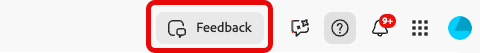
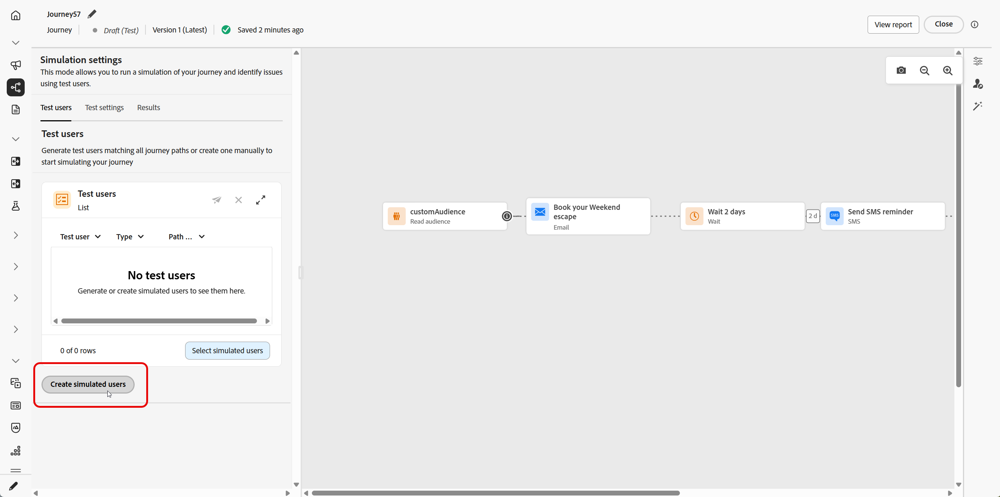
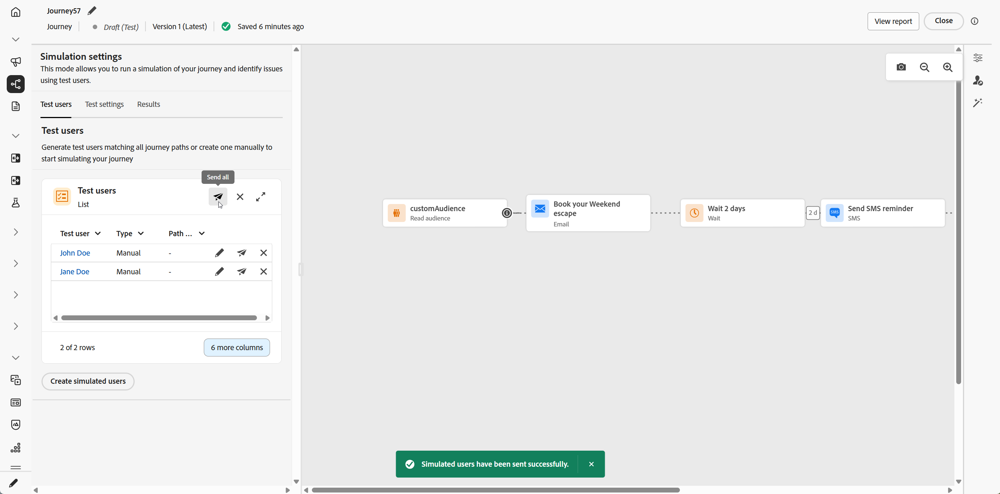
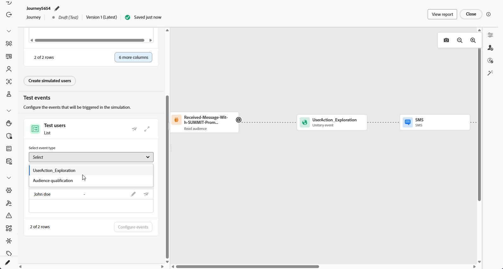
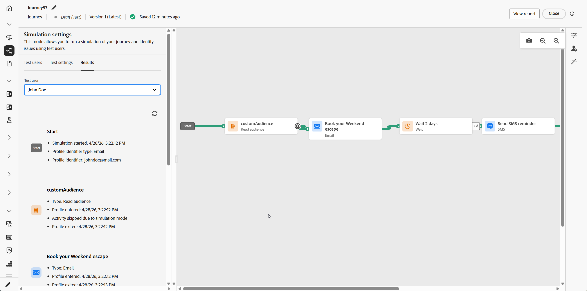

# ジャーニーのシミュレート{#simulate-journey}

>[!IMPORTANT]
>
> この機能は現在、基本機能を備えた限定提供として、すべてのお客様にご利用いただけます。

ジャーニーは、**ドラフト**、**テストモード**、**ライブ**&#x200B;に加えて、**[!UICONTROL シミュレーション]**&#x200B;に設定できます。 Simulationでは、**simulated users**&#x200B;でテストを行います。Adobe Experience Platformで永続的なテストプロファイルを使用せずに、追加した一時的なプロファイルのようなエンティティです。

Adobe Journey Optimizerでは、ジャーニーをテストおよび検証する2つの方法があります。

* **[シミュレーション](#test-users)**: Adobe Experience Platformで事前に作成されたプロファイルを使用せずにクイック実行するには、**[!UICONTROL シミュレーション]** ジャーニー機能とシミュレートされたユーザーを使用します。

* **[テストモード](testing-the-journey.md)**: Adobe Experience Platformでテストプロファイルとしてフラグ付けされた永続的なプロファイルを使用します。セッション間で再利用可能です。 あらかじめ定義された一貫性のあるデータが必要な場合は、このアプローチを選択します。 [テストプロファイルの作成方法の詳細情報](../audience/creating-test-profiles.md)。

ジャーニーシミュレーションは&#x200B;**利用制限**&#x200B;中です。 フィードバックを共有し、エクスペリエンスの改善を支援するには、上部のバーから&#x200B;**[!UICONTROL フィードバック]**&#x200B;を開きます。

## シミュレートされたユーザーの作成と管理 {#test-users}

>[!IMPORTANT]
>
>**[!UICONTROL シミュレーション]**&#x200B;機能にアクセスするには、少なくとも次のいずれかの権限が必要です：**ジャーニーをシミュレート**、**ジャーニーを公開**&#x200B;または&#x200B;**ジャーニーを承認して公開**。 [詳細情報](../administration/permissions.md)

シミュレートされたユーザーは、**[!UICONTROL シミュレーション設定]**&#x200B;で定義した一時的なプロファイルのようなエンティティです。 この節では、UIまたはJSON ファイルから、それらを作成し、再利用のために保存し、リストから調整または削除して、ジャーニーに送信する方法について説明します。

### シミュレートされたユーザーの作成

次の手順では、UIから、またはJSON ファイルを読み込むことで、シミュレートされたユーザーを作成する方法を示します。

1. ジャーニーから、**[!UICONTROL Simulate]**&#x200B;を開き、**[!UICONTROL Simulation]**&#x200B;を選択します。

   

1. **[!UICONTROL シミュレートされたユーザーの作成]**&#x200B;をクリックして新しいユーザーを作成し、UIからユーザーを作成するか、JSONからユーザーをインポートするかを選択します。

   代わりにシミュレートされたユーザーを再利用するには、**[!UICONTROL シミュレートされたユーザーを選択]**&#x200B;し、以前に保存したエントリを選択します。

   

1. JSONからシミュレートされたユーザーを作成する場合は、シミュレートされたユーザーデータで対応するフィールドを更新します。

1. UIからシミュレートされたユーザーを作成する場合は、**[!UICONTROL 表示名]**&#x200B;と&#x200B;**[!UICONTROL 説明]**&#x200B;を入力して、このシミュレートされたユーザーを識別します。 次に、このユーザーに入力する結合スキーマから属性を選択します。

   

1. 「**[!UICONTROL オーディエンスメンバーシップ]**&#x200B;を追加」をクリックして、セグメントメンバーシップをシミュレートします。

1. 「**[!UICONTROL プロファイルを追加]**」をクリックして、1つのセッションで複数のシミュレートされたユーザーを作成します。

1. このセッションで追加したシミュレートされたユーザーごとに、次のアクションを使用できます。

   * **[!UICONTROL 複製]**：既存のエントリの完了した設定を複製する新しいシミュレートされたユーザーを追加します。その後、必要に応じて複製を編集できます。
   * **[!UICONTROL すべてを適用]**:1人のシミュレートされたユーザーからリスト内の他のすべてのシミュレートされたユーザーに、属性値または設定を反映します。
   * **[!UICONTROL 削除]**：選択したシミュレート ユーザーをリストから削除します。

1. **[!UICONTROL 保存]**&#x200B;をクリックして、今後の使用のために1人以上のシミュレートされたユーザーを保存します。

1. 保存すると、作成したシミュレートされたユーザーが&#x200B;**[!UICONTROL ユーザーのテスト]** リストに表示されます。 各エントリについて、オプションメニューを開き、次のいずれかを選択します。

   * ：シミュレートされたユーザーの詳細を更新します。
   * ：このシミュレートされたユーザーのみのシミュレーションを実行します。
   * ：このリストからユーザーを削除します。 シミュレートされたユーザーは削除されず、「シミュレートされたユーザー」選択で引き続き使用できます。

   

1. ジャーニーに&#x200B;**[!UICONTROL 待機]** アクティビティが含まれる場合は、「**[!UICONTROL テスト設定]**」タブを開いて、シミュレーション中に待機時間を微調整します。

1. 「**[!UICONTROL すべてを送信]**」をクリックして、リスト内のすべてのシミュレートされたユーザーをジャーニーに送信します。 シミュレートされたユーザーがジャーニーに正常にエントリすると、`Simulated users have been sent successfully.`確認メッセージが表示されます。

   

1. 「**[!UICONTROL 結果]**」タブにアクセスして実行ログを開き、各ステップの実行方法を確認します。 詳しくは、[結果の表示](#viewing-results)を参照してください。

**[!UICONTROL シミュレーション]**&#x200B;でジャーニーを検証したら、**[!UICONTROL 結果]** ログを確認します。 エラーが表示された場合は、**[!UICONTROL シミュレーション]**&#x200B;を終了し、必要な変更をジャーニーに適用し、実行が正しく表示されるまで&#x200B;**[!UICONTROL シミュレーション]**&#x200B;を再度実行します。 そして、ジャーニーを公開することができます。 「[&#x200B; ジャーニーを公開する](../building-journeys/publish-journey.md)」を参照してください。

### シミュレートされたユーザーの選択

手動で作成したシミュレート済みユーザーは保存され、他のジャーニーでシミュレーションが有効になっている場合、このリストから選択できます。

1. ジャーニーを&#x200B;**[!UICONTROL シミュレーション]**&#x200B;に設定します。 **[!UICONTROL Simulate]** エントリポイントを開き、**[!UICONTROL Simulation]**&#x200B;を選択して、ワークスペースに応じて、ジャーニーがシミュレーション機能（テストモードやライブモードなど）を使用できるようにします。

   

1. **[!UICONTROL シミュレーション設定]** パネルでは、**[!UICONTROL シミュレーションユーザーの選択]**&#x200B;をクリックして、以前に作成したシミュレーションユーザーを選択できます。

   

1. 以前に作成および保存されたシミュレート済みユーザーのリストから選択します。

1. シミュレートされたユーザーを選択すると、**[!UICONTROL ユーザーのテスト]**&#x200B;のリストで使用できるようになります。 オプションメニューから、次のいずれかのオプションを選択します。

   * してユーザーを編集し、その詳細を変更します。
   * を送信して、シミュレーションを1人のシミュレートされたユーザーにのみ送信します。
   * をクリアして、シミュレートしたユーザーをリストから消去します。 消去しても削除されないことに注意してください。シミュレートされたユーザーリストから選択できます。

   

1. 「**[!UICONTROL すべてを送信]**」をクリックして、リスト内のすべてのシミュレートされたユーザーをジャーニーに送信します。 シミュレートされたユーザーがジャーニーに正常にエントリすると、`Simulated users entered the journey successfully.`確認メッセージが表示されます。

   

1. 「**[!UICONTROL 結果]**」タブにアクセスして実行ログを開き、各ステップの実行方法を確認します。 詳しくは、[結果の表示](#viewing-results)を参照してください。

**[!UICONTROL シミュレーション]**&#x200B;でジャーニーを検証したら、**[!UICONTROL 結果]** ログを確認します。 エラーが表示された場合は、**[!UICONTROL シミュレーション]**&#x200B;を終了し、必要な変更をジャーニーに適用し、実行が正しく表示されるまで&#x200B;**[!UICONTROL シミュレーション]**&#x200B;を再度実行します。 そして、ジャーニーを公開することができます。 「[&#x200B; ジャーニーを公開する](../building-journeys/publish-journey.md)」を参照してください。

## イベントのトリガー {#firing_events}

ジャーニーに1つ以上のイベントが含まれている場合は、シミュレーションがアクティブな間にトリガーできます。

1. **[!UICONTROL イベントタイプを選択]**&#x200B;で、このシミュレーションに適用するイベントを選択します。

   

1. 「**[!UICONTROL イベントの設定]**」をクリックしてエディターを開き、必要に応じてイベントを調整します。 特定のシミュレートされたユーザーのペイロードのみを変更するには、そのユーザーの横にあるをクリックします。

   

1. **[!UICONTROL トリガーイベント]** ビューで、実行に含めるシミュレートされたユーザーを指定します。 イベント設定は、一度に1つのイベントに適用されます。 選択したイベントまたは含まれるユーザーのセットを変更すると、以前に入力したフィールド値がリセットされます。 選択を変更する前に、現在の設定を完了してください。

   

1. 「**[!UICONTROL 完了]**」をクリックします。

1. 次に、**[!UICONTROL テストイベント]**&#x200B;で、**[!UICONTROL すべてを送信]**&#x200B;を選択して、**[!UICONTROL ユーザーをテスト]**&#x200B;の下にリストされているすべてのシミュレートされたユーザーをジャーニーに送信するか、1人のユーザーに対してを選択して、そのユーザーのシミュレーションのみを実行します。

1. 「**[!UICONTROL 結果]**」タブにアクセスして実行ログを開き、各ステップの実行方法を確認します。 詳しくは、[結果の表示](#viewing-results)を参照してください。

## 結果の表示 {#viewing-results}

「**[!UICONTROL 結果]**」タブでは、テスト結果を表示できます。 「**[!UICONTROL ユーザーをテスト]**」ドロップダウンで、実行を検査するシミュレートされたユーザーを選択します。

<!--
* **All simulated users**: Select **[!UICONTROL All]** to see results aggregated across every simulated user in the run. This view helps you scan the full simulation at a glance, activity, outcomes, and errors, without picking a single simulated user first.
-->

各アクティビティについて、シミュレートされたユーザーがステップにエントリしたか離脱したか、およびシミュレーション中に発生したエラーがログに表示されます。

**Wait** アクティビティの場合、ログには期間に関連する2つの値が含まれます。

* **定義された期間**：公開されたジャーニーの&#x200B;**Wait** アクティビティで指定され、ジャーニーがライブになると適用される期間。 ログは、ジャーニーで定義された値のみに依存するのではなく、Simulationがテスト設定からオーバーライド（例えば10秒）を適用するかどうかを記録します。
* **実際の期間**：シミュレートされたユーザーが&#x200B;**待機** アクティビティに残った経過時間。 この値は、**[!UICONTROL テスト設定]** タブから設定されます。

ログにエラーが表示されたら、**シミュレーション**&#x200B;を終了し、必要な変更をジャーニーに適用して、**シミュレーション**&#x200B;を再度実行します。 検証が成功したら、ジャーニーを公開します。 「[&#x200B; ジャーニーを公開する](../building-journeys/publish-journey.md)」を参照してください。

## 制限事項 {#limitations}

このリリースでは、**[!UICONTROL シミュレーション]**&#x200B;は、**[!UICONTROL テストモード]**&#x200B;またはライブジャーニーがサポートするすべてのアクティビティ、チャネル、または統合をサポートしていない可能性があり、機能の成熟度に応じて動作が変更される可能性があります。 サポートされるワークフローについては、この記事の手順を使用してください。

シミュレーションの制限について詳しくは、以下のドロップダウンを参照してください。

+++ ノードレベルの制限

ジャーニーに次のいずれかのノードが含まれている場合、**[!UICONTROL シミュレーション]**&#x200B;でジャーニーを開始することはできません。 シミュレーションを実行する前に、ジャーニーを変更するか、関連するノードを削除する必要があります。

| 制限付きノード | メモ |
| --- | --- |
| ビジネスイベント | ビジネスイベントで始まるジャーニーは、**[!UICONTROL シミュレーション]**&#x200B;で実行できません。 |
| 補足ID （複数回の再入力） | 同時再エントリ（同じシミュレートされたユーザーに対して複数のアクティブなインスタンス）では、**[!UICONTROL シミュレーション]**&#x200B;を開始できません。 |
| コンテンツ決定ノード | ジャーニーをシミュレートする前に、このアクティビティを削除または変更する必要があります。 |
| データセットのルックアップ | キーによる顧客データセットの検索はサポートされていません。このアクティビティを含むジャーニーは&#x200B;**[!UICONTROL シミュレーション]**&#x200B;で実行できません。 |
| パスの実験（最適化 – 実験のバリアント） | **[!UICONTROL シミュレーション]**&#x200B;ではサポートされていません。 **[!UICONTROL 条件]**&#x200B;の下に存在していたフロー（データソース条件など）に対しては、**[!UICONTROL 最適化]**&#x200B;を引き続き使用できます。 |
| パスのターゲティング（最適化、ターゲティングルールのバリエーション） | **[!UICONTROL シミュレーション]**&#x200B;ではサポートされていません。 |
| 外部オーディエンス属性の強化 | この検証がアクティブな場合、外部オーディエンスソースからパーソナライズされた属性を使用するジャーニーは&#x200B;**[!UICONTROL シミュレーション]**&#x200B;で開始されません。 |

+++

 

+++ 機能の制限

次の機能は、**[!UICONTROL シミュレーション]**&#x200B;ではサポートされていません。

| 機能 | メモ |
| --- | --- |
| 終了条件 | **[!UICONTROL シミュレーション]**&#x200B;を実行すると、終了条件は適用されません。 |
| アクション内の[!DNL Adobe Journey Optimizer]決定（Adobe Journey Optimizer decisioningを使用した電子メールコンテンツなど） | [!DNL Adobe Journey Optimizer]決定を使用するコンテンツのアクションプルーフは生成されません。 |
| カスタムアクション応答をモック | [!UICONTROL &#x200B; カスタムアクション &#x200B;]は、デフォルトで実際のアウトバウンドコールを実行します。 外部呼び出しの実行がサポートされないように応答をモックします。 |
| 同意ポリシーの評価 | シミュレートされたユーザーレベルでは、同意をモックすることはできません。 |
| ジャーニーの上限と調停 | **[!UICONTROL シミュレーション]**&#x200B;ではサポートされていません。 |
| 配信頻度の上限設定（チャネルまたは通信タイプ別） | **[!UICONTROL シミュレーション]**&#x200B;ではサポートされていません。 |
| オプトアウトの管理、抑制、許可リスト | メッセージのルーティング設定が適用される場所に従います。 |
| チャネル設定における動的サブドメインと動的属性 | メッセージのルーティング設定が適用される場所に従います。 |
| 送信時間最適化（STO） | **[!UICONTROL シミュレーション]**&#x200B;ではサポートされていません。 |
| サンドボックスツール（サンドボックス間でシミュレートされたユーザーをコピー） | サポートされていません。 |
| ジャーニー内でのウェーブ送信 | サポートされていません。 |
| クワイエットアワー | サポートされていません。 |
| オプトアウトの管理、抑制、許可リスト | サポートされていません。 |
| チャネル設定における動的サブドメインと動的属性 | サポートされていません。 |
| プライバシーサービス | シミュレートされたユーザーは、GDPRに準拠した永続的なプロファイルではありません。 シミュレーションユーザーに実際の顧客データを含めないでください。 |

+++

 

+++ 定量的ガードレール 

これらのガードレールは、**[!UICONTROL シミュレーション]**&#x200B;に適用されます。 数値キャップは、ジャーニーインターフェイスおよび実行時に適用されます。 制限は、後のリリースで変更される可能性があります。上限の近くで実行する場合は、サンドボックス内の動作を確認してください。

| ガードレール | 上限 | メモ |
| --- | --- | --- |
| 1回のバッチで選択およびトリガーできる最大シミュレーションユーザー（バッチジャーニー、イベントトリガーフロー、オーディエンス選定フロー） | 20 | 各&#x200B;**[!UICONTROL Send all]**&#x200B;または&#x200B;**[!UICONTROL トリガーが選択したイベント]**&#x200B;ごとにカウントされます。ジャーニー全体の累積上限ではありません。 |
| 1回のシミュレーション実行でテストされた最大一意のシミュレートされたユーザー | 100 | 1回の実行ブロックで&#x200B;**100**&#x200B;人のユニークユーザーにリーチ **[!UICONTROL 新しいシミュレーションユーザーのシミュレーションユーザー]**&#x200B;を選択します。 **90**&#x200B;の場合は、同じブロックの前に最大&#x200B;**10**&#x200B;個まで追加できます。 |
| 1つのサンドボックスで同時に&#x200B;**[!UICONTROL シミュレーション]**&#x200B;で実行できる最大ジャーニー | 20 | Capは、そのサンドボックス内のすべての&#x200B;**[!UICONTROL シミュレーション]** ジャーニーで一度に共有されます。 |
| 1つのサンドボックス内の最大アクティブなシミュレーションユーザー | 2,000 | 一度にサンドボックスに存在できるシミュレートされた最大ユーザー。 Adobeは、お客様からのフィードバックに基づいて、この制限を調整する場合があります。 |
| イベントの事前入力（ブラウザーのみ） | — | イベントペイロードフィールドを事前入力できるのは、ブラウザーベースのシミュレーション UIのみです。 事前入力された値は、そのブラウザー内に残り、他のブラウザー、デバイス、セッションとは同期されないため、テストする場所ごとに異なる事前入力データが表示される場合があります。 |

+++
