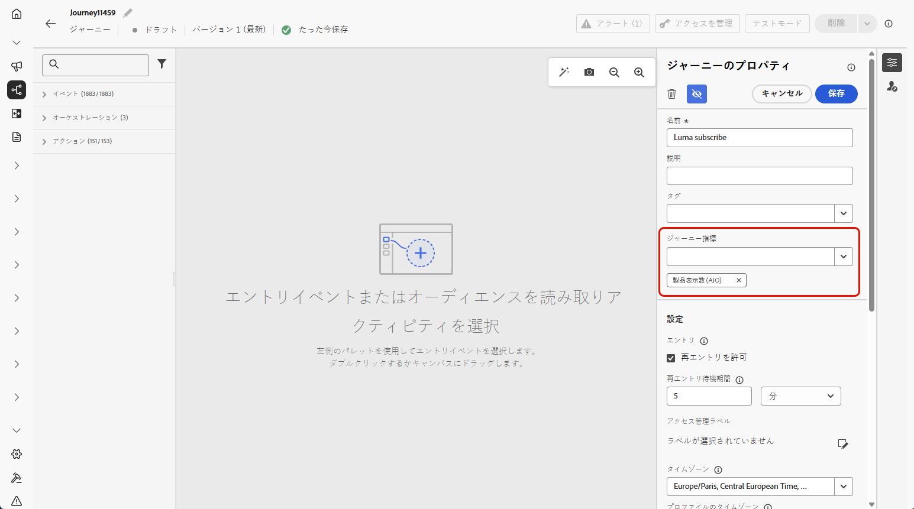
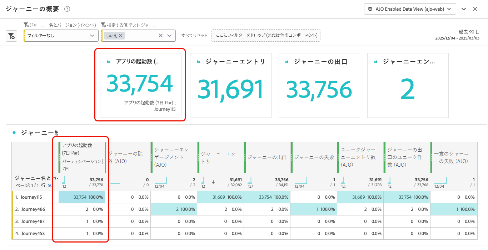

# ジャーニー指標の設定と追跡 {#success-metrics}

ジャーニー指標を使用すると、事前定義された指標に対するパフォーマンスを追跡することで、アクティビティの影響を効果的に測定できます。
これらの指標を追跡することで、ジャーニーのパフォーマンスを確認し、改善点を特定し、十分な情報に基づいた意思決定を行って顧客エンゲージメントを強化できます。

## 前提条件 {#prerequisites}

ジャーニー指標を使用する前に、`Commerce Details` [ フィールドグループ ](https://experienceleague.adobe.com/docs/experience-platform/xdm/tutorials/create-schema-ui.html?lang=ja#field-group){target="_blank"} を含むデータセットを追加する必要があります。

## 使用可能な指標 {#metrics}

指標のリストは、データセットに含まれる [ フィールドグループ ](https://experienceleague.adobe.com/docs/experience-platform/xdm/tutorials/create-schema-ui.html?lang=ja#field-group){target="_blank"} によって異なります。

データセットが設定されていない場合は、次の指標のみ使用できます。**[!UICONTROL クリック]**、**[!UICONTROL ユニーククリック]**、**[!UICONTROL クリックスルー率]** および **[!UICONTROL 開封率]**。

Customer Journey Analytics ライセンスを使用すると、カスタムの成功指標を作成できます。 [詳細情報](https://experienceleague.adobe.com/en/docs/analytics-platform/using/cja-components/cja-calcmetrics/cm-workflow/participation-metric)

| 指標 | 関連するフィールドグループ |
|-|-|
| クリック数 | フィールドグループは不要です |
| ユニーククリック数 | フィールドグループは不要です |
| クリックスルー率（CTR） | フィールドグループは不要です |
| クリックスルー開封率（CTOR） | フィールドグループは不要です |
| ページビュー数 | Web フィールドグループ |
| アプリの起動数 | モバイルフィールドグループ |
| アプリの初回起動数 | モバイルフィールドグループ |
| アプリインストール数 | モバイルフィールドグループ |
| アプリのアップグレード | モバイルフィールドグループ |
| 購入 | 「Commerceの詳細」フィールドグループ |
| チェックアウト | 「Commerceの詳細」フィールドグループ |
| 買い物かご追加 | 「Commerceの詳細」フィールドグループ |
| 買い物かごが開かれた回数 | 「Commerceの詳細」フィールドグループ |
| 買い物かご表示 | 「Commerceの詳細」フィールドグループ |
| 買い物かごからの削除 | 「Commerceの詳細」フィールドグループ |
| 製品表示 | 「Commerceの詳細」フィールドグループ |
| 後で使用するために保存 | 「Commerceの詳細」フィールドグループ |

## アトリビューション {#attribution}

各指標には、特定の結果に貢献したタッチポイントやインタラクションを決定する一連のアトリビューションが付属しています。

* **Journey Optimizer ライセンスによる指標アトリビューション**:

  Journey Optimizer ライセンスの場合のみ、選択した指標で使用可能なルックバックウィンドウの最大値は 7 日に設定されます。 これらの指標の場合、アトリビューションモデルはデフォルトで **ラストタッチ** （コンバージョン前の最新のインタラクション）に設定されます。

  例えば、顧客が過去 7 日以内にジャーニーに対して何らかのアクションを起こした後に購入が行われたかどうかを追跡できます。

* **Customer Journey Analytics ライセンスによる指標アトリビューション**:

  Journey Optimizer ライセンスとCustomer Journey Analytics ライセンスの両方を使用すると、特定のアトリビューション設定を持つカスタム指標を作成したり、組み込みの指標のアトリビューションを変更したりできます。

  [ アトリビューションモデル ](https://experienceleague.adobe.com/en/docs/analytics-platform/using/cja-dataviews/component-settings/attribution#attribution-models) の詳細情報

## ジャーニー指標の割り当て {#assign}

ジャーニー指標の追跡を開始するには、次に示す手順に従います。

1. **[!UICONTROL ジャーニー]** メニューで、「**[!UICONTROL ジャーニーを作成]**」をクリックします。

1. ジャーニーの設定パネルを編集して、ジャーニーの名前を定義し、そのプロパティを設定します。ジャーニーのプロパティを設定する方法について詳しくは、[このページ](../building-journeys/journey-properties.md)を参照してください。

1. ジャーニーの効果を測定するために使用する ]**0}ジャーニー指標を選択します。**[!UICONTROL 

   指標はジャーニー自体に適用され、ジャーニーのすべての要素に適用されます。

   

1. 「**[!UICONTROL 保存]**」をクリックします。

1. 必要な **[!UICONTROL アクティビティ]** を使用してジャーニーを設計します。

1. ジャーニーをテストし公開します。

1. ジャーニーレポートを開いて、割り当てられた成功指標のパフォーマンスを追跡します。

   選択した指標が、レポートの KPI とジャーニー統計テーブルに表示されます。

   
