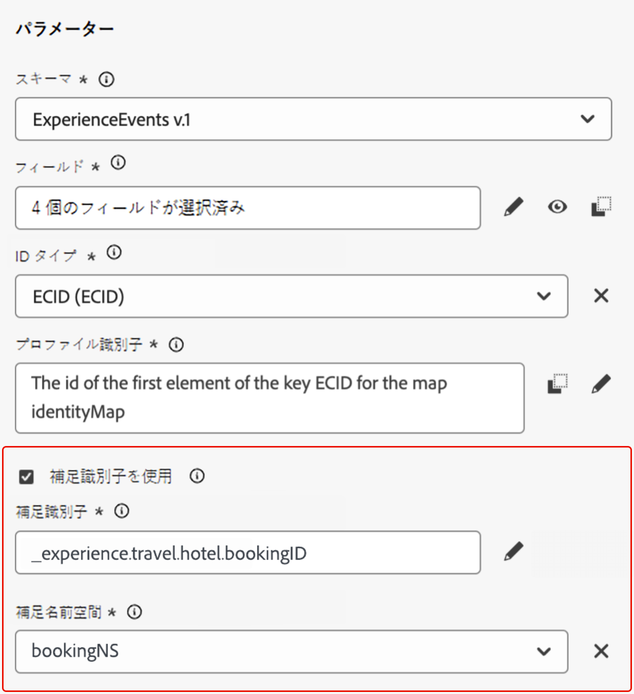
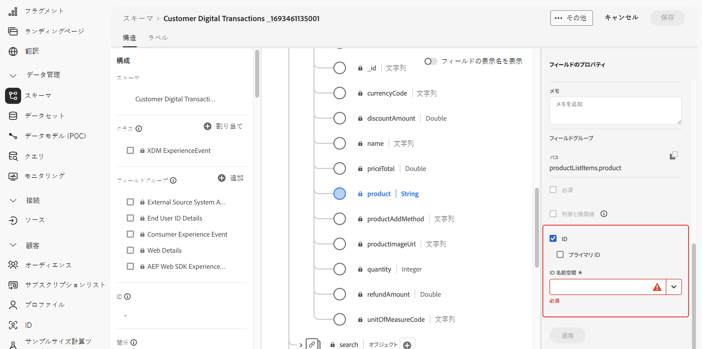
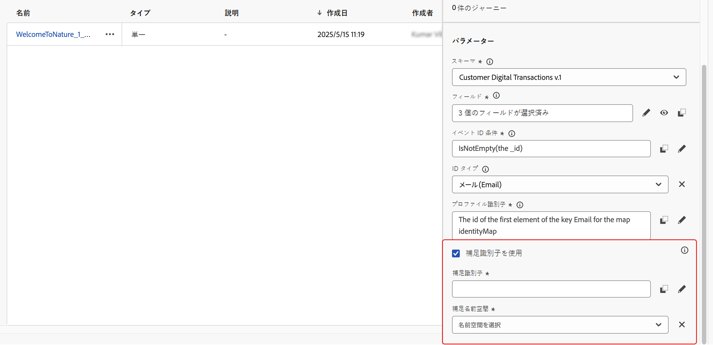
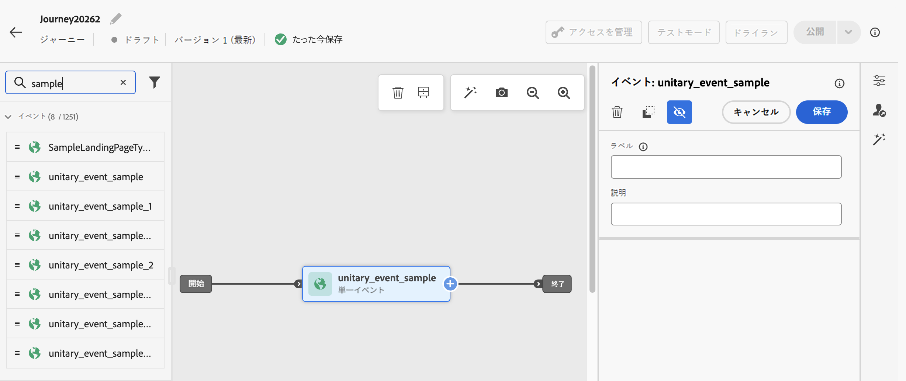
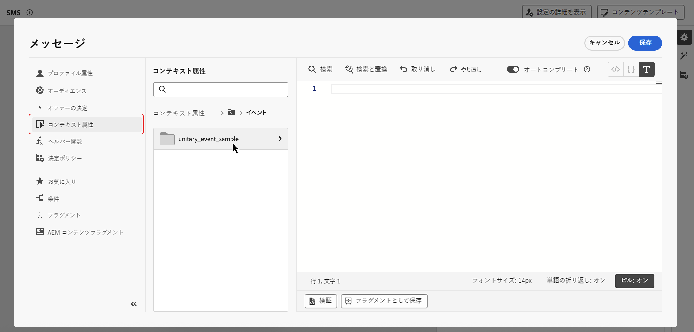

# イベントトリガージャーニーの補足識別子 {#supplemental-id}

>[!CONTEXTUALHELP]
>id="ajo_journey_parameters_supplemental_identifier"
>title="補足識別子の使用"
>abstract="補足識別子は、ジャーニーの実行に関する追加のコンテキストを指定するセカンダリ識別子です。定義するには、補足識別子として使用するフィールドを選択し、関連付ける名前空間を選択します。"

>[!AVAILABILITY]
>
>この機能は、一連の組織でのみ使用できます（限定提供）。アクセスするには、アドビ担当者にお問い合わせください。

デフォルトでは、イベントトリガージャーニーは&#x200B;**プロファイル ID** のコンテキストで実行されます。つまり、特定のジャーニーでプロファイルがアクティブである限り、別のジャーニーに再エントリできません。これを防ぐために、Journey Optimizer では、プロファイル ID に加えて、注文 ID、サブスクリプション ID、処方箋 ID などの&#x200B;**補足識別子**&#x200B;をイベントで取得できます。
この例では、予約 ID を補足識別子として追加しています。

{width=40% zoomable}

これにより、イベントによってトリガーされたジャーニーは、補足識別子（ここでは予約 ID）に関連付けられたプロファイル ID のコンテキストで実行されます。補助識別子の反復ごとに、ジャーニーのインスタンスが 1 つ実行されます。これにより、異なる予約を行った場合、ジャーニーで同じプロファイル ID の複数のエントリが可能になります。

さらに、Journey Optimizer を使用すると、補足識別子の属性（予約番号、処方箋の更新日、製品タイプなど）を活用してメッセージをカスタマイズできるので、関連性の高いコミュニケーションを確保できます。<!--Example: A healthcare provider can send renewal reminders for each prescription in a patient's profile.-->

## ガードレールと制限 {#guardrails}

* **同時インスタンス制限**：プロファイルには、10 を超えるジャーニーインスタンスを同時に含めることはできません。

<!--* **Array depth**: Supplemental identifier objects can have a maximum depth of 3 levels (2 levels of nesting).

    +++Example

    ```
    [
    (level 1) "Atorvastatin" : {
    "description" : "used to lower cholesterol",
    "renewal_date" : "11/20/25",
    "dosage" : "10mg"
    (level 2) "ingredients" : [
    (level 3) "Atorvastatin calcium",
    "lactose monohydrate",
    "microcrystalline cellulose",
    "other" ]
    }
    ]
    ```

    +++
-->
* **終了条件**：終了条件がトリガーされると、その時点でジャーニーでライブになっているプロファイルのすべてのインスタンスが終了します。これは、プロファイル ID と補足識別子の組み合わせとは関係ありません。

* **頻度ルール**：補足識別子の使用から作成した各ジャーニーインスタンスは、1 つのイベントによって複数のジャーニーインスタンスが生成された場合でも、フリークエンシーキャップにカウントされます。

* **データタイプとスキーマ構造**：補足識別子は、`string` タイプにする必要があります。独立した文字列属性や、オブジェクト配列内の文字列属性にすることができます。独立した文字列属性では、単一のジャーニーインスタンスが生成されますが、オブジェクト配列内の文字列属性では、オブジェクト配列の反復ごとに一意のジャーニーインスタンスが生成されます。文字列配列およびマップはサポートされていません。

* **ジャーニー再エントリ**

  追加の識別子を使用したジャーニーの再エントリ動作は、既存の再エントリポリシーに従います。

   * ジャーニーが再入力不可の場合、同じプロファイル ID と追加の ID の組み合わせを使用してジャーニーに再度エントリすることはできません。
   * 時間枠を指定してジャーニーを再入力する場合、定義した時間枠の後に、同じプロファイル ID と追加の ID の組み合わせを再入力できます。

## 補足識別子の追加とジャーニーでの活用 {#add}

ジャーニーで補足識別子を使用するには、次の手順に従います。

1. **属性をイベントスキーマの識別子としてマーク**

   1. イベントスキーマにアクセスし、補足識別子として使用する属性（予約 ID、サブスクリプション ID など）を見つけて、ID としてマークします。[スキーマの操作方法の詳細情報](../data/get-started-schemas.md)

   1. 識別子を **[!UICONTROL ID]** としてマークします。

      

      >[!IMPORTANT]
      >
      >属性を&#x200B;**プライマリ ID** としてマークしないでください。

   1. 補足 ID に関連付ける名前空間を選択します。これは、ユーザー以外の識別子の名前空間にする必要があります。

1. **イベントに補足 ID を追加**

   1. 目的のイベントを作成または編集します。[単一イベントの設定方法の詳細情報](../event/about-creating.md)

   1. イベント設定画面で、「**[!UICONTROL 補助識別子を使用]**」オプションをオンにします。

      

   1. 式エディターを使用して、補足 ID としてマークした属性を選択します。

      >[!NOTE]
      >
      >式エディターを **[!UICONTROL 詳細設定モード]** で使用して、属性を選択していることを確認します。

   1. 補足 ID を選択すると、関連付けられた名前空間がイベント設定画面に読み取り専用として表示されます。

1. **ジャーニーにイベントを追加**

   設定したイベントをジャーニーキャンバスにドラッグします。プロファイル ID と補足 ID の両方に基づいてジャーニーエントリがトリガーされます。

   

1. **補足 ID 属性を活用**

   式エディターとパーソナライゼーションエディターを使用して、パーソナライゼーションまたは条件付きロジックの補足識別子の属性を参照します。属性は、**[!UICONTROL コンテキスト属性]**&#x200B;メニューからアクセスできます。

   

   >[!NOTE]
   >
   >配列（複数の処方箋やポリシーなど）を操作している場合は、数式を使用して特定の要素を抽出します。

+++ 例を参照

   補足 ID が `bookingNum` で、同じレベルの属性が `bookingCountry` であるオブジェクト配列では、ジャーニーは bookingNum に基づいて配列オブジェクトを反復し、各オブジェクトのジャーニーインスタンスを作成します。

   * 条件アクティビティの次の式は、オブジェクト配列を反復し、`bookingCountry` の値が「FR」と等しいかどうかを確認します。

     ```
     @event{<event_name>.<object_path>.<object_array_name>.all(currentEventField.<attribute_path>.bookingNum==${supplementalId}).at(0).<attribute_path>.bookingCountry}=="FR"
     ```

   * メールパーソナライゼーションエディターの次の式は、オブジェクト配列を反復し、現在のジャーニーインスタンスに適用可能な `bookingCountry` を取得して、コンテンツに表示します。

     ```
     {{#each context.journey.events.<event_ID>.<object_path>.<object_array_name> as |l|}} 
     
      {{l.<attribute_path>.bookingCountry}}  
     
     {{/each}}
     ```

   * ジャーニーをトリガーするために使用されるイベントの例：

     ```
     "bookingList": [
           {
               "bookingInfo": {
                   "bookingNum": "x1",
                         "bookingCountry": "US"
               }
           },
           {
               "bookingInfo": {
                   "bookingNum": "x2",
                   "bookingCountry": "FR"
               }
           }
       ]
     ```

+++

1. **ジャーニーの公開**

   設定したら、ジャーニーを公開して、補足識別子に基づいて複数の同時エントリの使用を開始します。

## ユースケースの例

### **ポリシー更新通知**

* **シナリオ**：保険プロバイダーは、お客様が保持するアクティブなポリシーごとに更新リマインダーを送信します。
* **実行**：
   * プロファイル：「John」。
   * 補足 ID：`"AutoPolicy123", "HomePolicy456"`。
   * ジャーニーは、パーソナライズされた更新日、カバレッジの詳細、プレミアム情報と共に、各ポリシーに対して個別に実行されます。

### **購読管理**

* **シナリオ**：購読サービスは、この購読のイベントをトリガーする際に、各購読に対して調整されたメッセージを送信します。
* **実行**：
   * プロファイル：「Jane」。
   * 補足 ID：`"Luma Yoga Program ", "Luma Fitness Program"`。
   * 各イベントには、購読 ID およびこの購読に関する詳細が含まれます。ジャーニーは、各イベント／購読に対して個別に実行されるので、購読ごとにパーソナライズされた更新オファーが可能になります。

### **製品レコメンデーション**

* **シナリオ**：e コマースプラットフォームは、お客様が購入した特定の製品に基づいてレコメンデーションを送信します。
* **実行**：
   * プロファイル：「Alex」。
   * 補足 ID：`"productID1234", "productID5678"`。
   * ジャーニーは、パーソナライズされたアップセルの商談と共に、各製品に対して個別に実行されます。
