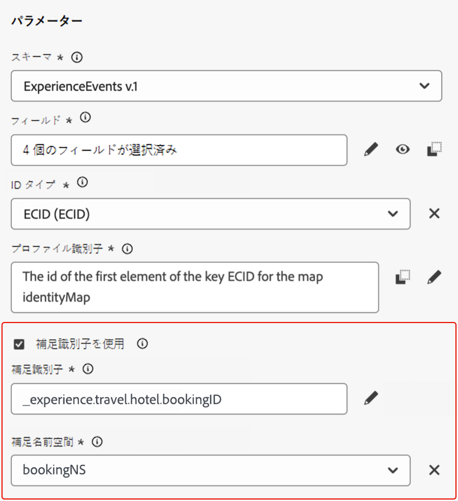
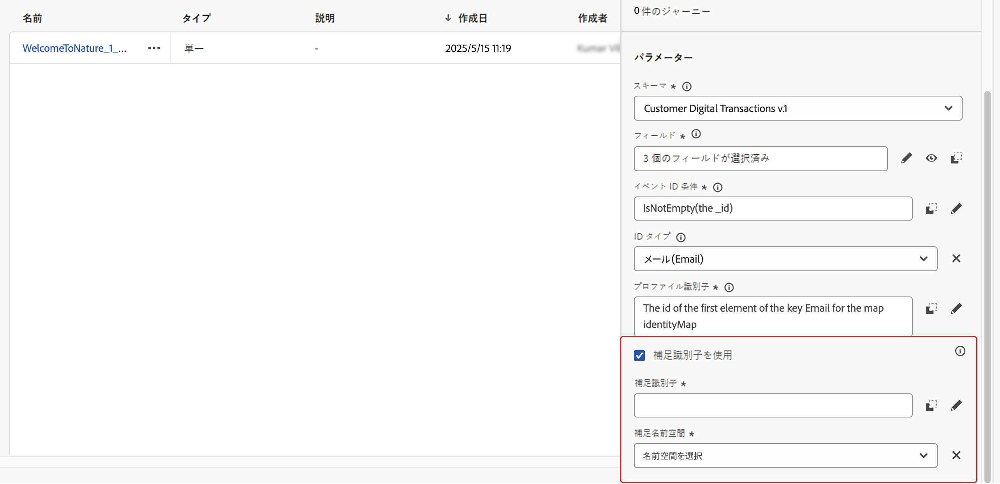
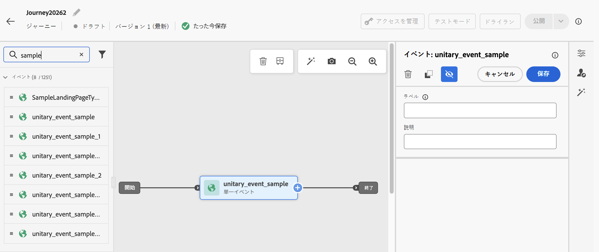
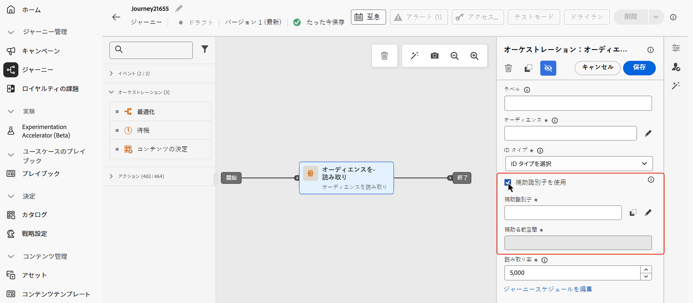
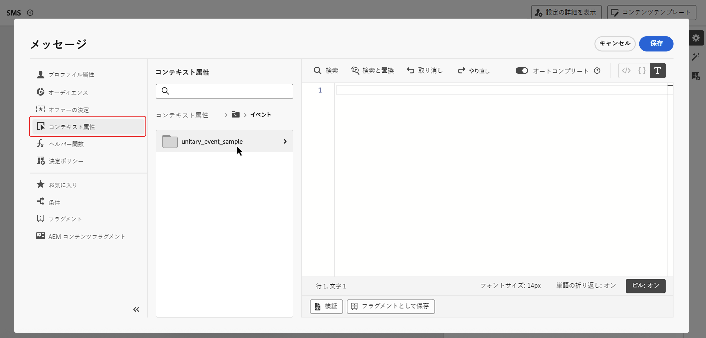

# ジャーニーの補足識別子の使用 {#supplemental-id}

>[!BEGINSHADEBOX]

**このページ：**&#x200B;追加識別子（注文や予約IDなどのセカンダリ識別子）を使用して、識別子ごとに個別のジャーニーインスタンスを実行し、その属性を使用してメッセージをパーソナライズする方法を説明します。

>[!ENDSHADEBOX]

>[!CONTEXTUALHELP]
>id="ajo_journey_parameters_supplemental_identifier"
>title="補足識別子の使用"
>abstract="補足識別子は、ジャーニーの実行に関する追加のコンテキストを指定するセカンダリ識別子です。 定義するには、補足識別子として使用するオーディエンスまたはイベントからID以外の属性（または個人ではないID）を選択します。"

<table style="border-collapse: collapse; width: 100%;">
  <tr>
    <td style="vertical-align: top; padding-right: 20px; border: none;">
      <p>デフォルトでは、ジャーニーは<b> プロファイル ID</b>のコンテキストで実行されます。つまり、プロファイルがジャーニー内でアクティブである限り、別のジャーニーに再エントリすることはできません。これを防ぐために、Journey Optimizerでは、プロファイル IDに加えて、注文ID、サブスクリプション ID、処方箋IDなどの<b>補足識別子</b>を取得できます。  
      <p>この例では、<b>予約 ID</b> を補助識別子として追加しています。</p>
      <p>これにより、ジャーニーは、補助識別子（ここでは予約 ID）に関連付けられたプロファイル ID のコンテキストで実行されます。 補助識別子の反復ごとに、ジャーニーのインスタンスが 1 つ実行されます。 これにより、異なる予約を行った場合、ジャーニーで同じプロファイル ID の複数のエントリが可能になります。</p>
      <p>さらに、Journey Optimizer を使用すると、補助識別子の属性（予約番号、処方箋の更新日、製品タイプなど）を活用してメッセージをカスタマイズできるので、関連性の高いコミュニケーションを確保できます。</p>
    </td>
    <td style="vertical-align: top; border: none; text-align: center; width: 40%;">
      
    </td>
  </tr>
</table>

➡️ [この機能について詳しくは、ビデオを参照してください](#video)。

## ガードレールと制限 {#guardrails}

* **サポートされているジャーニー**：**イベントトリガー**&#x200B;ジャーニーと&#x200B;**オーディエンスを読み取り**&#x200B;ジャーニーでは、補助識別子がサポートされています。 オーディエンスの選定ジャーニー（例：オーディエンスの選定アクティビティから開始するジャーニー）では&#x200B;**サポートされていません**。

* **インバウンドアクション**：現在、アプリ内アクションやweb アクションなどのインバウンドアクションでは、補足識別子はサポートされていません。

* **同時インスタンス制限**：プロファイルには、10 を超えるジャーニーインスタンスを同時に含めることはできません。

* **データタイプとスキーマ構造**：補足識別子は、`string` タイプにする必要があります。 独立した文字列属性や、オブジェクト配列内の文字列属性にすることができます。 独立した文字列属性では、単一のジャーニーインスタンスが生成されますが、オブジェクト配列内の文字列属性では、オブジェクト配列の反復ごとに一意のジャーニーインスタンスが生成されます。 文字列配列およびマップはサポートされていません。

* **ジャーニーの再エントリ**

  補助識別子を使用したジャーニーの再エントリ動作は、既存の再エントリポリシーに従います。

   * ジャーニーが再エントリ不可の場合、同じプロファイル ID + 補助 ID の組み合わせでジャーニーに再エントリすることはできません。
   * 時間枠でジャーニーが再エントリ可能な場合、定義した時間枠の後に同じプロファイル ID + 補助 ID の組み合わせで再エントリできます。

* **Data Use Labelling and Enforcement（DULE）** - 補助 ID に対して DULE 検証チェックは実行されません。 つまり、ジャーニーでデータガバナンスポリシー違反を探す際には、この属性は考慮されません。

* **ダウンストリームイベントの設定**

  ジャーニーのダウンストリームで別のイベントを使用している場合は、同じ補足 ID を使用し、同じ ID 名前空間を持つ必要があります。

* **オーディエンスを読み取りジャーニー**

   * **ビジネスイベント**: ビジネスイベントを使用する場合、補足IDは無効になります。
   * **イベントフィールドとコンテキストフィールド**：補足識別子をイベントまたはジャーニーコンテキストフィールドから取得することはできません。
   * **属性選択**：すべてのオーディエンスタイプ（統合プロファイルサービス、CSV読み込み、および連合オーディエンス構成）に対して、ID以外の属性（または個人ではないID）を補足IDとして使用できます。 個人ベースのID属性は許可されていません。 外部オーディエンスについては、サポートされているデータパターンと設定要件については、[外部オーディエンスを持つ補足識別子](#external-audiences)を参照してください。
   * **読み取り率**：配列タイプの補足ID フィールドを使用する読み取りオーディエンスジャーニーの場合、「オーディエンスを読み取り」アクティビティの読み取り率は、1秒あたり最大500個のプロファイルに制限されます。

## 補助 ID を使用した終了基準の動作 {#exit-criteria}

前提条件：補助 ID に対してジャーニーが有効になっていること（単一イベントまたはオーディエンスを読み取りアクティビティ経由）

以下の表に、終了基準が設定されている場合の補助 ID が有効になっているジャーニーでのプロファイルの動作を示します。

| 終了基準の設定 | 終了基準を満たした場合の動作 |
| ---------------------------- | ---------------------------------- |
| 補助 ID 以外のイベントに基づく | そのジャーニー内の対応するプロファイルのすべてのインスタンスが終了します。 |
| 補助 ID イベントに基づく <br/>*メモ：補助 ID 名前空間は、初期ノードの名前空間と一致する必要があります。* | 一致するプロファイル + 補助 ID インスタンスのみが終了します。 |
| オーディエンスに基づく | そのジャーニー内の対応するプロファイルのすべてのインスタンスが終了します。 |

## 補助識別子の追加とジャーニーでの活用 {#add}

>[!BEGINTABS]

>[!TAB イベントトリガージャーニー]

イベントトリガージャーニーで補助識別子を使用するには、次の手順に従います。

1. **イベントに補足 ID を追加**

   1. 目的のイベントを作成または編集します。 [単一イベントの設定方法の詳細情報](../event/about-creating.md)

   1. イベント設定画面で、「**[!UICONTROL 補助識別子を使用]**」オプションをオンにします。

      

   1. 式エディターを使用して、補足IDとして使用するフィールド（予約ID、購読IDなど）を選択します。

      >[!NOTE]
      >
      >式エディターを&#x200B;**[!UICONTROL 詳細設定モード]**&#x200B;で使用して、属性を選択していることを確認します。

1. **ジャーニーにイベントを追加**

   設定したイベントをジャーニーキャンバスにドラッグします。 プロファイル ID と補足 ID の両方に基づいてジャーニーエントリがトリガーされます。

   

>[!TAB オーディエンスを読み取りジャーニー]

オーディエンスを読み取りジャーニーで補助識別子を使用するには、次の手順に従います。

1. **ジャーニーでのオーディエンスを読み取りアクティビティの追加と設定**

   1. **[!UICONTROL オーディエンスを読み取り]**&#x200B;アクティビティをジャーニーにドラッグします。

   1. アクティビティのプロパティパネルで、「**[!UICONTROL 補助識別子を使用]**」オプションをオンに切り替えます。

      

   1. **[!UICONTROL 補足識別子]** フィールドで、式エディターを使用して補足識別子の属性を選択します。

   CSV ファイル [&#128279;](https://experienceleague.adobe.com/docs/experience-platform/segmentation/ui/overview.html?lang=ja#import-audience){target="_blank"}から読み込まれたオーディエンス について、CSV オーディエンスにプロファイル IDごとに複数の行が含まれている場合は、最初にExpress Activationが有効になっていることを確認してください。外部オーディエンスを含む[補足識別子](#external-audiences)を参照してください。

       >[!NOTE]
       >
       >**[!UICONTROL 詳細モード &#x200B;]の式エディターを使用して属性を選択していることを確認してください**&#x200B;7&rbrace;。   

>[!ENDTABS]

## 補助 ID 属性を活用

式エディターとパーソナライゼーションエディターを使用して、パーソナライゼーションまたは条件付きロジックの補足識別子の属性を参照します。 属性は、**[!UICONTROL コンテキスト属性]**&#x200B;メニューからアクセスできます。



イベントトリガージャーニーでは、配列（複数の処方箋やポリシーなど）を操作している場合は、数式を使用して特定の要素を抽出します。

+++ 例を参照

補足 ID が `bookingNum` で、同じレベルの属性が `bookingCountry` であるオブジェクト配列では、ジャーニーは bookingNum に基づいて配列オブジェクトを反復し、各オブジェクトのジャーニーインスタンスを作成します。

* 条件アクティビティの次の式は、オブジェクト配列を反復し、`bookingCountry` の値が「FR」と等しいかどうかを確認します。

  ```
  @event{<event_name>.<object_path>.<object_array_name>.all(currentEventField.<attribute_path>.bookingNum==${supplementalId}).at(0).<attribute_path>.bookingCountry}=="FR"
  ```

* メールパーソナライゼーションエディターの次の式は、オブジェクト配列を反復し、現在のジャーニーインスタンスに適用可能な `bookingCountry` を取得して、コンテンツに表示します。

  ```
  {{#each context.journey.events.<event_ID>.<object_path>.<object_array_name> as |l|}} 
  
   {{l.<attribute_path>.bookingCountry}}  
  
  {{/each}}
  ```

* ジャーニーをトリガーするために使用されるイベントの例：

  ```
  "bookingList": [
        {
            "bookingInfo": {
                "bookingNum": "x1",
                      "bookingCountry": "US"
            }
        },
        {
            "bookingInfo": {
                "bookingNum": "x2",
                "bookingCountry": "FR"
            }
        }
    ]
  ```

+++

## 補足IDとジャーニー調停 {#arbitration}

ジャーニーの調停（ルールセット内の同時上限とエントリ数を含む）は、（プロファイル ID、補足ID）ペアレベルではなく、プロファイル ID レベルで実行されます。 つまり、同時実行キャップが1の場合、同じプロファイルに対する2番目のジャーニーインスタンスが、異なる追加ID値を持つ場合でもブロックされる可能性があります。

本番環境の特定の仲裁設定に頼る前に、Adobeの担当者に調停の動作に関するガイダンスを依頼してください。

**関連ドキュメント：**

* [ジャーニーのキャップと判別](../conflict-prioritization/journey-capping.md)
* [ルールセットの操作](../conflict-prioritization/rule-sets.md)
* [競合管理と優先順位付け](../conflict-prioritization/gs-conflict-prioritization.md)

## 外部オーディエンスを使用した補足識別子 {#external-audiences}

追加IDは、CSV ファイルから読み込まれたオーディエンス [&#128279;](https://experienceleague.adobe.com/docs/experience-platform/segmentation/ui/overview.html?lang=ja#import-audience)や[連合オーディエンス構成](../audience/get-started-audience-orchestration.md){target="_blank"}で作成されたオーディエンスなど、外部オーディエンスに対してサポートされています。 &#x200B;CSVまたはFederated Audience Composition オーディエンスから読み取るジャーニーを設定する場合、そのオーディエンスのID以外の属性を補足IDとして指定できます。 次に、Journey Optimizerは、一意のプロファイルと追加のIDの組み合わせごとに個別のジャーニーインスタンスを作成します。

* ユースケース 1：一意のプロファイルごとに1行+追加のID ペア

  これは、CSVおよびFederated Audience Composition オーディエンスの主なユースケースです。 オーディエンスには複数の行が含まれ、各行はプロファイル（顧客など）と補足ID （アカウントまたは注文IDなど）の一意の組み合わせを表します。 各行は独立したアクティベーションレコードとして扱われます。

  | profile_id | account_id *（補足ID）* | other_attributes |
  | --- | --- | --- |
  | customer_001 | ACC-1001 | ... |
  | customer_001 | ACC-1002 | ... |
  | customer_002 | ACC-2001 | ... |

  この例では、`customer_001`には2つのアカウントがあります。 Journey Optimizerは、一意のプロファイル + `account_id` ペアごとに個別のジャーニーインスタンスを作成します。

* ユースケース 2：補足IDの配列を含むプロファイルごとに1行

  このユースケースは、配列をサポートするオーディエンスタイプで使用できます。 オーディエンスの1つの行には、複数の補足ID値を保持する配列属性を持つプロファイルが含まれます。 Journey Optimizerは、配列内の値ごとに1つのジャーニーインスタンスを作成します。

  | profile_id | account_ids *（array, Supplemental ID）* | other_attributes |
  | --- | --- | --- |
  | customer_001 | [ACC-1001、ACC-1002] | ... |
  | customer_002 | [ACC-2001] | ... |

  この例では、Journey Optimizerは`customer_001`に2つのジャーニーインスタンス（アカウント IDごとに1つ）を生成し、`customer_002`に1つのインスタンスを生成します。 これは、統合プロファイルサービスのオーディエンスに対する補足IDの仕組みと一貫して動作します。

### 設定方法 {#external-configuration}

ユースケース 1 （オーディエンスが意図的に同じプロファイル IDの複数の行を含んでいる場合）を使用するCSV オーディエンスの場合、ジャーニーを設定する前にExpress Activationを有効にする必要があります。 以下の前提条件を参照してください。 それ以外の場合は、ジャーニーを直接設定します。

+++ 前提条件：API経由でCSV オーディエンスに対するExpress アクティベーションを有効にする

>[!IMPORTANT]
>
>この前提条件は、オーディエンスが意図的に同じプロファイル IDの複数の行を含むCSV オーディエンスにのみ適用されます（ユースケース 1）。 連合オーディエンス構成オーディエンスでは、デフォルトでExpress アクティベーションが有効になっており、この手順は必要ありません。 オーディエンスポータル UIは`expressActivation`の設定をサポートしていません。外部オーディエンス APIを使用する必要があります。

作成時にオーディエンスで`expressActivation`を有効にする必要があります。 これにより、Journey Optimizerは、プロファイル IDによる重複排除を行うことなく、すべてのレコードを独立してアクティブ化します。 このフラグは、オーディエンスの作成後に変更することはできません。

オーディエンスの作成時に、次のAPI呼び出しを使用します。

エンドポイント：

```http
POST https://platform.adobe.io/data/core/ais/external-audience
```

必要なヘッダー：

```http
Authorization: Bearer {ACCESS_TOKEN}
Content-Type: application/json
x-api-key: {API_KEY}
x-gw-ims-org-id: {IMS_ORG}
x-sandbox-name: {SANDBOX_NAME}
```

リクエスト本文（セット `expressActivation: true`）:

```json
{
  "name": "my_audience_name",
  "fields": [ ... ],
  "sourceSpec": { ... },
  "audienceType": "people",
  "namespace": "CustomerAudienceUpload",
  "expressActivation": true
}
```

>[!NOTE]
>
>`expressActivation`のデフォルトは`false`です。 オーディエンス作成時に設定する必要があり、作成後に変更することはできません。 すべてのFederated Audience Composition オーディエンスでは、デフォルトでExpress Activationが有効になっており、このフラグは必要ありません。

完全なリファレンスについては、[外部オーディエンス APIの作成](https://experienceleague.adobe.com/ja/docs/experience-platform/segmentation/tutorials/create-external-audience#create){target="_blank"}を参照してください。

+++

ジャーニーを設定するには：

1. **[!UICONTROL オーディエンスを読み取り]** ノードでジャーニーを開くか、作成します。
1. **[!UICONTROL オーディエンスの読み取り]** ノード設定で、CSVまたはFederated Audience Composition オーディエンスを選択します。
1. 「**[!UICONTROL 補足識別子を使用]**」オプションを切り替え、**[!UICONTROL 補足識別子]** フィールドで、**[!UICONTROL 詳細モード]**&#x200B;の式エディターを使用して、セカンダリ識別子として使用する属性（例：`account_id`、`order_number`）を選択します。
1. 選択した属性は、ジャーニーの補足IDとして扱われます。ID登録は必要ありません。

### 重複排除の動作 {#external-dedup}

オーディエンスでExpress Activationが有効になっている場合（Federated Audience Compositionには常にtrueを設定する必要があります – CSVに対して明示的に設定する必要があります）、Journey Optimizerはジャーニーの設定方法に基づいて重複排除を処理します。

| シナリオ | オーディエンス行の例 | 動作 |
| --- | --- | --- |
| **追加IDを持つジャーニー – 重複しない（プロファイル ID、追加ID）ペア** | （P1、S1）、（P1、S2） | 意図したユースケース： Journey Optimizerは、一意のプロファイルと追加のIDの組み合わせごとに別のジャーニーインスタンスを作成します。 すべての行を受け入れます。 |
| **追加IDを持つジャーニー – 重複（プロファイル ID、追加ID）ペアが存在します** | （P1、S1）、（P1、S1）、（P1、S2） | 同じ（プロファイル ID、補足ID）の組み合わせを共有する行は、通常のジャーニー再エントランス ロジックによってフィルタリングされます。 一意の組み合わせごとに最初の一致する行のみが許可されます。 |
| **追加IDが設定されていないジャーニー** | （P1、S1）、（P1、S2） | 補足IDがない場合、Journey Optimizerは、同じプロファイル IDのすべての行を同じプロファイルとして扱います。 プロファイル IDごとに1つのジャーニーインスタンスのみが許可されます。同じプロファイルの追加行は破棄されます。 |

## ユースケースの例

これらの例は、補足識別子が複数の関連レコードをどのようにサポートするかを示しています。

### **ポリシー更新通知**

* **シナリオ**：保険プロバイダーは、お客様が保持するアクティブなポリシーごとに更新リマインダーを送信します。
* **実行**：
   * プロファイル：「John」。
   * 補足 ID：`"AutoPolicy123", "HomePolicy456"`。
   * ジャーニーは、パーソナライズされた更新日、カバレッジの詳細、プレミアム情報と共に、各ポリシーに対して個別に実行されます。

### **購読管理**

* **シナリオ**：購読サービスは、この購読のイベントをトリガーする際に、各購読に対して調整されたメッセージを送信します。
* **実行**：
   * プロファイル：「Jane」。
   * 補足 ID：`"Luma Yoga Program ", "Luma Fitness Program"`。
   * 各イベントには、購読 ID およびこの購読に関する詳細が含まれます。 ジャーニーは、各イベント／購読に対して個別に実行されるので、購読ごとにパーソナライズされた更新オファーが可能になります。

### **製品レコメンデーション**

* **シナリオ**：e コマースプラットフォームは、お客様が購入した特定の製品に基づいてレコメンデーションを送信します。
* **実行**：
   * プロファイル：「Alex」。
   * 補足 ID：`"productID1234", "productID5678"`。
   * ジャーニーは、パーソナライズされたアップセルの商談と共に、各製品に対して個別に実行されます。

## チュートリアルビデオ {#video}

[!DNL Adobe Journey Optimizer] で補足識別子を有効にして適用する方法について説明します。

>[!VIDEO](https://video.tv.adobe.com/v/3464793?captions=jpn&quality=12)

+++ AI ナレッジリファレンス

このセクションには、このトピックに関連する解釈、検索、質問への回答をサポートすることを目的とした構造化された知識が含まれています。

理解を深めるには、この情報をこのページのドキュメントと組み合わせる必要があります。 どちらのソースも単独で使用することを意図していません。このページでは、機能について説明しますが、この節では、用語、意図、適用可能性、および制約の曖昧さを解消するのに役立つ追加のコンテキストを提供します。

* **TL;DR:**&#x200B;このページでは、Adobe Journey Optimizer ジャーニーで補足識別子を使用して、1つのプロファイルが複数の同時ジャーニーインスタンスを持つようにし、各プロファイルを予約、サブスクリプション、ポリシーIDなどの個別のセカンダリ IDにスコープ設定する方法について説明します。

**インテント：**
* プロファイル IDのみに依存するのではなく、補完的な識別子を使用するタイミングと理由を把握します
* イベントスキーマで属性をIDとしてマークすることで、イベントトリガージャーニーで補足識別子を設定します
* オーディエンスの読み取りアクティビティのオプションを有効にして、オーディエンスジャーニーの補足識別子を設定します
* 式エディターを使用して、メッセージのパーソナライゼーションと条件付きロジックの補足識別子の属性を参照します
* 正しい式の構文を適用して、補足IDでキーを設定したオブジェクト配列を繰り返します
* ジャーニーに補足的なIDを実装する前に、ガードレールと制限事項を特定する

**用語集：**
* **補足識別子**: プロファイル IDと一緒に使用されるセカンダリ ID （注文ID、予約ID、サブスクリプション IDなど）。ジャーニーインスタンスを特定のレコードにスコープ設定し、プロファイル *（製品固有）*&#x200B;ごとに複数の同時インスタンスを有効にします。
* **プロファイル ID**: ジャーニーの実行にデフォルトで使用されるプライマリ ID。ジャーニーでアクティブなプロファイルは、追加IDがなければ別のジャーニーに再入力できません
* **人以外のID名前空間**：個人を表さないID名前空間（補足IDに必要）。プライマリ ID名前空間とは異なる必要があります
* **joai名前空間**：このページには適用されません（インバウンドアクションのトラブルシューティングを参照）
* **DULE**: Data Use Labeling and Enforcement — Adobe Experience Platformのデータガバナンスポリシー検証フレームワーク。追加IDはDULE チェックの対象ではありません

**ガードレール：**
* 補足識別子は、イベントトリガーおよびオーディエンスジャーニーの読み取りでのみサポートされます。オーディエンスの選定ジャーニーではサポートされていません
* プロファイルに同時ジャーニーインスタンスを10個以上含めることはできません
* 各ジャーニーインスタンスは、追加識別子を介して作成された場合でも、頻度の上限にカウントされます
* 補足識別子は`string`型である必要があります。文字列配列とマップはサポートされていません
* 補足ID属性は、スキーマでプライマリ IDとしてマークしてはなりません
* 補足IDに使用される名前空間は、個人でないID名前空間である必要があります
* 非ユーザーID名前空間をスキーマに適用した後、新しいイベントまたはフィールドグループを作成する必要があります。既存のエンティティは更新できません
* 追加IDを持つオーディエンスジャーニーの読み取り：読み取り率は、ジャーニーインスタンスごとに1秒あたり500 プロファイルに制限されます。統合プロファイルサービスオーディエンスのみがサポートされます。追加IDは、プロファイルフィールド（イベント/コンテキストフィールドではなく）である必要があります
* 同じジャーニー内のダウンストリームイベントでは、同じ補足IDと名前空間を使用する必要があります
* ビジネスイベントを使用するオーディエンスジャーニーの読み取りに対する補足IDは無効になっています

**用語：**
* 正規名：補足識別子 – 頭字語：なし – バリアント：補足ID、二次識別子
* 同義語：「補足識別子」 = 「補足ID」（UIとドキュメントで同義語として使用）
* 「補足ID」≠「プライマリ ID」は混同しないでください。補足IDは、スキーマ内でプライマリ IDとしてマークしてはなりません

**FAQ:**
* **Q：補足識別子は何に使用されますか？** — 1つのプロファイルでジャーニーを複数回同時に入力および実行し、各インスタンスを予約、サブスクリプション、ポリシーIDなどの異なるセカンダリレコードにスコープ付けすることができます。
* **Q：どのジャーニータイプが補足識別子をサポートしていますか？** — イベントをトリガーにしたジャーニーとオーディエンスジャーニーの読み取り。 オーディエンスの選定ジャーニーは、補足識別子をサポートしていません。
* **Q: プロファイルに追加のIDを持つ同時ジャーニーインスタンスの数を指定できますか？** — プロファイルごとに最大10個の同時ジャーニーインスタンス。
* **Q: メッセージのパーソナライゼーションに追加のID属性を使用できますか？**  – はい。 式エディターまたはパーソナライゼーションエディターのコンテキスト属性メニューを使用して参照します。
* **Q：補足IDは、スキーマでプライマリ IDとしてマークする必要がありますか？**  – いいえ。 IDとしてマークする必要がありますが、プライマリ IDとして設定することはできません。
* **Q: DULE ガバナンスポリシーは追加識別子に適用されますか？**  – いいえ。 DULE検証チェックは、補足IDに対して実行されません。

+++
