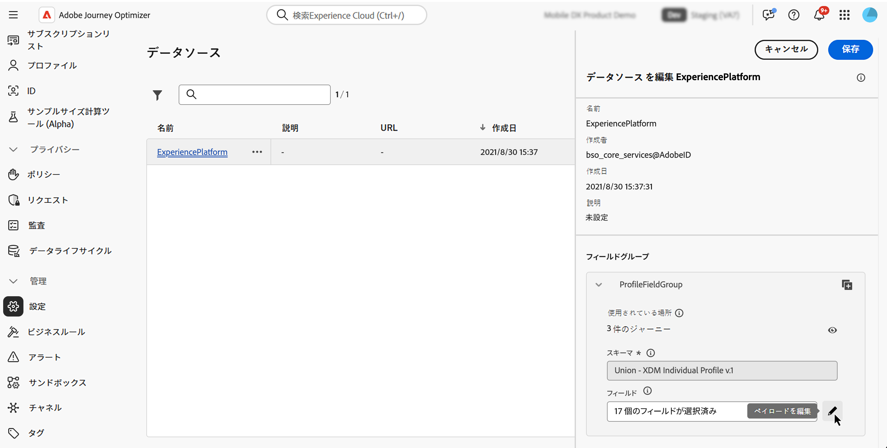
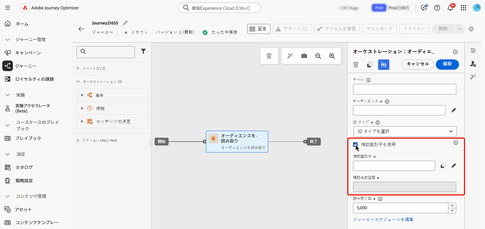

# ジャーニーでの補助識別子の使用 {#supplemental-id}

>[!CONTEXTUALHELP]
>id="ajo_journey_parameters_supplemental_identifier"
>title="補足識別子の使用"
>abstract="補足識別子は、ジャーニーの実行に関する追加のコンテキストを指定するセカンダリ識別子です。定義するには、補足識別子として使用するフィールドを選択し、関連付ける名前空間を選択します。"

<table style="border-collapse: collapse; width: 100%;">
  <tr>
    <td style="vertical-align: top; padding-right: 20px; border: none;">
      <p>デフォルトでは、ジャーニーは<b>プロファイル ID</b> のコンテキストで実行されます。つまり、特定のジャーニーでプロファイルがアクティブである限り、別のジャーニーに再エントリできません。これを防ぐために、Journey Optimizerでは、プロファイル ID に加えて、注文 ID、サブスクリプション ID、処方箋 ID などの <b> 追加の識別子 </b> を取得できます。  
      <p>この例では、追加の識別子として <b> 予約 ID</b> を追加しました。</p>
      <p>これにより、ジャーニーは、補助識別子（ここでは予約 ID）に関連付けられたプロファイル ID のコンテキストで実行されます。補助識別子の反復ごとに、ジャーニーのインスタンスが 1 つ実行されます。これにより、異なる予約を行った場合、ジャーニーで同じプロファイル ID の複数のエントリが可能になります。</p>
      <p>さらに、Journey Optimizerでは、補足的な識別情報の属性（予約番号、処方箋更新日、商品タイプなど）をメッセージのカスタマイズに活用し、関連性の高いコミュニケーションを確保できます。</p>
    </td>
    <td style="vertical-align: top; border: none; text-align: center; width: 40%;">
      
    </td>
  </tr>
</table>

➡️ [この機能について詳しくは、ビデオを参照してください](#video)。

## ガードレールと制限 {#guardrails}

* **サポートされているジャーニー**:**イベントトリガー** ジャーニーと **オーディエンスを読み取り** ジャーニーでは、追加の識別子がサポートされています。 オーディエンスの選定ジャーニー **オーディエンスの選定アクティビティで始まるジャーニーなど）では** サポートされません）。

* **同時インスタンス制限**：プロファイルには、10 を超えるジャーニーインスタンスを同時に含めることはできません。

* **頻度ルール**：補助識別子の使用から作成した各ジャーニーインスタンスは、補助識別子の使用によって複数のジャーニーインスタンスが生成された場合でも、フリークエンシーキャップにカウントされます。

* **データタイプとスキーマ構造**：補足識別子は、`string` タイプにする必要があります。独立した文字列属性や、オブジェクト配列内の文字列属性にすることができます。独立した文字列属性では、単一のジャーニーインスタンスが生成されますが、オブジェクト配列内の文字列属性では、オブジェクト配列の反復ごとに一意のジャーニーインスタンスが生成されます。文字列配列およびマップはサポートされていません。

* **ジャーニーの再エントリ**

  補助識別子を使用したジャーニーの再エントリ動作は、既存の再エントリポリシーに従います。

   * ジャーニーが再エントリ不可の場合、同じプロファイル ID + 補助 ID の組み合わせでジャーニーに再エントリすることはできません。
   * 時間枠でジャーニーが再エントリ可能な場合、定義した時間枠の後に同じプロファイル ID + 補助 ID の組み合わせで再エントリできます。

* **Data Use Labelling and Enforcement（DULE）** - 補助 ID に対して DULE 検証チェックは実行されません。つまり、ジャーニーでデータガバナンスポリシー違反を探す際には、この属性は考慮されません。

* **ダウンストリームイベントの設定**

  ジャーニーのダウンストリームで別のイベントを使用している場合は、同じ補足 ID を使用し、同じ ID 名前空間を持つ必要があります。

* **オーディエンスを読み取りジャーニー**

   * ビジネスイベントを使用する場合、補助 ID は無効になります。
   * 補助 ID は、プロファイルのフィールドである必要があります（つまり、イベント／コンテキストフィールドではありません）。
   * 追加の ID を使用するオーディエンスを読み取りジャーニーの場合、各ジャーニーインスタンスのオーディエンスを読み取りアクティビティの読み取り率は、1 秒あたり最大 500 プロファイルに制限されます。
   * 追加の ID を含むオーディエンスを読み取りジャーニーを使用する場合、統合プロファイルサービスオーディエンスのみがサポートされます。

## 追加の ID を含む終了条件の動作 {#exit-criteria}

前提条件：追加の ID に対してジャーニーが有効になっていること（単一イベントまたはオーディエンスを読み取りアクティビティを使用）

終了条件が設定されている場合の、追加の ID 対応ジャーニーでのプロファイルの動作を次の表に示します。

| 終了条件の設定 | 終了条件を満たした場合の動作 |
| ---------------------------- | ---------------------------------- |
| 追加でない ID イベントに基づく | そのジャーニー内の対応するプロファイルのすべてのインスタンスが終了します。 |
| 追加の ID イベントに基づく <br/>*メモ：追加の ID 名前空間は、初期ノードの名前空間と一致する必要があります*。 | 一致するプロファイル +追加の ID インスタンスのみが終了します。 |
| オーディエンスに基づく | そのジャーニー内の対応するプロファイルのすべてのインスタンスが終了します。 |

## 補助識別子の追加とジャーニーでの活用 {#add}

>[!BEGINTABS]

>[!TAB イベントトリガージャーニー]

イベントトリガージャーニーで補助識別子を使用するには、次の手順に従います。

1. **属性をイベントスキーマの識別子としてマーク**

   1. イベントスキーマにアクセスし、補足識別子として使用する属性（予約 ID、サブスクリプション ID など）を見つけて、ID としてマークします。[スキーマの操作方法の詳細情報](../data/get-started-schemas.md)

   1. 識別子を **[!UICONTROL ID]** としてマークします。

      

      >[!IMPORTANT]
      >
      >属性を&#x200B;**プライマリ ID** としてマークしないでください。

   1. 補足 ID に関連付ける名前空間を選択します。これは、ユーザー以外の識別子の名前空間にする必要があります。

      ユーザー以外の ID 名前空間をスキーマに適用した後、補助識別子を使用するには、新しいイベントを作成する必要があります。既存のエンティティを更新して、新しい識別子を認識することはできません。

1. **イベントに補足 ID を追加**

   1. 目的のイベントを作成または編集します。[単一イベントの設定方法の詳細情報](../event/about-creating.md)

   1. イベント設定画面で、「**[!UICONTROL 補助識別子を使用]**」オプションをオンにします。

      

   1. 式エディターを使用して、補足 ID としてマークした属性を選択します。

      >[!NOTE]
      >
      >式エディターを&#x200B;**[!UICONTROL 詳細設定モード]**&#x200B;で使用して、属性を選択していることを確認します。

   1. 補足 ID を選択すると、関連付けられた名前空間がイベント設定画面に読み取り専用として表示されます。

1. **ジャーニーにイベントを追加**

   設定したイベントをジャーニーキャンバスにドラッグします。プロファイル ID と補足 ID の両方に基づいてジャーニーエントリがトリガーされます。

   

>[!TAB オーディエンスを読み取りジャーニー]

オーディエンスを読み取りジャーニーで補助識別子を使用するには、次の手順に従います。

1. **属性を和集合／プロファイルスキーマの識別子としてマーク**

   1. 和集合／プロファイルスキーマにアクセスし、補助識別子として使用する属性（予約 ID、サブスクリプション ID など）を見つけて、ID としてマークします。[スキーマの操作方法の詳細情報](../data/get-started-schemas.md)

   1. 識別子を **[!UICONTROL ID]** としてマークします。

      

      >[!IMPORTANT]
      >
      >属性を&#x200B;**プライマリ ID** としてマークしないでください。

   1. 補足 ID に関連付ける名前空間を選択します。これは、ユーザー以外の識別子の名前空間にする必要があります。

      ユーザー以外の ID 名前空間をスキーマに適用した後、補助識別子を使用するには、新しいフィールドグループを作成する必要があります。既存のエンティティを更新して、新しい識別子を認識することはできません。

<!--1. **Add the supplemental ID field to the data source**

    1. Navigate to the **[!UICONTROL Configuration]** / **[!UICONTROL Data Sources]** menu, then locate the "ExperiencePlatformDataSource" data source.

        

    1. Open the field selector then select the attribute you want to use as a supplemental identifier (e.g., booking ID, subscription ID).-->

1. **ジャーニーでのオーディエンスを読み取りアクティビティの追加と設定**

   1. **[!UICONTROL オーディエンスを読み取り]**&#x200B;アクティビティをジャーニーにドラッグします。

   1. アクティビティのプロパティパネルで、「**[!UICONTROL 補助識別子を使用]**」オプションをオンに切り替えます。

      

   1. 「**[!UICONTROL 補助識別子]**」フィールドで、式エディターを使用して、補助 ID としてマークした属性を選択します。

      >[!NOTE]
      >
      >式エディターを&#x200B;**[!UICONTROL 詳細設定モード]**&#x200B;で使用して、属性を選択していることを確認します。

   1. 補助 ID を選択すると、関連付けられた名前空間が「**[!UICONTROL 補助名前空間]**」フィールドに読み取り専用として表示されます。

>[!ENDTABS]

## 補助 ID 属性を活用

式エディターとパーソナライゼーションエディターを使用して、パーソナライゼーションまたは条件付きロジックの補足識別子の属性を参照します。属性は、**[!UICONTROL コンテキスト属性]**&#x200B;メニューからアクセスできます。


イベントトリガージャーニーでは、配列（複数の処方箋やポリシーなど）を操作している場合は、数式を使用して特定の要素を抽出します。

+++ 例を参照

補足 ID が `bookingNum` で、同じレベルの属性が `bookingCountry` であるオブジェクト配列では、ジャーニーは bookingNum に基づいて配列オブジェクトを反復し、各オブジェクトのジャーニーインスタンスを作成します。

* 条件アクティビティの次の式は、オブジェクト配列を反復し、`bookingCountry` の値が「FR」と等しいかどうかを確認します。

  ```
  @event{<event_name>.<object_path>.<object_array_name>.all(currentEventField.<attribute_path>.bookingNum==${supplementalId}).at(0).<attribute_path>.bookingCountry}=="FR"
  ```

* メールパーソナライゼーションエディターの次の式は、オブジェクト配列を反復し、現在のジャーニーインスタンスに適用可能な `bookingCountry` を取得して、コンテンツに表示します。

  ```
  {{#each context.journey.events.<event_ID>.<object_path>.<object_array_name> as |l|}} 
  
   {{l.<attribute_path>.bookingCountry}}  
  
  {{/each}}
  ```

* ジャーニーをトリガーするために使用されるイベントの例：

  ```
  "bookingList": [
        {
            "bookingInfo": {
                "bookingNum": "x1",
                      "bookingCountry": "US"
            }
        },
        {
            "bookingInfo": {
                "bookingNum": "x2",
                "bookingCountry": "FR"
            }
        }
    ]
  ```

+++

## ユースケースの例

### **ポリシー更新通知**

* **シナリオ**：保険プロバイダーは、お客様が保持するアクティブなポリシーごとに更新リマインダーを送信します。
* **実行**：
   * プロファイル：「John」。
   * 補足 ID：`"AutoPolicy123", "HomePolicy456"`。
   * ジャーニーは、パーソナライズされた更新日、カバレッジの詳細、プレミアム情報と共に、各ポリシーに対して個別に実行されます。

### **購読管理**

* **シナリオ**：購読サービスは、この購読のイベントをトリガーする際に、各購読に対して調整されたメッセージを送信します。
* **実行**：
   * プロファイル：「Jane」。
   * 補足 ID：`"Luma Yoga Program ", "Luma Fitness Program"`。
   * 各イベントには、購読 ID およびこの購読に関する詳細が含まれます。ジャーニーは、各イベント／購読に対して個別に実行されるので、購読ごとにパーソナライズされた更新オファーが可能になります。

### **製品レコメンデーション**

* **シナリオ**：e コマースプラットフォームは、お客様が購入した特定の製品に基づいてレコメンデーションを送信します。
* **実行**：
   * プロファイル：「Alex」。
   * 補足 ID：`"productID1234", "productID5678"`。
   * ジャーニーは、パーソナライズされたアップセルの商談と共に、各製品に対して個別に実行されます。

## チュートリアルビデオ {#video}

[!DNL Adobe Journey Optimizer] で補足識別子を有効にして適用する方法について説明します。

>[!VIDEO](https://video.tv.adobe.com/v/3464793?quality=12&captions=jpn)
